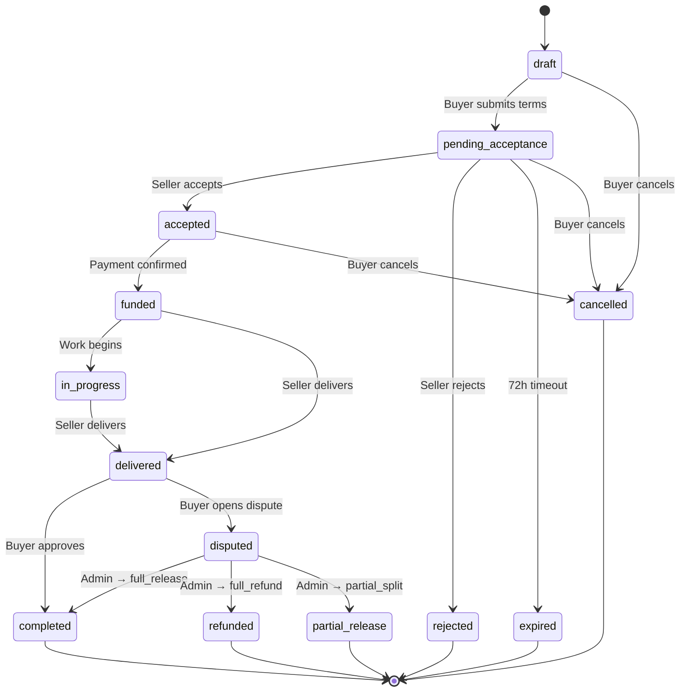
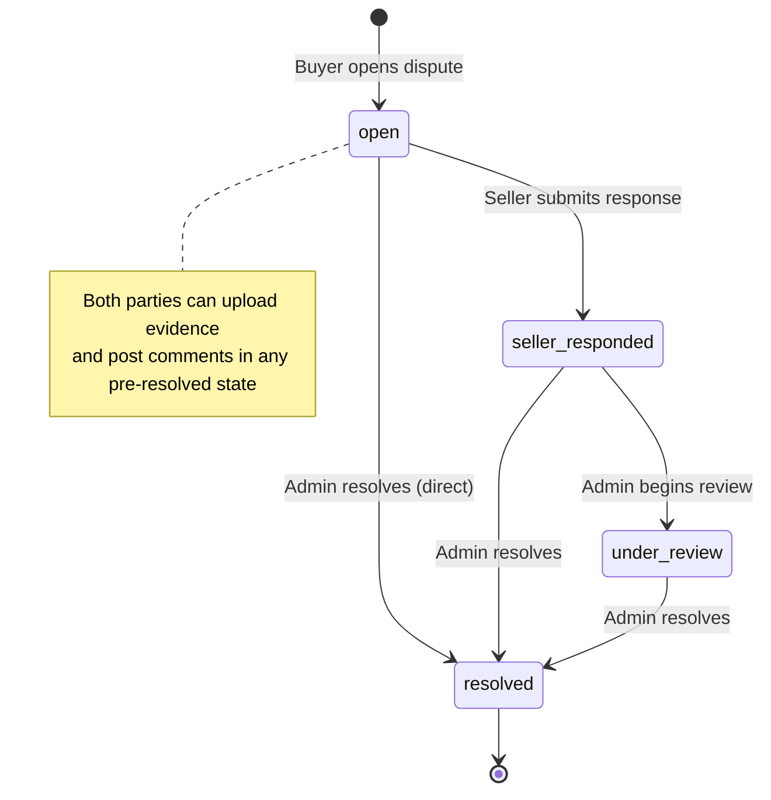
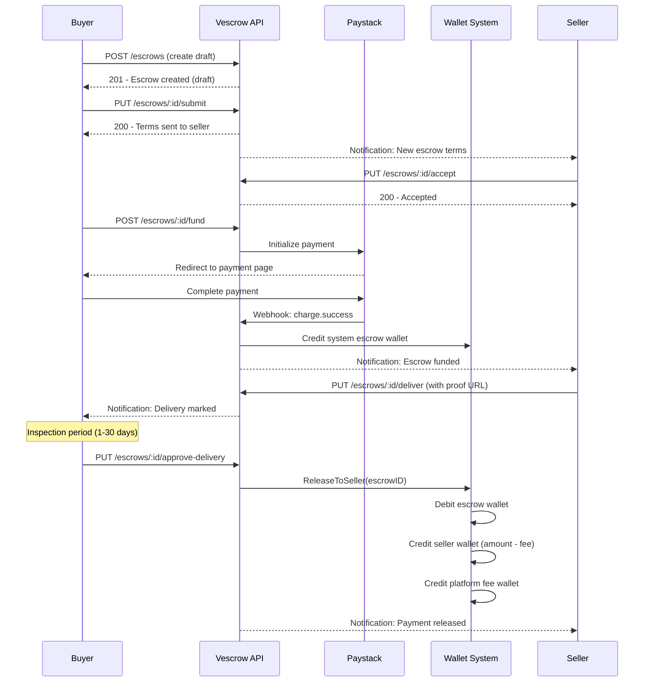
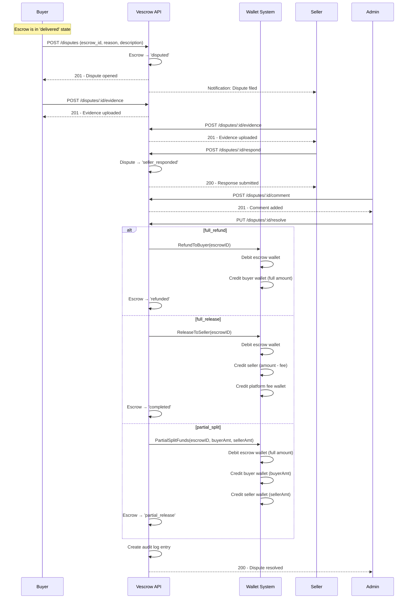

# Vescrow — State Machine, Dispute Resolution & Transaction Flow

This document provides a comprehensive reference for the Vescrow platform's escrow lifecycle,
dispute resolution system, and end-to-end transaction flow including wallet ledger operations.

---

## Table of Contents

1. [Escrow State Machine](#1-escrow-state-machine)
2. [Dispute State Machine](#2-dispute-state-machine)
3. [End-to-End Transaction Flow](#3-end-to-end-transaction-flow)
4. [Dispute Resolution Deep Dive](#4-dispute-resolution-deep-dive)
5. [Wallet & Ledger Operations](#5-wallet--ledger-operations)
6. [Audit Trail](#6-audit-trail)
7. [Security & Access Control Matrix](#7-security--access-control-matrix)

---

## 1. Escrow State Machine

The escrow status field governs what actions are possible at any point. Each transition
is enforced by `escrow.CanTransition(currentStatus, targetStatus)` in `internal/escrow/state_machine.go`.

### 1.1 States

| Status | Description | Entered By |
|--------|-------------|------------|
| `draft` | Initial state. Buyer is composing escrow terms. | System (on creation) |
| `pending_acceptance` | Buyer submitted terms. Awaiting seller decision. | Buyer submits |
| `accepted` | Seller agreed to terms. Awaiting buyer funding. | Seller accepts |
| `rejected` | Seller declined terms. Terminal for this escrow. | Seller rejects |
| `funded` | Buyer paid. Money held in system escrow wallet. | Payment webhook confirms |
| `in_progress` | Work/delivery has started. | Manual transition |
| `delivered` | Seller marked delivery with proof. Inspection period begins. | Seller delivers |
| `completed` | Buyer approved delivery OR admin resolved (full_release). Funds released to seller. | Buyer approves / Admin resolves |
| `disputed` | Buyer opened a dispute. Funds remain locked. | Buyer disputes |
| `refunded` | Admin resolved dispute as full_refund. Funds returned to buyer. | Admin resolves |
| `partial_release` | Admin resolved dispute as partial_split. Funds split between parties. | Admin resolves |
| `cancelled` | Escrow cancelled before funding. | Buyer cancels |
| `expired` | Seller didn't respond within 72-hour window. | System TTL |

### 1.2 Transition Diagram



### 1.3 Valid Transitions Table

| From → | Can go to |
|--------|-----------|
| `draft` | `pending_acceptance`, `cancelled` |
| `pending_acceptance` | `accepted`, `rejected`, `expired`, `cancelled` |
| `accepted` | `funded`, `cancelled` |
| `funded` | `in_progress`, `delivered` |
| `in_progress` | `delivered` |
| `delivered` | `completed`, `disputed` |
| `disputed` | `completed`, `refunded`, `partial_release` |

---

## 2. Dispute State Machine

The dispute module manages a secondary lifecycle that runs inside the `disputed` escrow state.
Dispute status transitions are controlled by the `DisputeService` business logic.

### 2.1 States

| Status | Description | Entered By |
|--------|-------------|------------|
| `open` | Buyer filed the dispute. Evidence collection begins. | Buyer opens |
| `seller_responded` | Seller submitted their formal response. | Seller responds |
| `under_review` | Admin is actively reviewing (reserved for future use). | Admin action |
| `resolved` | Admin issued a final resolution. Terminal state. | Admin resolves |

### 2.2 Transition Diagram



### 2.3 Resolution Types

| Resolution | Description | Escrow Final Status | Wallet Action |
|------------|-------------|---------------------|---------------|
| `full_refund` | Buyer's claim validated. All funds returned. | `refunded` | `RefundToBuyer(escrowID)` |
| `full_release` | Seller vindicated. Funds released minus platform fee. | `completed` | `ReleaseToSeller(escrowID)` |
| `partial_split` | Compromise. Amounts must sum to `escrow.amount_kobo`. | `partial_release` | `PartialSplitFunds(escrowID, buyerAmt, sellerAmt)` |

---

## 3. End-to-End Transaction Flow

This section traces a complete transaction from escrow creation to final resolution,
covering every system interaction.

### 3.1 Happy Path (No Dispute)



### 3.2 Dispute Path



---

## 4. Dispute Resolution Deep Dive

### 4.1 Opening a Dispute

**Preconditions:**
- Escrow must be in `delivered` status
- Caller must be the buyer (identified by `escrow.buyer_id`)
- No active (unresolved) dispute exists for the escrow

**Effects:**
1. Creates a `Dispute` record with status `open`
2. Transitions escrow status from `delivered` → `disputed` (atomic DB transaction)
3. Funds remain locked in the system escrow wallet

### 4.2 Evidence & Discussion

**Who can participate:**
- **Buyer** — can upload evidence, post comments (role: `buyer`)
- **Seller** — can upload evidence, post comments (role: `seller`), submit formal response
- **Admin** — can post comments (role: `admin`), view all disputes

**Seller Response:**
- Only available once (when dispute is in `open` status)
- Transitions dispute to `seller_responded`
- Response is stored as a `DisputeComment` with role `seller`

**Evidence records store:**
- `file_url` — URL to the uploaded file
- `file_type` — `image`, `pdf`, or `document`
- `description` — Context for the evidence

### 4.3 Admin Resolution

**Preconditions:**
- Caller must have `admin` or `super_admin` role (enforced by `AdminOnly()` middleware)
- Dispute must not already be `resolved`
- For `partial_split`: `buyer_amount_kobo + seller_amount_kobo == escrow.amount_kobo`

**Resolution Flow:**

```
1. Validate resolution type and amounts
2. Execute wallet operation (RefundToBuyer / ReleaseToSeller / PartialSplitFunds)
3. In a single DB transaction:
   a. Update dispute: status → 'resolved', set resolution, amounts, admin ID, timestamp
   b. Update escrow: status → final status (refunded / completed / partial_release)
   c. Create audit log entry with old_state and new_state
```

### 4.4 Post-Resolution Behavior

Once a dispute is `resolved`:
- ❌ No new comments can be added
- ❌ No new evidence can be uploaded
- ❌ Cannot be re-resolved
- ✅ Can still be viewed by participants and admins
- ✅ Appears in list queries with status filter

---

## 5. Wallet & Ledger Operations

### 5.1 Wallet Types

| Type | Owner | Purpose |
|------|-------|---------|
| `escrow` | System (NULL user_id) | Holds locked funds during transactions |
| `buyer` | User | Receives refunds from disputes |
| `seller` | User | Receives payments from completed escrows |
| `platform_fee` | System | Accumulates platform commission (3%) |

### 5.2 Ledger Entry Categories

| Category | Direction | Used When |
|----------|-----------|-----------|
| `escrow_funding` | Credit → escrow wallet | Payment confirmed |
| `escrow_release` | Credit → seller wallet | Funds released (approve/resolve) |
| `escrow_refund` | Credit → buyer wallet | Refund (cancel/resolve) |
| `platform_fee` | Credit → fee wallet | On `full_release` and `approve_delivery` |
| `withdrawal` | Debit → seller wallet | Seller withdraws to bank |

### 5.3 Ledger Flow by Resolution Type

#### Full Refund
```
┌─────────────────┐      amount_kobo       ┌─────────────────┐
│  Escrow Wallet   │ ──── DEBIT ──────────→ │  Buyer Wallet    │
│  (system)        │                        │  (buyer user)    │
└─────────────────┘                        └─────────────────┘
                                            CREDIT: amount_kobo
```

#### Full Release
```
┌─────────────────┐   amount - fee         ┌─────────────────┐
│  Escrow Wallet   │ ──── DEBIT ─────────→ │  Seller Wallet   │
│  (system)        │                        │  (seller user)   │
└─────────────────┘                        └─────────────────┘
        │                                   CREDIT: amount - fee
        │
        │            platform_fee           ┌─────────────────┐
        └──────── DEBIT ──────────────────→ │  Fee Wallet      │
                                            │  (system)        │
                                            └─────────────────┘
                                            CREDIT: fee
```

#### Partial Split (No Platform Fee)
```
┌─────────────────┐   buyer_amount_kobo    ┌─────────────────┐
│  Escrow Wallet   │ ──── DEBIT ─────────→ │  Buyer Wallet    │
│  (system)        │                        │  (buyer user)    │
│                  │                        └─────────────────┘
│  TOTAL DEBIT:    │                        CREDIT: buyer_amt
│  amount_kobo     │
│                  │   seller_amount_kobo   ┌─────────────────┐
│                  │ ──── DEBIT ─────────→ │  Seller Wallet   │
└─────────────────┘                        │  (seller user)   │
                                            └─────────────────┘
                                            CREDIT: seller_amt
```

> **Key invariant:** `buyer_amount_kobo + seller_amount_kobo == escrow.amount_kobo`
> No platform fee is charged on partial splits — disputed funds are returned as-is.

---

## 6. Audit Trail

Every dispute resolution creates an immutable audit log entry via `internal/audit/model.go`.

### Audit Log Fields

| Field | Value |
|-------|-------|
| `actor_id` | Admin's user ID |
| `actor_type` | `admin` |
| `action` | `dispute.resolved` |
| `resource_type` | `dispute` |
| `resource_id` | Dispute UUID |
| `old_state` | JSON: `{ dispute_status, escrow_status }` before resolution |
| `new_state` | JSON: `{ dispute_status, escrow_status, resolution, buyer_amount, seller_amount, resolution_notes }` |

### Example Audit Entry

```json
{
  "actor_type": "admin",
  "action": "dispute.resolved",
  "resource_type": "dispute",
  "old_state": {
    "dispute_status": "seller_responded",
    "escrow_status": "disputed"
  },
  "new_state": {
    "dispute_status": "resolved",
    "escrow_status": "partial_release",
    "resolution": "partial_split",
    "buyer_amount": 250000,
    "seller_amount": 250000,
    "resolution_notes": "Both parties agreed to split 50/50"
  }
}
```

---

## 7. Security & Access Control Matrix

### 7.1 Escrow Endpoints

| Endpoint | Buyer | Seller | Admin | Other |
|----------|:-----:|:------:|:-----:|:-----:|
| Create escrow | ✅ | — | — | — |
| View escrow | ✅ | ✅ | ✅ | ❌ |
| Update draft | ✅ | ❌ | ❌ | ❌ |
| Submit terms | ✅ | ❌ | ❌ | ❌ |
| Accept/Reject | ❌ | ✅ | ❌ | ❌ |
| Fund escrow | ✅ | ❌ | ❌ | ❌ |
| Mark delivered | ❌ | ✅ | ❌ | ❌ |
| Approve delivery | ✅ | ❌ | ❌ | ❌ |
| Open dispute | ✅ | ❌ | ❌ | ❌ |

### 7.2 Dispute Endpoints

| Endpoint | Buyer | Seller | Admin | Other |
|----------|:-----:|:------:|:-----:|:-----:|
| Open dispute | ✅ | ❌ | ❌ | ❌ |
| View dispute | ✅ | ✅ | ✅ | ❌ |
| List disputes | Own | Own | All | Own |
| Upload evidence | ✅ | ✅ | ❌ | ❌ |
| Submit response | ❌ | ✅ | ❌ | ❌ |
| Add comment | ✅ | ✅ | ✅ | ❌ |
| Resolve dispute | ❌ | ❌ | ✅ | ❌ |

### 7.3 Middleware Stack

All dispute endpoints go through:
1. **`middleware.AuthRequired()`** — Validates JWT, injects `userID` and `role` into context
2. **`middleware.AdminOnly()`** — Applied only to `PUT /:id/resolve`; requires `admin` or `super_admin` role
3. **Service-level checks** — Validate participant relationship to escrow (buyer/seller)
