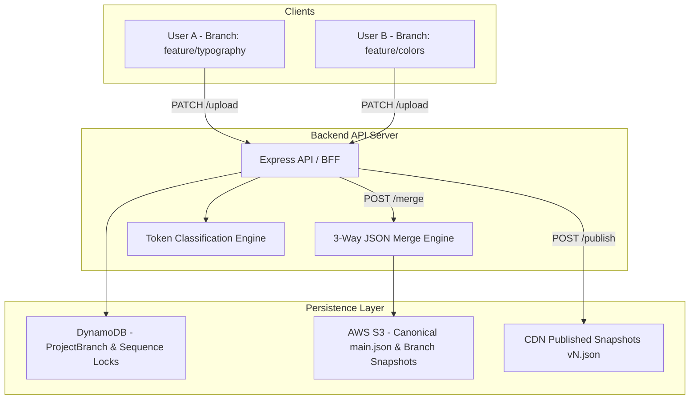
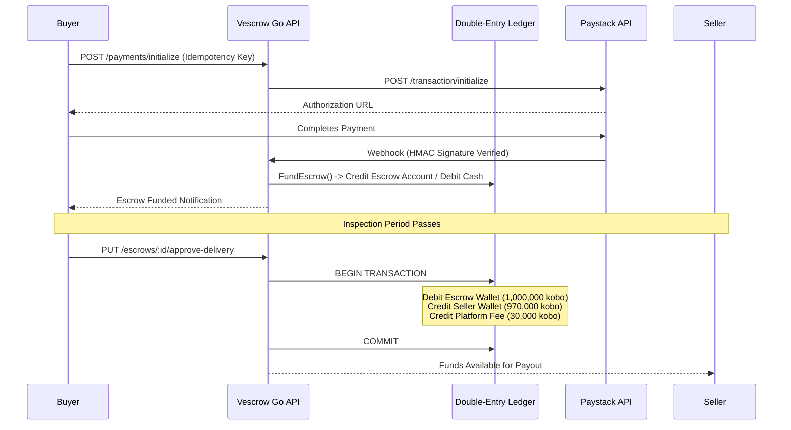

# Systems Architecture & Technical Engineering Documentation (`docsplan`)

[](#project-portfolio)
[](#technology-stack--domain-breakdown)
[](#3-sbts--enterprise-security--regulatory-governance)

Welcome to the **Systems Architecture & Technical Engineering Documentation** repository. This workspace hosts production-grade system blueprints, financial ledger specifications, distributed state management designs, security audit matrices, and regulatory compliance engines developed across high-scale platforms.

---

## Executive Overview

This repository captures complex multi-tier software architectures, database schemas, cryptographic flow designs, and automated compliance engines organized into **three major domains**:

```
docsplan/
├── charisol/      # Multi-User VCS, Design System Tokens & Collaborative Engine
├── QSD/           # Vescrow: Go Modular Monolith, Double-Entry Ledger & Payment Gateway
└── SBTS/          # CBN CSAT Rules Engine, ISO 27001 ISMS & OSINT Intelligence Platform
```

---

## Master Document Index

### 1. Charisol — Collaborative VCS & Design Infrastructure (`/charisol`)

Design system infrastructure featuring Git-like multi-user collaboration, automated token classification engines, and state synchronization:

| Document | Category | Scope / Key Focus |
| :--- | :--- | :--- |
| [ARCHITECTURE.md](file:///Users/oluwatobiloba/Desktop/personal/docsplan/charisol/ARCHITECTURE.md) | **System Architecture** | Collaborative Branching & Multi-User VCS (DynamoDB, S3 3-way JSON merge engine, sequence locks) |
| [TOKEN_CLASSIFICATION_ARCHITECTURE.md](file:///Users/oluwatobiloba/Desktop/personal/docsplan/charisol/TOKEN_CLASSIFICATION_ARCHITECTURE.md) | **Core Engine** | Deterministic token classification pyramid (Brand / Semantic / Scoped tokens & rule evaluator) |
| [COLLABORATION_GAP_ANALYSIS.md](file:///Users/oluwatobiloba/Desktop/personal/docsplan/charisol/COLLABORATION_GAP_ANALYSIS.md) | **Analysis** | Multi-user conflict resolution, optimistic locking gaps, and state sync strategy |
| [AI_BRIEF_MERGE_BUG_ANALYSIS.md](file:///Users/oluwatobiloba/Desktop/personal/docsplan/charisol/AI_BRIEF_MERGE_BUG_ANALYSIS.md) | **Debugging** | Deep-dive bug analysis on AI brief merging and state hydration |
| [BRAND_CONTEXT_ENGINE_PREVIEW_MISMATCH_ANALYSIS.md](file:///Users/oluwatobiloba/Desktop/personal/docsplan/charisol/BRAND_CONTEXT_ENGINE_PREVIEW_MISMATCH_ANALYSIS.md) | **Debugging** | Canvas vs runtime theme preview mismatch resolution |
| [PUBLIC_ASSET_PUBLISH_BUG_ANALYSIS.md](file:///Users/oluwatobiloba/Desktop/personal/docsplan/charisol/PUBLIC_ASSET_PUBLISH_BUG_ANALYSIS.md) | **Debugging** | Asset publication race conditions and CDN snapshot persistence |
| [SYNC_PUBLISH_SAVE_ANALYSIS.md](file:///Users/oluwatobiloba/Desktop/personal/docsplan/charisol/SYNC_PUBLISH_SAVE_ANALYSIS.md) | **State Machine** | Tri-state sync, publish, and save workflow integrity |
| [1789987065356-strata-live-prototype-plan.md](file:///Users/oluwatobiloba/Desktop/personal/docsplan/charisol/1789987065356-strata-live-prototype-plan.md) | **Implementation** | Strata live prototype execution roadmap |
| [FONT_INTEGRATION_MANUAL_UI_TEST_GUIDE.md](file:///Users/oluwatobiloba/Desktop/personal/docsplan/charisol/FONT_INTEGRATION_MANUAL_UI_TEST_GUIDE.md) | **QA / Testing** | Dynamic font loader verification and fallback guidelines |
| [MANUAL_UI_TEST_GUIDE.md](file:///Users/oluwatobiloba/Desktop/personal/docsplan/charisol/MANUAL_UI_TEST_GUIDE.md) | **QA / Testing** | End-to-end component rendering and design token verification |

---

### 2. QSD — Vescrow Escrow & Financial Systems (`/QSD`)

Production financial platform providing escrow, double-entry bookkeeping, Paystack payment webhooks, and regulatory compliance for the Nigerian market:

| Document | Category | Scope / Key Focus |
| :--- | :--- | :--- |
| [architecture.md](file:///Users/oluwatobiloba/Desktop/personal/docsplan/QSD/architecture.md) | **System Architecture** | Modular Monolith Go application architecture, domain dependencies, and worker loops |
| [double_entry_ledger_explained.md](file:///Users/oluwatobiloba/Desktop/personal/docsplan/QSD/double_entry_ledger_explained.md) | **Financial Design** | Immutable double-entry ledger math (debits = credits), balance invariants, and transaction safety |
| [database-schema.md](file:///Users/oluwatobiloba/Desktop/personal/docsplan/QSD/database-schema.md) | **Data Architecture** | PostgreSQL schema (25+ tables), foreign keys, composite indexing, and audit logging |
| [api-specification.md](file:///Users/oluwatobiloba/Desktop/personal/docsplan/QSD/api-specification.md) | **API Design** | Endpoints for Escrow lifecycle, Wallet funding, Payouts, Disputes, and Admin operations |
| [security-architecture.md](file:///Users/oluwatobiloba/Desktop/personal/docsplan/QSD/security-architecture.md) | **Security** | 7-layer defense system (JWT RS256, Argon2id, AES-256-GCM, Rate limiting, HMAC webhooks) |
| [nigerian-compliance.md](file:///Users/oluwatobiloba/Desktop/personal/docsplan/QSD/nigerian-compliance.md) | **Regulatory** | CBN AML/CFT compliance, BVN/NIN verification flows, transaction limits, and PEP screening |
| [state-machine-and-transaction-flow.md](file:///Users/oluwatobiloba/Desktop/personal/docsplan/QSD/state-machine-and-transaction-flow.md) | **Flow Logic** | Escrow state machine (Draft -> Funded -> Inspection -> Released / Disputed) |
| [implementation-tasks.md](file:///Users/oluwatobiloba/Desktop/personal/docsplan/QSD/implementation-tasks.md) | **Task Execution** | Phase-by-phase backend implementation task breakdown |
| [deployment-guide.md](file:///Users/oluwatobiloba/Desktop/personal/docsplan/QSD/deployment-guide.md) | **DevOps** | Containerization, environment setup, and CI/CD production deployment |
| [swagger.json](file:///Users/oluwatobiloba/Desktop/personal/docsplan/QSD/swagger.json) / [swagger.yaml](file:///Users/oluwatobiloba/Desktop/personal/docsplan/QSD/swagger.yaml) | **OpenAPI Specs** | Complete API contracts for frontend and client integrations |

---

### 3. SBTS — Enterprise Security & Regulatory Governance (`/SBTS`)

Security assessment systems, regulatory compliance engines, and OSINT intelligence frameworks:

| Document | Category | Scope / Key Focus |
| :--- | :--- | :--- |
| [CBN_CSAT_Implementation_Plan.md](file:///Users/oluwatobiloba/Desktop/personal/docsplan/SBTS/CBN_CSAT_Implementation_Plan.md) | **Compliance Engine** | CBN Cybersecurity Self-Assessment Tool rules engine (FFIEC CAT, 504 statements, risk bands) |
| [CBN_CSAT_Backend_Migration_Tasks.md](file:///Users/oluwatobiloba/Desktop/personal/docsplan/SBTS/CBN_CSAT_Backend_Migration_Tasks.md) | **Backend Roadmap** | NestJS & Prisma migration roadmap for the CBN CSAT scoring module |
| [ISO27001_Mock_Removal_Implementation.md](file:///Users/oluwatobiloba/Desktop/personal/docsplan/SBTS/ISO27001_Mock_Removal_Implementation.md) | **Security Portal** | Replacing mock data with live ISMS controls, audit evidence, and verification logic |
| [ISO27001_Portal_Redesign_Tasks.md](file:///Users/oluwatobiloba/Desktop/personal/docsplan/SBTS/ISO27001_Portal_Redesign_Tasks.md) | **UI/UX & API** | Task list for ISO 27001 portal frontend redesign and audit trail integration |
| [01-requirements-and-core-entities.md](file:///Users/oluwatobiloba/Desktop/personal/docsplan/SBTS/01-requirements-and-core-entities.md) | **Requirements** | Functional requirements and core domain entities for enterprise security governance |
| [02-architecture-and-data-flow.md](file:///Users/oluwatobiloba/Desktop/personal/docsplan/SBTS/02-architecture-and-data-flow.md) | **Architecture** | High-level data flows, entity relationships, and security controls |
| [03-implementation-plan.md](file:///Users/oluwatobiloba/Desktop/personal/docsplan/SBTS/03-implementation-plan.md) | **Plan** | Multi-phase development roadmap and acceptance milestones |
| [04-security-architecture-review.md](file:///Users/oluwatobiloba/Desktop/personal/docsplan/SBTS/04-security-architecture-review.md) | **Security Review** | Threat modeling, attack surfaces, and defensive countermeasures |
| [05-security-signoff-and-pentest-readiness.md](file:///Users/oluwatobiloba/Desktop/personal/docsplan/SBTS/05-security-signoff-and-pentest-readiness.md) | **Pentest Sign-off** | Pentest preparation, vulnerability remediation matrix, and sign-off verification |
| [ElectionsSentinel360_Live_Data_Sources_and_OSINT_Strategy.pdf](file:///Users/oluwatobiloba/Desktop/personal/docsplan/SBTS/ElectionsSentinel360_Live_Data_Sources_and_OSINT_Strategy.pdf) | **OSINT / Intelligence** | Real-time social media & news intelligence collection pipeline strategy |

---

## Technical Highlights

### 1. Collaborative Branching & 3-Way Merge (`/charisol`)

The Charisol architecture extends design token storage into a Git-like version control system:



- **Token Classification Pyramid**: Deterministic rules classify tokens into **Brand** (literals like `#3B82F6`), **Semantic** (aliases like `var(--color-blue-500)`), and **Scoped** (component-bound rules like `--button-primary-bg`).
- **Conflict Prevention**: Per-branch `sequenceNumber` counters prevent lost updates while key-level 3-way JSON merges handle non-overlapping concurrent edits smoothly.

---

### 2. Double-Entry Financial Ledger & Escrow (`/QSD`)

The Vescrow backend leverages a domain-driven **Modular Monolith** in Go, backed by double-entry accounting invariants to eliminate balance drift:



- **Financial Integrity**: Guaranteeing sum(Debits) = sum(Credits) across all system ledger entries.
- **Async Payout Outbox**: High-reliability payout processing via asynchronous DB outbox patterns to isolate external banking web services from state transitions.

---

### 3. Regulatory Rules Engine & FFIEC Scoring (`/SBTS`)

The Central Bank of Nigeria (CBN) Cybersecurity Self-Assessment Tool (CSAT) translates complex spreadsheets into a deterministic, queryable rules engine:

> [!IMPORTANT]
> **Scoring Engine Mechanics**:
> - **Inherent Risk Engine**: Evaluates 102 weighted risk attributes across 5 categories (*Technologies, Delivery Channels, Online/Mobile Services, Organizational Characteristics, External Attacks*) using threshold bands:
>   $$\text{Rating} = \begin{cases} \text{Low} & < 1.5 \\ \text{Moderate} & < 2.5 \\ \text{Above Average} & < 3.5 \\ \text{High} & < 4.5 \\ \text{Extremely High} & \ge 4.5 \end{cases}$$
> - **Maturity Engine**: Maps 504 declarative statements across 5 Domains and 5 Maturity Levels (*Baseline, Evolving, Intermediate, Advanced, Innovative*). Domain maturity level is governed by the highest level at which **100% of statements are satisfied**.

---

## Technology Stack & Domain Breakdown

| Domain | Core Frameworks / Stack | Database & Storage | Key Patterns |
| :--- | :--- | :--- | :--- |
| **Charisol** | Node.js, Express, React, Next.js, TypeScript | AWS DynamoDB, AWS S3, CloudFront CDN | Optimistic Locks, 3-Way Merge, Token Classification Engine |
| **QSD (Vescrow)** | Go (Fiber), GORM, Next.js | PostgreSQL 15, Redis 7 | Double-Entry Accounting, Outbox Worker Pattern, RS256 JWT, HMAC Webhooks |
| **SBTS (CSAT)** | NestJS, Next.js, Prisma ORM, TypeScript | PostgreSQL | FFIEC CAT Rules Engine, Multi-Tenant Governance, Security Audits |

---

## How to Explore This Documentation

1. **For System Architecture & Design System Engineering**:
   - Begin with [charisol/ARCHITECTURE.md](file:///Users/oluwatobiloba/Desktop/personal/docsplan/charisol/ARCHITECTURE.md) for VCS branching design.
   - Read [charisol/TOKEN_CLASSIFICATION_ARCHITECTURE.md](file:///Users/oluwatobiloba/Desktop/personal/docsplan/charisol/TOKEN_CLASSIFICATION_ARCHITECTURE.md) to understand backend-authoritative token classification.

2. **For Financial Engineering & Escrow Systems**:
   - Read [QSD/architecture.md](file:///Users/oluwatobiloba/Desktop/personal/docsplan/QSD/architecture.md) for system architecture overview.
   - Review [QSD/double_entry_ledger_explained.md](file:///Users/oluwatobiloba/Desktop/personal/docsplan/QSD/double_entry_ledger_explained.md) for double-entry ledger math.
   - Inspect [QSD/security-architecture.md](file:///Users/oluwatobiloba/Desktop/personal/docsplan/QSD/security-architecture.md) for 7-layer defense-in-depth principles.

3. **For Regulatory Governance & Enterprise Compliance**:
   - Explore [SBTS/CBN_CSAT_Implementation_Plan.md](file:///Users/oluwatobiloba/Desktop/personal/docsplan/SBTS/CBN_CSAT_Implementation_Plan.md) for FFIEC scoring rules.
   - Review [SBTS/04-security-architecture-review.md](file:///Users/oluwatobiloba/Desktop/personal/docsplan/SBTS/04-security-architecture-review.md) for security audit & pentest readiness.

---

> [!NOTE]
> All documentation files in this repository contain absolute links for easy inline navigation across IDEs and documentation tools.
