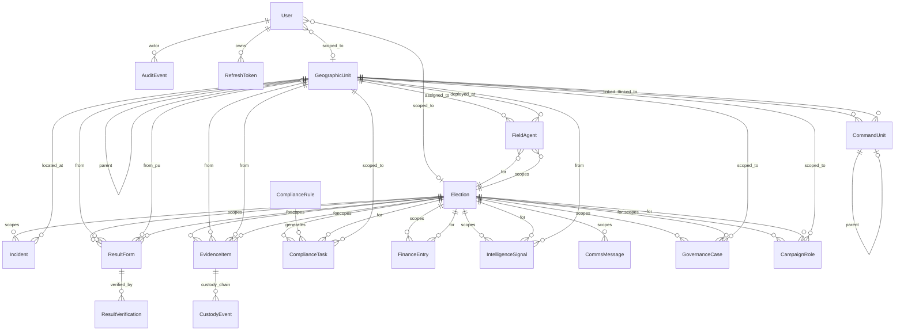

# ElectionsSentinel (ES360) — Requirements & Core Entities Specification

**Document Version:** 1.0  
**Date:** 27 August 2026  
**Classification:** Internal — Engineering Reference  

---

## Table of Contents

1. [Statutory & Regulatory Foundation](#1-statutory--regulatory-foundation)
2. [Functional Requirements by Domain](#2-functional-requirements-by-domain)
3. [Non-Functional Requirements](#3-non-functional-requirements)
4. [Core Entity Model](#4-core-entity-model)
5. [Entity Relationship Diagram](#5-entity-relationship-diagram)
6. [Role-Based Access Control Matrix](#6-role-based-access-control-matrix)
7. [Current Implementation Inventory](#7-current-implementation-inventory)
8. [Gap Analysis — Current State vs. Production Requirements](#8-gap-analysis)

---

## 1. Statutory & Regulatory Foundation

ES360 must comply with the following Nigerian legislation. Every feature must trace to the specific statutory section it satisfies.

### 1.1 Electoral Act 2026 (Amended)

| Section | Provision | ES360 Feature |
|---------|-----------|---------------|
| **§51(2)** | Over-voting: total votes cast must not exceed accredited voters; presiding officer must cancel the PU result if breached | Results Reconciliation Engine — mathematical integrity validation |
| **§60** | Mandatory electronic transmission of Form EC8A to IReV; manual backup if e-transmission fails | PVT Collation — IReV comparison layer |
| **§88(2)** | Campaign spending ceilings: Presidential ₦10bn, Governor ₦1bn (doubled from 2022 Act), Senate ₦100m, House ₦70m, State Assembly ₦30m | Finance Ledger — cap enforcement |
| **§88(8)** | Individual donor aggregate cap: ₦50m (2022); ₦100m under 2026 amendment | Finance Ledger — donor KYC & aggregate check |
| **§90(3)** | Parties may not accept contributions >₦50m unless source is identifiable to INEC | Donor Identity & KYC Auditing |
| **§94(1)** | Campaign period: 150 days before polling; campaign silence: 24 hours before polling through end of polling day | Election Silence Service — comms enforcement |

### 1.2 Evidence Act 2011 (as Amended) — Section 84

| Requirement | Detail | ES360 Implementation |
|-------------|--------|---------------------|
| **§84(2)(a)** | Computer used regularly to store/process information in ordinary course of activities | Certificate generation must attest to regular platform use |
| **§84(2)(b)** | Information of the kind in the document regularly supplied to the computer | Chain-of-custody log proves continuous evidence ingestion |
| **§84(2)(c)** | Computer operating properly during the period | System health & uptime attestation in certificate |
| **§84(4)** | Certificate signed by a responsible person authenticating device reliability | Digital Evidence Certificate — signed by Legal Team role; exportable as PDF |

### 1.3 INEC Operational Framework

| Component | Detail | ES360 Integration |
|-----------|--------|-------------------|
| **Geographic Hierarchy** | Federation → 36 States + FCT → 774 LGAs → 8,809 Wards → 176,846 Polling Units | `GeographicUnit` entity with self-referencing hierarchy and materialized `path` |
| **BVAS** | Bimodal Voter Accreditation System — fingerprint + facial recognition | Accredited voters count sourced from BVAS as ground truth for over-voting checks |
| **IReV** | INEC Election Result Viewing Portal — public PU-level result viewing | Reconciliation layer 4: compare ES360 captured results against IReV published results |
| **Form EC8A** | Statement of Poll Result — the primary paper record per PU | Core result ingestion form; OCR target document |

---

## 2. Functional Requirements by Domain

### FR-01: Situation Room & Command Dashboard

| ID | Requirement | Priority | Acceptance Criteria |
|----|-------------|----------|---------------------|
| FR-01.01 | Display real-time nationwide deployment progress | P0 | Dashboard shows agent check-in % across all 36+1 states; updates within 30 seconds of new data |
| FR-01.02 | Interactive geographic drill-down (Federation → State → LGA → Ward → PU) | P0 | Click-through navigation with breadcrumb; each level loads aggregated metrics |
| FR-01.03 | Live election countdown with operational rhythm markers | P1 | Countdown to polling date; visual markers for campaign period start, silence period, polling day |
| FR-01.04 | State Readiness Index ranking | P0 | Each state scored on: agent deployment %, equipment checklist completion %, incident load, result capture % |
| FR-01.05 | Real-time WebSocket/SSE push for live metrics | P1 | Dashboard receives push updates without polling; < 5 second latency |

### FR-02: Field Agent Force Management

| ID | Requirement | Priority | Acceptance Criteria |
|----|-------------|----------|---------------------|
| FR-02.01 | Full agent rostering with profile, phone, PU assignment | P0 | CRUD operations; agent linked to `GeographicUnit` and `Election` |
| FR-02.02 | Training/certification status tracking | P0 | Status enum: Pending → In Training → Certified → Remediation; blocks deployment if not Certified |
| FR-02.03 | Equipment deployment checklist | P0 | Boolean checklist per agent; deployment gating enforced by API |
| FR-02.04 | Live heartbeat & connectivity telemetry | P1 | `syncStatus` field updated by client heartbeat; dashboard shows online/offline/store-and-forward |
| FR-02.05 | Bulk agent import (CSV/Excel) | P1 | Upload CSV with name, phone, state, LGA, ward, PU; validates geography against master data |
| FR-02.06 | Agent deployment gating | P0 | API blocks status change to Equipped/Checked-in unless trainingStatus=Certified AND equipmentChecklistComplete=true |

### FR-03: Parallel Vote Tabulation (PVT) & Results Collation

| ID | Requirement | Priority | Acceptance Criteria |
|----|-------------|----------|---------------------|
| FR-03.01 | Form EC8A data ingestion (manual entry) | P0 | Capture: registered voters, accredited voters, valid votes, rejected votes, per-party scores |
| FR-03.02 | Double-blind verification entry | P0 | Second operator re-enters independently; auto-match commits, mismatch flags Exception |
| FR-03.03 | Mathematical integrity validation | P0 | `valid_votes + rejected_votes ≤ accredited_voters`; `accredited_voters ≤ registered_voters`; over-voting alert if breached |
| FR-03.04 | Per-party candidate vote scores | P1 | `ResultCandidateScore` entity: party name, candidate name, votes; linked to `ResultForm` |
| FR-03.05 | Ward/LGA/State collation roll-up | P1 | Aggregate PU results to ward level; ward to LGA; LGA to state; flag discrepancies vs. INEC collation |
| FR-03.06 | IReV comparison layer | P2 | Fetch or manually enter IReV-published figures; compare with ES360-captured data; flag divergence |

### FR-04: AI-Powered OCR Form Scanning

| ID | Requirement | Priority | Acceptance Criteria |
|----|-------------|----------|---------------------|
| FR-04.01 | Photo-to-data extraction of Form EC8A | P1 | Upload image; OCR returns extracted numerical fields with confidence scores |
| FR-04.02 | Confidence scoring per field | P0 | Each extracted field tagged with confidence 0–1; fields < 0.7 highlighted for manual review |
| FR-04.03 | Advisory-only pre-fill (never auto-commits) | P0 | OCR populates form fields for operator confirmation; no write to DB without operator submit |
| FR-04.04 | Offline OCR capability | P2 | Vendor Tesseract.js worker + eng.traineddata for air-gapped deployments |

### FR-05: Evidence Vault & Chain of Custody

| ID | Requirement | Priority | Acceptance Criteria |
|----|-------------|----------|---------------------|
| FR-05.01 | SHA-256 hash at upload time | P0 | Every upload computes and stores cryptographic hash; immutable after creation |
| FR-05.02 | Immutable chain-of-custody log | P0 | Every action (upload, transfer, export, legal hold) creates an append-only `CustodyEvent` |
| FR-05.03 | Statutory legal hold | P0 | Legal/DPO role applies hold; held items cannot be deleted or modified |
| FR-05.04 | Export with hash re-verification | P0 | Export re-downloads from storage, recomputes SHA-256, compares to stored hash; logs match/mismatch |
| FR-05.05 | Section 84 Digital Evidence Certificate | P1 | Generate PDF certificate with: device identification, data regularity attestation, proper functioning attestation, signatory details |
| FR-05.06 | GPS coordinates on evidence capture | P1 | Client captures GPS lat/long at upload time; stored with evidence item |
| FR-05.07 | Evidence linked to source record | P0 | Evidence items link to incidents, results, compliance tasks via `linkedRecordId` + `linkedRecordType` |

### FR-06: Incident Command & SLA

| ID | Requirement | Priority | Acceptance Criteria |
|----|-------------|----------|---------------------|
| FR-06.01 | Multi-category incident reporting | P0 | Categories: Technology, Logistics, Security & Violence, Information Integrity, Compliance |
| FR-06.02 | Severity-based SLA timers | P0 | Critical: 5 min ack / 2 hr resolve; High: 15 min / 4 hr; Medium: 1 hr / 8 hr; Low: 4 hr / 24 hr |
| FR-06.03 | Duplicate/cluster detection | P0 | Same geography + similar title within 6 hours → flagged for reviewer; Confirm/Reject actions |
| FR-06.04 | Acknowledgement workflow | P0 | One-click ack stamps `ackedAt`; stops ack SLA timer |
| FR-06.05 | Escalation routing | P1 | Critical incidents auto-notify National Director role; unacknowledged breached SLAs trigger escalation |
| FR-06.06 | Incident geospatial clustering | P2 | Adjacent PU incidents within same ward grouped into cluster; single cluster view in dashboard |

### FR-07: Multilingual Intelligence & Counter-Disinformation

| ID | Requirement | Priority | Acceptance Criteria |
|----|-------------|----------|---------------------|
| FR-07.01 | Multilingual signal ingestion (5 languages) | P0 | Capture text content; auto-detect language among English, Pidgin, Hausa, Yoruba, Igbo |
| FR-07.02 | Language confidence scoring | P0 | Confidence < 0.4 or multi-language → `needsHumanReview = true` |
| FR-07.03 | Human review triage queue | P0 | Filterable list of signals needing review; Confirm/Escalate/Dismiss actions |
| FR-07.04 | Narrative clustering & deduplication | P2 | Group related signals into tracked "narratives"; track lifecycle from emergence to countered |
| FR-07.05 | Counter-narrative spokesperson desk | P2 | Draft, approve, and deploy verified counter-statements; approval workflow for press releases |

### FR-08: Statutory Compliance & Legal Risk Engine

| ID | Requirement | Priority | Acceptance Criteria |
|----|-------------|----------|---------------------|
| FR-08.01 | Versioned compliance rules with trigger types | P0 | Fixed date / Relative to polling date / Recurring; effective-dated versioning |
| FR-08.02 | Occurrence generation from rules | P0 | Generate concrete `ComplianceTask` with due date from rule + election |
| FR-08.03 | Rule supersession (statute amendments) | P0 | Supersede retires old version; new version created; past occurrences keep pointing to original |
| FR-08.04 | Statutory reference mapping | P0 | Every task, rule, and violation tagged with exact legal clause |
| FR-08.05 | Automated recurring occurrence generation | P1 | Cron job generates occurrences for RECURRING rules on schedule |
| FR-08.06 | Compliance dashboard with due/overdue counts | P0 | Summary: total rules, open tasks, overdue tasks, completion % by election |

### FR-09: Campaign Finance & Spending Ceilings

| ID | Requirement | Priority | Acceptance Criteria |
|----|-------------|----------|---------------------|
| FR-09.01 | Record expenditures and donations | P0 | Entry type, election, office type, amount, description, donor details |
| FR-09.02 | Real-time cap enforcement | P0 | Preview endpoint shows "within cap" / "would exceed cap" before committing |
| FR-09.03 | Cap override with approval | P0 | Over-cap entry requires `capOverrideApproval`; flagged `capExceeded` for compliance review |
| FR-09.04 | Donor aggregate tracking | P0 | Per-donor-name aggregate across election; flag when approaching ₦100m ceiling |
| FR-09.05 | Donor KYC verification | P1 | KYC reference field; flag unverified donors; block anonymous contributions |
| FR-09.06 | Expense categorization | P1 | Categories: Agent stipends, Logistics, Legal, Media, Security, Administration |

### FR-10: Offline-First Operation

| ID | Requirement | Priority | Acceptance Criteria |
|----|-------------|----------|---------------------|
| FR-10.01 | IndexedDB offline write queue | P0 | Failed network requests queued in IndexedDB; survives browser refresh |
| FR-10.02 | Automatic sync on reconnection | P0 | Queued items replayed on `online` event + periodic 30-second sweep |
| FR-10.03 | Conflict routing (not auto-merge) | P0 | Non-retryable errors (validation, 4xx) routed to conflict queue for human review |
| FR-10.04 | Sync status indicator | P0 | Topbar shows: Synced / N pending sync / Offline |
| FR-10.05 | Service worker for asset caching | P1 | PWA shell cacheable offline; app usable without connectivity for pre-cached pages |
| FR-10.06 | Zero data loss guarantee | P0 | 12-hour offline simulation test passes: 100% of valid items sync, invalid items routed to conflict |

### FR-11: Constituency Casework & Governance

| ID | Requirement | Priority | Acceptance Criteria |
|----|-------------|----------|---------------------|
| FR-11.01 | Casework CRUD with sector categorization | P0 | Health, Education, Infrastructure, Energy, Agriculture, Security sectors |
| FR-11.02 | Casework SLA tracking | P1 | Due dates; status progression: Open → In Progress → Resolved → Closed |
| FR-11.03 | Constituency analytics dashboard | P2 | Per-constituency metrics: cases opened, resolved, overdue, by sector |

### FR-12: Enterprise Security & RBAC

| ID | Requirement | Priority | Acceptance Criteria |
|----|-------------|----------|---------------------|
| FR-12.01 | JWT-based authentication with refresh tokens | P0 | Access token (12h) + refresh token (30d); secure rotation |
| FR-12.02 | TOTP MFA for privileged roles | P0 | Super Admin, Principal, National Director, Legal, Finance, DPO must enroll TOTP before usable token issued |
| FR-12.03 | Role-based endpoint authorization | P0 | `@Roles()` decorator + `RolesGuard` on all write endpoints |
| FR-12.04 | Geography scope enforcement | P0 | Non-national roles blocked from writing records outside their `assignedGeographicUnitId` subtree |
| FR-12.05 | Immutable audit trail | P0 | Every create/update across all modules writes `AuditEvent` (actor, action, record type/id, detail) |
| FR-12.06 | Rate limiting | P0 | 120 requests per minute per IP (ThrottlerModule) |

---

## 3. Non-Functional Requirements

| ID | Category | Requirement | Target |
|----|----------|-------------|--------|
| NFR-01 | **Performance** | Dashboard summary API response time | < 500ms at 10,000 PU results |
| NFR-02 | **Performance** | Result form ingestion throughput | ≥ 500 concurrent writes/second |
| NFR-03 | **Scalability** | Support 176,846 polling units with 6 agents each | ~1M agent records |
| NFR-04 | **Availability** | Uptime during polling day (12-hour window) | 99.9% (max 43 seconds downtime) |
| NFR-05 | **Security** | OWASP Top 10 compliance | All categories addressed |
| NFR-06 | **Security** | Data encryption at rest | PostgreSQL TDE or volume-level encryption |
| NFR-07 | **Security** | Data encryption in transit | TLS 1.3 for all API communications |
| NFR-08 | **Compliance** | Audit trail retention | Minimum 7 years (election petition limitation period) |
| NFR-09 | **Reliability** | Zero data loss for offline-queued submissions | 100% sync or conflict-routed |
| NFR-10 | **Observability** | Structured logging with correlation IDs | JSON logs; request tracing |
| NFR-11 | **Deployment** | Blue-green or rolling deployment | Zero-downtime deployments |
| NFR-12 | **Backup** | PostgreSQL automated backups | Point-in-time recovery; 30-day retention |
| NFR-13 | **Localization** | Support for Nigerian English and 4 local languages | UI labels and system messages |

---

## 4. Core Entity Model

### 4.1 Foundation Entities

#### `User` (Table: `users`)
The operator/actor identity. Every authenticated action traces to a User.

| Column | Type | Constraints | Description |
|--------|------|-------------|-------------|
| `id` | UUID | PK | Unique operator ID |
| `email` | VARCHAR | UNIQUE, NOT NULL | Login credential |
| `password_hash` | VARCHAR | NOT NULL | bcrypt-hashed password |
| `full_name` | VARCHAR | NOT NULL | Display name |
| `role` | ENUM(Role) | NOT NULL, DEFAULT 'PU/Collation Agent' | RBAC role assignment |
| `assigned_geographic_unit_id` | VARCHAR | FK → geographic_units, NULLABLE | Scope boundary for geography-restricted roles |
| `assigned_election_id` | VARCHAR | FK → elections, NULLABLE | Scope boundary for election-restricted roles |
| `mfa_enabled` | BOOLEAN | DEFAULT false | Whether TOTP MFA is active |
| `mfa_secret` | VARCHAR | NULLABLE | TOTP shared secret (encrypted at rest) |
| `created_at` | TIMESTAMP | AUTO | Account creation time |

**Role Enum Values:** Super Admin, Principal/Candidate, National/State Director, LGA/Ward Coordinator, PU/Collation Agent, Intelligence Analyst, Legal Team, Comms/Media, Finance/Compliance, Observer, DPO/Security/Auditor, Governance Team

#### `Election` (Table: `elections`)
A discrete electoral event that scopes all operational records.

| Column | Type | Constraints | Description |
|--------|------|-------------|-------------|
| `id` | VARCHAR | PK | e.g., `EL-2027-PRES` |
| `name` | VARCHAR | NOT NULL | Display name |
| `type` | ENUM(ElectionType) | NOT NULL | General, Off-cycle Governorship, FCT Area Council, Local Government, etc. |
| `authority` | VARCHAR | NOT NULL | INEC, SIEC, or party oversight body |
| `polling_date` | DATE | NOT NULL | The date of the election |
| `legal_version` | VARCHAR | | Statute version this election is configured against |
| `status` | VARCHAR | DEFAULT 'Draft' | Draft, Active, Completed, Cancelled |
| `timezone` | VARCHAR | DEFAULT 'Africa/Lagos' | Timezone for silence period calculations |
| `created_by` | VARCHAR | NOT NULL | Creating operator's email |
| `created_at` / `updated_at` | TIMESTAMP | AUTO | Temporal tracking |

#### `GeographicUnit` (Table: `geographic_units`)
The INEC administrative hierarchy — self-referencing tree with materialized path.

| Column | Type | Constraints | Description |
|--------|------|-------------|-------------|
| `id` | VARCHAR | PK | e.g., `GEO-STA-24` |
| `official_code` | VARCHAR | UNIQUE | INEC/SIEC official code |
| `name` | VARCHAR | NOT NULL | Unit name |
| `level` | ENUM(GeoLevel) | NOT NULL | Federation, State, LGA, Ward, Polling Unit |
| `parent_id` | VARCHAR | FK → geographic_units, NULLABLE | Parent in the hierarchy |
| `path` | VARCHAR | INDEXED | Materialized ancestor path, e.g., `NG/LA/IKJ/WD-04` |
| `source` | VARCHAR | | Source registry (e.g., "INEC Master Registry") |
| `effective_from` / `effective_to` | DATE | | Temporal validity for boundary changes |
| `status` | VARCHAR | DEFAULT 'Active' | Active, Deprecated |

**Hierarchy Cardinality:**
- 1 Federation → 37 States (36 + FCT)
- 37 States → 774 LGAs
- 774 LGAs → 8,809 Wards
- 8,809 Wards → 176,846 Polling Units

### 4.2 Operational Entities

#### `FieldAgent` (Table: `field_agents`)
A deployed election observer or party agent at a geographic unit.

| Column | Type | Constraints | Description |
|--------|------|-------------|-------------|
| `id` | VARCHAR | PK | e.g., `AGT-010841` |
| `full_name` | VARCHAR | NOT NULL | Agent's legal name |
| `phone` | VARCHAR | | Direct contact number |
| `election_id` | VARCHAR | FK → elections, INDEXED | Scoping election |
| `geographic_unit_id` | VARCHAR | FK → geographic_units, INDEXED | Canonical geography assignment |
| `state` / `lga` / `ward` / `polling_unit` | VARCHAR | | Display-friendly free-text (populated from geography FK) |
| `assignment_type` | VARCHAR | DEFAULT 'Polling Unit Agent' | PU Agent, Ward Collation Observer, LGA Supervisor |
| `training_status` | VARCHAR | DEFAULT 'Pending' | Pending → In Training → Certified → Remediation |
| `deployment_status` | VARCHAR | DEFAULT 'Unassigned' | Unassigned → Assigned → Equipped → Checked in → Acknowledged |
| `equipment_checklist_complete` | BOOLEAN | DEFAULT false | Must be true before deployment advances past Assigned |
| `sync_status` | VARCHAR | DEFAULT 'Online' | Online, Offline, Store-and-forward |
| `created_by` | VARCHAR | NOT NULL | Creating operator |

#### `ResultForm` (Table: `result_forms`)
A captured Form EC8A result sheet — one per polling unit per election.

| Column | Type | Constraints | Description |
|--------|------|-------------|-------------|
| `id` | VARCHAR | PK | e.g., `RES-010841` |
| `form_type` | VARCHAR | DEFAULT 'EC8A' | EC8A (PU), EC8B (Ward), EC8C (LGA), EC8D (State), EC8E (National) |
| `election` | VARCHAR | NOT NULL | Display name of election |
| `election_id` / `geographic_unit_id` | VARCHAR | FK, INDEXED | Scoping FKs |
| `state` / `lga` / `ward` / `polling_unit` | VARCHAR | | Display-friendly location |
| `registered_voters` | INT | DEFAULT 0 | From official voter roll |
| `accredited_voters` | INT | DEFAULT 0 | From BVAS device |
| `valid_votes` | INT | DEFAULT 0 | Total valid votes cast |
| `rejected_votes` | INT | DEFAULT 0 | Spoiled/rejected ballots |
| `verification_status` | VARCHAR | DEFAULT 'Quality review' | Quality review → Verified → Failed |
| `reconciliation_status` | VARCHAR | DEFAULT 'Pending' | Pending → Reconciled → Exception |
| `captured_by` | VARCHAR | NOT NULL | Capturing agent/operator |

**Production Enhancement Needed:** `ResultCandidateScore` (new entity) — per-party vote scores linked to ResultForm.

#### `ResultVerification` (Table: `result_verifications`)
The second-operator double-blind entry for a result form.

| Column | Type | Constraints | Description |
|--------|------|-------------|-------------|
| `id` | VARCHAR | PK | |
| `result_form_id` | VARCHAR | FK → result_forms, INDEXED | The form being verified |
| `verified_by` | VARCHAR | NOT NULL | Second operator email |
| `accredited_voters` / `valid_votes` / `rejected_votes` | INT | | Re-entered figures |
| `matches_original` | BOOLEAN | | Auto-computed: do re-entered figures match original? |

#### `EvidenceItem` (Table: `evidence_items`)
A tamper-evident digital artifact (image, video, audio, document).

| Column | Type | Constraints | Description |
|--------|------|-------------|-------------|
| `id` | VARCHAR | PK | |
| `file_name` | VARCHAR | NOT NULL | Original filename |
| `object_key` | VARCHAR | NOT NULL | Storage path (S3/local) |
| `content_type` | VARCHAR | NOT NULL | MIME type |
| `size_bytes` | INT | NOT NULL | File size |
| `sha256` | VARCHAR | INDEXED | Cryptographic hash computed at upload |
| `evidence_type` | VARCHAR | NOT NULL | Result sheet, Incident photo, Legal exhibit, etc. |
| `linked_record_id` | VARCHAR | INDEXED | FK to source record (incident, result, compliance task) |
| `election_id` / `geographic_unit_id` | VARCHAR | FK, INDEXED | Scoping |
| `legal_hold` | BOOLEAN | DEFAULT false | Cannot be deleted/modified when true |
| `uploaded_by` | VARCHAR | NOT NULL | Uploading operator |

#### `CustodyEvent` (Table: `custody_events`)
Immutable, append-only chain-of-custody log entry.

| Column | Type | Constraints | Description |
|--------|------|-------------|-------------|
| `id` | VARCHAR | PK | |
| `evidence_item_id` | VARCHAR | FK → evidence_items, INDEXED | Parent evidence |
| `action` | ENUM(CustodyAction) | NOT NULL | Uploaded, Transferred, Exported, Legal hold applied/removed, Hash verified/mismatch |
| `actor_email` | VARCHAR | NOT NULL | Who performed the action |
| `to_email` | VARCHAR | NULLABLE | Custody recipient (transfers only) |
| `notes` | VARCHAR | | Freeform context |
| `created_at` | TIMESTAMP | AUTO, IMMUTABLE | When the action occurred |

#### `Incident` (Table: `incidents`)
An electoral irregularity, device failure, or security emergency.

| Column | Type | Constraints | Description |
|--------|------|-------------|-------------|
| `id` | VARCHAR | PK | e.g., `INC-2841` |
| `title` | VARCHAR | NOT NULL | Brief description |
| `category` | VARCHAR | NOT NULL | Technology, Logistics, Security & Violence, Information Integrity, Compliance |
| `election_id` / `geographic_unit_id` | VARCHAR | FK, INDEXED | Scoping |
| `severity` | VARCHAR | INDEXED | Critical, High, Medium, Low |
| `confidence` | VARCHAR | DEFAULT 'Unverified' | Unverified → Verified → Human-verified |
| `status` | VARCHAR | INDEXED, DEFAULT 'Reported' | Reported → Assigned → In progress → Resolved → Closed |
| `description` | TEXT | | Detailed narrative |
| `owner` | VARCHAR | | Assigned desk/team |
| `reported_by` | VARCHAR | NOT NULL | Reporting agent |
| `possible_duplicate_of` | VARCHAR | NULLABLE | FK to suspected duplicate incident |
| `duplicate_status` | VARCHAR | DEFAULT 'None' | None → Flagged → Confirmed → Rejected |
| `acked_at` | TIMESTAMP | NULLABLE | When acknowledged |
| `resolved_at` | TIMESTAMP | NULLABLE | When resolved |

### 4.3 Compliance & Finance Entities

#### `ComplianceRule` (Table: `compliance_rules`)
A versioned, effective-dated statutory obligation.

| Column | Type | Constraints | Description |
|--------|------|-------------|-------------|
| `id` | VARCHAR | PK | e.g., `RULE-EA26-01` |
| `title` | VARCHAR | NOT NULL | Rule description |
| `authority` | VARCHAR | NOT NULL | Issuing authority |
| `statutory_reference` | VARCHAR | NOT NULL | Exact legal clause |
| `jurisdiction_level` | VARCHAR | DEFAULT 'National' | National, State, LGA |
| `triggerType` | ENUM | NOT NULL | Fixed date, Relative to polling date, Recurring |
| `trigger_value` | VARCHAR | NOT NULL | ISO date, day offset, or cadence |
| `risk` | VARCHAR | DEFAULT 'Medium' | Critical, High, Medium, Low |
| `version` | INT | DEFAULT 1 | Increment on supersession |
| `effective_from` / `effective_to` | DATE | | Temporal validity |
| `status` | VARCHAR | DEFAULT 'Active' | Active, Superseded, Retired |

#### `ComplianceTask` (Table: `compliance_tasks`)
A concrete, dated obligation instance generated from a rule.

| Column | Type | Constraints | Description |
|--------|------|-------------|-------------|
| `id` | VARCHAR | PK | e.g., `TSK-001` |
| `title` | VARCHAR | NOT NULL | Task description |
| `rule_id` | VARCHAR | FK → compliance_rules | Source rule |
| `election_id` / `geographic_unit_id` | VARCHAR | FK | Scoping |
| `due_date` | DATE | NOT NULL | Calculated deadline |
| `status` | VARCHAR | DEFAULT 'Open' | Open → In Progress → Complete → Overdue |
| `risk` | VARCHAR | | Inherited from rule |
| `owner` | VARCHAR | | Assigned team/person |
| `evidence_count` | INT | DEFAULT 0 | Attached evidence items |

#### `FinanceEntry` (Table: `finance_entries`)
A campaign expenditure or donation record.

| Column | Type | Constraints | Description |
|--------|------|-------------|-------------|
| `id` | VARCHAR | PK | |
| `entryType` | ENUM | NOT NULL | Expenditure, Donation |
| `election_id` | VARCHAR | FK → elections, INDEXED | Scoping election |
| `office_type` | VARCHAR | NOT NULL | President, Governor, Senate, House, State Assembly |
| `amountNgn` | NUMERIC(16,2) | NOT NULL | Amount in Nigerian Naira |
| `description` | VARCHAR | | Entry description |
| `donor_name` | VARCHAR | NULLABLE | Donor identity (donations only) |
| `donor_kyc_reference` | VARCHAR | NULLABLE | KYC verification reference |
| `recorded_by` | VARCHAR | NOT NULL | Recording operator |
| `cap_exceeded` | BOOLEAN | DEFAULT false | Flagged if over statutory ceiling |
| `approved_by` | VARCHAR | NULLABLE | Override approver |

### 4.4 Intelligence & Communications Entities

#### `IntelligenceSignal` (Table: `intelligence_signals`)
A captured media/social/hotline signal for multilingual triage.

| Column | Type | Constraints | Description |
|--------|------|-------------|-------------|
| `id` | VARCHAR | PK | |
| `content` | TEXT | NOT NULL | Raw signal text |
| `source` | VARCHAR | NOT NULL | Public social API, Broadcast monitoring, Field hotline, Official notice |
| `election_id` / `geographic_unit_id` | VARCHAR | FK, INDEXED | Scoping |
| `detected_language` | VARCHAR | INDEXED | English, Nigerian Pidgin, Hausa, Yoruba, Igbo, Mixed, Undetermined |
| `language_confidence` | FLOAT | | 0–1 confidence score |
| `needs_human_review` | BOOLEAN | | True if confidence < 0.4 or mixed-language |
| `status` | VARCHAR | INDEXED, DEFAULT 'Unreviewed' | Unreviewed → Reviewed → Escalated → Dismissed |
| `reviewed_by` | VARCHAR | NULLABLE | Reviewing analyst |
| `captured_by` | VARCHAR | NOT NULL | Capturing operator |

#### `CommsMessage` (Table: `comms_messages`)
A campaign communication subject to election silence enforcement.

| Column | Type | Constraints | Description |
|--------|------|-------------|-------------|
| `id` | VARCHAR | PK | |
| `channel` | VARCHAR | NOT NULL | SMS, WhatsApp, Email, Social, Press |
| `subject` / `body` | VARCHAR/TEXT | NOT NULL | Message content |
| `election_id` | VARCHAR | FK, INDEXED | Scoping for silence period check |
| `status` | VARCHAR | DEFAULT 'Draft' | Draft → Sent → Blocked - Silence Period → Sent - Counsel Override |
| `silence_override_by` / `silence_override_reason` | VARCHAR | NULLABLE | Legal override audit trail |
| `sent_by` | VARCHAR | NOT NULL | Sending operator |

### 4.5 Campaign Structure & Governance Entities

#### `CampaignRole` (Table: `campaign_roles`)
A position in the national campaign council organizational structure.

| Column | Type | Constraints | Description |
|--------|------|-------------|-------------|
| `id` | VARCHAR | PK | |
| `serial_number` | INT | NOT NULL | Roster order |
| `title` | VARCHAR | NOT NULL | Position title |
| `incumbent` | VARCHAR | | Person holding the role |
| `directorate` | VARCHAR | NOT NULL | Organizational directorate |
| `level` | VARCHAR | DEFAULT 'National HQ' | Organizational level |
| `election_id` / `geographic_unit_id` | VARCHAR | FK, INDEXED | Scoping |
| `status` | VARCHAR | DEFAULT 'Setup due' | Setup due → Confirmed |

#### `CommandUnit` (Table: `command_units`)
A geographically-scoped operational command node.

| Column | Type | Constraints | Description |
|--------|------|-------------|-------------|
| `id` | VARCHAR | PK | |
| `name` | VARCHAR | NOT NULL | Unit name |
| `level` | VARCHAR | NOT NULL | Zone, State, LGA, Ward, Polling Unit |
| `parent_id` | VARCHAR | | Parent command unit |
| `geographic_unit_id` | VARCHAR | FK, INDEXED | Linked geography |
| `lead_role_id` | VARCHAR | | FK to CampaignRole |
| `readiness` | INT | DEFAULT 0 | 0–100 readiness score |

#### `GovernanceCase` (Table: `governance_cases`)
A post-election constituency casework item.

| Column | Type | Constraints | Description |
|--------|------|-------------|-------------|
| `id` | VARCHAR | PK | |
| `title` | VARCHAR | NOT NULL | Case description |
| `case_type` | VARCHAR | NOT NULL | Health, Education, Infrastructure, Energy, Agriculture, Security |
| `election_id` / `geographic_unit_id` | VARCHAR | FK, INDEXED | Scoping |
| `status` | VARCHAR | DEFAULT 'Open' | Open → In Progress → Resolved → Closed |
| `priority` | VARCHAR | DEFAULT 'Normal' | Urgent, High, Normal, Low |
| `owner` | VARCHAR | NOT NULL | Assigned desk |
| `due_date` | VARCHAR | | Target resolution date |

### 4.6 System Entities

#### `AuditEvent` (Table: `audit_events`)
Immutable, append-only audit log for every system action.

| Column | Type | Constraints | Description |
|--------|------|-------------|-------------|
| `id` | UUID | PK | |
| `actor_email` | VARCHAR | NOT NULL | Who performed the action |
| `action` | VARCHAR | NOT NULL | Created, Updated, Deleted, Exported, etc. |
| `record_type` | VARCHAR | INDEXED | Entity type (e.g., 'ResultForm', 'Incident') |
| `record_id` | VARCHAR | INDEXED | ID of the affected record |
| `detail` | TEXT | | JSON diff or descriptive text |
| `created_at` | TIMESTAMP | AUTO, IMMUTABLE | When the action occurred |

#### `RefreshToken` (Table: `refresh_tokens`)
Long-lived token for session renewal.

| Column | Type | Constraints | Description |
|--------|------|-------------|-------------|
| `id` | UUID | PK | |
| `user_id` | UUID | FK → users | Owner |
| `token_hash` | VARCHAR | INDEXED | SHA-256 of the refresh token value |
| `expires_at` | TIMESTAMP | NOT NULL | Token expiry |
| `revoked` | BOOLEAN | DEFAULT false | Explicit revocation flag |

---

## 5. Entity Relationship Diagram

---

## 6. Role-Based Access Control Matrix

| Module | Super Admin | National Director | LGA/Ward Coordinator | PU/Collation Agent | Legal Team | Finance | Intelligence Analyst | Comms/Media | Observer | DPO |
|--------|:-----------:|:-----------------:|:--------------------:|:-----------------:|:----------:|:-------:|:-------------------:|:-----------:|:--------:|:---:|
| **User Management** | CRUD | Read | — | — | — | — | — | — | — | Read |
| **Elections** | CRUD | CRUD | Read | Read | Read | Read | Read | Read | Read | Read |
| **Geography** | CRUD | Read | Read | Read | Read | Read | Read | Read | Read | Read |
| **Field Agents** | CRUD | CRUD | CRU (scoped) | Read (self) | Read | — | — | — | Read | Read |
| **Incidents** | CRUD | CRUD | CRU (scoped) | CR (scoped) | Read | — | Read | Read | Read | Read |
| **Results** | CRUD | CRUD | CRU (scoped) | CR (scoped) | Read | — | — | — | Read | Read |
| **Evidence** | CRUD | CRUD | CRU (scoped) | CR (scoped) | CRU + Legal Hold | — | — | — | Read | CRU + Legal Hold |
| **Compliance Rules** | CRUD | Read | Read | — | CRUD | Read | — | — | — | Read |
| **Compliance Tasks** | CRUD | CRUD | Read (scoped) | — | CRUD | Read | — | — | — | Read |
| **Finance** | CRUD | Read | — | — | Read | CRUD | — | — | — | Read |
| **Intelligence** | CRUD | CRUD | Read | CR (scoped) | Read | — | CRUD | Read | — | Read |
| **Comms** | CRUD | CRUD | — | — | CRUD (override) | — | — | CRUD | — | Read |
| **Governance** | CRUD | CRUD | CRU (scoped) | — | Read | — | — | — | — | Read |
| **Campaign Structure** | CRUD | CRUD | Read | — | — | — | — | — | — | Read |
| **Audit Trail** | Read | Read | — | — | Read | — | — | — | — | Read |
| **Dashboard** | Read | Read | Read | Read | Read | Read | Read | Read | Read | Read |

---

## 7. Current Implementation Inventory

### 7.1 Backend Modules (NestJS — `apps/api/src/`)

| Module | Entity | Controller | Service | DTOs | Guards | Status |
|--------|--------|------------|---------|------|--------|--------|
| `auth` | User, RefreshToken | ✅ | ✅ (register, login, MFA) | ✅ | JwtAuthGuard | **Functional** |
| `agents` | FieldAgent | ✅ | ✅ (CRUD + deployment gating) | ✅ | Roles + Geography | **Functional** |
| `incidents` | Incident | ✅ | ✅ (CRUD + dedup + SLA + ack) | ✅ | Roles + Geography | **Functional** |
| `results` | ResultForm, ResultVerification | ✅ | ✅ (CRUD + double-entry + reconciliation + OCR) | ✅ | Roles + Geography | **Functional** |
| `evidence` | EvidenceItem, CustodyEvent | ✅ | ✅ (upload + custody + export + hash verify) | ✅ | Roles + Geography | **Functional** |
| `compliance` | ComplianceTask, ComplianceRule | ✅ | ✅ (CRUD + rule engine + supersession) | ✅ | Roles | **Functional** |
| `finance` | FinanceEntry | ✅ | ✅ (CRUD + cap preview + cap enforcement) | ✅ | Roles | **Functional** |
| `comms` | CommsMessage | ✅ | ✅ (send + silence enforcement) | ✅ | Roles | **Functional** |
| `intelligence` | IntelligenceSignal | ✅ | ✅ (capture + language detect + review) | ✅ | Roles | **Functional** |
| `governance` | GovernanceCase | ✅ | ✅ (CRUD) | ✅ | Roles + Geography | **Functional** |
| `dashboard` | — | ✅ | ✅ (summary + state readiness) | — | JWT | **Functional** |
| `geography` | GeographicUnit | ✅ | ✅ (CRUD + hierarchy) | ✅ | Roles | **Functional** |
| `elections` | Election | ✅ | ✅ (CRUD) | ✅ | Roles | **Functional** |
| `campaign-structure` | CampaignRole, CommandUnit | ✅ | ✅ (CRUD + bulk import + confirm) | ✅ | Roles | **Functional** |
| `audit` | AuditEvent | ✅ | ✅ (read) | — | Roles | **Functional** |

### 7.2 Frontend Stores & Views (Next.js — `apps/web/`)

| Store | Connected Views | Offline Support | Status |
|-------|----------------|-----------------|--------|
| `authStore` | Login, MFA enrollment/challenge | — | **Functional** |
| `agentsStore` | Agents table, deployment gating | ✅ (offline queue) | **Functional** |
| `incidentsStore` | Incidents cards, SLA badges, dedup review | ✅ (offline queue) | **Functional** |
| `resultsStore` | Results table, double-entry modal, reconciliation, OCR | ✅ (offline queue) | **Functional** |
| `evidenceStore` | Evidence grid, custody drawer, export manifest | ✅ (offline queue) | **Functional** |
| `complianceStore` / `complianceRulesStore` | Compliance tasks, rule engine | — | **Functional** |
| `financeStore` | Finance ledger, cap preview | — | **Functional** |
| `commsStore` | Comms log, silence enforcement | — | **Functional** |
| `intelligenceStore` | Signal capture, triage queue, language breakdown | — | **Functional** |
| `governanceStore` | Casework cards | — | **Functional** |
| `dashboardStore` | Command centre metrics, state readiness | — | **Functional** |
| `geographyStore` | Geography picker (cascading selects) | — | **Functional** |
| `electionsStore` | Election select | — | **Functional** |
| `campaignStructureStore` | Campaign roster, command units | — | **Functional** |

---

## 8. Gap Analysis — Current State vs. Production Requirements

### 8.1 Critical Gaps (P0 — Must Fix Before Production)

| Gap ID | Area | Current State | Required State | Effort |
|--------|------|---------------|----------------|--------|
| GAP-01 | **Testing** | Zero automated tests (no unit, integration, or E2E tests) | Comprehensive test suite: unit tests for all services, integration tests for critical flows, E2E tests for auth + results + evidence | High |
| GAP-02 | **Per-Party Vote Scores** | ResultForm only captures aggregate valid/rejected votes; no per-party candidate breakdown | `ResultCandidateScore` entity with party name, candidate, votes; linked to ResultForm | Medium |
| GAP-03 | **Over-Voting Alert** | Mathematical integrity check exists in reconciliation but no proactive alert system | Real-time alert when `valid_votes + rejected_votes > accredited_voters`; push notification to National Director | Medium |
| GAP-04 | **Section 84 Certificate** | Evidence vault has hash + custody chain but no formal certificate generation | PDF certificate generator conforming to §84 requirements | Medium |
| GAP-05 | **GPS on Evidence** | No GPS coordinates captured at upload | Client-side geolocation API; lat/long stored on EvidenceItem | Low |
| GAP-06 | **Geography Seed Data** | 10 sample geography records; no INEC master data | Import complete INEC PU registry (176,846 units) | High |
| GAP-07 | **Migrations** | TypeORM `synchronize: true` in dev/prod | Proper migration files for production; `synchronize: false` in production | Medium |
| GAP-08 | **CORS Hardening** | `origin: true` (accepts all origins) | Whitelist specific frontend domains | Low |
| GAP-09 | **MFA Secret Encryption** | `mfa_secret` stored as plaintext in DB | Encrypt at rest with application-level AES-256 | Medium |
| GAP-10 | **Refresh Token Rotation** | Refresh token entity exists but rotation not fully implemented | Proper token rotation with revocation on reuse detection | Medium |

### 8.2 High Gaps (P1 — Should Fix for Production)

| Gap ID | Area | Current State | Required State | Effort |
|--------|------|---------------|----------------|--------|
| GAP-11 | **Real-Time Push** | Dashboard polls via HTTP | WebSocket/SSE gateway for live metric updates | High |
| GAP-12 | **Bulk Agent Import** | No CSV/Excel import | File upload → parse → validate → bulk create agents | Medium |
| GAP-13 | **Service Worker** | No asset caching; only IndexedDB data queue | PWA service worker for offline shell caching | Medium |
| GAP-14 | **Notification System** | No in-app or push notifications | Notification entity + WebSocket delivery for SLA breaches, over-voting alerts, escalations | High |
| GAP-15 | **Collation Roll-Up** | PU-level results only; no ward/LGA/state aggregation | Aggregate queries or materialized views for collation hierarchy | Medium |
| GAP-16 | **IReV Comparison** | Reconciliation layer reports "Not yet available" for IReV | Manual IReV data entry or API integration if available | Medium |
| GAP-17 | **Recurring Rule Scheduler** | No cron job for RECURRING compliance rules | NestJS ScheduleModule for automated occurrence generation | Low |
| GAP-18 | **Structured Logging** | Default NestJS console logger | Winston/Pino with JSON output, correlation IDs, log levels | Medium |
| GAP-19 | **Health Check Endpoint** | No `/health` or `/ready` endpoints | NestJS Terminus for health checks (DB, storage, memory) | Low |
| GAP-20 | **API Documentation** | No Swagger/OpenAPI docs | NestJS Swagger module for auto-generated API documentation | Medium |

### 8.3 Enhancement Gaps (P2 — Nice to Have)

| Gap ID | Area | Current State | Required State |
|--------|------|---------------|----------------|
| GAP-21 | **Narrative Clustering** | Individual signals only; mock narrative UI | NLP-based clustering of related intelligence signals |
| GAP-22 | **Incident Geospatial Clustering** | Title-similarity dedup only | Adjacent-PU geospatial clustering |
| GAP-23 | **Constituency Analytics Dashboard** | Basic casework CRUD | Per-constituency sector analytics |
| GAP-24 | **Counter-Narrative Desk** | No drafting/approval workflow | Message drafting, approval chain, deployment tracking |
| GAP-25 | **Timezone-Aware Silence** | Server local time comparison | Proper timezone conversion using election's `timezone` field |
| GAP-26 | **Donor Identity Resolution** | String match on donor name | Fuzzy matching / NIN-based donor identity resolution |
