# ElectionsSentinel (ES360) — System Architecture & Data Flow

**Document Version:** 1.0  
**Date:** 27 August 2026  
**Classification:** Internal — Engineering Reference  

---

## Table of Contents

1. [Architecture Overview](#1-architecture-overview)
2. [System Context Diagram](#2-system-context-diagram)
3. [Technology Stack](#3-technology-stack)
4. [Application Architecture](#4-application-architecture)
5. [Backend Module Architecture](#5-backend-module-architecture)
6. [Data Flow Diagrams](#6-data-flow-diagrams)
7. [Database Architecture](#7-database-architecture)
8. [Security Architecture](#8-security-architecture)
9. [Offline-First Architecture](#9-offline-first-architecture)
10. [Infrastructure & Deployment Architecture](#10-infrastructure--deployment-architecture)
11. [Observability Architecture](#11-observability-architecture)

---

## 1. Architecture Overview

ES360 follows a **monolithic modular** architecture with a clear frontend/backend separation. This is a deliberate choice for the current scale — the domain boundaries are well-defined within NestJS modules, enabling future extraction to microservices if needed.

### Design Principles

1. **Election-Scoped Multi-Tenancy**: Every operational record is scoped to an `Election` entity. A single deployment serves multiple electoral events without data leakage.
2. **Geography-First Access Control**: Non-national roles are constrained to their assigned `GeographicUnit` subtree, enforced at the API layer, not the frontend.
3. **Fail-Closed Compliance**: Silence period enforcement, finance cap checks, and deployment gating default to blocking the action, not permitting it.
4. **Immutable Audit Trail**: Every mutation creates an append-only `AuditEvent`. Evidence custody events are never updated or deleted.
5. **Offline-First Data Capture**: Field operations assume zero connectivity. All write operations queue locally and sync when network is available.
6. **Advisory AI, Human Decision**: OCR pre-fills forms but never auto-commits. Language detection routes to human review when uncertain.

### High-Level Architecture

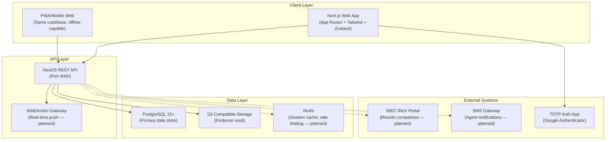

---

## 2. System Context Diagram

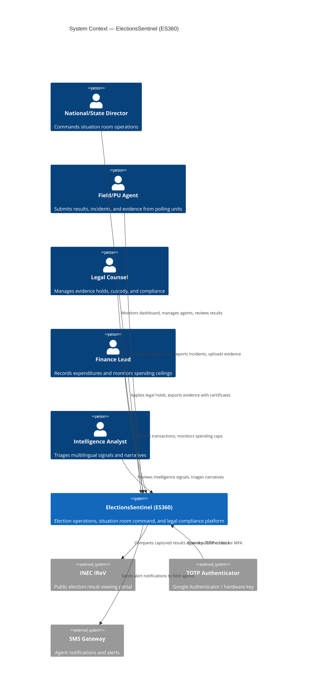

---

## 3. Technology Stack

### 3.1 Current Stack

| Layer | Technology | Version | Purpose |
|-------|-----------|---------|---------|
| **Frontend Framework** | Next.js (App Router) | 15.x | Server-side rendering, routing, file-based pages |
| **Frontend Styling** | Tailwind CSS | 4.x | Utility-first CSS framework |
| **Frontend State** | Zustand | 5.x | Lightweight state management per module |
| **Frontend HTTP** | Axios | 1.7.x | API client with JWT interceptor |
| **Frontend Offline** | idb (IndexedDB) | 8.x | Offline write queue persistence |
| **Backend Framework** | NestJS | 11.x | Modular REST API with dependency injection |
| **Backend ORM** | TypeORM | 0.3.x | Entity mapping, migrations, query builder |
| **Database** | PostgreSQL | 15+ | Primary relational data store |
| **Authentication** | Passport + JWT | — | Strategy-based auth with JWT tokens |
| **MFA** | otplib + qrcode | 12.x | TOTP generation, QR code enrollment |
| **File Storage** | @aws-sdk/client-s3 | 3.x | S3-compatible evidence storage (MinIO / AWS S3 / local disk fallback) |
| **OCR** | Tesseract.js | 5.x | Client/server-side optical character recognition |
| **Security** | Helmet + ThrottlerModule | — | HTTP headers, rate limiting |
| **Password Hashing** | bcryptjs | 2.x | Argon2-equivalent password hashing |

### 3.2 Production Additions (Planned)

| Layer | Technology | Purpose |
|-------|-----------|---------|
| **Real-Time** | NestJS WebSocket Gateway (Socket.IO or ws) | Live dashboard push, SLA breach notifications |
| **Caching** | Redis 7+ | Session store, rate limiter backend, dashboard cache |
| **Logging** | Winston or Pino | Structured JSON logging with correlation IDs |
| **Health Checks** | @nestjs/terminus | Readiness/liveness probes for orchestration |
| **API Docs** | @nestjs/swagger | Auto-generated OpenAPI documentation |
| **Task Scheduling** | @nestjs/schedule | Recurring compliance rule generation, heartbeat checks |
| **PWA** | next-pwa or custom service worker | Offline asset caching for field app |
| **Monitoring** | Prometheus + Grafana | Metrics collection and visualization |
| **Containerization** | Docker + Docker Compose | Reproducible deployment packaging |
| **Orchestration** | Kubernetes or AWS ECS | Auto-scaling, blue-green deployments |
| **CI/CD** | GitHub Actions | Automated testing, linting, and deployment |
| **CDN** | Cloudflare or AWS CloudFront | Static asset delivery, DDoS protection |
| **Backup** | pgBackRest or AWS RDS automated backups | Point-in-time recovery |

---

## 4. Application Architecture

### 4.1 Frontend Architecture (Next.js)

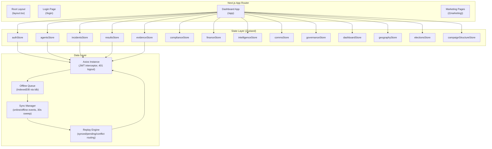

### 4.2 Backend Architecture (NestJS)

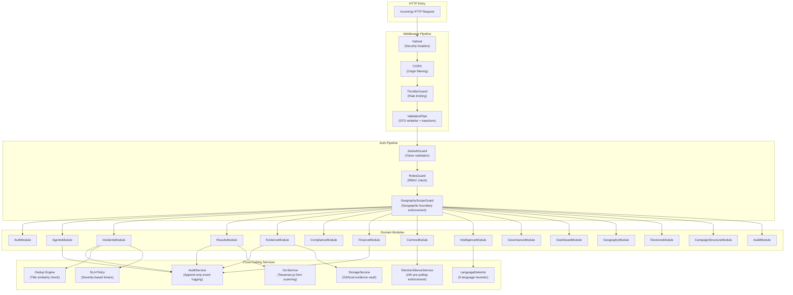

---

## 5. Backend Module Architecture

Each NestJS module follows a consistent internal pattern:

```
module-name/
├── module-name.module.ts       # NestJS module declaration
├── module-name.controller.ts   # REST endpoint definitions
├── module-name.service.ts      # Business logic
├── entity-name.entity.ts       # TypeORM entity (database mapping)
├── dto/
│   ├── create-entity.dto.ts    # Create request validation
│   └── update-entity.dto.ts    # Update request validation
└── [domain-specific files]     # e.g., sla-policy.ts, language-detector.ts
```

### Module Dependency Graph

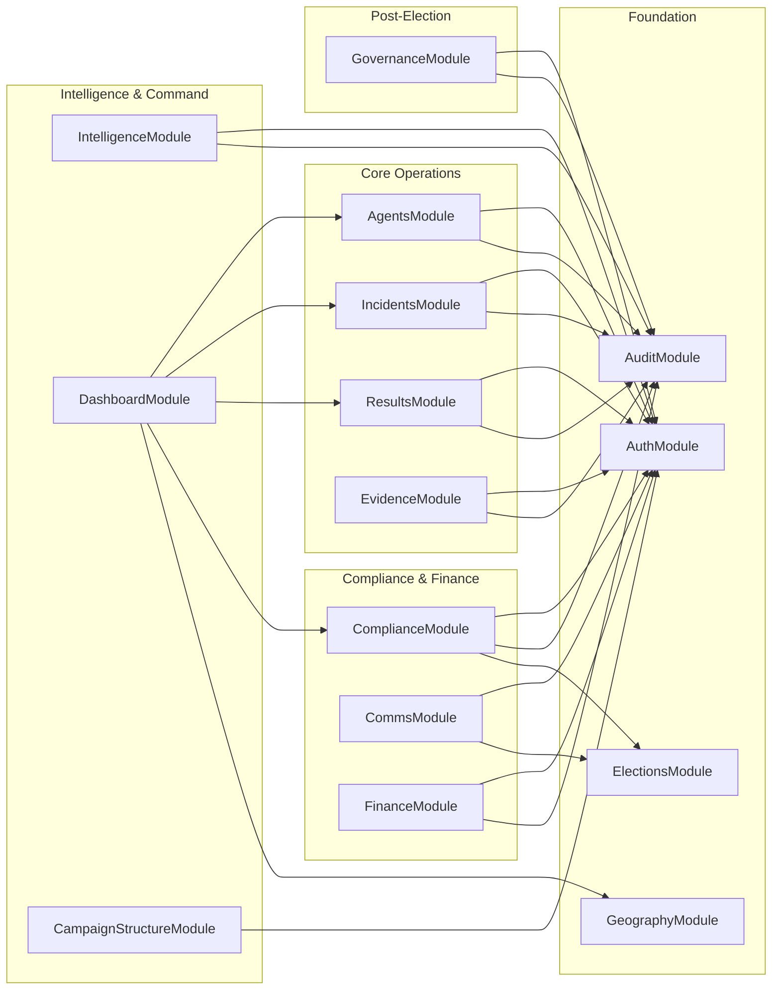

---

## 6. Data Flow Diagrams

### 6.1 Form EC8A Result Capture Flow

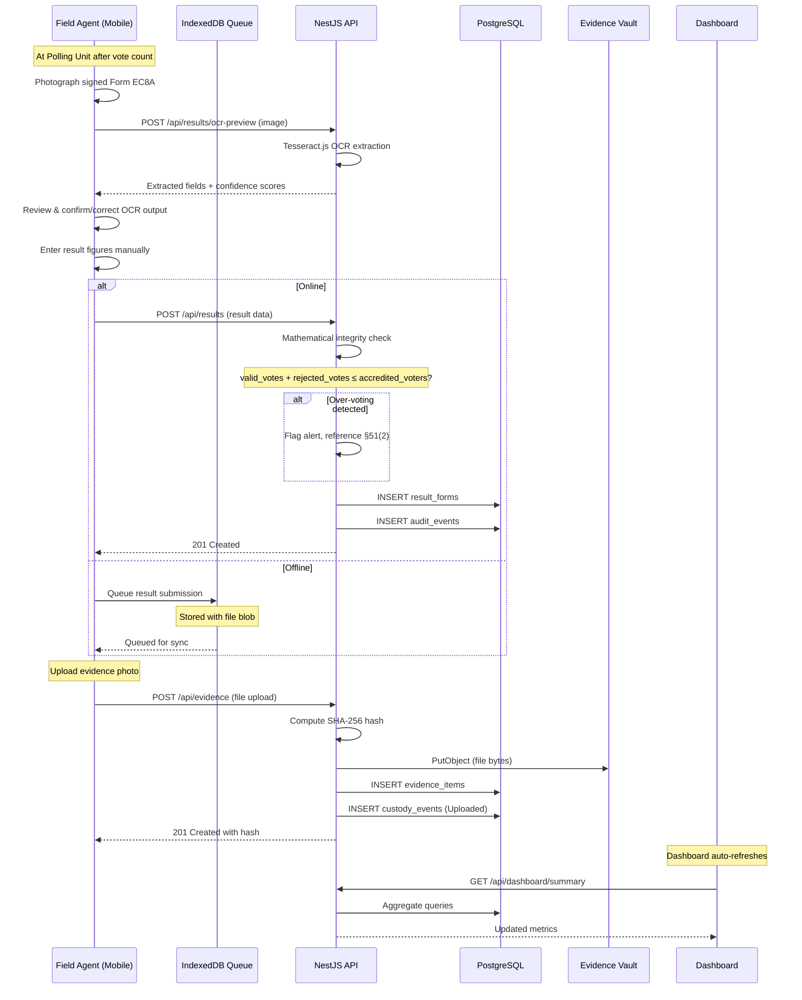

### 6.2 Double-Blind Verification Flow

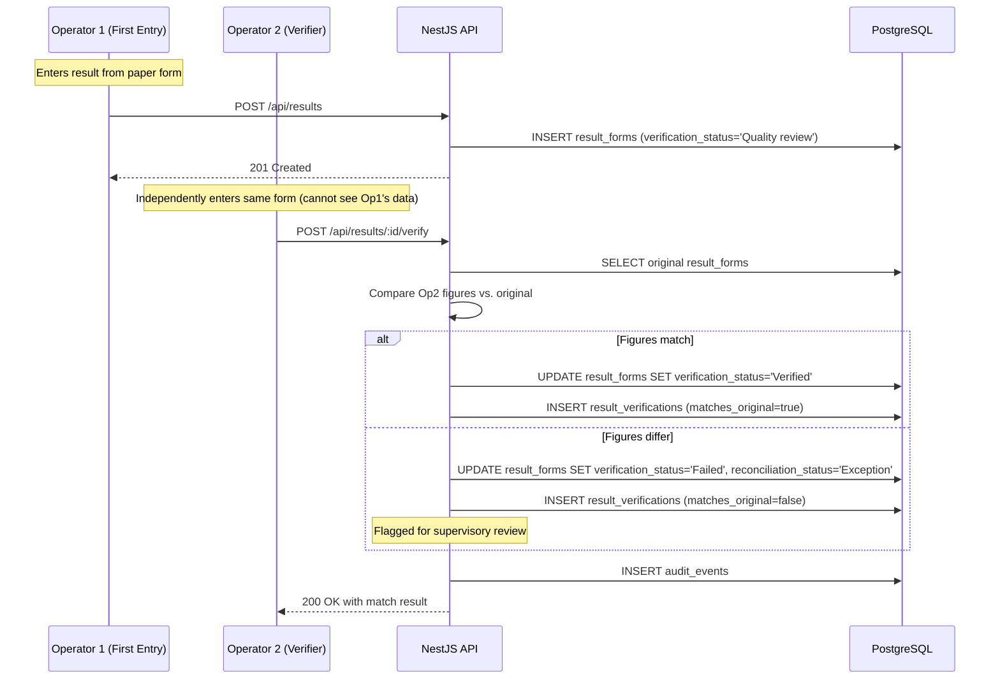

### 6.3 Evidence Chain of Custody Flow

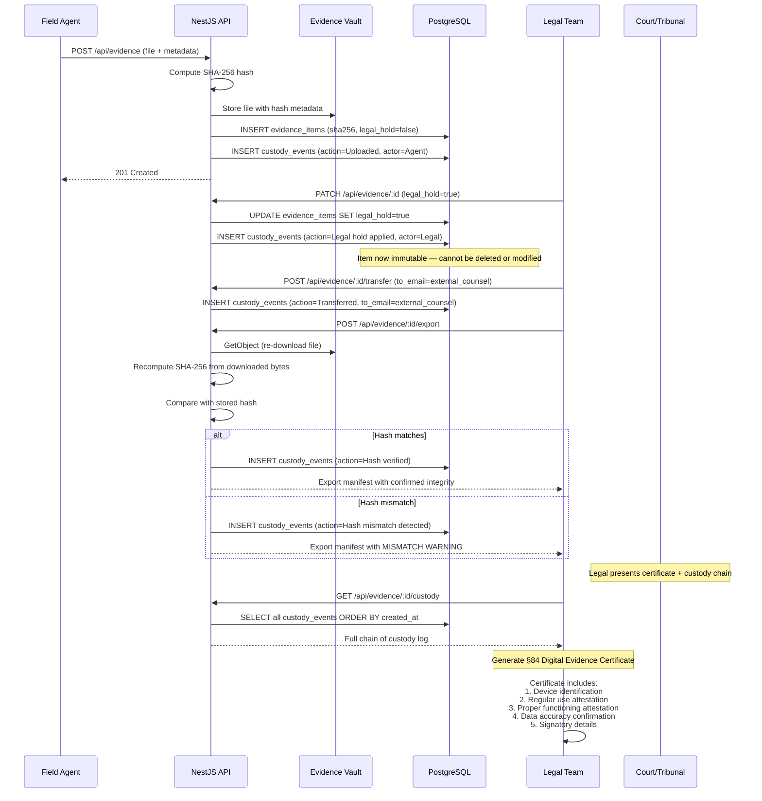

### 6.4 Incident SLA & Escalation Flow

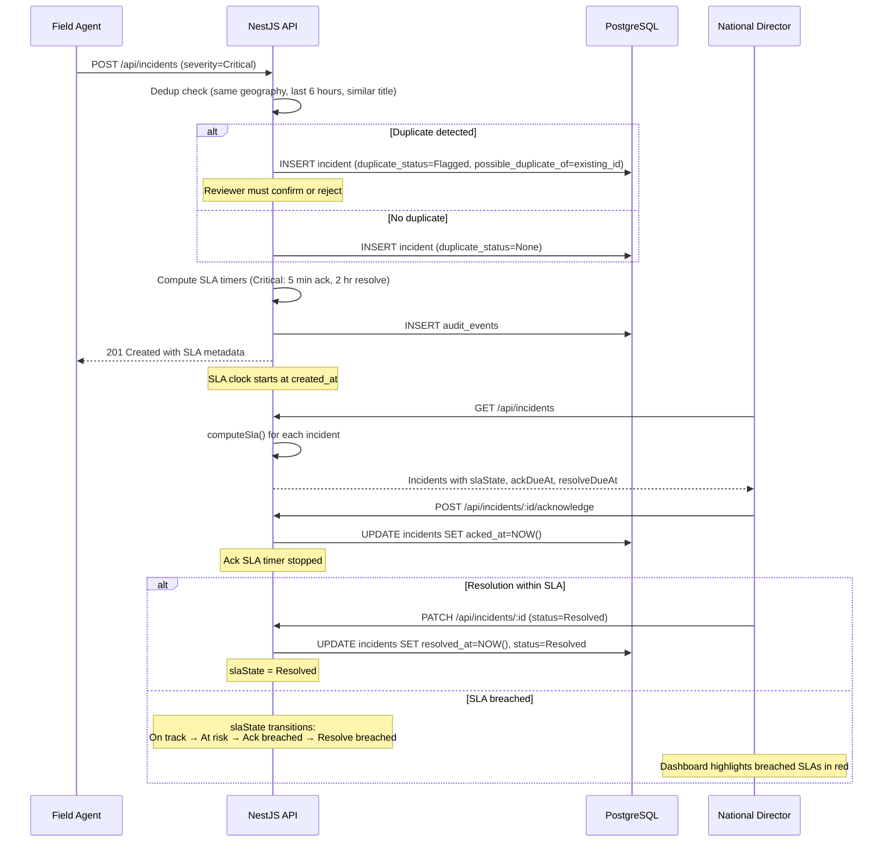

### 6.5 Election Silence Enforcement Flow

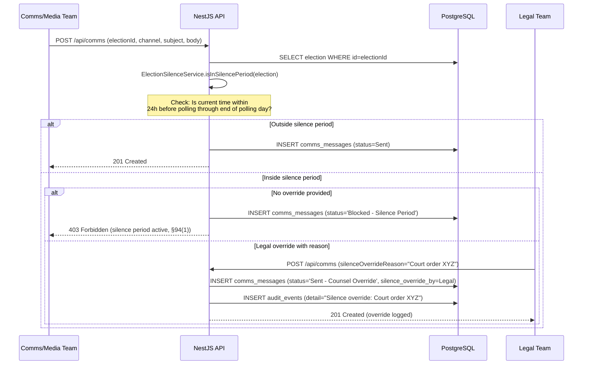

### 6.6 Offline Sync Data Flow

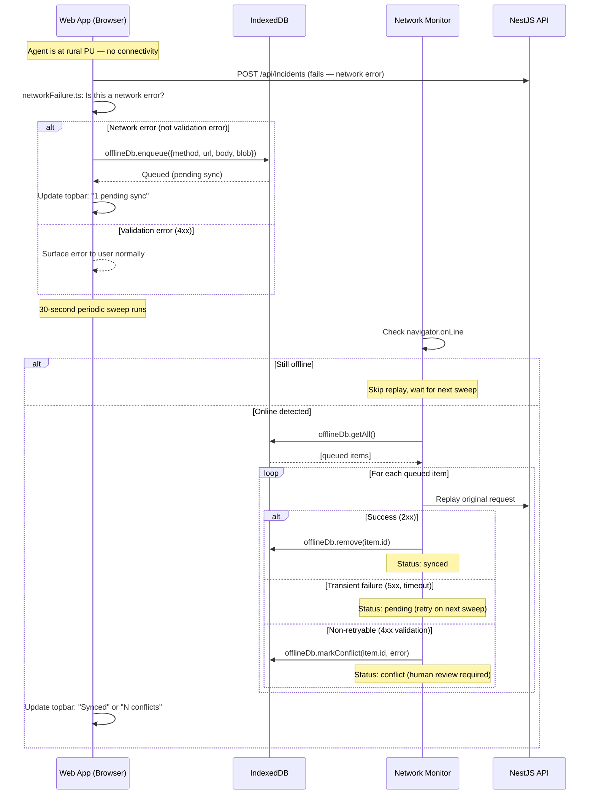

### 6.7 Campaign Finance Cap Check Flow

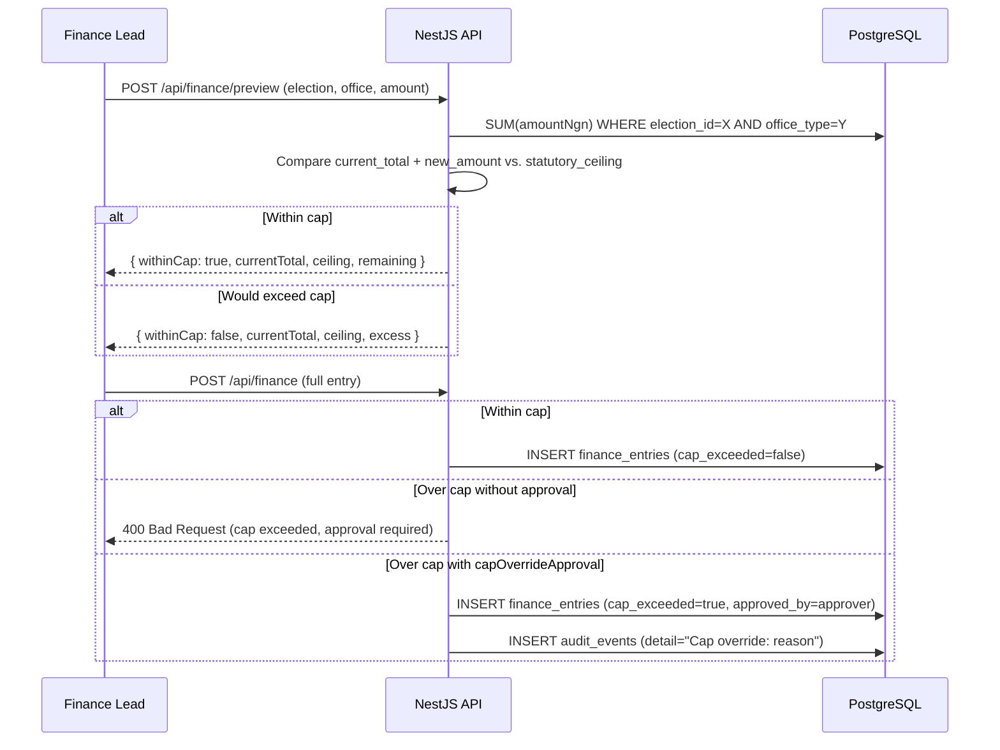

---

## 7. Database Architecture

### 7.1 Schema Layout

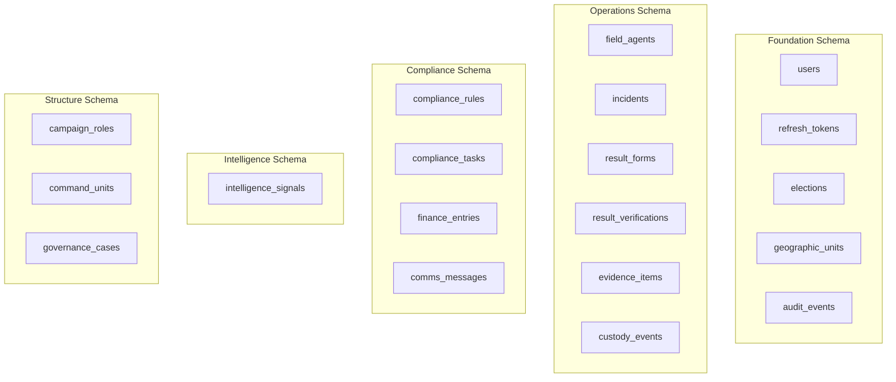

### 7.2 Index Strategy

| Table | Index | Columns | Purpose |
|-------|-------|---------|---------|
| `geographic_units` | `IDX_geo_level_parent` | `level, parent_id` | Hierarchy traversal |
| `geographic_units` | `IDX_geo_path` | `path` | Geographic scope checks (LIKE 'NG/LA/%') |
| `geographic_units` | `UQ_geo_code` | `official_code` | UNIQUE — INEC code lookup |
| `field_agents` | `IDX_agent_election` | `election_id` | Election-scoped queries |
| `field_agents` | `IDX_agent_geo` | `geographic_unit_id` | Geography-scoped queries |
| `field_agents` | `IDX_agent_state` | `state` | State-level aggregation |
| `incidents` | `IDX_inc_severity` | `severity` | SLA-priority filtering |
| `incidents` | `IDX_inc_status` | `status` | Dashboard status counts |
| `result_forms` | `IDX_res_pu` | `polling_unit` | PU-level lookup |
| `result_forms` | `IDX_res_verification` | `verification_status` | Quality review filtering |
| `evidence_items` | `IDX_evi_sha256` | `sha256` | Hash-based integrity lookup |
| `evidence_items` | `IDX_evi_linked` | `linked_record_id` | Record-to-evidence association |
| `audit_events` | `IDX_audit_record` | `record_type, record_id` | Record-specific audit trail retrieval |
| `compliance_rules` | `IDX_rule_jurisdiction` | `jurisdiction_level, status` | Active rule filtering |
| `finance_entries` | `IDX_fin_election_office` | `election_id, office_type` | Spending cap aggregation |

### 7.3 Connection & Pooling Configuration

```
Production configuration targets:
├── Max connections: 100 (per API instance)
├── Connection timeout: 5,000ms
├── Idle timeout: 30,000ms
├── Statement timeout: 30,000ms (prevent runaway queries)
└── SSL: Required (sslmode=verify-full)
```

---

## 8. Security Architecture

### 8.1 Authentication Flow

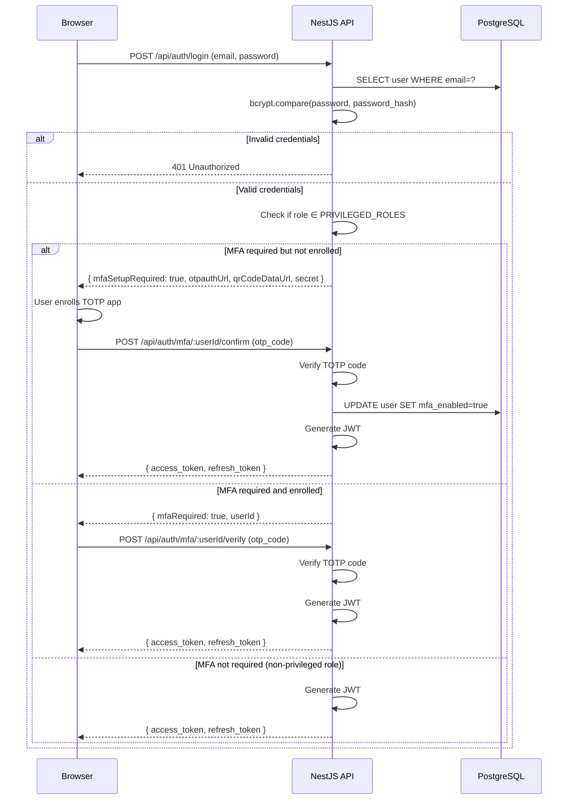

### 8.2 Authorization Pipeline

```
Request → Helmet (security headers)
        → CORS (origin check)
        → ThrottlerGuard (rate limit: 120 req/min)
        → ValidationPipe (DTO whitelist, forbid unknown properties)
        → JwtAuthGuard (token validation, user extraction)
        → RolesGuard (@Roles decorator — RBAC check)
        → GeographyScopeGuard (geographic boundary enforcement)
        → Controller method
```

### 8.3 Security Controls Summary

| Control | Implementation | Status |
|---------|---------------|--------|
| Password hashing | bcryptjs (cost factor 10) | ✅ Active |
| JWT access tokens | 12-hour expiry, HS256 | ✅ Active |
| Refresh tokens | 30-day expiry, stored hashed | ✅ Active |
| TOTP MFA | otplib, QR enrollment, 6-digit codes | ✅ Active |
| Rate limiting | NestJS ThrottlerModule (120 req/60s) | ✅ Active |
| Input validation | class-validator + whitelist + forbidNonWhitelisted | ✅ Active |
| Security headers | Helmet (HSTS, X-Frame-Options, CSP, etc.) | ✅ Active |
| RBAC | @Roles decorator + RolesGuard | ✅ Active |
| Geography scoping | GeographyScopeGuard on create operations | ✅ Active |
| Audit trail | Append-only audit_events on all mutations | ✅ Active |
| CORS | Currently `origin: true` | ⚠️ Needs hardening |
| MFA secret encryption | Plaintext in DB | ❌ Needs AES-256 |
| TLS | Not enforced at app level (infrastructure concern) | ⚠️ Needs infra config |
| SQL injection | TypeORM parameterized queries | ✅ Active |
| XSS | React auto-escaping + Helmet CSP | ✅ Active |

---

## 9. Offline-First Architecture

### 9.1 Component Overview

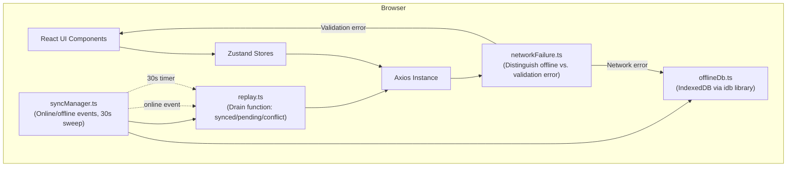

### 9.2 Offline Queue Item Schema

```typescript
interface QueuedItem {
  id: string;          // Auto-generated UUID
  method: string;      // HTTP method (POST, PATCH)
  url: string;         // API endpoint
  body: object;        // Request payload
  blob?: Blob;         // File attachment (evidence uploads)
  status: 'pending' | 'conflict';
  error?: string;      // Server rejection reason (conflicts only)
  createdAt: number;   // Timestamp
}
```

### 9.3 Replay Decision Logic

| Server Response | Classification | Action |
|----------------|----------------|--------|
| 2xx | **Synced** | Remove from queue |
| 5xx, timeout, network error | **Pending** | Keep in queue, retry on next sweep |
| 4xx (validation, auth) | **Conflict** | Mark as conflict, surface for human review |

---

## 10. Infrastructure & Deployment Architecture

### 10.1 Production Deployment (Target)

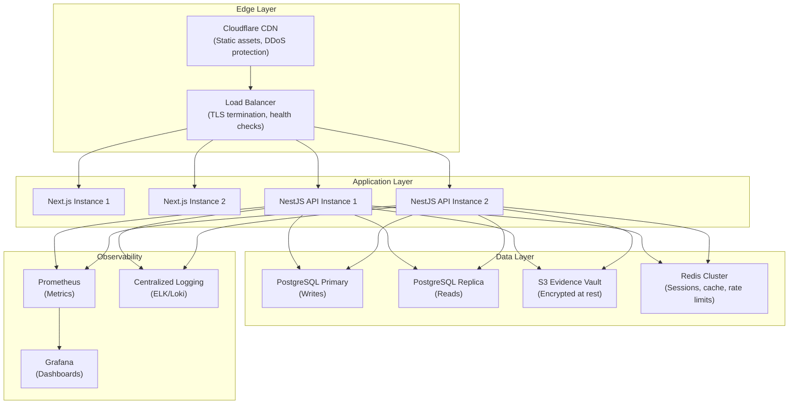

### 10.2 Environment Strategy

| Environment | Purpose | Database | Deployment |
|-------------|---------|----------|------------|
| **Local** | Developer workstation | PostgreSQL 15 (local), S3=local disk | `npm run start:dev` + `npm run dev` |
| **Staging** | Pre-production validation | PostgreSQL (cloud instance), S3 bucket | Docker Compose or K8s namespace |
| **Production** | Live election operations | PostgreSQL HA cluster, S3 encrypted bucket | K8s or ECS with auto-scaling |

### 10.3 Docker Compose (Current)

```
docker-compose.yml
├── postgres (port 5435→5432) — PostgreSQL 16 Alpine
├── minio (port 9002→9000, 9003→9001) — Evidence vault
├── api (port 4001→4000) — NestJS backend
└── web (port 3001→3000) — Next.js frontend
```

---

## 11. Observability Architecture

### 11.1 Logging Strategy (Target)

```
Log Levels:
├── ERROR — Unhandled exceptions, DB connection failures, storage errors
├── WARN  — SLA breaches, cap exceeded, hash mismatches, silence period blocks
├── INFO  — Request lifecycle, auth events, CRUD operations
├── DEBUG — Query execution, SLA computation details, language detection scores
└── TRACE — Raw HTTP request/response bodies (dev only)

Log Format:
{
  "timestamp": "2027-02-27T08:15:30.000Z",
  "level": "WARN",
  "correlationId": "req-abc123",
  "module": "FinanceService",
  "message": "Spending cap exceeded",
  "context": {
    "electionId": "EL-2027-PRES",
    "officeType": "President",
    "currentTotal": 9500000000,
    "ceiling": 10000000000,
    "newAmount": 600000000
  }
}
```

### 11.2 Key Metrics (Target)

| Metric | Type | Alert Threshold |
|--------|------|-----------------|
| `api_request_duration_seconds` | Histogram | p99 > 2s |
| `api_request_total` | Counter | Error rate > 5% |
| `db_connection_pool_active` | Gauge | > 80% utilization |
| `incidents_sla_breached_total` | Counter | Any Critical SLA breach |
| `results_overvoting_detected_total` | Counter | Any detection |
| `evidence_hash_mismatch_total` | Counter | Any mismatch |
| `offline_queue_pending_total` | Gauge | > 100 pending items |
| `auth_failed_login_total` | Counter | > 10/min from single IP |
