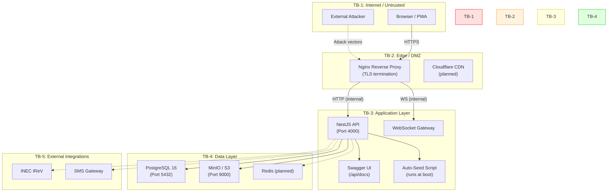
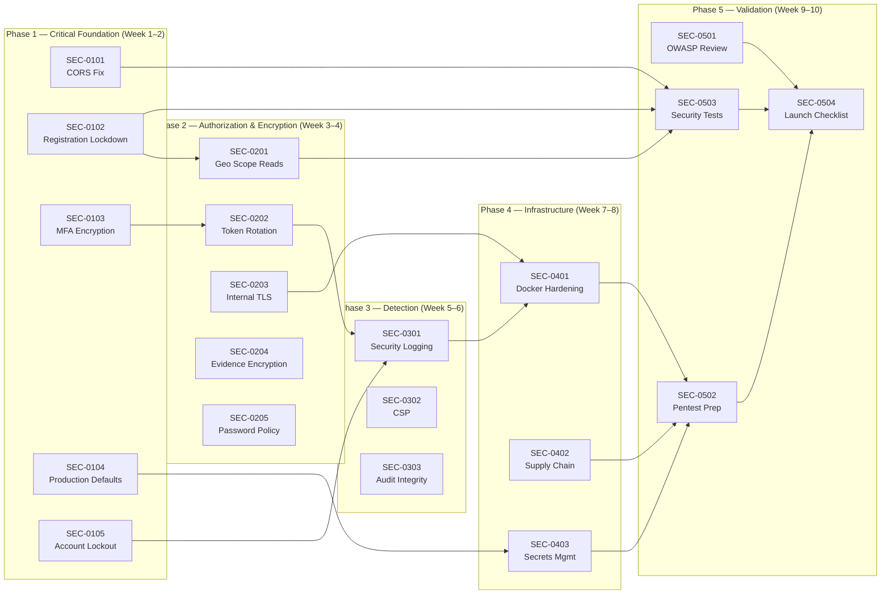

# ElectionsSentinel (ES360) — Security Architecture Review & Hardening Implementation Plan

**Document Version:** 1.0  
**Date:** 31 August 2026  
**Classification:** Internal — Security Architecture  
**Review Lead:** Security Architect  

---

## Table of Contents

1. [Executive Summary](#1-executive-summary)
2. [Architecture Component Inventory & Trust Levels](#2-architecture-component-inventory--trust-levels)
3. [Trust Boundary Analysis](#3-trust-boundary-analysis)
4. [Attack Surface Analysis](#4-attack-surface-analysis)
5. [Security Findings Table](#5-security-findings-table)
6. [Defense-in-Depth Coverage Assessment](#6-defense-in-depth-coverage-assessment)
7. [Phase 1 — Critical Foundation Fixes (Week 1–2)](#7-phase-1--critical-foundation-fixes-week-12)
8. [Phase 2 — Authorization & Data Protection Hardening (Week 3–4)](#8-phase-2--authorization--data-protection-hardening-week-34)
9. [Phase 3 — Runtime Defense & Detection (Week 5–6)](#9-phase-3--runtime-defense--detection-week-56)
10. [Phase 4 — Infrastructure & Supply Chain Security (Week 7–8)](#10-phase-4--infrastructure--supply-chain-security-week-78)
11. [Phase 5 — Validation, Audit & Continuous Assurance (Week 9–10)](#11-phase-5--validation-audit--continuous-assurance-week-910)
12. [Top 5 Security Design Changes](#12-top-5-security-design-changes)
13. [Cross-Phase Security Dependency Map](#13-cross-phase-security-dependency-map)
14. [Validation Criteria Master Checklist](#14-validation-criteria-master-checklist)

---

## 1. Executive Summary

ElectionsSentinel (ES360) is a **sovereignty-grade election operations platform** handling **tribunal-admissible evidence**, **parallel vote tabulation data** for 176,846 polling units, **campaign finance records** under statutory spending ceilings, and **multilingual intelligence signals**. The system serves multiple high-privilege user classes — from field agents in low-connectivity environments to National Directors commanding a situation room.

### Data Classification

| Data Category | Classification | Regulatory Basis | Impact of Breach |
|---------------|---------------|------------------|------------------|
| Election result forms (EC8A) | **Highly Sensitive — Sovereign** | Electoral Act 2026 §60 | Election invalidation, tribunal challenges |
| Evidence vault (photos, custody chain) | **Highly Sensitive — Legal** | Evidence Act 2011 §84 | Inadmissibility of digital evidence in court |
| Campaign finance records | **Sensitive — Regulatory** | Electoral Act 2026 §88–§90 | Criminal penalties, party deregistration |
| MFA secrets (TOTP) | **Critical — Authentication** | OWASP AuthN guidelines | Full account takeover of privileged roles |
| User credentials (password hashes) | **Critical — Authentication** | OWASP AuthN guidelines | Mass account compromise |
| Intelligence signals | **Sensitive — Operational** | Internal classification | Counter-disinformation capability loss |
| Audit trail | **Sensitive — Compliance** | Electoral Act; Evidence Act | Loss of forensic reconstruction ability |
| GPS coordinates | **Sensitive — PII** | NDPR 2019 | Location tracking of field agents |

### Threat Actor Profile

| Actor | Motivation | Capability |
|-------|-----------|------------|
| **State-sponsored adversary** | Electoral manipulation, evidence tampering | APT-level; zero-day exploitation, supply chain compromise |
| **Political opponent's operatives** | Result alteration, evidence discrediting | Moderate; social engineering, insider recruitment |
| **Corrupt insider** | Data leakage, audit trail manipulation | High; legitimate credentials, system knowledge |
| **Hacktivist / disinfo network** | Platform disruption, narrative pollution | Moderate; DDoS, credential stuffing, API abuse |
| **Opportunistic attacker** | Data harvesting, ransomware | Low-moderate; automated scanning, known CVEs |

**Assessment: This system operates in a high-threat, high-consequence environment. The combination of sovereign election data, statutory legal requirements (Evidence Act §84), and the high-value nature of election outcomes makes ES360 a Tier-1 target requiring defense-in-depth at every layer.**

---

## 2. Architecture Component Inventory & Trust Levels

| Component | Technology | Trust Level | Exposure | Sensitive Data Handled |
|-----------|-----------|-------------|----------|----------------------|
| Next.js Web App | Next.js 15, Zustand, Axios | **Untrusted** (client-side) | Internet-facing | User credentials, JWT tokens, result data, evidence files |
| PWA / Mobile Web | Same codebase + Service Worker | **Untrusted** (client-side) | Internet-facing + offline | Same + IndexedDB offline queue |
| NestJS REST API | NestJS 11, TypeORM, Passport | **Trusted — Application** | Reverse-proxied via Nginx | All data categories |
| WebSocket Gateway | Socket.IO (planned) | **Trusted — Application** | Reverse-proxied via Nginx | Real-time metrics, notification payloads |
| PostgreSQL 16 | TypeORM, `synchronize: true` | **Trusted — Data** | Internal network only | All persistent data |
| S3-Compatible Storage (MinIO) | AWS S3 SDK | **Trusted — Data** | Internal network only | Evidence files (images, documents) |
| Redis (planned) | Redis 7+ | **Trusted — Data** | Internal network only | Session cache, rate limiter state |
| Nginx Reverse Proxy | Nginx + Let's Encrypt | **Trusted — Edge** | Internet-facing | TLS termination, request routing |
| TOTP Authenticator | Google Authenticator (external) | **External — User Device** | N/A | Time-based OTP codes |
| INEC IReV Portal (planned) | External API | **External — Untrusted** | Internet | Published election results |
| SMS Gateway (planned) | External API | **External — Untrusted** | Internet | Agent phone numbers, alert messages |

---

## 3. Trust Boundary Analysis

### Critical Trust Boundary Crossings

| Crossing ID | From → To | Data Crossing | Current Protection | Gap |
|-------------|-----------|---------------|-------------------|-----|
| **TC-1** | Client → Nginx | Credentials, JWTs, result data, evidence files | TLS 1.2+ (Let's Encrypt) | No TLS version pinning; no HSTS preload |
| **TC-2** | Nginx → API | Forwarded request with `X-Real-IP` headers | Plaintext HTTP on internal network | No mTLS between proxy and API; IP spoofable if internal network compromised |
| **TC-3** | API → PostgreSQL | All SQL queries, all data | Plaintext TCP on internal network | `sslmode` not enforced; no connection encryption |
| **TC-4** | API → MinIO | Evidence file bytes, S3 credentials | Plaintext HTTP (`http://minio:9000`) | No TLS on object storage connection |
| **TC-5** | Client → TOTP App | MFA secret during enrollment | QR code over HTTPS + raw `secret` in JSON response | **Secret returned in plaintext to client** |
| **TC-6** | API → External (IReV/SMS) | Election results comparison, agent phone numbers | Planned — not yet implemented | No egress filtering design |

---

## 4. Attack Surface Analysis

### 4.1 External Attack Surface

| Interface | Exposure | Current Controls | Risk Assessment |
|-----------|----------|-----------------|-----------------|
| HTTPS :443 (Nginx) | Full internet | TLS via Let's Encrypt, 50MB upload limit | **Medium** — no WAF, no DDoS protection beyond Nginx |
| `/api/auth/login` | Unauthenticated | Rate limiter (120 req/60s global), bcrypt | **High** — rate limit is per-IP globally, not per-endpoint; no account lockout |
| `/api/auth/register` | Unauthenticated | Validation, duplicate email check | **Critical** — open registration allows anyone to create accounts with arbitrary roles |
| `/api/docs` (Swagger) | Unauthenticated | No access control | **High** — full API schema exposed in production |
| `/api/health/*` | Unauthenticated | Excluded from JWT auth | **Low** — information disclosure (DB connectivity status) |
| WebSocket `/socket.io/` | After JWT handshake | JWT validation in handshake (planned) | **Medium** — no separate rate limiting for WS connections |

### 4.2 Internal Attack Surface

| Interface | Exposure | Current Controls | Risk Assessment |
|-----------|----------|-----------------|-----------------|
| PostgreSQL :5435 (host) / :5432 (container) | Docker internal + host port mapping | Password auth, default `postgres` user | **High** — DB port exposed on host; superuser credentials in env vars |
| MinIO :9002/:9003 (host) | Docker internal + host port mapping | Root credentials in env vars | **High** — MinIO console and API exposed on host |
| Service-to-service (API → DB) | Docker network | Plaintext, password auth only | **Medium** — no network segmentation, no mTLS |
| Auto-seed script | Runs at every API boot | Hardcoded demo data with known passwords | **Critical** — demo accounts persist in production |
| TypeORM `synchronize: true` | Every API boot | None | **Critical** — schema mutations in production; data loss risk |

### 4.3 Supply Chain Surface

| Dependency | Risk | Current Controls |
|-----------|------|-----------------|
| npm packages (~400+ transitive deps) | Known CVE exploitation | None — no `npm audit` in CI |
| Docker base images (node, postgres, minio) | Compromised base image | No image scanning, no pinned digests |
| Let's Encrypt / Certbot | Certificate issuance compromise | Standard ACME challenge |
| Tesseract.js (OCR engine) | Malicious model injection | `eng.traineddata` bundled statically (good); no integrity check |
| `otplib` / `qrcode` | TOTP implementation flaws | Version pinned in package.json |

### 4.4 Human Attack Surface

| Interface | Risk | Current Controls |
|-----------|------|-----------------|
| Admin users (Super Admin, National Director) | Credential theft, social engineering | MFA required for privileged roles (TOTP) |
| Developer access | Code injection, backdoor deployment | No branch protection, no required code review |
| Field agents (176,846 PU agents) | Device theft, shoulder surfing | No device binding, no session management |
| Support/operations team | Data exfiltration via export endpoints | Role-based access; exports restricted to National Director + Legal + Super Admin |

---

## 5. Security Findings Table

| ID | Finding | Component | Severity | Root Cause | Recommendation | Fix Type |
|----|---------|-----------|----------|-----------|----------------|----------|
| **SEC-01** | CORS fallback allows all origins | `main.ts` L27 | **Critical** | Final `return callback(null, true)` bypasses all origin checks | Remove universal fallback; deny unmatched origins | Configuration |
| **SEC-02** | Open registration with arbitrary role assignment | `AuthService.register()` | **Critical** | `dto.role` accepts any Role enum value from unauthenticated caller | Remove `role` from RegisterDto; assign default role; require admin to escalate | Redesign |
| **SEC-03** | MFA secret stored as plaintext in DB | `User.mfaSecret` column | **Critical** | No application-level encryption | Encrypt with AES-256-GCM; key from env var `MFA_ENCRYPTION_KEY` | Redesign |
| **SEC-04** | MFA secret returned in plaintext in login response | `AuthService.beginMfaEnrollment()` L90 | **High** | `secret` field included in JSON response | Remove raw `secret` from response; rely on QR code only | Configuration |
| **SEC-05** | `synchronize: true` in all environments | `app.module.ts` L88 | **Critical** | No environment-conditional check | Set `synchronize: false` in production; use migrations | Configuration |
| **SEC-06** | Auto-seed runs in production | `main.ts` L73-83 | **Critical** | Unconditional seed execution with demo accounts/passwords | Gate behind `NODE_ENV !== 'production'` | Configuration |
| **SEC-07** | Swagger UI accessible without authentication | `main.ts` L65 | **High** | No environment guard on Swagger setup | Disable in production or protect with basic auth | Configuration |
| **SEC-08** | No refresh token rotation / reuse detection | `AuthService.refreshAccessToken()` | **High** | Refresh token reused indefinitely without rotation | Implement token rotation with family-based reuse detection | Redesign |
| **SEC-09** | JWT signed with HS256 (symmetric) | `JwtModule` config | **Medium** | Single shared secret for sign + verify | Consider RS256 (asymmetric) for multi-service environments; at minimum, enforce 256-bit key length | Configuration |
| **SEC-10** | Geography scope guard only checks request body | `GeographyScopeGuard` | **High** | Guard reads `request.body.geographicUnitId` only; ignores URL params and doesn't filter reads | Extend to filter GET responses; check URL params for PATCH/DELETE | Redesign |
| **SEC-11** | No account lockout after failed login attempts | `AuthService.login()` | **High** | No counter for failed attempts | Implement progressive lockout: 5 failures → 15 min lock → notify admin | Redesign |
| **SEC-12** | Database port exposed on Docker host | `docker-compose.yml` L14 | **Medium** | `ports: "5435:5432"` maps to host | Remove host port mapping; use Docker internal networking only | Configuration |
| **SEC-13** | MinIO console exposed on Docker host | `docker-compose.yml` L27-28 | **Medium** | Admin console mapped to host port 9003 | Remove host port mapping for MinIO console in production | Configuration |
| **SEC-14** | No Content Security Policy | Helmet defaults | **Medium** | Helmet CSP not explicitly configured | Configure strict CSP: `default-src 'self'`; whitelist specific sources | Configuration |
| **SEC-15** | Evidence files lack server-side encryption at rest | MinIO / S3 storage | **High** | No SSE-S3 or SSE-KMS configured | Enable server-side encryption on S3 bucket; use SSE-S3 minimum | Configuration |
| **SEC-16** | No egress filtering | Docker network | **Medium** | Containers have unrestricted outbound access | Implement network policies; whitelist required external endpoints only | Redesign |
| **SEC-17** | Weak default JWT secret in docker-compose | `docker-compose.yml` L51 | **High** | `sentinel360_jwt_dev_secret_key_1234567890` as default | Require explicit secret with minimum 256 bits of entropy; fail-fast if missing | Configuration |
| **SEC-18** | No password complexity requirements | `RegisterDto` | **Medium** | Only basic validation on password field | Enforce minimum 12 chars, mixed case, number, special char; check against breached password list | Configuration |
| **SEC-19** | Audit events not integrity-protected | `AuditEvent` entity | **Medium** | Append-only by convention, not by DB constraint | Add hash chain (each event's hash includes previous event's hash) or use DB triggers to prevent UPDATE/DELETE | Redesign |
| **SEC-20** | No request signing for offline queue replay | Offline sync architecture | **Medium** | Queued items contain raw request payloads without integrity protection | Sign offline queue items with a device-bound key; verify signature on replay | Redesign |

---

## 6. Defense-in-Depth Coverage Assessment

| Layer | Control | Status | Coverage | Gap |
|-------|---------|--------|----------|-----|
| **Edge (Prevention)** | TLS/HTTPS | ✅ Active | All external traffic | No HSTS preload; no TLS 1.3 enforcement |
| **Edge (Prevention)** | DDoS protection | ❌ Missing | None | No WAF or CDN-level protection |
| **Edge (Prevention)** | Rate limiting | ⚠️ Partial | 120 req/min global per IP | Not endpoint-specific; no auth endpoint hardening |
| **App (Prevention)** | Authentication | ✅ Active | JWT + TOTP MFA for privileged | No account lockout; open registration; no device binding |
| **App (Prevention)** | Authorization (RBAC) | ✅ Active | Role-based via decorators | Geography scope incomplete on reads |
| **App (Prevention)** | Input validation | ✅ Active | DTOs with whitelist + forbidNonWhitelisted | Good — class-validator + forbidNonWhitelisted |
| **App (Prevention)** | SQL injection prevention | ✅ Active | TypeORM parameterized queries | Good — no raw SQL observed |
| **App (Prevention)** | XSS prevention | ✅ Active | React auto-escaping + Helmet | CSP not configured; inline scripts possible |
| **Data (Prevention)** | Encryption at rest (DB) | ❌ Missing | None | No TDE, no volume encryption documented |
| **Data (Prevention)** | Encryption at rest (files) | ❌ Missing | None | No SSE on MinIO/S3 |
| **Data (Prevention)** | Encryption in transit (internal) | ❌ Missing | None | DB and S3 connections use plaintext |
| **Detection** | Structured logging | ❌ Missing | Console.log only | No JSON logging, no correlation IDs |
| **Detection** | Security event alerting | ❌ Missing | None | No alerts for brute force, privilege escalation, evidence tampering |
| **Detection** | Anomaly detection | ❌ Missing | None | No baseline behavioral analysis |
| **Response** | Audit trail | ✅ Active | Append-only AuditEvent | Not integrity-protected; no hash chain |
| **Response** | Incident detection triggers | ❌ Missing | None | No automated security incident detection |
| **Response** | Session revocation | ⚠️ Partial | Refresh token revocation exists | No mass revocation; no "revoke all sessions" for compromised user |
| **Recovery** | Database backup | ❌ Missing | None documented | No automated backup; no tested recovery procedure |
| **Recovery** | Disaster recovery plan | ❌ Missing | None documented | No RTO/RPO targets defined |
| **Recovery** | Evidence vault integrity | ✅ Active | SHA-256 hash on upload + re-verify on export | Good — core design pattern |

---

## 7. Phase 1 — Critical Foundation Fixes (Week 1–2)

> **Goal:** Eliminate architectural-level vulnerabilities that enable system-wide compromise. These are non-negotiable prerequisites before any production deployment.

---

### SEC-TASK-0101: Fix CORS Universal Bypass

**Severity:** Critical | **Effort:** 0.5 days | **Assignee:** Backend Engineer  
**Finding:** SEC-01

**Description:**  
The CORS configuration in `main.ts` contains a fatal flaw: after checking trusted origins, the final `return callback(null, true)` on line 27 allows **all origins**, rendering the entire CORS check decorative. Any malicious domain can make authenticated cross-origin requests.

**Deliverables:**
- Remove the universal fallback `return callback(null, true)` at L27
- Replace with `return callback(new Error('CORS: Origin not allowed'), false)`
- Ensure `WEB_ORIGIN` environment variable is mandatory in production
- Add startup validation: if `NODE_ENV=production` and `WEB_ORIGIN` is empty, throw and refuse to boot

**Validation Criteria:**
- [ ] Requests from `https://electionssentinel360.com` succeed
- [ ] Requests from `https://malicious-site.com` receive no CORS headers (browser blocks)
- [ ] Application refuses to start in production without `WEB_ORIGIN` configured
- [ ] Unit test verifies CORS callback behavior for trusted and untrusted origins

---

### SEC-TASK-0102: Lock Down Open Registration / Role Self-Assignment

**Severity:** Critical | **Effort:** 1 day | **Assignee:** Backend Engineer  
**Finding:** SEC-02

**Description:**  
The `POST /api/auth/register` endpoint accepts a `role` field in the request body, allowing any unauthenticated caller to self-assign **any role** including Super Admin, National Director, or Legal Team. This is a **complete authorization bypass** — an attacker can register as Super Admin and gain full system control.

**Deliverables:**
- Remove `role` from `RegisterDto` — all self-registrations default to `Role.OBSERVER` (lowest privilege)
- Create a new admin-only endpoint: `POST /api/auth/users/:id/assign-role`
  - Protected by `@Roles(Role.SUPER_ADMIN)` decorator
  - Validates target role is a legal value
  - Creates audit event for role assignment
- Remove `assignedGeographicUnitId` from `RegisterDto` — admin assigns via separate endpoint
- Consider removing self-registration entirely and requiring admin-created accounts for this security classification

**Validation Criteria:**
- [ ] `POST /api/auth/register` with `role: "Super Admin"` results in account with `role: "Observer"`
- [ ] Only Super Admin can change a user's role via the new endpoint
- [ ] Role assignment creates an audit event
- [ ] Existing tests updated to reflect new registration behavior

---

### SEC-TASK-0103: Encrypt MFA Secrets at Rest

**Severity:** Critical | **Effort:** 1 day | **Assignee:** Security Engineer  
**Finding:** SEC-03, SEC-04

**Description:**  
TOTP shared secrets are stored as plaintext VARCHAR in the `users` table. A database compromise (SQL injection in future code, backup theft, cloud misconfiguration) would expose every privileged user's MFA secret, enabling authentication bypass for all accounts that require MFA.

Additionally, the `beginMfaEnrollment()` method returns the raw `secret` string in the JSON response alongside the QR code, which is unnecessary and increases the exposure window.

**Deliverables:**
- Create `src/common/crypto.service.ts`:
  - `encrypt(plaintext: string): string` — AES-256-GCM with random 12-byte IV per encryption; returns `iv:ciphertext:authTag` in base64
  - `decrypt(ciphertext: string): string` — reverses the above
  - Key sourced from `MFA_ENCRYPTION_KEY` environment variable (must be 32 bytes / 256 bits)
- Update `AuthService.beginMfaEnrollment()`:
  - Encrypt the TOTP secret before saving to DB
  - Remove the raw `secret` field from the JSON response — only return `otpauthUrl` and `qrCodeDataUrl`
- Update `AuthService.login()` and `confirmMfaEnrollment()`:
  - Decrypt MFA secret from DB before TOTP verification
- Create migration to encrypt existing plaintext secrets
- Add startup validation: fail-fast if `MFA_ENCRYPTION_KEY` is not set or is too short

**Validation Criteria:**
- [ ] `mfa_secret` column contains only encrypted values (not readable base32 TOTP secrets)
- [ ] TOTP verification still works correctly after encryption
- [ ] JSON response from enrollment endpoint does not contain `secret` field
- [ ] Application refuses to start without `MFA_ENCRYPTION_KEY` environment variable
- [ ] Encryption key rotation procedure documented (dual-read capability)

---

### SEC-TASK-0104: Disable Production-Unsafe Defaults

**Severity:** Critical | **Effort:** 0.5 days | **Assignee:** Backend Engineer  
**Finding:** SEC-05, SEC-06, SEC-07, SEC-17

**Description:**  
Multiple configuration defaults that are appropriate for development are actively dangerous in production: `synchronize: true` can silently drop columns/data, auto-seed creates demo accounts with known passwords, Swagger exposes the full API schema, and JWT secrets have weak defaults.

**Deliverables:**
- **TypeORM synchronize**: Change to `synchronize: config.get('DB_SYNCHRONIZE', 'false') === 'true'` — default off, opt-in only for local dev
- **Auto-seed**: Wrap the seed block in `main.ts` with `if (process.env.NODE_ENV !== 'production')`
- **Swagger**: Conditionally mount: `if (process.env.NODE_ENV !== 'production') { SwaggerModule.setup(...) }`
- **JWT secret**: Add startup validation — if `JWT_SECRET` matches known defaults or is shorter than 32 characters, throw and refuse to boot in production
- **DB password**: Same validation — refuse weak defaults in production

**Validation Criteria:**
- [ ] `NODE_ENV=production` + `synchronize` not set → synchronize is `false`
- [ ] `NODE_ENV=production` → seed script does not execute
- [ ] `NODE_ENV=production` → `/api/docs` returns 404
- [ ] `NODE_ENV=production` + default JWT secret → application refuses to start
- [ ] Development environment continues to work with existing `.env` defaults

---

### SEC-TASK-0105: Implement Account Lockout & Brute-Force Protection

**Severity:** High | **Effort:** 1 day | **Assignee:** Backend Engineer  
**Finding:** SEC-11

**Description:**  
The login endpoint has no counter for failed authentication attempts. An attacker can attempt unlimited password guesses at 120 requests per minute (the global rate limit). With the 12 Role types and predictable email patterns, credential stuffing is a viable attack.

**Deliverables:**
- Add `failed_login_attempts` (INT, default 0) and `locked_until` (TIMESTAMP, nullable) columns to `users` table
- On failed login: increment counter; if counter ≥ 5, set `locked_until = NOW() + 15 minutes`
- On successful login: reset counter to 0
- During lockout: return `401` with message "Account temporarily locked. Try again in N minutes." — do not reveal whether the email exists
- Add per-endpoint rate limiting on `/api/auth/login`: 10 requests per minute per IP (separate from global 120/min)
- Create audit event for lockout events
- Notify Super Admin when a privileged role account is locked

**Validation Criteria:**
- [ ] 5 consecutive failed logins lock the account for 15 minutes
- [ ] Locked account returns 401 without revealing lockout status to attacker (same error message)
- [ ] Successful login resets the counter
- [ ] Login endpoint rate-limited to 10 req/min per IP
- [ ] Lockout event creates an audit trail entry

---

## 8. Phase 2 — Authorization & Data Protection Hardening (Week 3–4)

> **Goal:** Close authorization gaps and establish encryption-at-rest/in-transit for all data tiers.

---

### SEC-TASK-0201: Complete Geography Scope Enforcement on Read Operations

**Severity:** High | **Effort:** 2 days | **Assignee:** Backend Engineer  
**Finding:** SEC-10

**Description:**  
The `GeographyScopeGuard` only checks `request.body.geographicUnitId` on write operations. A Ward Coordinator assigned to Lagos can call `GET /api/incidents` and see incidents from Kano, Abuja, or any other state. This violates the principle of least privilege and the "Geography-First Access Control" design principle stated in the architecture document.

**Deliverables:**
- Create `GeographyScopeInterceptor` (NestJS interceptor, not guard) that filters query results post-execution:
  - For scoped roles: filter results where `geographicUnitId` is within caller's assigned geography subtree (using materialized `path` prefix matching)
  - For national-scope roles: no filtering
- Apply interceptor to all list endpoints across: agents, incidents, results, evidence, compliance tasks, governance cases, intelligence signals
- Also extend the guard to check URL parameters (`:id` routes) — verify the target record's geography is within scope before returning it

**Validation Criteria:**
- [ ] State Director for Lagos sees only Lagos-scoped records in `GET /api/incidents`
- [ ] PU Agent sees only their own PU's records
- [ ] Super Admin sees all records without filtering
- [ ] Attempting to access `GET /api/incidents/:id` for an out-of-scope incident returns 403
- [ ] Performance acceptable: filter uses indexed `path` column with LIKE prefix

---

### SEC-TASK-0202: Implement Refresh Token Rotation with Reuse Detection

**Severity:** High | **Effort:** 2 days | **Assignee:** Backend Engineer  
**Finding:** SEC-08

**Description:**  
The current refresh token implementation allows indefinite reuse of the same refresh token for 7 days. If a refresh token is stolen (via XSS, device theft, or network interception), the attacker has a 7-day window of persistent access that cannot be detected.

**Deliverables:**
- Modify `POST /api/auth/refresh`:
  - On valid refresh: issue new access token **and new refresh token**; immediately revoke the used refresh token
  - If a **revoked** refresh token is presented (reuse detection): revoke **all** refresh tokens for that user (entire token family) — force re-login on all devices
- Add `family_id` column to `refresh_tokens` table (UUID, set at initial login, inherited on rotation)
- On reuse detection: create a `SECURITY_ALERT` audit event ("Refresh token reuse detected — possible token theft")
- Frontend: update Axios interceptor to store and use the rotated refresh token from each refresh response

**Validation Criteria:**
- [ ] Valid refresh produces new access token + new refresh token
- [ ] Used (rotated) refresh token returns 401 on second use
- [ ] Reuse of a rotated token revokes all tokens in that family
- [ ] Reuse event creates a SECURITY_ALERT audit entry
- [ ] Frontend seamlessly handles token rotation without user-visible interruption

---

### SEC-TASK-0203: Enable Encryption in Transit for Internal Services

**Severity:** High | **Effort:** 1.5 days | **Assignee:** DevOps Engineer  
**Finding:** TC-3, TC-4

**Description:**  
All internal service-to-service communication (API → PostgreSQL, API → MinIO) uses plaintext TCP/HTTP. On a shared host or compromised network segment, this exposes all queries, credentials, and evidence file transfers to passive eavesdropping.

**Deliverables:**
- **PostgreSQL**: Configure `sslmode=require` in TypeORM connection options; generate server certificate for PostgreSQL container; mount via Docker volume
- **MinIO**: Enable TLS on MinIO using self-signed or internal CA certificate; update `S3_ENDPOINT` to `https://minio:9000`
- **Docker Compose**: Remove host port mappings for PostgreSQL (5435) and MinIO console (9003) in production overlay
- Document internal CA certificate generation and rotation procedure

**Validation Criteria:**
- [ ] API connects to PostgreSQL over TLS (verify with `pg_stat_ssl`)
- [ ] API connects to MinIO over HTTPS
- [ ] No database or storage ports exposed on the Docker host in production
- [ ] Connection fails if TLS is not available (no silent fallback to plaintext)

---

### SEC-TASK-0204: Enable Evidence Vault Encryption at Rest

**Severity:** High | **Effort:** 0.5 days | **Assignee:** DevOps Engineer  
**Finding:** SEC-15

**Description:**  
Evidence files (tribunal-grade digital artifacts) are stored in MinIO/S3 without server-side encryption. Physical access to the storage volume or a cloud misconfiguration would expose all evidence in cleartext.

**Deliverables:**
- Enable MinIO server-side encryption (SSE-S3) using auto-encryption with a vault-managed key
- For AWS S3: enable default bucket encryption with SSE-S3 or SSE-KMS
- Verify that exported evidence files re-download and hash correctly after encryption is enabled
- Document encryption key management and rotation

**Validation Criteria:**
- [ ] New evidence uploads are encrypted at rest (verified via MinIO `mc stat`)
- [ ] SHA-256 hash verification on export still passes (encryption is transparent to the application)
- [ ] Existing unencrypted evidence items remain accessible

---

### SEC-TASK-0205: Harden Password Policy

**Severity:** Medium | **Effort:** 0.5 days | **Assignee:** Backend Engineer  
**Finding:** SEC-18

**Description:**  
No password complexity requirements are enforced. Users can register with passwords like "123456" which can be cracked instantly.

**Deliverables:**
- Add class-validator decorators to `RegisterDto.password`:
  - Minimum 12 characters
  - At least one uppercase letter, one lowercase letter, one number, one special character
  - Not in the top 10,000 breached passwords list (lightweight check using bundled list)
- Add `@MinLength(12)` and custom validator `@IsStrongPassword()`
- Return clear error messages indicating which requirement is not met

**Validation Criteria:**
- [ ] Registration with "password123" fails with descriptive error
- [ ] Registration with "C0mpl3x!P@ssw0rd" succeeds
- [ ] Error messages do not leak information about existing accounts

---

## 9. Phase 3 — Runtime Defense & Detection (Week 5–6)

> **Goal:** Implement detection capabilities, security-specific logging, and runtime protections.

---

### SEC-TASK-0301: Implement Security Event Logging & Alerting

**Severity:** High | **Effort:** 2 days | **Assignee:** Backend Engineer

**Description:**  
The system currently has no structured logging (console.log only) and no security-specific event detection. Failed login attempts, role changes, evidence tampering, and privilege escalation attempts are invisible to operators.

**Deliverables:**
- Define security event taxonomy:
  - `AUTH_LOGIN_FAILED` — failed login attempt (include IP, email)
  - `AUTH_ACCOUNT_LOCKED` — account locked due to brute force
  - `AUTH_MFA_FAILED` — failed MFA verification
  - `AUTH_TOKEN_REUSE` — refresh token reuse detected
  - `AUTHZ_DENIED` — RBAC or geography scope denial (include attempted resource)
  - `EVIDENCE_HASH_MISMATCH` — evidence integrity failure
  - `EVIDENCE_LEGAL_HOLD_CHANGE` — legal hold applied or removed
  - `USER_ROLE_CHANGED` — role escalation or de-escalation
  - `ADMIN_ACTION` — any Super Admin mutation
- Log all security events in structured JSON format with: timestamp, event type, actor, IP, target resource, outcome
- Integrate with Prometheus metrics: `security_events_total{type, outcome}` counter
- Configure alert rules: `AUTH_ACCOUNT_LOCKED` > 3 in 10 min, `EVIDENCE_HASH_MISMATCH` any occurrence, `AUTH_TOKEN_REUSE` any occurrence

**Validation Criteria:**
- [ ] Failed login produces a structured `AUTH_LOGIN_FAILED` log entry with IP address
- [ ] Evidence hash mismatch produces alert within 5 minutes
- [ ] Security events are queryable by type, actor, and time range
- [ ] No PII (passwords, tokens) appears in security logs

---

### SEC-TASK-0302: Implement Content Security Policy (CSP)

**Severity:** Medium | **Effort:** 1 day | **Assignee:** Frontend Engineer  
**Finding:** SEC-14

**Description:**  
Helmet is applied but CSP is not explicitly configured. Without CSP, XSS attacks can inject arbitrary scripts, exfiltrate JWT tokens from memory, or manipulate result form data in the browser.

**Deliverables:**
- Configure Helmet CSP in `main.ts`:
  - `default-src: 'self'`
  - `script-src: 'self'` — no `'unsafe-inline'` or `'unsafe-eval'`
  - `style-src: 'self' 'unsafe-inline'` — required for Tailwind
  - `img-src: 'self' data: blob:` — for camera captures, QR codes, evidence thumbnails
  - `connect-src: 'self' wss://*.electionssentinel360.com` — for WebSocket
  - `font-src: 'self'`
  - `object-src: 'none'`
  - `base-uri: 'self'`
  - `frame-ancestors: 'none'` — prevent clickjacking
- Add CSP violation reporting endpoint: `POST /api/csp-report` (log violations, no auth required)
- Fix any CSP violations in the frontend codebase

**Validation Criteria:**
- [ ] `Content-Security-Policy` header present on all HTML responses
- [ ] No CSP violations in browser console during normal app usage
- [ ] Inline script injection attempt blocked by CSP
- [ ] CSP violations reported to server endpoint

---

### SEC-TASK-0303: Protect Audit Trail Integrity

**Severity:** Medium | **Effort:** 1.5 days | **Assignee:** Backend Engineer  
**Finding:** SEC-19

**Description:**  
The audit trail is append-only by application convention, but nothing prevents a compromised application or database admin from modifying or deleting audit records. For Evidence Act §84 compliance, the audit trail must be tamper-evident.

**Deliverables:**
- Add a `previous_hash` column to `audit_events` table
- Each new audit event computes: `SHA-256(previous_event_hash + event_data)` and stores it
- Implement a verification endpoint: `GET /api/audit/verify-integrity` — walks the hash chain and reports any breaks
- Add a PostgreSQL trigger that prevents `UPDATE` or `DELETE` on `audit_events` table (fail at DB level, not just app level)
- Consider periodic hash chain verification as a scheduled job

**Validation Criteria:**
- [ ] Each audit event contains a hash linking to the previous event
- [ ] Manually modifying an audit event in the DB is detectable via hash chain verification
- [ ] `DELETE FROM audit_events` fails with a trigger-enforced error
- [ ] Verification endpoint correctly identifies a tampered event

---

## 10. Phase 4 — Infrastructure & Supply Chain Security (Week 7–8)

> **Goal:** Harden the deployment infrastructure, implement supply chain controls, and prepare for production deployment.

---

### SEC-TASK-0401: Harden Docker Compose for Production Security

**Severity:** Medium | **Effort:** 2 days | **Assignee:** DevOps Engineer  
**Finding:** SEC-12, SEC-13

**Deliverables:**
- Create `docker-compose.prod.yml` overlay:
  - Remove all host port mappings except Nginx (80, 443)
  - Add `read_only: true` filesystem where possible
  - Add `no-new-privileges: true` security option
  - Drop all Linux capabilities except required ones (`cap_drop: ALL`, `cap_add` only specific)
  - Set resource limits (memory, CPU) for each container
  - Use non-root users in Dockerfiles (`USER node`, `USER postgres`)
- Create internal Docker network with explicit network segmentation:
  - `frontend-net`: Nginx ↔ Web
  - `backend-net`: Web ↔ API
  - `data-net`: API ↔ PostgreSQL, API ↔ MinIO
- Pin Docker image versions by SHA256 digest, not tag
- Run `docker scout cves` or Trivy scan on all images

**Validation Criteria:**
- [ ] No services accessible on host ports except Nginx 80/443
- [ ] Containers run as non-root users
- [ ] `docker inspect` shows `no-new-privileges: true`
- [ ] Network segmentation prevents web container from directly accessing database
- [ ] Image vulnerability scan shows no critical CVEs

---

### SEC-TASK-0402: Implement Supply Chain Security Controls

**Severity:** Medium | **Effort:** 1 day | **Assignee:** DevOps Engineer

**Deliverables:**
- Add `npm audit` to CI pipeline; fail on critical/high vulnerabilities
- Generate and commit `package-lock.json` integrity (already present)
- Add Dependabot or Renovate for automated dependency update PRs
- Pin critical security dependencies to exact versions (not ranges): `bcryptjs`, `otplib`, `jsonwebtoken`, `helmet`
- Verify Tesseract.js `eng.traineddata` file integrity with a committed SHA-256 hash

**Validation Criteria:**
- [ ] CI pipeline fails if `npm audit` reports critical vulnerabilities
- [ ] Dependabot creates PRs for outdated dependencies weekly
- [ ] `eng.traineddata` hash matches committed value in `checksums.txt`

---

### SEC-TASK-0403: Implement Secrets Management

**Severity:** High | **Effort:** 1 day | **Assignee:** DevOps Engineer  
**Finding:** SEC-17

**Deliverables:**
- Remove all hardcoded default secrets from `docker-compose.yml` — require explicit `.env` file
- Create a `docker-compose.override.yml` for local development with non-production defaults (gitignored)
- Add `.env` to `.gitignore` if not already present
- Document secrets inventory:
  - `POSTGRES_PASSWORD` — database superuser
  - `JWT_SECRET` — JWT signing key (minimum 256 bits)
  - `MFA_ENCRYPTION_KEY` — AES-256 key for MFA secrets
  - `S3_ACCESS_KEY_ID` / `S3_SECRET_ACCESS_KEY` — object storage credentials
  - `MINIO_ROOT_USER` / `MINIO_ROOT_PASSWORD` — MinIO admin
- For cloud deployment: integrate with AWS Secrets Manager / HashiCorp Vault / GCP Secret Manager
- Add startup validation in `main.ts`: verify all required secrets are present and meet minimum entropy requirements

**Validation Criteria:**
- [ ] `docker compose up` fails with clear error if `.env` is missing
- [ ] No secrets appear in `docker-compose.yml` or any committed file
- [ ] Application startup validates presence and minimum length of all critical secrets
- [ ] Secrets inventory document lists all required secrets with rotation schedule

---

## 11. Phase 5 — Validation, Audit & Continuous Assurance (Week 9–10)

> **Goal:** Validate all security controls, conduct penetration testing preparation, and establish continuous security assurance.

---

### SEC-TASK-0501: OWASP Top 10 (2021) Systematic Review

**Severity:** P0 | **Effort:** 2 days | **Assignee:** Security Engineer

**Deliverables:**

| OWASP Category | Review Focus | ES360 Status |
|----------------|-------------|-------------|
| A01: Broken Access Control | RBAC enforcement, geography scoping, open registration | Fix in Phase 1 (SEC-02) and Phase 2 (SEC-10) |
| A02: Cryptographic Failures | MFA plaintext, internal plaintext comms, evidence at rest | Fix in Phase 1 (SEC-03) and Phase 2 (SEC-15) |
| A03: Injection | TypeORM parameterization, no raw SQL | ✅ Currently protected |
| A04: Insecure Design | Open registration, no account lockout | Fix in Phase 1 |
| A05: Security Misconfiguration | CORS bypass, synchronize:true, auto-seed | Fix in Phase 1 (SEC-01, SEC-05, SEC-06) |
| A06: Vulnerable Components | No npm audit, no image scanning | Fix in Phase 4 |
| A07: Auth Failures | No token rotation, no lockout | Fix in Phase 1 and Phase 2 |
| A08: Data Integrity Failures | Audit trail not integrity-protected | Fix in Phase 3 |
| A09: Logging Failures | No structured logging, no security alerting | Fix in Phase 3 |
| A10: SSRF | No outbound request proxying; IReV integration is planned | Monitor during Phase 4 |

- Document findings for each category with evidence
- Track remediation status against Phase 1–4 tasks

**Validation Criteria:**
- [ ] All 10 categories reviewed with documented evidence
- [ ] All critical and high findings traced to specific SEC-TASK remediation
- [ ] Residual risks documented with compensating controls

---

### SEC-TASK-0502: Penetration Testing Preparation & Scope Document

**Severity:** P0 | **Effort:** 1.5 days | **Assignee:** Security Engineer

**Deliverables:**
- Penetration test scope document including:
  - In-scope targets: Web app, API, WebSocket, authentication flows, evidence vault
  - Out-of-scope: Third-party infrastructure (Let's Encrypt, DNS provider)
  - Test types: Black-box (unauthenticated), grey-box (with Observer credentials), white-box (with Super Admin credentials + source code access)
  - Priority test scenarios:
    1. Authentication bypass and privilege escalation
    2. Evidence vault integrity (can evidence be modified post-upload?)
    3. Geography scope bypass (can a Lagos agent access Kano data?)
    4. Offline queue tampering (can queued items be modified in IndexedDB?)
    5. Result form manipulation (can vote counts be altered after submission?)
  - Test credentials for each role type
  - Expected completion: 5 business days for initial assessment
- Run `npm audit` and remediate all critical/high findings before pentest

**Validation Criteria:**
- [ ] Scope document approved by Technical Lead and Security Lead
- [ ] Test credentials created for all 12 role types
- [ ] `npm audit` returns 0 critical and 0 high findings
- [ ] Staging environment configured for pentest (identical to production config)

---

### SEC-TASK-0503: Security Regression Testing Suite

**Severity:** P1 | **Effort:** 2 days | **Assignee:** Backend Engineer

**Deliverables:**
- Create `test/security/` directory with dedicated security test suites:
  - `auth-bypass.e2e-spec.ts` — verify registration role assignment blocked, expired JWT rejected, revoked refresh token rejected
  - `rbac.e2e-spec.ts` — verify each role can only access permitted endpoints
  - `geography-scope.e2e-spec.ts` — verify scoped users cannot read/write out-of-scope records
  - `cors.e2e-spec.ts` — verify untrusted origins are rejected
  - `rate-limit.e2e-spec.ts` — verify login rate limiting
- Add security tests to CI pipeline — block merge if any security test fails
- Target: 100% of Phase 1 and Phase 2 findings covered by regression tests

**Validation Criteria:**
- [ ] Security test suite passes in CI
- [ ] At least 20 security-specific test cases
- [ ] Coverage of all Phase 1 critical findings
- [ ] Tests verify negative cases (attacks that should be blocked)

---

### SEC-TASK-0504: Pre-Launch Security Checklist

**Severity:** P0 | **Effort:** 0.5 days | **Assignee:** Security Lead

**Deliverables:**
- Final security checklist:
  - [ ] All SEC-TASK Phase 1 (Critical) items completed and verified
  - [ ] All SEC-TASK Phase 2 (High) items completed and verified
  - [ ] CORS restricted to production domains only
  - [ ] Open registration disabled or limited to Observer role
  - [ ] MFA enforced for all privileged roles
  - [ ] MFA secrets encrypted at rest
  - [ ] `synchronize: false` in production
  - [ ] Auto-seed disabled in production
  - [ ] Swagger disabled in production
  - [ ] All default secrets replaced with production-grade credentials
  - [ ] Database port not exposed on host
  - [ ] MinIO console not exposed on host
  - [ ] Internal service connections use TLS
  - [ ] Evidence vault encryption at rest enabled
  - [ ] Account lockout implemented and tested
  - [ ] Refresh token rotation implemented and tested
  - [ ] Structured security logging operational
  - [ ] Security alert rules configured and tested
  - [ ] CSP headers present on all responses
  - [ ] Audit trail integrity protection active
  - [ ] `npm audit` clean (0 critical, 0 high)
  - [ ] Penetration test completed (or scheduled for < 2 weeks post-launch)

**Validation Criteria:**
- [ ] All checklist items marked complete with evidence
- [ ] Sign-off from: Tech Lead, Security Lead, Legal Team (for Evidence Act compliance)
- [ ] Residual risk register documented and accepted by stakeholders

---

## 12. Top 5 Security Design Changes

### 1. Eliminate the CORS Universal Bypass (SEC-01) — **Critical, Immediate**

**Rationale:** The current CORS configuration is a complete no-op. The final `return callback(null, true)` allows any origin to make credentialed cross-origin requests. This enables cross-site request forgery from any malicious domain, allowing attackers to read election results, modify evidence, and impersonate users through their browsers.

**Pattern:** *API Gateway Pattern — Origin Filtering*. Implement a strict allowlist with deny-by-default behavior. In production, only `https://electionssentinel360.com` should be permitted.

---

### 2. Lock Down Self-Registration with Role Self-Assignment (SEC-02) — **Critical, Immediate**

**Rationale:** This is the single most dangerous vulnerability in the system. An unauthenticated attacker can register as `Super Admin` in one HTTP request and gain total system control — modifying election results, tampering with evidence, and bypassing all access controls. This architectural flaw renders every other security control irrelevant.

**Pattern:** *Principle of Least Privilege + Admin-Gated Provisioning*. User creation should be an administrative function for this security classification. Self-registration, if permitted, must assign the lowest privilege level and require separate admin action for role escalation.

---

### 3. Encrypt MFA Secrets at Rest and Remove from API Responses (SEC-03, SEC-04) — **Critical, Week 1**

**Rationale:** Plaintext TOTP secrets in the database are a cryptographic time bomb. A single database compromise (backup theft, SQL injection in future code, cloud misconfiguration) would expose the MFA secrets of every privileged account, enabling authentication bypass. Returning the raw secret in API responses also expands the attack surface unnecessarily — the QR code is sufficient for enrollment.

**Pattern:** *Defense in Depth — Application-Level Encryption*. Apply AES-256-GCM encryption with per-value IV at the application layer, independent of any database-level or disk-level encryption. This ensures secrets are protected even if the database is compromised through means that bypass disk encryption.

---

### 4. Implement Refresh Token Rotation with Reuse Detection (SEC-08) — **High, Week 3**

**Rationale:** Without token rotation, a stolen refresh token provides 7 days of undetectable persistent access. With rotation and reuse detection, stolen tokens are detectable (first reuse triggers a security event) and the blast radius is limited (entire token family is revoked on detection).

**Pattern:** *Circuit Breaker Pattern for Authentication*. When anomalous behavior is detected (token reuse), circuit-break the entire session family rather than continuing to issue tokens. This limits the attacker's persistence window and provides a detection signal.

---

### 5. Complete Geography Scope Enforcement on Read Operations (SEC-10) — **High, Week 3**

**Rationale:** The Geography-First Access Control principle is a cornerstone of ES360's multi-tenancy model, but it's only enforced on writes. A compromised Ward Coordinator account in Lagos can read every incident, result, and evidence item from every state in Nigeria. This violates the architectural invariant and the principle of least privilege.

**Pattern:** *Defense in Depth — Query-Level Tenant Isolation*. Implement geography scope filtering as an NestJS interceptor that operates on all query results, ensuring scope enforcement cannot be bypassed by adding new endpoints or modifying existing controllers.

---

## 13. Cross-Phase Security Dependency Map

---

## 14. Validation Criteria Master Checklist

### Phase 1 Exit Criteria (Gate: Must pass before Phase 2)
- [ ] CORS rejects non-whitelisted origins (verified by automated test)
- [ ] Registration assigns Observer role only (verified by automated test)
- [ ] MFA secrets encrypted in database (verified by DB inspection)
- [ ] `NODE_ENV=production` disables synchronize, auto-seed, and Swagger
- [ ] Account lockout activates after 5 failed logins

### Phase 2 Exit Criteria (Gate: Must pass before Phase 3)
- [ ] Scoped users cannot read out-of-scope records (verified by E2E test)
- [ ] Refresh token reuse triggers full session revocation
- [ ] PostgreSQL and MinIO connections use TLS
- [ ] Evidence files encrypted at rest
- [ ] Password policy enforces 12+ character complexity

### Phase 3 Exit Criteria (Gate: Must pass before Phase 4)
- [ ] All 9 security event types produce structured log entries
- [ ] CSP header present on all responses with no violations
- [ ] Audit trail hash chain verifiable via API endpoint
- [ ] `DELETE FROM audit_events` fails at database level

### Phase 4 Exit Criteria (Gate: Must pass before Phase 5)
- [ ] No service ports exposed on Docker host except Nginx 80/443
- [ ] `npm audit` returns 0 critical, 0 high vulnerabilities
- [ ] All secrets externalized and validated at startup
- [ ] Docker images scanned with 0 critical CVEs

### Phase 5 Exit Criteria (Gate: Production Launch)
- [ ] OWASP Top 10 review complete with all findings remediated or accepted
- [ ] Penetration test scope document approved
- [ ] 20+ security regression tests passing in CI
- [ ] Security launch checklist signed off by Tech Lead + Security Lead + Legal Team

---

**Document End**

*This security architecture review was produced based on analysis of the ES360 codebase, architecture documentation, implementation plan, and infrastructure configuration. All findings reference specific code locations and architectural components. Recommendations follow OWASP, NIST SP 800-53, and defense-in-depth security design principles.*
