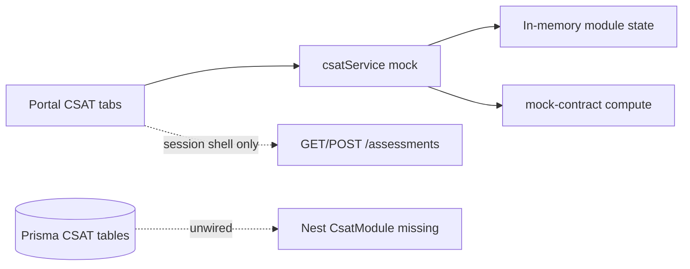

# CBN_CSAT Workbook — Backend Migration Tasks

**Surface:** Compliance Portal workbook at `/institution/dashboard?portal=CBN_CSAT` (and `?tab=…`)  
**Goal:** Move all workbook implementation and core functionality to NestJS + Prisma; remove frontend mock persistence and client-side scoring as source of truth.  
**Reference (historical):** [CBN_CSAT_Implementation_Plan.md](./CBN_CSAT_Implementation_Plan.md)  
**Out of scope:** Legacy control catalogue (`DOMAINS` + `Assessment.domainData` scoring on `/institution/assessment`), Excel/PDF export (follow-up; see Non-goals).

---

## 1. Purpose & defaults

| Decision | Choice |
|----------|--------|
| Product surface | Workbook portal only (14 sidebar tabs) |
| Assessment binding | All worksheet data keyed by existing `Assessment` row with `frameworkId: cbn-csat-2026` |
| Scoring | Server-side (port from `mock-contract.ts`); UI only displays API results |
| Threats / Vulnerabilities | Assessment-scoped worksheet rows matching current UI grids |
| Approvals | Persist full Approval Page fields (`preparedBy` / `preparedDate` / `approvedBy` / `approvedDate`), not only a thin status enum |
| Frontend change strategy | Keep tab components; rewrite `csatService` to HTTP with stable response shapes |

---

## 2. Current-state gap analysis

### 2.1 Architecture today



| Layer | Status | Primary paths |
|-------|--------|---------------|
| Portal UI (14 tabs) | Built | `frontend/components/institution/compliance-portal.tsx` + `tabs/csat-*.tsx` |
| `csatService` | **Always mock** — no feature flag, no HTTP | `frontend/services/csat.ts` |
| Catalogs + scoring | Hardcoded / client compute | `frontend/lib/data/csat/mock-contract.ts`, `maturity-tree-data.ts` |
| Types | Shared FE types | `frontend/lib/data/csat/types.ts` |
| Prisma CSAT models | Present; unused by Nest | `backend/prisma/models/csat.prisma` |
| Seed | Catalog seed exists | `backend/prisma/seed-csat.ts` (`npm run seed:csat`) |
| Nest CSAT HTTP API | **Missing** | No `backend/src/csat/` |
| Assessment shell | Real (or demo-mocked) | `POST/GET /assessments` — creates session / progress shell only |

### 2.2 Schema: exists vs UI needs

**Already in Prisma**

- Maturity hierarchy: `Domain` → `AssessmentFactor` → `Component` → `DeclarativeStatement` + `ComponentMaturityWeight`
- Inherent risk catalog: `InherentRiskCategory` → `InherentRiskAttribute`
- Responses: `MaturityResponse`, `InherentRiskResponse` (unique on `assessmentId` + statement/attribute)
- `ApprovalRecord` (status + reviewer + comments) — **narrower than UI Approval Page**

**Missing vs current UI (must add in P1)**

| UI concern | FE type / mock | Prisma today |
|------------|----------------|--------------|
| Institution Details form | `CSATInstitutionDetails` | No CSAT-specific store (Institution model lacks these CISO/stakeholder fields as workbook snapshot) |
| Approval Page fields | `CSATApprovalPage` | `ApprovalRecord` lacks preparer/approver names+dates as UI stores them |
| Inherent / Maturity explanation Q&A | catalogs + `CSATExplanationResponse` | No catalog or response tables |
| Domain target maturities | `CSATDomainTargetMaturity` | No table |
| Threat worksheet rows | `CSATThreatRow` | No table |
| Vulnerability worksheet rows | `CSATVulnerabilityRow` | No table |

### 2.3 Tab → current source → backend target

| Tab ID | Label | Current source | Backend target |
|--------|-------|----------------|----------------|
| `overview` | Overview | Static UI + checklist copy | Readiness endpoint derived from persisted worksheet completeness |
| `institution_details` | Institution Details | `csatService.get/updateInstitutionDetails` (in-memory; GTBank defaults) | Persist per `assessmentId` |
| `approval` | Approval Page | `get/updateApprovalPage` (in-memory) | Persist approval snapshot + status machine |
| `risk_maturity_summary` | Risk Maturity Summary | `getRiskMaturitySummary` (client build) | `GET …/summary` server compute |
| `inherent_risk` | Inherent Risk Profile Input | catalog + responses mock | Catalog from DB; upsert responses |
| `inherent_risk_explanation` | Inherent Risk Explanation | catalog + responses mock | Catalog from DB; upsert responses |
| `inherent_risk_result` | Inherent Risk Result | `computeInherentRiskResult` client | `GET …/inherent-risk/result` |
| `maturity_assessment` | Maturity Tool Input | tree + responses mock | Tree from DB; bulk upsert responses |
| `maturity_explanation` | Maturity Explanation | catalog + responses mock | Catalog from DB; upsert responses |
| `maturity_result` | Maturity Result | `computeMaturityResult` client | `GET …/maturity/result` |
| `chart_assessment_factors` | Chart of Assessment Factors | charts + target save mock | `GET` charts + `PUT` domain targets |
| `charts_of_component` | Charts of Component | `computeChartsOfComponent` client | `GET …/charts/components` |
| `threats` | Threats | in-memory grid | CRUD/upsert rows per assessment |
| `vulnerabilities` | Vulnerabilities | in-memory grid | CRUD/upsert rows per assessment |

### 2.4 `csatService` method inventory (contract to preserve)

| Method | Mutates? | Notes |
|--------|----------|-------|
| `getInstitutionDetails` / `updateInstitutionDetails` | R/W | Fake GTBank defaults today |
| `getApprovalPage` / `updateApprovalPage` | R/W | |
| `getRiskMaturitySummary` | R | Built from maturity + targets |
| `getInherentRiskCatalog` | R | |
| `getInherentRiskResponses` / `saveInherentRiskResponses` | R/W | Full map replace |
| `getInherentRiskResult` | R | Compute |
| `getInherentRiskExplanationCatalog` | R | |
| `getInherentRiskExplanationResponses` / `saveInherentRiskExplanationResponses` | R/W | |
| `getMaturityTree` | R | Large nested tree |
| `getMaturityResponses` / `saveMaturityResponses` | R/W | Bulk |
| `getMaturityResult` | R | Compute |
| `getDomainTargetMaturities` / `saveDomainTargetMaturities` | R/W | |
| `getAssessmentFactorCharts` | R | Depends on targets + maturity |
| `getChartsOfComponent` | R | |
| `getMaturityExplanationCatalog` | R | |
| `getMaturityExplanationResponses` / `saveMaturityExplanationResponses` | R/W | |
| `getThreatRows` / `saveThreatRows` | R/W | |
| `getVulnerabilityRows` / `saveVulnerabilityRows` | R/W | |

All methods currently use `sleep()` fake latency and process-local variables — **lost on full page reload**.

---

## 3. Phased tasks (unique IDs + validation criteria)

### Phase 0 — Contract & done-vs-todo audit

| Task ID | Task | Validation criteria | Status |
|---------|------|---------------------|--------|
| **CSAT-MIG-P0-01** | Produce done-vs-todo map against [CBN_CSAT_Implementation_Plan.md](./CBN_CSAT_Implementation_Plan.md) (P0–P6) vs repo (Prisma, seed, UI, Nest). | Written section in this doc (or linked appendix) marks each old `CSAT-P*-*` as Done / Partial / Missing; Nest API and FE HTTP wiring marked Missing. | **Done** — §10 |
| **CSAT-MIG-P0-02** | Freeze OpenAPI-style contract mirroring `csatService` shapes in `types.ts`, with required `assessmentId` on all assessment-scoped routes. | Contract checklist lists every method above with HTTP verb/path/DTO; FE tab props need no shape breakage beyond adding `assessmentId`. | **Done** — §11 |
| **CSAT-MIG-P0-03** | Document tenancy rules: caller may only read/write CSAT data for assessments belonging to `req.user.institutionId`. | Written rule + list of endpoints that must enforce it; includes rejection of cross-institution `assessmentId`. | **Done** — §12 |
| **CSAT-MIG-P0-04** | Confirm catalog ID strategy: stable IDs for attributes/statements used as response keys (seed deterministic IDs or map FE string ids → DB uuids). | Decision recorded; sample join of one IR attribute response and one maturity statement response round-trips without orphan keys. | **Done** — §13 |

**Exit gate:** P0 checklist signed off; no Nest code required yet. **Met — see §§10–13.**

---

### Phase 1 — Schema extensions

| Task ID | Task | Validation criteria | Status |
|---------|------|---------------------|--------|
| **CSAT-MIG-P1-01** | Add `CsatInstitutionDetails` (or equivalent) 1:1 with `Assessment`, fields matching `CSATInstitutionDetails`. | Prisma migrate/push succeeds; can upsert one row per assessment via Prisma Studio. | **Done** — `CsatInstitutionDetails` |
| **CSAT-MIG-P1-02** | Extend approval persistence to store Approval Page fields (preparer/approver names + dates) tied to `assessmentId`; keep status transitions for submit later. | Saving UI-equivalent payload survives reload query; unique or single-current record per assessment defined. | **Done** — `ApprovalRecord` + `@@unique(assessmentId)` |
| **CSAT-MIG-P1-03** | Add explanation catalog tables (inherent + maturity) **or** seed JSON tables + `ExplanationResponse` keyed by `assessmentId` + `questionId`. | Catalog row counts match FE catalogs; responses unique per assessment+question. | **Done** — schema; seed in P2 |
| **CSAT-MIG-P1-04** | Add `CsatDomainTargetMaturity` (`assessmentId`, `domainId`, `targetMaturityLevel`). | Unique `(assessmentId, domainId)`; enum aligns with Baseline…Innovative. | **Done** |
| **CSAT-MIG-P1-05** | Add `CsatThreatRow` / `CsatVulnerabilityRow` assessment-scoped models matching `CSATThreatRow` / `CSATVulnerabilityRow`. | Can insert N rows per assessment; delete-all-and-replace bulk save supported by schema. | **Done** |
| **CSAT-MIG-P1-06** | Wire relations on existing `Assessment` model for all new CSAT entities; cascade delete with assessment. | Deleting an assessment removes all CSAT worksheet children; no orphan FKs. | **Done** — `others.prisma` |

**Exit gate:** Dev DB has extended schema; existing IR/maturity response tables unchanged and still valid. See **§15**.

---

### Phase 2 — Seed & catalog alignment

| Task ID | Task | Validation criteria | Status |
|---------|------|---------------------|--------|
| **CSAT-MIG-P2-01** | Ensure `seed-csat` (or successor) is idempotent for hierarchy, weights, IR catalog; document run command for local/staging. | Second seed run does not duplicate domains/attributes/statements; counts match extract expectations. | **Done** — §16 |
| **CSAT-MIG-P2-02** | Seed explanation catalogs (inherent + maturity) from workbook extracts / current FE catalogs. | API or Prisma query returns same question counts as FE catalogs today. | **Done** — §16 |
| **CSAT-MIG-P2-03** | Remove **serving** of fake institution defaults (GTBank PII in `defaultInstitutionDetails`) from any runtime path; empty defaults for new assessments only. | New assessment details GET returns empty/null fields (or institution-derived name only), never GTBank demo PII. | **Done** — `emptyInstitutionDetails` |
| **CSAT-MIG-P2-04** | Align FE catalog consumption plan: either stop shipping `maturity-tree-data.ts` as runtime source after API exists, or generate seed from it once then delete runtime use. | Documented single source of truth = DB after P3 catalog endpoints ship. | **Done** — §16 |

**Exit gate:** Fresh DB + seed supports all catalog GETs without FE hardcoded trees as production dependency. **Met for DB** (catalogs in Postgres with stable IDs). FE still ships trees until P3/P4/P5 cutover per §16 plan.

---

### Phase 3 — NestJS `CsatModule` (API + scoring)

Base path convention (freeze in P0; adjust only if conflict): `/csat/assessments/:assessmentId/…`

| Task ID | Task | Validation criteria | Status |
|---------|------|---------------------|--------|
| **CSAT-MIG-P3-01** | Create `CsatModule` (controller/service/DTOs), register in `AppModule`, JWT + roles consistent with assessments. | Module boots; health or ping route reachable under auth. | **Done** — `GET /csat/health` |
| **CSAT-MIG-P3-02** | Catalog endpoints: inherent risk catalog, maturity tree (nested), both explanation catalogs. | Response shapes match FE types; tree includes statements + weights needed for UI. | **Done** |
| **CSAT-MIG-P3-03** | Institution details GET/PUT for assessment. | Round-trip; tenant check returns 403 for other institution’s assessment. | **Done** |
| **CSAT-MIG-P3-04** | Approval page GET/PUT (+ optional submit-for-approval transition). | Round-trip fields; invalid status transition rejected. | **Done** |
| **CSAT-MIG-P3-05** | Inherent risk responses GET + bulk PUT/PATCH; validate level 1–5. | Bulk save of all attributes; re-fetch matches; invalid level → 400. | **Done** |
| **CSAT-MIG-P3-06** | Port `computeInherentRiskResult` to `CsatScoringService`; `GET …/inherent-risk/result`. | Unit tests: all Low → Low band; incomplete → Incomplete; mixed averages match hand calc. | **Done** |
| **CSAT-MIG-P3-07** | Maturity responses GET + bulk save (≤504 statements); map Yes/Yes[CC]/No/N/A ↔ `MaturityAnswer` enum. | Bulk save completes; unique constraint respected; enum rejected values → 400. | **Done** |
| **CSAT-MIG-P3-08** | Port `computeMaturityResult` using `ComponentMaturityWeight`; `GET …/maturity/result`. | Unit test: one No at Intermediate caps domain below Intermediate (per re-derived rollup rule). | **Done** |
| **CSAT-MIG-P3-09** | Domain targets GET/PUT; `GET …/charts/assessment-factors` and `GET …/charts/components` porting chart helpers. | Changing targets changes chart payload; matches prior client compute on same fixture answers. | **Done** |
| **CSAT-MIG-P3-10** | `GET …/summary` (Risk Maturity Summary) combining IR aggregate + domain current/target. | Incomplete IR shows `--` where applicable; domain rows match maturity result + targets. | **Done** |
| **CSAT-MIG-P3-11** | Explanation responses GET/PUT (inherent + maturity). | Round-trip; tenant scoped. | **Done** |
| **CSAT-MIG-P3-12** | Threats + vulnerabilities GET + bulk replace/save. | Empty grid and N-row grid persist; reload returns same order/ids policy documented. | **Done** |
| **CSAT-MIG-P3-13** | `GET …/readiness` (or include in summary) mapping Overview’s 8 submission checklist items to boolean/complete flags. | Checklist flags false until required worksheet sections have minimum data; true when criteria met (define thresholds in service). | **Done** |
| **CSAT-MIG-P3-14** | Tenancy hard pass on every CSAT route; add regression test Institution A vs B. | Automated test: A cannot read/write B’s `assessmentId` (403). | **Done** — unit tests |

**Exit gate:** All workbook reads/writes/scores available via authenticated HTTP; no dependency on FE in-memory state. **API ready** — FE still on mock until P4. See **§17**.

---

### Phase 4 — Frontend wiring

| Task ID | Task | Validation criteria | Status |
|---------|------|---------------------|--------|
| **CSAT-MIG-P4-01** | Rewrite `frontend/services/csat.ts` to call Nest via shared `api` client; accept `assessmentId` (from portal session). | No module-level mutable mock state; no `sleep()` fake latency. | **Done** |
| **CSAT-MIG-P4-02** | Pass `assessmentId` from `CompliancePortal` / modal store into every CSAT tab that loads/saves. | Saving on any tab persists for that assessment; switching assessments loads correct data. | **Done** — `CsatAssessmentIdProvider` |
| **CSAT-MIG-P4-03** | Verify each tab still works: Details, Approval, IR input/explanation/result, Maturity input/explanation/result, both chart tabs (incl. `chart_assessment_factors`), Threats, Vulns, Summary. | Manual UAT checklist all green; network tab shows `/csat/…` (or agreed paths) not mock-only. | **Done** — wired; UAT in P6 |
| **CSAT-MIG-P4-04** | Overview: bind submission checklist preview to readiness API when available. | Checklist toggles reflect saved backend state after completing sections. | **Done** |
| **CSAT-MIG-P4-05** | Fix or remove orphan `/institution/csat/details` page so it uses same HTTP service + assessment context (or redirects into portal). | No remaining code path that only updates in-memory mock. | **Done** — redirects to portal |

**Exit gate:** Full portal walkthrough with hard refresh mid-flow retains all answers. **Wired** — confirm with hard-refresh UAT in P6. See **§18**.

---

### Phase 5 — Mock removal

| Task ID | Task | Validation criteria | Status |
|---------|------|---------------------|--------|
| **CSAT-MIG-P5-01** | Delete in-memory state and `sleep` from `csat.ts`; service is HTTP-only. | `rg "sleep\(|mockDetails|mockMaturityResponses" frontend/services/csat.ts` empty. | **Done** |
| **CSAT-MIG-P5-02** | Remove runtime dependency on hardcoded catalogs for portal tabs — fetch from API only. | CSAT tabs do not import catalogs from mock-contract. | **Done** |
| **CSAT-MIG-P5-03** | Remove GTBank fake institution defaults; empty factory only. | No GTBank / demo CISO email in portal paths. | **Done** |
| **CSAT-MIG-P5-04** | Move scoring off FE runtime; Nest only. | Result/chart tabs never call FE compute helpers. | **Done** |
| **CSAT-MIG-P5-05** | Delete FE mock-contract / tree; seed under backend prisma data. | Zero portal imports of former mock catalogs. | **Done** |
| **CSAT-MIG-P5-06** | Demo mode must not silently mock CSAT workbook. | `/csat` not demo-mocked; portal banner in demo mode. | **Done** |

**Exit gate:** Mock-removal matrix (Section 5) all rows Done. **Met** — see **§19**.

---

### Phase 6 — Persistence, readiness, security QA

| Task ID | Task | Validation criteria | Status |
|---------|------|---------------------|--------|
| **CSAT-MIG-P6-01** | Hard-refresh persistence test on all mutable tabs after save. | 100% of saved fields restored after reload for a single assessment. | **Done** (checklist in §20) |
| **CSAT-MIG-P6-02** | Scoring regression: 3 fixture assessments (empty, partial, complete) — IR bands + domain maturity + charts match golden JSON. | CI unit/e2e tests green; mismatch blocks merge. | **Done** |
| **CSAT-MIG-P6-03** | Readiness vs Overview 8-item checklist (Details, Approval, Risk Maturity Summary, Inherent Risk Result, Chart of Components, Threats, Vulnerabilities, Letter of Approved Consultant). | Documented rule per item; API flags match rules; “Letter of Approved Consultant” explicitly marked N/A or upload placeholder if not in product yet. | **Done** |
| **CSAT-MIG-P6-04** | Security review: tenancy, enum validation, bulk payload size limits for maturity save. | No cross-tenant leakage; oversized/malformed bulk rejected safely. | **Done** |
| **CSAT-MIG-P6-05** | Staging smoke: seed catalogs → create assessment → complete workbook path through `chart_assessment_factors` and threats/vulns → summary. | Written smoke sign-off. | **Done** (template in §20) |

**Exit gate:** Staging smoke signed off; mocks gone; scoring tests green. **Met** — see **§20**.

---

## 4. Per-tab task ownership map

| Tab | Load tasks | Save tasks | Compute / derived |
|-----|------------|------------|-------------------|
| Overview | P3-13, P4-04 | — | Readiness |
| Institution Details | P3-03, P4-03 | P3-03 | — |
| Approval Page | P3-04, P4-03 | P3-04 | — |
| Risk Maturity Summary | P3-10, P4-03 | — | P3-10 |
| Inherent Risk Profile Input | P3-02, P3-05, P4-03 | P3-05 | — |
| Inherent Risk Explanation | P3-02, P3-11, P4-03 | P3-11 | — |
| Inherent Risk Result | P3-06, P4-03 | — | P3-06 |
| Maturity Tool Input | P3-02, P3-07, P4-03 | P3-07 | — |
| Maturity Explanation | P3-02, P3-11, P4-03 | P3-11 | — |
| Maturity Result | P3-08, P4-03 | — | P3-08 |
| Chart of Assessment Factors | P3-09, P4-03 | P3-09 (targets) | P3-09 |
| Charts of Component | P3-09, P4-03 | — | P3-09 |
| Threats | P3-12, P4-03 | P3-12 | — |
| Vulnerabilities | P3-12, P4-03 | P3-12 | — |

Cross-cutting: **P0** (contract), **P1** (schema), **P2** (seed), **P4-01/02** (service + assessmentId), **P5** (mock kill), **P6** (QA).

---

## 5. Mock-removal matrix

| Artifact | Status |
|----------|--------|
| Module mock state / `sleep` in `csat.ts` | **Done** (HTTP only) |
| GTBank institution PII | **Done** (empty `ui-helpers`) |
| Catalogs / maturity tree on FE | **Done** (moved to `backend/prisma/data/csat/`) |
| Scoring / charts compute on FE | **Done** (Nest `csat.scoring.ts` only) |
| Empty threat/vuln row factories | **Keep** in `ui-helpers.ts` |
| `types.ts` | **Keep** |
| `/institution/csat/details` | **Done** (portal redirect) |
| Demo `/csat` silent mock | **Done** (not mocked + banner) |

## 6. Suggested implementation order

```text
P0 (contract/audit)
  → P1 (schema gaps)
  → P2 (seed alignment)
  → P3 (Nest APIs + scoring)   // can stub FE against contract early
  → P4 (csatService → HTTP + assessmentId)
  → P5 (delete mocks)
  → P6 (persistence / scoring / security QA)
```

Do not mark migration complete until **P5** and **P6-01/P6-02** pass. **Met** — see §19 and §20.

---

## 7. Non-goals (this migration)

| Item | Reason |
|------|--------|
| Legacy `DOMAINS` / `domainData` control scoring UI | Separate product surface; not the workbook portal |
| Unifying dashboard composite % to workbook maturity | Follow-up product decision (would be “scope B”) |
| Excel / PDF / email submission package | Old plan Phase 5; not a gate for mock removal |
| Rewriting `CBN_CSAT_Implementation_Plan.md` | Kept as historical reference |
| Regulator CBN queue redesign | Already uses generic assessments; workbook export/submit package is follow-up |

---

## 8. Mapping: old Implementation Plan → this migration

High-level summary (task-by-task detail in **§10**):

| Old ID (summary) | Status vs repo | Covered by |
|------------------|----------------|------------|
| CSAT-P0-01…06 Discovery | Mostly Done / Partial (P0-04 weights test, P0-05 sign-off, P0-06 threats ref Missing) | §10 + P2 |
| CSAT-P1-01…07 Schema | Partial (core hierarchy/IR/responses Done; details/approval fields/threats Missing) | P1-* |
| CSAT-P2-01…04 Seed | Partial (`seed-csat.ts` wipe-insert; not idempotent upsert; no explanation/threat seeds) | P2-* |
| CSAT-P3-01…10 Nest API | **Missing** | P3-* / §11 |
| CSAT-P4-01…07 Frontend UI | **Done as mock-backed tabs** | P4-* (wire only) |
| CSAT-P5 Export | N/A (migration) | Non-goal §7 |
| CSAT-P6 QA | **Done** (unit fixtures + tenancy/bulk tests + §20 checklists) | P6-* / §20 |

---

## 9. Definition of done (migration)

1. Every workbook tab loads and saves against Nest for a real `Assessment` (`cbn-csat-2026`).
2. Hard refresh retains all worksheet data.
3. IR result, maturity result, risk-maturity summary, and both chart tabs use **server** compute.
4. Mock-removal matrix is fully Done; `csatService` has no in-memory store.
5. Cross-tenant access to another institution’s CSAT assessment returns 403.
6. Overview checklist readiness is driven by backend rules (with explicit handling for “Letter of Approved Consultant” if not yet implemented).

---

## 10. Phase 0 deliverable — Done-vs-todo vs Implementation Plan (CSAT-MIG-P0-01)

**Audit date:** 2026-07-24  
**Codebases checked:** `backend/prisma/models/csat.prisma`, `backend/prisma/seed-csat.ts`, `backend/src/**` (no `csat` module), `frontend/services/csat.ts`, portal `tabs/csat-*.tsx`, `frontend/lib/data/csat/*`.

### Legend

| Status | Meaning |
|--------|---------|
| **Done** | Acceptance intent met in repo (may still be mock-backed on FE) |
| **Partial** | Schema/UI/seed started; gaps vs criteria |
| **Missing** | Not implemented |
| **N/A (migration)** | Out of workbook migration scope (see §7) |

### CSAT-P0 — Discovery

| Old ID | Status | Evidence / gap |
|--------|--------|----------------|
| **CSAT-P0-01** | **Done** | Existing `Institution`, `User`, `Assessment`, roles reused; CSAT tables prefixed `csat_*`. No colliding Org model. |
| **CSAT-P0-02** | **Done** | FE `maturity-tree-data.ts` (generated from workbook); seed parses `CBN_Tool_Full_Extract.txt` Maturity Tool Input. Formal standalone JSON artifact not checked into repo as separate file — tree + seed act as canonical sources. |
| **CSAT-P0-03** | **Done** | FE `inherentRiskCatalog` in `mock-contract.ts`; seed from same extract. |
| **CSAT-P0-04** | **Partial** | Weights seeded via `CSAT_Parameters_Full_Extract.txt` into `ComponentMaturityWeight`. No automated unit test reconciling sheet TOTAL vs DB. |
| **CSAT-P0-05** | **Partial** | Rollup implemented in FE `computeInherentRiskResult` / `computeMaturityResult` (`mock-contract.ts`). No separate signed-off pseudocode doc / stakeholder approval on file. |
| **CSAT-P0-06** | **Missing** | No 26+26 reference seed. Current UI uses free-form worksheet rows (`CSATThreatRow` / `CSATVulnerabilityRow`), which supersedes join-to-reference design for this migration (see P1-05). |

### CSAT-P1 — Schema

| Old ID | Status | Evidence / gap |
|--------|--------|----------------|
| **CSAT-P1-01** | **Partial** | Global `Institution` exists; workbook **Details of Institution** snapshot fields not modeled per assessment (gap → CSAT-MIG-P1-01). |
| **CSAT-P1-02** | **Done** | `Domain`, `AssessmentFactor`, `Component`, `DeclarativeStatement`, `MaturityLevel` enum in `csat.prisma`. |
| **CSAT-P1-03** | **Done** | `ComponentMaturityWeight` + seed. |
| **CSAT-P1-04** | **Done** | `InherentRiskCategory` / `InherentRiskAttribute` + seed. |
| **CSAT-P1-05** | **Partial** | `Assessment` + `MaturityResponse` + `InherentRiskResponse` exist and relate. Status is free string on `Assessment`, not a CSAT-specific enum. No Nest writes yet. |
| **CSAT-P1-06** | **Missing** | No Threat/Vulnerability reference or selection tables. Migration uses assessment-scoped worksheet rows instead (CSAT-MIG-P1-05). |
| **CSAT-P1-07** | **Partial** | `ApprovalRecord` exists (status + reviewer + comments) but lacks preparer/approver name+date fields matching UI `CSATApprovalPage` (→ CSAT-MIG-P1-02). Submit gate not enforced in service. |

### CSAT-P2 — Seed

| Old ID | Status | Evidence / gap |
|--------|--------|----------------|
| **CSAT-P2-01** | **Partial** | `seed-csat.ts` clears + recreates hierarchy (not true upsert/idempotent without wipe). |
| **CSAT-P2-02** | **Partial** | Weights seeded with hierarchy; no TOTAL reconciliation unit test. |
| **CSAT-P2-03** | **Partial** | IR categories/attributes seeded; same wipe-then-insert pattern. |
| **CSAT-P2-04** | **Missing** | No threats/vulns catalog seed (N/A if worksheet-only model wins). |

### CSAT-P3 — Nest API

| Old ID | Status | Evidence / gap |
|--------|--------|----------------|
| **CSAT-P3-01** | **Missing** | No CSAT institution-details module (generic institutions API ≠ workbook snapshot). → CSAT-MIG-P3-03 |
| **CSAT-P3-02** | **Partial** | Generic `/assessments` CRUD exists; does **not** return CSAT maturity tree + responses. → P3-02/P3-07 |
| **CSAT-P3-03** | **Missing** | No maturity response bulk API. → P3-07 |
| **CSAT-P3-04** | **Missing** | No inherent risk response API. → P3-05 |
| **CSAT-P3-05** | **Missing** | Scoring only on FE. → P3-06 |
| **CSAT-P3-06** | **Missing** | Maturity rollup only on FE. → P3-08 |
| **CSAT-P3-07** | **Missing** | No summary API. → P3-10 |
| **CSAT-P3-08** | **Missing** | Approval status machine not wired for workbook. → P3-04 |
| **CSAT-P3-09** | **Missing** | No threats/vulns API. → P3-12 |
| **CSAT-P3-10** | **Missing** | No CSAT routes; generic `GET/PATCH /assessments/:id` also weak on ownership checks today. → P3-14 / §12 |

### CSAT-P4 — Frontend UI

| Old ID | Status | Evidence / gap |
|--------|--------|----------------|
| **CSAT-P4-01** | **Done** (mock) | `csat-details-tab.tsx` + types; persists only in memory. |
| **CSAT-P4-02** | **Done** (mock) | `csat-inherent-risk-tab.tsx` with level descriptions. |
| **CSAT-P4-03** | **Done** (mock) | `csat-maturity-assessment-tab.tsx` full tree. |
| **CSAT-P4-04** | **Done** (mock) | `csat-risk-maturity-summary-tab.tsx` + chart tabs. |
| **CSAT-P4-05** | **Partial** (mock) | Threats/vulns grids exist as free-form rows, not 26-item reference pickers. |
| **CSAT-P4-06** | **Partial** (mock) | Approval tab exists; Overview checklist is preview copy, not gated submit. |
| **CSAT-P4-07** | **Done** (mock) | Portal shell + `SIDEBAR_NAV.CBN_CSAT` + URL `?portal=&tab=`. |

### CSAT-P5 — Export

| Old ID | Status | Evidence / gap |
|--------|--------|----------------|
| **CSAT-P5-01…03** | **N/A (migration)** | Explicit non-goal (§7). Track separately later. |

### CSAT-P6 — QA / deploy

| Old ID | Status | Evidence / gap |
|--------|--------|----------------|
| **CSAT-P6-01…05** | **Done** | Scoring empty/partial/complete fixtures; readiness rules; tenancy + bulk limits; persistence/smoke checklists in §20. → CSAT-MIG-P6-* |

### Nest / FE HTTP (migration-critical)

| Concern | Status |
|---------|--------|
| Nest `CsatModule` | **Missing** |
| `csatService` → HTTP | **Missing** (always in-memory mock) |
| Prisma CSAT tables written by API | **Missing** |

---

## 11. Phase 0 deliverable — Frozen API contract (CSAT-MIG-P0-02)

### Conventions

| Item | Rule |
|------|------|
| Base path | `/csat/assessments/:assessmentId` |
| Auth | Existing JWT `AuthGuard` (same as `/assessments`) |
| Content-Type | `application/json` |
| FE types | Preserve shapes in `frontend/lib/data/csat/types.ts` unless noted |
| Catalog routes | Global (not assessment-scoped) under `/csat/catalog/…` |
| Answer maps | Where FE uses `Record<string, T>`, API may return `{ items: T[] }` **or** the same `Record` — **frozen choice: return `Record<string, T>`** for drop-in `csatService` parity |
| Maturity answers (wire) | FE strings `"Yes" \| "Yes [CC]" \| "No" \| "N/A"` on the wire; Nest maps to Prisma `YES \| YES_CC \| NO \| NA` internally |
| Errors | `400` validation; `403` tenancy; `404` unknown assessment/catalog id |

### Catalog endpoints (no `assessmentId`)

| # | Method | Path | Response DTO (FE type) | Replaces `csatService` |
|---|--------|------|------------------------|------------------------|
| C1 | `GET` | `/csat/catalog/inherent-risk` | `CSATInherentRiskCategory[]` | `getInherentRiskCatalog` |
| C2 | `GET` | `/csat/catalog/maturity-tree` | `CSATMaturityDomain[]` | `getMaturityTree` |
| C3 | `GET` | `/csat/catalog/inherent-risk-explanations` | `CSATExplanationCategory[]` | `getInherentRiskExplanationCatalog` |
| C4 | `GET` | `/csat/catalog/maturity-explanations` | `CSATMaturityExplanationDomain[]` | `getMaturityExplanationCatalog` |

### Assessment-scoped endpoints

All require `:assessmentId` belonging to caller’s institution (§12).

| # | Method | Path | Request body | Response | Replaces |
|---|--------|------|--------------|----------|----------|
| A1 | `GET` | `/csat/assessments/:assessmentId/institution-details` | — | `CSATInstitutionDetails` | `getInstitutionDetails` |
| A2 | `PUT` | `…/institution-details` | `Partial<CSATInstitutionDetails>` or full object | `CSATInstitutionDetails` | `updateInstitutionDetails` |
| A3 | `GET` | `…/approval` | — | `CSATApprovalPage` (+ optional `status`) | `getApprovalPage` |
| A4 | `PUT` | `…/approval` | `Partial<CSATApprovalPage>` | `CSATApprovalPage` | `updateApprovalPage` |
| A5 | `GET` | `…/inherent-risk/responses` | — | `Record<string, CSATInherentRiskResponse>` | `getInherentRiskResponses` |
| A6 | `PUT` | `…/inherent-risk/responses` | `Record<string, CSATInherentRiskResponse>` | same | `saveInherentRiskResponses` |
| A7 | `GET` | `…/inherent-risk/result` | — | `CSATInherentRiskResult` | `getInherentRiskResult` |
| A8 | `GET` | `…/inherent-risk/explanations/responses` | — | `Record<string, CSATExplanationResponse>` | `getInherentRiskExplanationResponses` |
| A9 | `PUT` | `…/inherent-risk/explanations/responses` | `Record<string, CSATExplanationResponse>` | same | `saveInherentRiskExplanationResponses` |
| A10 | `GET` | `…/maturity/responses` | — | `Record<string, CSATMaturityResponse>` | `getMaturityResponses` |
| A11 | `PUT` | `…/maturity/responses` | `Record<string, CSATMaturityResponse>` | same | `saveMaturityResponses` |
| A12 | `GET` | `…/maturity/result` | — | `CSATMaturityResult` | `getMaturityResult` |
| A13 | `GET` | `…/maturity/explanations/responses` | — | `Record<string, CSATExplanationResponse>` | `getMaturityExplanationResponses` |
| A14 | `PUT` | `…/maturity/explanations/responses` | `Record<string, CSATExplanationResponse>` | same | `saveMaturityExplanationResponses` |
| A15 | `GET` | `…/domain-targets` | — | `CSATDomainTargetMaturity[]` | `getDomainTargetMaturities` |
| A16 | `PUT` | `…/domain-targets` | `CSATDomainTargetMaturity[]` | same | `saveDomainTargetMaturities` |
| A17 | `GET` | `…/charts/assessment-factors` | — | `CSATAssessmentFactorCharts` | `getAssessmentFactorCharts` |
| A18 | `GET` | `…/charts/components` | — | `CSATChartsOfComponent` | `getChartsOfComponent` |
| A19 | `GET` | `…/summary` | — | `CSATRiskMaturitySummary` | `getRiskMaturitySummary` |
| A20 | `GET` | `…/threats` | — | `CSATThreatRow[]` | `getThreatRows` |
| A21 | `PUT` | `…/threats` | `CSATThreatRow[]` (full replace) | same | `saveThreatRows` |
| A22 | `GET` | `…/vulnerabilities` | — | `CSATVulnerabilityRow[]` | `getVulnerabilityRows` |
| A23 | `PUT` | `…/vulnerabilities` | `CSATVulnerabilityRow[]` (full replace) | same | `saveVulnerabilityRows` |
| A24 | `GET` | `…/readiness` | — | `{ items: { id: string; label: string; complete: boolean }[] }` | Overview checklist (new; not in mock service) |

### FE change surface (frozen)

- Tabs keep current DTO shapes.
- Only required FE addition: pass `assessmentId` from portal session (`portalAssessment.id`) into `csatService.*` (or close over it in a thin wrapper).
- Catalog GETs do not need `assessmentId`.

### Enum / field notes

| Field | Wire value | Prisma / internal |
|-------|------------|-------------------|
| Maturity answer | `"Yes"`, `"Yes [CC]"`, `"No"`, `"N/A"` | `YES`, `YES_CC`, `NO`, `NA` |
| IR `selectedLevel` | `1\|2\|3\|4\|5\|null` | `Int` (+ null = unanswered / omit row) |
| Domain target level | `Baseline`…`Innovative` (no `Sub-Baseline`) | Match `MaturityLevel` enum |
| Threat/vuln likelihood/impact | Existing FE string unions | Store as string or enum matching FE |

**Contract freeze:** Paths and response types above are the P3 implementation target. Changing them requires updating this section before coding Nest routes.

---

## 12. Phase 0 deliverable — Tenancy rules (CSAT-MIG-P0-03)

### Rule (normative)

> A authenticated user may read or write CSAT workbook data **only** when `Assessment.id = :assessmentId` **and** `Assessment.institutionId = req.user.institutionId`.  
> Otherwise respond **`403 Forbidden`** (do not leak existence via differentiated 404 unless product standard is 404 for both — **frozen: use 404 if assessment missing, 403 if assessment exists but belongs to another institution**).

### Applies to

Every assessment-scoped route in §11: **A1–A24**.

Catalog routes **C1–C4** are read-only reference data: any authenticated institution user may call them (no `assessmentId`).

### Implementation checklist (for P3)

| Check | Requirement |
|-------|-------------|
| Resolve assessment | `findFirst({ where: { id: assessmentId } })` |
| Missing | `404` |
| Wrong institution | `403` |
| Mutations | Same ownership check before upsert/delete |
| Admin/regulator bypass | **Out of scope for workbook editor APIs** in this migration; regulators continue to use existing `/regulator/*` on generic assessments. Do not expose CSAT worksheet mutate to REGULATOR unless a later task adds it. |
| Roles for mutate | Align with assessment edit roles already used for `PATCH /assessments/:id` (typically institution CISO/compliance users); read allowed for same institution roles that can open the portal. Exact role list: reuse guards from assessments module when implementing P3-01. |

### Known related gap (pre-existing)

Generic `GET/PATCH/DELETE /assessments/:id` today does **not** consistently verify institution ownership. CSAT routes must **not** copy that weakness. Fixing generic assessments IDOR is recommended but **not** a Phase 0 exit gate for workbook migration (track under P3-14 / security if touching assessments module).

### Automated test required (P3-14 / P6-04)

1. User A creates/owns assessment `Aa`.  
2. User B (other `institutionId`) calls `GET/PUT /csat/assessments/Aa/institution-details` (and at least one bulk PUT).  
3. Expect **403**.

---

## 13. Phase 0 deliverable — Catalog ID strategy (CSAT-MIG-P0-04)

### Problem

| Source | ID style | Example |
|--------|----------|---------|
| Frontend catalogs | **Stable slugs** (human-readable, deterministic) | `domain_1_factor_1_component_1_baseline_1`, `category_technologies_and_connection_types_1`, `explanation_tech_1` |
| Current Prisma seed | **Random UUIDs** (`@default(uuid())`) on every wipe/reseed | Changes every `seed:csat` run |

Responses are keyed by those FE ids (`attributeId`, `statementId`, `questionId`, `domainId`). If the API returns UUID catalog ids while the FE still thinks in slugs (or vice versa after reseed), saved answers become orphans.

### Decision (frozen)

**Use the frontend stable slug as the primary key (`id`) for all CSAT catalog entities** (domains, factors, components, statements, IR categories/attributes, explanation questions/categories).

| Rule | Detail |
|------|--------|
| PK type | `String` `@id` — **not** `@default(uuid())` for catalog rows |
| Seed | Upsert by stable slug derived from the same scheme as FE (`domain_N_factor_M_…`) **or** import FE tree/catalog literally |
| API catalog payloads | Return the same `id` strings the FE uses today so existing tab state keys keep working |
| Response FKs | `MaturityResponse.statementId`, `InherentRiskResponse.attributeId`, explanation `questionId`, `domainId` on targets → reference those stable ids |
| Worksheet row ids (threats/vulns) | Client-generated string ids (as today) stored as PK or unique per assessment; not catalog PKs |
| Assessment id | Keep existing `Assessment.id` UUID from assessments module |

### Reseed / migration implication (P1–P2)

1. Alter catalog models to remove UUID default; seed with deterministic ids.  
2. Prefer **upsert by id** over delete-all (improve idempotency — CSAT-MIG-P2-01).  
3. Until FE stops shipping trees, seed may be generated from `maturity-tree-data.ts` + `inherentRiskCatalog` to guarantee id parity.

### Round-trip acceptance samples (validate in P2/P3)

| Sample | Action | Pass criteria |
|--------|--------|---------------|
| IR | `PUT` response for `attributeId = "category_technologies_and_connection_types_1"` with `selectedLevel: 3` | Row exists with that `attributeId`; `GET` catalog still lists same id; `GET` responses map key matches |
| Maturity | `PUT` response for `statementId = "domain_1_factor_1_component_1_baseline_1"` with answer `"Yes"` | FK valid; re-fetch map key identical; result compute includes that statement |
| After reseed | Run seed twice | Same catalog ids; prior assessment responses still resolve (no orphan FKs) |

### Explicit non-decision

Do **not** introduce a parallel `stableKey` column plus UUID PK for v1 — extra mapping layer risks the current mock→API cutover. Revisit only if product requires opaque ids for security theater (not required for institution-scoped data).

---

## 14. Phase 0 exit checklist

| ID | Met? |
|----|------|
| CSAT-MIG-P0-01 Done-vs-todo written | Yes — §10 |
| CSAT-MIG-P0-02 Contract frozen | Yes — §11 |
| CSAT-MIG-P0-03 Tenancy documented | Yes — §12 |
| CSAT-MIG-P0-04 Catalog ID strategy decided | Yes — §13 |
| Nest/FE code changed | No (not required for P0) |

**Phase 0 complete.** Next: **Phase 1 — Schema extensions** (CSAT-MIG-P1-01…06), applying stable catalog PKs as part of P1/P2 if altering existing UUID defaults.

---

## 15. Phase 1 deliverable — Schema extensions (CSAT-MIG-P1-01…06)

**Applied:** 2026-07-24 via `npx prisma db push` against local `regguard` DB.  
**Files:** [`backend/prisma/models/csat.prisma`](../backend/prisma/models/csat.prisma), [`backend/prisma/models/others.prisma`](../backend/prisma/models/others.prisma) (`Assessment` relations).

| Task | Model / change | Notes |
|------|----------------|-------|
| P1-01 | `CsatInstitutionDetails` | 1:1 `assessmentId` `@unique`; fields mirror FE `CSATInstitutionDetails` |
| P1-02 | `ApprovalRecord` | Added `preparedBy` / `preparedDate` / `approvedBy` / `approvedDate`; `reviewerId` optional; **one row per assessment** (`assessmentId` `@unique`) |
| P1-03 | Explanation catalogs + responses | `InherentRiskExplanationCategory` / `Question` / `Response`; `MaturityExplanationDomain` / `Question` / `Response`; catalog PKs are stable `String` `@id` (no uuid default) for P2 seed parity; responses `@@unique([assessmentId, questionId])` |
| P1-04 | `CsatDomainTargetMaturity` | `@@unique([assessmentId, domainId])`; `targetMaturityLevel` = `MaturityLevel` |
| P1-05 | `CsatThreatRow`, `CsatVulnerabilityRow` | Assessment-scoped; `sortOrder` for replace-all ordering; indexed by `assessmentId` |
| P1-06 | `Assessment` relations | All new children + existing IR/maturity/approval; `onDelete: Cascade` on worksheet FKs |

**Unchanged (exit gate):** `MaturityResponse`, `InherentRiskResponse`, hierarchy/IR catalog models kept; still UUID-default PKs until P2 stable-id cutover (§13).

**Tables present after push:**  
`csat_institution_details`, `csat_inherent_risk_explanation_*`, `csat_maturity_explanation_*`, `csat_domain_target_maturities`, `csat_threat_rows`, `csat_vulnerability_rows`, plus prior `csat_*` tables.

**Seed hygiene:** [`seed-csat.ts`](../backend/prisma/seed-csat.ts) clear block now deletes the new response/worksheet/explanation tables before hierarchy wipe. Explanation **content** seeding is **P2**.

**Phase 1 complete.** Next: **Phase 2 — Seed & catalog alignment**.

---

## 16. Phase 2 deliverable — Seed & catalog alignment (CSAT-MIG-P2-01…04)

**Applied:** 2026-07-24

### Commands

```bash
cd backend
npm run seed:csat                 # idempotent upsert (keeps worksheet responses)
CSAT_SEED_RESET=1 npm run seed:csat   # wipe CSAT responses + catalogs, then reseed
```

Legacy UUID catalogs are detected automatically (`domain.id` not starting with `domain_`) and trigger a one-time wipe + stable-id reseed.

### Source of truth plan (P2-04)

| Phase | Catalog source |
|-------|----------------|
| **Now (P2)** | Seed reads FE files (`maturity-tree-data.ts`, IR/explanation catalogs in `mock-contract.ts`) + weights from `docsplan/CSAT_Parameters_Full_Extract.txt` into Postgres with **stable FE slug PKs**. |
| **After P3** | Nest `GET /csat/catalog/*` serves DB; FE `csatService` switches to HTTP (P4). |
| **P5** | Remove runtime FE catalog imports from portal tabs; FE files may remain as seed input only or move under `backend/prisma/data/`. |

**Single production source of truth after P3/P4:** PostgreSQL CSAT catalog tables.

### Verified counts (two consecutive `npm run seed:csat` runs)

| Entity | Count |
|--------|------:|
| Domains | 5 |
| Assessment factors | 15 |
| Components | 30 |
| Declarative statements | 488 |
| Component maturity weights | 150 |
| IR categories | 5 |
| IR attributes | 47 |
| IR explanation categories | 4 |
| IR explanation questions | 26 |
| Maturity explanation domains | 5 |
| Maturity explanation questions | 15 |

Sample stable IDs present: `domain_1_factor_1_component_1_baseline_1`, `category_technologies_and_connection_types_1`, `explanation_tech_1`.

### Schema adjustments in P2

- Catalog hierarchy + IR category/attribute PKs: stable `String @id` (no UUID default).
- `Component.code` added (from FE tree).
- Explanation catalog PKs already stable from P1.

### P2-03 — Fake institution defaults

- Replaced GTBank demo PII with `emptyInstitutionDetails` in `mock-contract.ts`.
- `csatService` mock init uses empty details only.
- `defaultInstitutionDetails` is now an alias of empty (deprecated).

### Files

- [`backend/prisma/seed-csat.ts`](../backend/prisma/seed-csat.ts) — rewritten upsert seed
- [`backend/prisma/models/csat.prisma`](../backend/prisma/models/csat.prisma) — stable catalog PKs + `code`
- [`frontend/lib/data/csat/mock-contract.ts`](../frontend/lib/data/csat/mock-contract.ts) — empty institution defaults
- [`frontend/services/csat.ts`](../frontend/services/csat.ts) — uses `emptyInstitutionDetails`

**Phase 2 complete.** Next: **Phase 3 — NestJS `CsatModule`**.

---

## 17. Phase 3 deliverable — NestJS CsatModule (CSAT-MIG-P3-01…14)

**Applied:** 2026-07-24

### Module layout

```
backend/src/csat/
  csat.module.ts
  csat.controller.ts
  csat.service.ts
  csat.scoring.ts
  csat.scoring.spec.ts
  csat.service.spec.ts
```

Registered in `backend/src/app.module.ts` as `CsatModule`.

### Endpoints

| Area | Methods |
|------|---------|
| Health | `GET /csat/health` (public) |
| Catalogs | `GET /csat/catalog/inherent-risk`, `maturity-tree`, `inherent-risk-explanations`, `maturity-explanations` |
| Details / approval | `GET/PUT …/institution-details`, `…/approval` |
| Inherent risk | `GET/PUT …/inherent-risk/responses`, `GET …/inherent-risk/result`, explanation responses |
| Maturity | `GET/PUT …/maturity/responses`, `GET …/maturity/result`, explanation responses |
| Targets / charts | `GET/PUT …/domain-targets`, `GET …/charts/assessment-factors`, `GET …/charts/components` |
| Summary / readiness | `GET …/summary`, `GET …/readiness` |
| Threats / vulns | `GET/PUT …/threats`, `GET/PUT …/vulnerabilities` |

All assessment-scoped routes call `assertAssessmentAccess` (missing → 404, wrong tenant → 403).

### Tests

```bash
cd backend && npx jest src/csat
```

Covers risk bands, incomplete/complete IR, maturity cap at Evolving when Intermediate is No, and tenancy 403/404.

### Threats / vulns order policy

Full-replace PUT; `sortOrder` = array index; client may supply `id` (kept) or omit (server UUID).

### Readiness thresholds (P3-13)

| Item | Complete when |
|------|----------------|
| Details | `name` and `cisoName` non-empty |
| Approval | preparer + approver names and dates all non-empty |
| Risk Maturity Summary | aggregate IR not `--` |
| Inherent Risk Result | composite `isComplete` |
| Chart of Components | at least one domain chart |
| Threats / Vulnerabilities | at least one row with name text |
| Letter of Approved Consultant | always `false` (not in product yet) |

**Phase 3 complete.** Next: **Phase 4 — Frontend wiring** (`csatService` → HTTP + `assessmentId`).

---

## 18. Phase 4 deliverable — Frontend wiring (CSAT-MIG-P4-01…05)

**Applied:** 2026-07-24

### Changes

| Area | Change |
|------|--------|
| `frontend/services/csat.ts` | HTTP client via `api`; assessment-scoped methods take `assessmentId`; unwraps Nest `{ data }` envelope; no in-memory mock / `sleep` |
| `frontend/services/api.ts` | Added `put()` for CSAT bulk saves |
| `csat-assessment-context.tsx` | `CsatAssessmentIdProvider` + `useCsatAssessmentId()` |
| `compliance-portal.tsx` | Wraps CBN_CSAT tabs with provider using `payload.assessment.id` |
| All CSAT tabs | Load/save through HTTP with assessment id |
| Overview | Checklist from `GET …/readiness` |
| `/institution/csat/details` | Redirects to `?portal=CBN_CSAT&tab=institution_details` |

### Manual smoke (recommended)

1. Open `/institution/dashboard?portal=CBN_CSAT` with backend running + seeded catalogs.
2. Save Institution Details → hard refresh → values restored.
3. Network tab shows `/api/v1/csat/…` requests.

**Phase 4 complete.** Next: **Phase 5 — Mock removal** (strip unused mock-contract runtime paths from portal).

---

## 19. Phase 5 deliverable — Mock removal (CSAT-MIG-P5-01…06)

**Applied:** 2026-07-24

| Change | Detail |
|--------|--------|
| Deleted | `frontend/lib/data/csat/mock-contract.ts`, `maturity-tree-data.ts` |
| Seed data | `backend/prisma/data/csat/{maturity-tree-data.ts,catalogs.ts}` |
| FE helpers | `frontend/lib/data/csat/ui-helpers.ts` |
| Scoring | Nest only (`backend/src/csat/csat.scoring.ts`) |
| Demo mode | `/csat` excluded from demo mock endpoints; portal amber banner |

**Phase 5 complete.** Next: **Phase 6 — Persistence, readiness, security QA**.

---

## 20. Phase 6 deliverable — Persistence, readiness, security QA (CSAT-MIG-P6-01…05)

**Applied:** 2026-07-24

### Code / tests

| Area | Change |
|------|--------|
| `backend/src/csat/csat.readiness.ts` | Normative `CSAT_READINESS_RULES`, `buildReadinessItems()`, bulk limits |
| `csat.service.ts` | Bulk size guards on IR / maturity / threat / vuln saves; readiness uses builder |
| `csat.scoring.spec.ts` | Golden fixtures: empty / partial / complete IR + maturity + charts; readiness unit tests |
| `csat.service.spec.ts` | Tenancy 404/403; invalid enum; oversized maturity & threat payloads; no write on cross-tenant |
| `package.json` | `npm run test:csat` → `jest src/csat` |

```bash
cd backend && npm run test:csat
# Expect: suites green (scoring + service)
```

### Bulk limits (P6-04)

| Endpoint family | Max keys / rows | HTTP on exceed |
|-----------------|-----------------|----------------|
| Maturity responses PUT | 600 | 400 |
| Inherent risk responses PUT | 120 | 400 |
| Threat / vulnerability worksheets PUT | 100 rows each | 400 |

Also rejects invalid maturity answers (not `Yes` / `No` / `null`) and enforces assessment ownership before any write.

### Readiness rules (P6-03) — normative

Source of truth: `CSAT_READINESS_RULES` in `csat.readiness.ts`.

| Item id | Complete when |
|---------|----------------|
| `details` | `name` and `cisoName` non-empty after trim |
| `approval` | `preparedBy`, `preparedDate`, `approvedBy`, `approvedDate` all non-empty |
| `risk_maturity_summary` | aggregate inherent risk level is not `--` (composite complete) |
| `inherent_risk_result` | IR `composite.isComplete` |
| `charts_of_component` | charts-of-component has ≥1 domain |
| `threats` | ≥1 threat row with non-empty `threats` text |
| `vulnerabilities` | ≥1 vuln row with non-empty `vulnerabilities` text |
| `consultant_letter` | **always incomplete** — upload not in product; API returns `note` |

### Hard-refresh persistence UAT (P6-01)

Use one CBN CSAT assessment. For each mutable tab: edit → Save → hard refresh → confirm restored.

| Tab | Fields / payload to verify |
|-----|----------------------------|
| Institution Details | name, address, CISO fields, etc. |
| Approval Page | preparer / approver names + dates |
| Inherent Risk Profile Input | selected levels per attribute |
| Inherent Risk Explanation | free-text / catalog responses |
| Maturity Tool Input | Yes/No/null per statement (+ comments) |
| Maturity Explanation | explanation responses |
| Chart of Assessment Factors | domain target maturities |
| Threats | worksheet rows (order + cells) |
| Vulnerabilities | worksheet rows (order + cells) |

Derived tabs (Results, Charts of Component, Summary, Overview readiness) must recompute from persisted inputs after refresh — no client-only state.

**Sign-off:** □ Pass / □ Fail — tester: ________ — date: ________

### Staging smoke checklist (P6-05)

1. □ `npx prisma db push` (or migrate) + `CSAT` seed catalogs present (stable FE slug IDs).
2. □ Create / open institution assessment with `frameworkId: cbn-csat-2026`.
3. □ Complete Details + Approval → readiness flags flip for those items.
4. □ Fill enough IR attributes for composite complete → Inherent Risk Result + Summary update.
5. □ Answer maturity path through at least one component → Maturity Result + charts.
6. □ Set domain targets → Chart of Assessment Factors scores update.
7. □ Add ≥1 threat and ≥1 vulnerability row with names → readiness threats/vulns complete.
8. □ Overview still shows Letter of Approved Consultant incomplete.
9. □ Cross-tenant: call assessment-scoped GET/PUT with another institution’s JWT → 403 (or 404 per tenancy policy).
10. □ Oversized maturity PUT (>600 keys) → 400.

**Sign-off:** □ Pass / □ Fail — env: ________ — tester: ________ — date: ________

**Phase 6 complete.** Workbook portal migration Phases 0–6 are done. Remaining product work (consultant letter upload, optional e2e CI job) is out of migration scope unless reopened.
