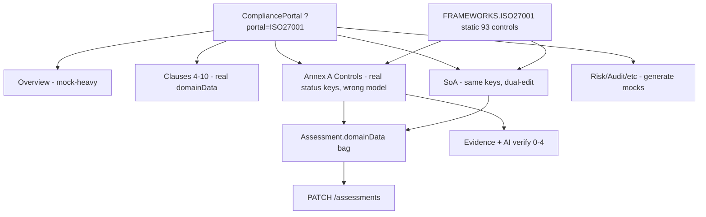
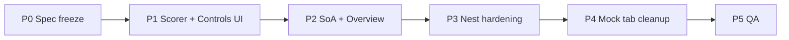

# ISO 27001 Portal & Annex A Controls — Redesign Tasks

**Surface:** Compliance Portal at `/institution/dashboard?portal=ISO27001` (and `?tab=…`)  
**Goal:** Redesign Annex A Controls to the **30% evidence-effectiveness + 70% checklist** scoring model; make Implementation Status **derived** from score bands; establish SoA as the source of applicability/justification; replace mock-heavy secondary tabs with real data or honest empty states.  
**Reference mockup:** Annex A control assessment panel (circular Implementation Status gauge, effectiveness dropdown, editable checklist).  
**Out of scope (this plan):** Full redesign of Clauses 4–10 forms (already structured + persisted); CBN CSAT workbook; new certification report PDF templates beyond SoA export.

---

## 1. Purpose & defaults

| Decision | Choice |
|----------|--------|
| Product surface | ISO27001 portal only (14 sidebar tabs) |
| Assessment binding | Existing `Assessment` row with `frameworkId: ISO27001` |
| Scoring | Pure shared formula (FE first in P1; Nest port in P3); UI displays computed `%` + derived status |
| Persistence (P1–P2) | Extend `Assessment.domainData` JSON keys; no new Prisma SoA/checklist tables until P3 optional |
| SoA ownership | SoA tab is **writer** for `applicable` + `justification`; Controls tab is **read-only** for those fields |
| Legacy statuses | Leave legacy manual `control-status-*` until user opens a control and saves under the new model (no silent rewrite on load) |
| Checklist weight | `70 / n` per item (5 items → **14%** each — not 15%) |
| Catalogue | Seed checklist from `FRAMEWORKS.ISO27001` / DB `Control.questions` on first edit; per-assessment CRUD thereafter |

### 1.1 Locked scoring contract

```
if Not Applicable (from SoA: control-applicable-{dbId} === false):
  score = null
  status = "Not Applicable"
else:
  effectivenessPts =
    Effective         → 30
    Almost Effective  → 15
    Not Effective     → 0
    unset / missing   → 0

  checklistPts = (checkedCount / max(itemCount, 1)) * 70

  implementationScore = round(effectivenessPts + checklistPts)   // 0–100

  status =
    implementationScore >= 90 → "Implemented"
    implementationScore >= 31 → "In Progress"   // persisted with space (see §1.1a)
    else                      → "Not Implemented"
```

**Applicability** (`Applicable` / `Not Applicable`) is separate from **implementation status bands**. Controls assessment shows SoA applicability badges + derived implementation status — not a single 4-way manual picker.

### 1.1a Status string freeze (P0)

| Concern | Decision |
|---------|----------|
| Persisted mid-band value | **`"In Progress"`** (space) — matches existing Controls / SoA / `getDomainScores` |
| Mockup label “In-Progress” | Display-only alias; do not persist hyphen form as canonical |
| Read aliases | Treat `"In-Progress"` and `"In Progress"` as the same mid-band on load |
| New derived writes (P1+) | Always write `"In Progress"` |
| Full persisted enum | `"Implemented"` \| `"In Progress"` \| `"Not Implemented"` \| `"Not Applicable"` |

### 1.2 Worked score examples

**Verified 2026-07-24** — all rows reproduced by `Math.round(effectivenessPts + (checked/n)*70)`:

| Scenario | Effectiveness | Checklist | Score | Derived status |
|----------|---------------|-----------|-------|----------------|
| All done | Effective (30) | 5/5 → 70 | **100** | Implemented |
| One miss | Effective (30) | 4/5 → 56 | **86** | In Progress |
| Evidence only | Effective (30) | 0/5 → 0 | **30** | Not Implemented |
| Almost + half | Almost (15) | 4/8 → 35 | **50** | In Progress |
| Checklist only | unset (0) | 5/5 → 70 | **70** | In Progress |
| Empty / zero | Not Effective (0) | 0/n → 0 | **0** | Not Implemented |
| SoA N/A | — | — | **null** | Not Applicable |
| 5-item weight | — | each item = **14%** of total (70÷5) | — | — |
| 8-item weight | — | each item = **8.75%** of total (70÷8) | — | — |

> Mockup showing **92%** with Effective + all checklist items checked is inconsistent with this contract (that case is **100%**). Treat 92% as illustrative UI chrome, not the formula.  
> Any earlier note that “5 checklist items = 15% each” is **incorrect**; the locked weight is **14%** (70÷5).

### 1.3 New / retained `domainData` keys

Per control DB id `ISO27001-{localId}` (e.g. `ISO27001-A.5.1`):

| Key | Type | Writer | Notes |
|-----|------|--------|-------|
| `control-applicable-{dbId}` | `boolean` | SoA | `false` ⇒ Not Applicable |
| `control-justification-{dbId}` | `string` | SoA | Read-only on Controls |
| `control-notes-{dbId}` | `string` | Controls | Implementation notes |
| `control-effectiveness-{dbId}` | `"Effective" \| "Almost Effective" \| "Not Effective"` | Controls | New — 30% axis |
| `control-checklist-{dbId}` | `{ items: { id, text, checked }[] }` | Controls | New — min 1 item |
| `control-score-{dbId}` | `number \| null` | Derived on save | 0–100 or null if N/A |
| `control-status-{dbId}` | status string | Derived write-through | Keep for SoA/overview compat |

**Legacy migration rule (default):** On first open under the new UI, if `control-checklist-*` is missing, seed from catalogue `questions`. Do **not** auto-convert legacy `"Implemented"` → score 100. Status remains legacy until the user changes effectiveness/checklist and autosave writes derived values. Document this in UI copy if needed (“Re-assess to refresh score”). Full inventory and mapping: **§10**.

---

## 2. Current-state gap analysis

### 2.1 Architecture today



### 2.2 Annex A: spec vs current

| Spec | Current | Gap |
|------|---------|-----|
| Score = 30% evidence effectiveness + 70% checklist | Manual status enum; checklist display-only | Entire formula missing |
| Effectiveness: Effective 30% / Almost Effective 15% / Not Effective 0% | Absent (AI 0–4 → status suggestion) | New input + weight |
| Checklist 70%/n equal split (5 → 14% each) | Static `ctrl.questions`; auto-checked only when status=Implemented | Interactive + weighted |
| Status bands: NI 0–30, In-Progress 31–89, Implemented 90–100 | Manual pills incl. Not Applicable | Status must be **derived** when Applicable |
| Justification read-only from SoA | Editable on Controls **and** SoA | Ownership wrong |
| Add/remove checklist items (min 1) | Fixed seed questions in `frameworks.ts` | Per-assessment CRUD |
| Circular Implementation Status % gauge | No % on control panel | New UI |

### 2.3 Mock vs backend (portal-wide)

| Area | Status | Primary paths |
|------|--------|---------------|
| Assessment session + `domainData` autosave | **Real API** | `assessmentsService` + `CompliancePortal` |
| Annex A status / notes / justification / applicable | Real keys, **wrong semantics** | `controls-tab.tsx`, `soa-tab.tsx` |
| Evidence upload / AI verify | Real; AI prompt CBN-oriented; mock score=3 without key | `ai.service.ts`, assessment store |
| Control catalogue (93 controls, A5–A8) | Dual FE static + DB seed; portal uses FE | `frameworks.ts`, `seed-secondary-frameworks.js` |
| Overview donuts / trends | **Hardcoded fallbacks** (e.g. 71, Dec 2023–May) | `overview-tab.tsx` |
| Risk / Activities / Audits | **`generate*` mocks** | `shared-constants.ts`, `risk-tab.tsx`, `activities-tab.tsx`, `audit-tab.tsx` |
| SoA Export | Button only, **no handler** | `soa-tab.tsx` |
| Backend `compositeScore` | Averages all numeric `domainData` values | `assessments.service.ts` — unreliable for Annex A |
| Dedicated ISO / SoA Nest module | **Does not exist** | Generic framework + assessments |
| Clauses 4–10 | Real structured notes + `ISO27001-CLAUSE-*` | Out of Annex A scoring redesign; consistency follow-ups only |

### 2.4 Tab → current source → target

| Tab ID | Label | Current source | Target |
|--------|-------|----------------|--------|
| `overview` | Overview | Mix assessment + hardcoded 71 / fake trends | Derived from `control-score-*` + clause scores; no fake fallbacks |
| `clause` | Clauses (4–10) | Real `domainData` + rich UIs | Keep; ensure overview aggregation includes clause % |
| `controls` | Annex-A Controls | Manual status; decorative checklist | Redesign per mockup + scoring contract |
| `policies` | ISMS Documentations | Hardcoded templates + evidence API | Keep evidence; later catalogue API (backlog) |
| `risk` | Risk Management | `generateRisks()` | Wire `/risk` API or empty state |
| `soa` | SOA | Shared keys; dual-edit with Controls; Export dead | Sole writer for applicable/justification; Export wired |
| `training` | Awarness / Training | Likely mock / thin | Empty state or real API (P4) |
| `incidents` | Incidents | Mock / thin | P4 |
| `changes` | Changes | Mock / thin | P4 |
| `vendors` | Suppliers/Vendors | Mock | P4 |
| `internal_audit` | Intend Audit | Mock (`generateAudits`) | P4 + typo fix |
| `management_review` | Management Review | Thin / clause-linked | P4 |
| `calendar` | ISMS calendar | Thin | P4 |
| `reports` | Reports | Partial / mock | Prefer derived Annex A + clause scores |

### 2.5 Sidebar copy issues

| Current label | Fix |
|---------------|-----|
| `Awarness / Training` | `Awareness / Training` |
| `Intend Audit` | `Internal Audit` |

---

## 3. Target Annex A UX (from mockup)

Expanded control panel layout (top → bottom):

1. **Header:** Control id + name (e.g. `A.5.1 Policies for Information Security`)
2. **Badges:** SoA applicability (`Applicable` / `Not Applicable`) + derived implementation status (`Implemented` / `In Progress` / `Not Implemented`)
3. **Implementation Status gauge:** Circular % (0–100) when Applicable; legend:
   - Implemented (green): 90–100%
   - In Progress (amber): 31–89%
   - Not Implemented (red): 0–30%
4. **Justification of Applicability:** disabled text field — “Not editable — sourced from the SoA”
5. **Implementation Notes and Evidence:** editable textarea + file attach (existing evidence pipeline)
6. **Evidence Effectiveness (30%):** dropdown — Effective / Almost Effective / Not Effective with weight hint
7. **Assessment Checklist (70%):** interactive checkboxes; add / remove / edit text; **minimum one item**; weight hint `70/n`
8. **AI verify / remediation:** retained as **advisory**; Accept Suggestion maps to effectiveness (or checklist guidance), never bypasses the formula by writing a raw status

List view / theme filters remain (ALL, A.5–A.8, search, sort). Stat cards use **derived** statuses.

---

## 4. Phased tasks (unique IDs + validation criteria)

Prefix: `ISO-P{phase}-{nn}`

### Phase 0 — Spec freeze

| Task ID | Task | Validation criteria | Status |
|---------|------|---------------------|--------|
| **ISO-P0-01** | Freeze scoring contract, band table, and worked examples in this doc (§1.1–§1.2). Correct any “15% per of 5 items” language to **14%** (70÷5). | Examples in §1.2 are reproducible by hand; reviewers sign off that mockup 92% is non-normative. | **Done** — §1.1, §1.1a, §1.2 verified 2026-07-24 |
| **ISO-P0-02** | Inventory current `domainData` keys used by Controls/SoA/Overview + document legacy migration rule (§1.3). | Written mapping of old → new keys; default = no silent rewrite of legacy status on load. | **Done** — §10 |

**Exit gate:** §1 accepted as source of truth; no app code required yet. **Met** — see §§1, 10.

---

### Phase 1 — Annex A scoring engine + UI redesign (priority)

| Task ID | Task | Validation criteria | Status |
|---------|------|---------------------|--------|
| **ISO-P1-01** | Add pure scorer module (e.g. `frontend/lib/iso27001/annex-a-scoring.ts`) + unit tests covering bands, N/A, min-1 checklist, n=5 and n=8 weights. | All §1.2 examples pass as automated tests; `70/5 === 14`, `70/8 === 8.75` for per-item contribution. | **Done** — `lib/iso27001/annex-a-scoring.ts` + `__tests__/annex-a-scoring.test.ts` (13 passing) |
| **ISO-P1-02** | Redesign `controls-tab.tsx` expanded panel per §3 (gauge, effectiveness select, interactive checklist CRUD, read-only SoA justification). | Manual status pills removed for Applicable controls; % and derived status update live; cannot delete last checklist item. | **Done** |
| **ISO-P1-03** | Persist new keys via existing debounced `assessmentsService.update`; write derived `control-status-*` + `control-score-*`. | Hard refresh restores effectiveness, checklist, score, and status for a control. | **Done** |
| **ISO-P1-04** | Seed checklist from `ctrl.questions` on first edit; allow add/remove/edit item text (min 1). | New control starts with catalogue questions; custom items survive reload. | **Done** |
| **ISO-P1-05** | Update list row badges and theme stat cards to use derived statuses + `%` where available; exclude N/A from implementation averages. | Stats match computed bands across filtered themes; N/A not counted as Not Implemented. | **Done** |
| **ISO-P1-06** | Retarget AI “Accept Suggestion” to map AI 0–4 → effectiveness suggestion (document mapping), not manual status overwrite. | Accepting suggestion updates effectiveness (or prompts checklist); status still derived from formula only. | **Done** — `mapAiScoreToEffectiveness` |

**Suggested AI → effectiveness mapping (document in code comments):**

| AI score (0–4) | Suggested effectiveness |
|----------------|-------------------------|
| ≥ 3.5 | Effective |
| ≥ 2.0 | Almost Effective |
| &lt; 2.0 | Not Effective |

**Exit gate:** Assessing A.5.1 end-to-end produces correct % and status; data survives reload. **Met for implementation** — confirm with hard-refresh UAT in P5.

---

### Phase 2 — SoA ownership + Overview consistency

| Task ID | Task | Validation criteria | Status |
|---------|------|---------------------|--------|
| **ISO-P2-01** | SoA remains sole editor of `applicable` + `justification`; Controls shows read-only justification. | Controls input is `disabled` / non-editable; SoA edit appears on Controls after sync/reload. | **Done** |
| **ISO-P2-02** | When SoA marks Not Applicable, Controls forces status N/A and hides/disables scoring inputs (or shows N/A empty state). | N/A control has `control-score-* = null` and status Not Applicable; no requirement to fill checklist. | **Done** |
| **ISO-P2-03** | Update `getDomainScores` in `shared-constants.ts` to prefer `control-score-*` (0–100) over enum→0/2/4 mapping. | Overview domain % reflects Annex A formula averages on a fixture assessment. | **Done** |
| **ISO-P2-04** | Replace Overview hardcoded fallbacks (71, fake Dec 2023–May trends) with assessment-derived stats; empty assessment → zeros / empty state. | Fresh assessment never shows fake 71% or fabricated trend series. | **Done** |
| **ISO-P2-05** | Wire SoA Export (CSV minimum; PDF optional) of control id, name, theme, applicable, justification, derived status, score. | Exported rows match on-screen SoA table for filtered set. | **Done** — CSV |

**Exit gate:** SoA ↔ Controls single source of truth; Overview does not lie when data is empty. **Met for implementation.**

---

### Phase 3 — Backend hardening

| Task ID | Task | Validation criteria | Status |
|---------|------|---------------------|--------|
| **ISO-P3-01** | Port scorer to Nest (helper under `framework` or `iso27001`); validate/recompute on `PATCH /assessments` for ISO Annex A keys. | Server unit tests match FE §1.2 examples; tampered `control-status-*` without matching score is overwritten or rejected. | **Done** — `backend/src/iso27001/` + normalize on update |
| **ISO-P3-02** | Fix assessment `compositeScore` to intentionally average Annex A `control-score-*` + clause `ISO27001-CLAUSE-*` only (exclude junk numeric keys). | Documented formula; composite stable across saves that only touch notes. | **Done** — `computeIso27001CompositeScore` |
| **ISO-P3-03** | ISO-oriented AI verify prompt path when control is Annex A (separate from CBN CSAT persona). | Prompt includes ISO control id/name; mock mode (no API key) still returns deterministic score. | **Done** — `verifyEvidence` options + ISO system prompt |
| **ISO-P3-04** | *(Optional stretch)* Prisma SoA / checklist tables if JSON bag becomes untenable; migrate domainData → tables with API parity. | Migration + API round-trip matches prior domainData shape; FE cutover documented. | **Deferred** — domainData bag remains sufficient for P1–P3 |

**Exit gate:** Server is source of truth for derived score/status; compositeScore is trustworthy. **Met** (P3-04 deferred by design).

---

### Phase 4 — Secondary tabs mock → real (backlog)

| Task ID | Task | Validation criteria | Status |
|---------|------|---------------------|--------|
| **ISO-P4-01** | Risk tab → existing `/risk` API instead of `generateRisks()`. | No `generateRisks` call from risk tab; empty list when institution has no risks. | **Done** — `/risk/register-clause4` + `/risk/all` |
| **ISO-P4-02** | Activities / Internal Audit / calendar / vendors / incidents / changes: replace `generate*` with APIs **or** explicit “coming soon” / empty states (no fake completed metrics). | `rg "generate(Risks|Activities|Audits|TrendData)"` unused by those tabs; empty state copy visible when no data. | **Done** — empty states; generators removed |
| **ISO-P4-03** | Fix sidebar typos: `Awarness` → `Awareness`; `Intend Audit` → `Internal Audit` in `shared-constants.ts` `SIDEBAR_NAV.ISO27001`. | Labels correct in UI; no remaining misspellings in nav. | **Done** |

**Exit gate:** No mock generators driving ISO secondary tabs that imply false completion. **Met.**

---

### Phase 5 — QA / acceptance

| Task ID | Task | Validation criteria | Status |
|---------|------|---------------------|--------|
| **ISO-P5-01** | Manual QA script for control **A.5.1** matching mockup flows + §1.2 score examples (Effective+5/5=100, Effective+4/5=86, N/A, add/remove checklist, SoA justification read-only). | Checklist signed; screenshots or notes attached to PR/issue. | **Done** — script + automated §1.2 in [ISO27001_Phase5_QA_Acceptance.md](./ISO27001_Phase5_QA_Acceptance.md); live UI boxes for human sign-off |
| **ISO-P5-02** | Regression: Clauses tab persistence unaffected; CBN CSAT portal unaffected. | Spot-check clause 5.2 / 6.1 save+reload; open `?portal=CBN_CSAT` workbook still loads. | **Done** — portal wiring intact; `npm run test:csat` 15 PASS; FE/BE Annex suites PASS; manual clause/CSAT smoke in QA script §3 |

**Exit gate:** Annex A redesign accepted; no regressions on Clauses or CSAT. **Met for automated acceptance**; complete manual UAT checkboxes in the Phase 5 QA doc before release sign-off.

---

## 5. Suggested implementation order



Ship value early: **P1 alone** delivers the mockup scoring UX; P2 makes SoA/Overview honest; P3 hardens trust; P4 removes demo noise.

---

## 6. Key file map

| Layer | Path | Role |
|-------|------|------|
| Portal shell | `frontend/components/institution/compliance-portal.tsx` | URL `portal`/`tab` restore, assessment session |
| Nav / mocks / scores | `frontend/components/institution/compliance-portal/shared-constants.ts` | `SIDEBAR_NAV`, `generate*`, `getDomainScores` |
| Annex A UI | `frontend/components/institution/compliance-portal/tabs/controls-tab.tsx` | **Primary redesign target** |
| SoA UI | `frontend/components/institution/compliance-portal/tabs/soa-tab.tsx` | Applicability + justification writer |
| Overview | `frontend/components/institution/compliance-portal/tabs/overview-tab.tsx` | Remove fake metrics |
| Clauses | `frontend/components/institution/compliance-portal/tabs/clause-tab.tsx` (+ `clause-4`…`clause-10`) | Keep; aggregate later |
| Catalogue | `frontend/lib/data/frameworks.ts` | 93 controls + default `questions[]` |
| CSAT scorer (do not reuse for Annex %) | `frontend/lib/scoring.ts` | 0–4 CSAT-style engine |
| New scorer (to add) | `frontend/lib/iso27001/annex-a-scoring.ts` | Pure 30/70 formula |
| Assessments API client | `frontend/services/assessments.ts` | `domainData` PATCH |
| AI client / store | `frontend/services/ai.ts`, `frontend/stores/use-assessment-store.ts` | Evidence verify |
| Assessments BE | `backend/src/assessments/assessments.service.ts` | Persist + compositeScore fix |
| AI BE | `backend/src/ai/ai.service.ts` | ISO prompt path |
| Framework BE | `backend/src/framework/framework.service.ts` | Optional calculate / scorer host |
| Seed | `backend/prisma/seed-secondary-frameworks.js`, `seed-all-frameworks.ts` | Catalogue mirror |

---

## 7. Non-goals

- Redesigning every Clause 4–10 form field
- Replacing the generic Evidence / AI upload pipeline wholesale
- Building a separate SoA approval workflow / versioning product in P1–P2
- Changing CBN CSAT workbook behavior
- Making mockup typos (“Effrective”) part of product copy — use correct spelling **Effective**

---

## 8. Status legend

| Status | Meaning |
|--------|---------|
| **Pending** | Not started |
| **In progress** | Actively being implemented |
| **Done** | Validation criteria met |
| **Blocked** | Waiting on decision or dependency |

Update the Status column in §4 as work completes. Phase exit gates must be met before treating the phase as closed.

---

## 9. Quick reference — task ID index

| ID | Phase | One-line |
|----|-------|----------|
| ISO-P0-01 | 0 | Freeze scoring contract + examples | **Done** |
| ISO-P0-02 | 0 | Inventory keys + legacy migration rule | **Done** |
| ISO-P1-01 | 1 | Pure scorer + unit tests | **Done** |
| ISO-P1-02 | 1 | Controls expanded panel redesign | **Done** |
| ISO-P1-03 | 1 | Persist effectiveness / checklist / score | **Done** |
| ISO-P1-04 | 1 | Seed + CRUD checklist (min 1) | **Done** |
| ISO-P1-05 | 1 | List/stats from derived status | **Done** |
| ISO-P1-06 | 1 | AI suggestion → effectiveness mapping | **Done** |
| ISO-P2-01 | 2 | SoA-only justification writer | **Done** |
| ISO-P2-02 | 2 | N/A forces null score | **Done** |
| ISO-P2-03 | 2 | `getDomainScores` uses `control-score-*` | **Done** |
| ISO-P2-04 | 2 | Overview: no fake 71% / trends | **Done** |
| ISO-P2-05 | 2 | SoA Export | **Done** |
| ISO-P3-01 | 3 | Nest scorer + validate on PATCH | **Done** |
| ISO-P3-02 | 3 | Fix compositeScore | **Done** |
| ISO-P3-03 | 3 | ISO AI verify prompt | **Done** |
| ISO-P3-04 | 3 | Optional Prisma SoA tables | **Deferred** |
| ISO-P4-01 | 4 | Risk tab → `/risk` | **Done** |
| ISO-P4-02 | 4 | Kill secondary `generate*` fakes | **Done** |
| ISO-P4-03 | 4 | Sidebar typo fixes | **Done** |
| ISO-P5-01 | 5 | A.5.1 manual QA script | **Done** |
| ISO-P5-02 | 5 | Clauses + CSAT regression | **Done** |

**Total tasks:** 22 (`ISO-P0-01` … `ISO-P5-02`).  
**Phase 0 complete:** 2 / 2.  
**Phase 1 complete:** 6 / 6.  
**Phase 2 complete:** 5 / 5.  
**Phase 3 complete:** 3 / 4 (**P3-04 Deferred**).  
**Phase 4 complete:** 3 / 3.  
**Phase 5 complete:** 2 / 2.

---

## 10. Phase 0 appendix — `domainData` inventory & migration (ISO-P0-02)

### 10.1 Annex A / SoA keys (today)

`dbId` = `{frameworkId}-{localId}` e.g. `ISO27001-A.5.1`.

| Key pattern | Type today | Readers | Writers today | P1+ fate |
|-------------|------------|---------|---------------|----------|
| `control-status-{dbId}` | string enum (manual) | Controls, SoA, `getDomainScores` | Controls + SoA (dual) | **Derived write-through** from formula when re-assessed; keep reading legacy until then |
| `control-applicable-{dbId}` | boolean (`!== false` ⇒ applicable) | Controls, SoA, `getDomainScores` | Controls + SoA | **SoA-only writer**; Controls read-only |
| `control-justification-{dbId}` | string | Controls, SoA | Controls + SoA | **SoA-only writer**; Controls read-only |
| `control-notes-{dbId}` | string | Controls, assessment store, legacy assessment page | Controls | Unchanged — Controls writer |

### 10.2 Keys to add (P1)

| Key pattern | Type | Writer | Notes |
|-------------|------|--------|-------|
| `control-effectiveness-{dbId}` | `"Effective" \| "Almost Effective" \| "Not Effective"` | Controls | Missing ⇒ 0 pts |
| `control-checklist-{dbId}` | `{ items: { id: string, text: string, checked: boolean }[] }` | Controls | Min 1 item; seed from catalogue `questions` on first open |
| `control-score-{dbId}` | `number` (0–100) or `null` | Derived on Controls save | `null` when Not Applicable |

### 10.3 Clause / other ISO keys (do not rewrite in Annex A P1)

| Key pattern | Type | Notes |
|-------------|------|-------|
| `ISO27001-CLAUSE-{num}` | number 0–100 | Clause progress % (e.g. `5.2`, `7.1`, `6.1.2`) |
| `control-notes-ISO27001-CLAUSE-*` | string | Sometimes used for clause notes / improvement (e.g. 10.1) |
| Evidence store keys (not domainData) | files + notes by control/clause id | Separate from Annex A formula |
| `ISO27001-CLAUSE-9.2.1-SLOT-…` | evidence slot ids | Clause 9 audit programme uploads |
| `ISO27001-CLAUSE-10.1-ITEM-…` / `10.2-ITEM-…` | evidence item ids | Clause 10 improvement / NC |

These remain out of scope for Annex A scoring; P3 `compositeScore` must **select** clause `%` keys + `control-score-*` intentionally (today it averages every number in the JSON bag).

### 10.4 Legacy status → new model mapping

| Existing `control-status-*` | `control-score-*` present? | Behaviour on Controls load (P1) | Behaviour on first user save under new model |
|-----------------------------|----------------------------|----------------------------------|-----------------------------------------------|
| `"Implemented"` / `"In Progress"` / `"Not Implemented"` | No | Show legacy status badge; seed checklist from catalogue (unchecked); effectiveness unset; **no silent score rewrite** | Compute score; overwrite status with derived value; write `control-score-*` |
| `"Not Applicable"` or `applicable === false` | — | Treat as N/A; hide scoring inputs | Keep `score = null`, status `"Not Applicable"` |
| Any + `control-score-*` already set | Yes | Prefer score + derived status; restore effectiveness + checklist from keys | Normal recompute |
| `"In-Progress"` (hyphen, if any) | — | Alias → mid-band `"In Progress"` on read | Write canonical `"In Progress"` |

**Explicit non-migration (locked):**

- Do **not** map legacy `"Implemented"` → `{ effectiveness: Effective, all checklist checked, score: 100 }` on load.
- Do **not** map legacy `"In Progress"` → score 50 or 2/4.
- Optional UI hint when legacy-only: “Re-assess to refresh score” once effectiveness/checklist UI is shown.

### 10.5 Consumers that must tolerate both eras (P1–P2)

| Consumer | Today | Required after P1 |
|----------|-------|-------------------|
| `controls-tab.tsx` | Manual status | Derived when score keys exist; else legacy |
| `soa-tab.tsx` | Editable status dropdown | Show derived status read-only for Applicable (P2); still may show legacy until re-assess |
| `getDomainScores` | Enum → 0/2/4 | Prefer `control-score-*` (0–100) when present (P2-03) |
| `AssessmentsService.update` compositeScore | Averages all numbers | Ignore until P3-02; new `control-score-*` numbers will currently pollute composite — acceptable short-term; fix in P3 |

### 10.6 Checklist seed shape (freeze)

```ts
// Seeded when control-checklist-{dbId} is absent and user opens control
{
  items: ctrl.questions.map((text, i) => ({
    id: `q-${i}`,          // stable within seed; new items get uuid/nanoid
    text,
    checked: false,        // never auto-check from legacy Implemented
  }))
}
```

If catalogue `questions` is empty, seed a single placeholder item `"Confirm control implementation"` (ensures min 1).

### 10.7 Phase 0 sign-off checklist

- [x] Scoring formula frozen (§1.1)
- [x] Status string canonical = `"In Progress"` (§1.1a)
- [x] Worked examples verified (100 / 86 / 30 / 50 / 70 / 0; 14% and 8.75% weights) (§1.2)
- [x] Mockup 92% marked non-normative
- [x] “15% per of 5 items” rejected → **14%**
- [x] Existing Annex A keys inventoried (§10.1)
- [x] New keys named (§10.2)
- [x] Legacy no-silent-rewrite rule locked (§10.4)
- [x] Clause keys listed as non-interference (§10.3)

**Phase 0 exit gate: Met.** Ready for Phase 1 (scorer + Controls UI).

---

## 11. Phase 5 acceptance evidence (2026-07-24)

Full checklist: [ISO27001_Phase5_QA_Acceptance.md](./ISO27001_Phase5_QA_Acceptance.md)

| Suite | Result |
|-------|--------|
| FE `annex-a-scoring` | 13 passed |
| BE `test:iso27001` | 15 passed |
| BE `test:csat` | 15 passed |
| Portal mock generators | removed |
| Sidebar typos | fixed |

Human tester should complete §2–§3 checkboxes in the QA doc before production release.