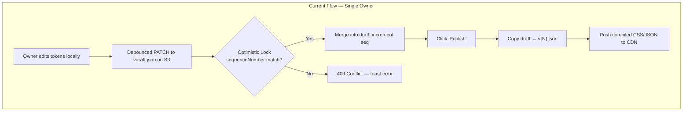
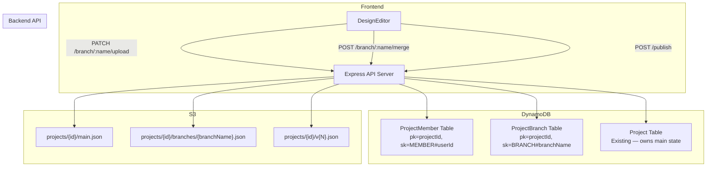
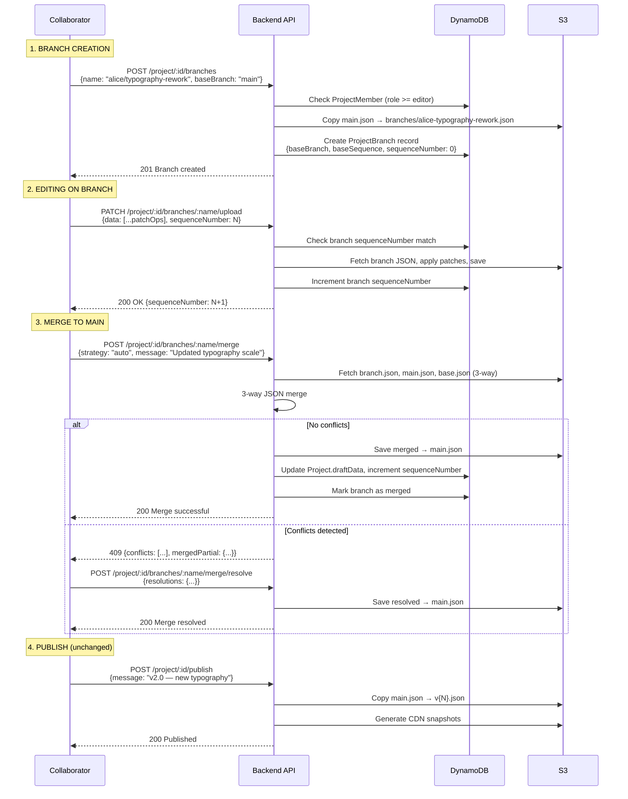
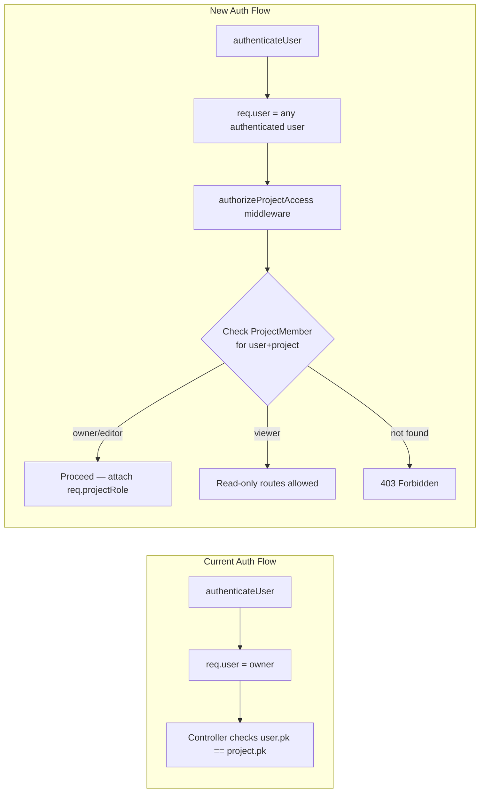
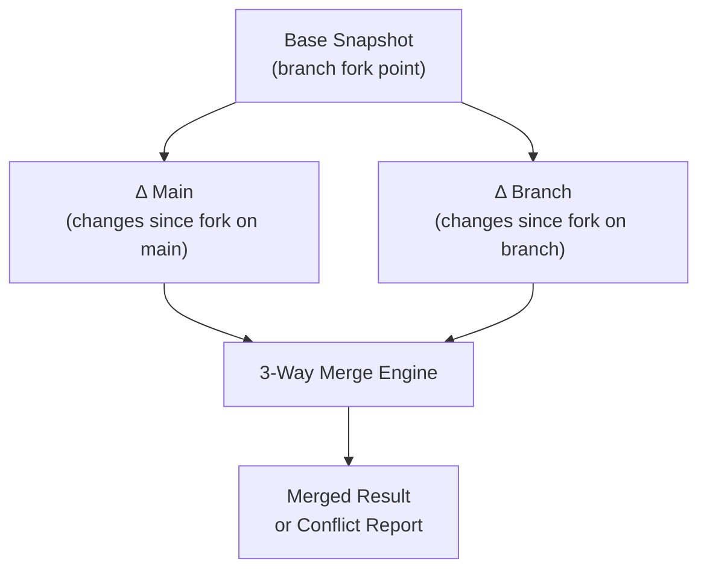
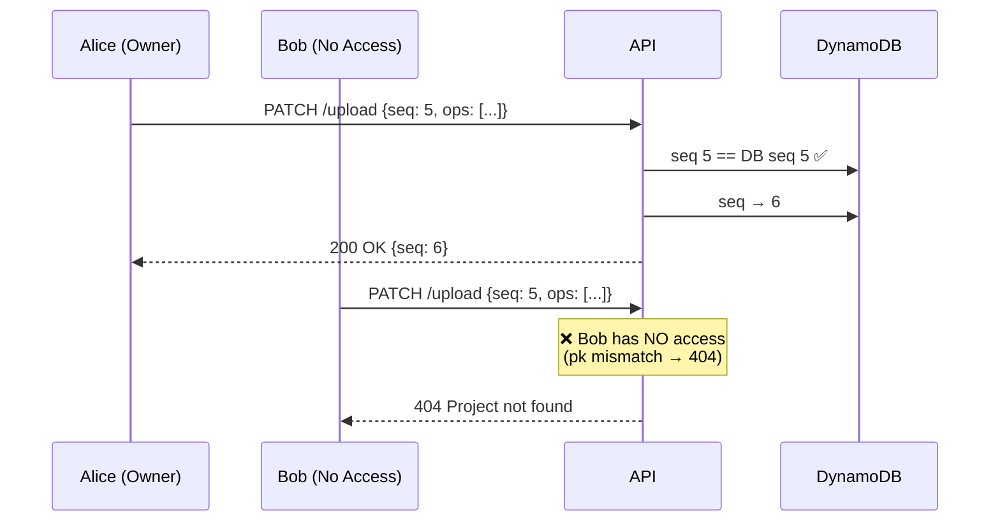
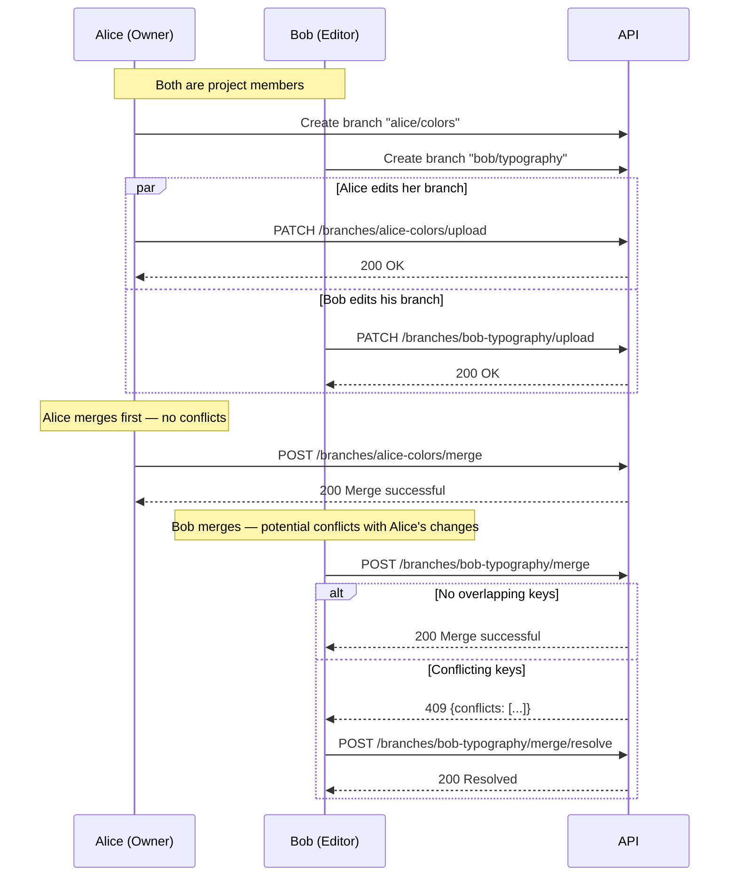

# Collaborative Branching & Multi-User VCS — Architecture Document

> **Version:** 1.0  
> **Date:** 2026-07-13  
> **Scope:** Extend the existing Git-like VCS (single-owner draft→publish) into a multi-user collaborative system with per-collaborator branches, merge/conflict resolution, and role-based access.

---

## 1. Current State Analysis

### 1.1 Current Architecture (Single-Owner Model)



#### Current Data Model (DynamoDB Project Schema)

| Field | Type | Description |
|-------|------|-------------|
| `pk` | String | Owner user key (hashKey) |
| `sk` | String | `PROJECT#<uuid>#<timestamp>` (rangeKey) |
| `draftData` | Object | `{ s3Key, hash, updatedAt }` — single mutable draft |
| `projectData` | Object | `{ [versionNumber]: { s3Key, hash, message, updatedAt } }` — published snapshots |
| `sequenceNumber` | Number | Optimistic locking counter for the single draft |
| `versions` | Number | Published version counter |
| `defaultVersion` | Number | Active published version |

#### Key Issues Identified

1. **Single-owner assumption:** `pk` is the owner's user key. All queries (`Project.query("pk").eq(user.pk)`) enforce ownership. No mechanism for a second user to access the project.
2. **Single draft per project:** Only one `draftData` entry exists. Two users editing simultaneously would overwrite each other's draft, or the optimistic lock would perpetually conflict.
3. **Sequence number is global:** The `sequenceNumber` is a single counter on the project record. With multiple collaborators, every edit by any user increments the same counter, causing cascading 409s for everyone else.
4. **No user identity on changes:** Draft updates don't record *who* made the change. `publishProjectVersion` doesn't attach the publishing user's identity.

---

## 2. Target Architecture — Collaborative Branching Model

### 2.1 Design Philosophy

We model this after Git's branching model adapted for a design-system-as-data paradigm:

- **`main`** is the canonical published state (replaces `vdraft.json` → publish flow)
- Each collaborator works on a **named branch** (personal or feature-scoped)
- Branches are lightweight: they're S3 keys + a DynamoDB record
- **Merge** is a JSON-level 3-way merge of design tokens/components
- **Publish** promotes `main` to a versioned CDN snapshot (unchanged from current)

### 2.2 High-Level Architecture



### 2.3 Core Data Flow



---

## 3. Data Model Design

### 3.1 New DynamoDB Table: `ProjectMember`

Manages project membership and role-based access control.

```
Table: ProjectMember (or use single-table design on existing project table)
PK: projectId (String)
SK: MEMBER#<userId> (String)
```

| Field | Type | Description |
|-------|------|-------------|
| `projectId` | String | Project identifier |
| `userId` | String | The user's `pk` from the User table |
| `email` | String | Denormalized for display/invite lookup |
| `role` | String | `owner`, `editor`, `viewer` |
| `status` | String | `pending`, `active`, `revoked` |
| `invitedBy` | String | userId of the inviter |
| `invitedAt` | String (ISO) | Invitation timestamp |
| `acceptedAt` | String (ISO) | Acceptance timestamp (null if pending) |
| `lastActiveAt` | String (ISO) | Last edit timestamp |

**GSI: `UserProjectsIndex`**  
- PK: `userId`  
- SK: `projectId`  
- Purpose: List all projects a user is a member of

**GSI: `InviteEmailIndex`**  
- PK: `email`  
- SK: `projectId`  
- Purpose: Look up pending invites by email on signup/login

### 3.2 New DynamoDB Table: `ProjectBranch`

Tracks branch metadata. The actual data lives in S3.

```
Table: ProjectBranch (or single-table with SK prefix BRANCH#)
PK: projectId (String)
SK: BRANCH#<branchName> (String)
```

| Field | Type | Description |
|-------|------|-------------|
| `projectId` | String | Project identifier |
| `branchName` | String | URL-safe branch name (e.g., `alice/typography-rework`) |
| `createdBy` | String | userId who created the branch |
| `baseBranch` | String | Branch this was forked from (usually `main`) |
| `baseSequence` | Number | sequenceNumber of baseBranch at fork time (for 3-way merge base) |
| `baseS3Key` | String | S3 key of the base snapshot at fork time |
| `s3Key` | String | Current S3 key for this branch's data |
| `hash` | String | Content hash of current branch data |
| `sequenceNumber` | Number | Per-branch optimistic locking counter |
| `status` | String | `active`, `merged`, `closed`, `stale` |
| `mergedAt` | String (ISO) | Timestamp when merged |
| `mergedBy` | String | userId who performed the merge |
| `mergeMessage` | String | Merge commit message |
| `createdAt` | String (ISO) | Branch creation timestamp |
| `updatedAt` | String (ISO) | Last update timestamp |

### 3.3 Changes to Existing `Project` Table

| Field | Change | Description |
|-------|--------|-------------|
| `draftData` | **Rename conceptually to `mainData`** | Now represents the `main` branch state |
| `sequenceNumber` | **Scoped to `main`** | Tracks changes to main only |
| `collaborationEnabled` | **New** | Boolean flag to enable multi-user mode |
| `ownerUserId` | **New** | Denormalized owner userId for quick access checks |

### 3.4 S3 Key Structure

```
projects/
  {projectId}/
    main.json                           ← The "main" branch (was vdraft.json)
    branches/
      {branchName}.json                 ← Active branch data
      {branchName}.base.json            ← Snapshot of base at fork time (for 3-way merge)
    v1.json                             ← Published version 1
    v2.json                             ← Published version 2
    ...
```

---

## 4. Authentication & Authorization Architecture

### 4.1 Middleware Changes



### 4.2 New Middleware: `authorizeProjectAccess`

```javascript
// pseudocode
async function authorizeProjectAccess(requiredRole = 'viewer') {
  return async (req, res, next) => {
    const projectId = req.params.queryId || req.params.projectId;
    const userId = req.user.pk;
    
    // 1. Check if user is the owner (legacy pk-based check)
    // 2. If not owner, query ProjectMember table
    // 3. Compare member.role against requiredRole hierarchy
    // 4. Attach req.projectRole = role
    // 5. Attach req.projectRecord = project (to avoid re-querying)
  };
}
```

### 4.3 Role Hierarchy

| Role | Permissions |
|------|------------|
| `owner` | All operations: invite/remove members, publish, delete project, merge to main |
| `editor` | Create/edit branches, merge to main (with owner approval optionally), edit tokens |
| `viewer` | Read-only: view tokens, view diffs, view branches |

---

## 5. API Design

### 5.1 New Endpoints

#### Collaborator Management

| Method | Path | Auth | Description |
|--------|------|------|-------------|
| POST | `/project/:id/members` | owner | Invite a collaborator |
| GET | `/project/:id/members` | any member | List project members |
| PATCH | `/project/:id/members/:userId` | owner | Update member role |
| DELETE | `/project/:id/members/:userId` | owner | Remove a collaborator |
| POST | `/project/:id/members/accept` | invitee | Accept an invitation |

#### Branch Management

| Method | Path | Auth | Description |
|--------|------|------|-------------|
| POST | `/project/:id/branches` | editor+ | Create a branch |
| GET | `/project/:id/branches` | viewer+ | List branches |
| GET | `/project/:id/branches/:name` | viewer+ | Get branch details + data |
| PATCH | `/project/:id/branches/:name/upload` | editor+ (branch owner) | Push patch ops to branch |
| DELETE | `/project/:id/branches/:name` | editor+ (branch owner) / owner | Delete/close a branch |
| GET | `/project/:id/branches/:name/diff` | viewer+ | Diff branch vs main |
| POST | `/project/:id/branches/:name/merge` | editor+ | Merge branch into main |
| POST | `/project/:id/branches/:name/merge/resolve` | editor+ | Submit conflict resolutions |
| POST | `/project/:id/branches/:name/rebase` | editor+ | Rebase branch onto latest main |

### 5.2 Modified Endpoints

| Method | Path | Change |
|--------|------|--------|
| GET | `/project/:id` | Add `authorizeProjectAccess('viewer')` middleware |
| PATCH | `/project/:id/upload` | Route to main branch edit; require `editor+` |
| POST | `/project/:id/publish` | Require `owner` role |
| GET | `/project/:id/diff` | Add project access check |

---

## 6. 3-Way Merge Engine

### 6.1 Strategy

Design system data is a JSON document with two top-level collections: `variables` and `components`. We implement a **key-level 3-way merge** algorithm:



### 6.2 Merge Rules

For each key in `variables` and `components`:

| Base | Main | Branch | Result |
|------|------|--------|--------|
| A | A | A | A (no change) |
| A | A | B | B (branch wins — only branch changed) |
| A | B | A | B (main wins — only main changed) |
| A | B | B | B (both agree on same change) |
| A | B | C | **CONFLICT** (both changed differently) |
| ∅ | ∅ | A | A (branch added) |
| ∅ | A | ∅ | A (main added) |
| ∅ | A | B | **CONFLICT** (both added same key differently) |
| A | ∅ | ∅ | ∅ (both deleted — agree) |
| A | ∅ | A | ∅ (main deleted, branch didn't change — main wins) |
| A | A | ∅ | ∅ (branch deleted, main didn't change — branch wins) |
| A | ∅ | B | **CONFLICT** (main deleted, branch modified) |
| A | B | ∅ | **CONFLICT** (branch deleted, main modified) |

### 6.3 Conflict Representation

```json
{
  "conflicts": [
    {
      "path": "/variables/--color-primary",
      "type": "BOTH_MODIFIED",
      "base": { "value": "#000" },
      "main": { "value": "#111" },
      "branch": { "value": "#222" },
      "autoResolution": null
    },
    {
      "path": "/components/Button/children/primary/properties/padding",
      "type": "DELETE_MODIFY",
      "base": { "value": "16px" },
      "main": null,
      "branch": { "value": "24px" },
      "autoResolution": null
    }
  ],
  "mergedPartial": {
    "variables": { /* non-conflicting merged result */ },
    "components": { /* non-conflicting merged result */ }
  }
}
```

---

## 7. Frontend Architecture Changes

### 7.1 State Management Updates

```mermaid
graph TD
    subgraph "Updated DesignSystemState"
        S1[data: DesignSystemData]
        S2[past/future: Undo/Redo stacks]
        S3[currentBranch: string]
        S4[branches: BranchInfo array]
        S5[projectMembers: Member array]
        S6["userRole: 'owner' &#124; 'editor' &#124; 'viewer'"]
        S7[mergeConflicts: ConflictInfo array or null]
    end
```



### 7.2 New UI Components

```
components/
  collaboration/
    MemberManagement.tsx         ← Invite/manage collaborators modal
    BranchSelector.tsx           ← Dropdown to switch branches
    BranchCreateDialog.tsx       ← Create new branch dialog
    MergeDiffView.tsx            ← Preview merge diff before confirming
    ConflictResolutionPanel.tsx  ← Side-by-side conflict resolver
    MergeConfirmDialog.tsx       ← Merge confirmation with message
```

### 7.3 Updated Project Service

New methods on `ProjectService`:

```typescript
// Collaborator management
inviteMember(projectId, email, role): Promise<boolean>
listMembers(projectId): Promise<Member[]>
updateMemberRole(projectId, userId, role): Promise<boolean>
removeMember(projectId, userId): Promise<boolean>
acceptInvitation(projectId): Promise<boolean>

// Branch management
createBranch(projectId, name, baseBranch?): Promise<Branch>
listBranches(projectId): Promise<Branch[]>
switchBranch(projectId, branchName): Promise<void>
deleteBranch(projectId, branchName): Promise<boolean>
getBranchDiff(projectId, branchName): Promise<DiffResult>
mergeBranch(projectId, branchName, message): Promise<MergeResult>
resolveConflicts(projectId, branchName, resolutions): Promise<boolean>
rebaseBranch(projectId, branchName): Promise<boolean>
```

### 7.4 BFF (Next.js) API Route Updates

New proxy routes needed:

```
app/api/project/[id]/members/route.ts          ← GET, POST
app/api/project/[id]/members/[userId]/route.ts  ← PATCH, DELETE
app/api/project/[id]/members/accept/route.ts    ← POST
app/api/project/[id]/branches/route.ts          ← GET, POST
app/api/project/[id]/branches/[name]/route.ts   ← GET, DELETE
app/api/project/[id]/branches/[name]/upload/route.ts  ← PATCH
app/api/project/[id]/branches/[name]/diff/route.ts    ← GET
app/api/project/[id]/branches/[name]/merge/route.ts   ← POST
app/api/project/[id]/branches/[name]/merge/resolve/route.ts ← POST
```

---

## 8. Migration Strategy

### 8.1 Backward Compatibility

The migration is **non-breaking** and **opt-in**:

1. Existing projects continue with the single-owner draft→publish flow
2. The owner's draft (`vdraft.json`) is renamed to `main.json` only when collaboration is enabled
3. The `sequenceNumber` on the Project record now tracks `main` branch changes
4. A project can be upgraded to collaborative mode via a settings toggle

### 8.2 Migration Steps

1. **Deploy new tables** (ProjectMember, ProjectBranch) — no data migration needed
2. **Deploy `authorizeProjectAccess` middleware** — defaults to legacy `pk`-based ownership if no ProjectMember record exists
3. **Enable collaboration flag** per project — owner opt-in
4. **Auto-create ProjectMember record** for the owner with `role: owner`
5. **Rename `draftData.s3Key`** from `vdraft.json` to `main.json` on first collaborative edit

---

## 9. Deployment Architecture

### 9.1 Infrastructure Changes (CDK)

| Resource | Change |
|----------|--------|
| DynamoDB | Add `ProjectMember` and `ProjectBranch` tables (or SK prefixes on existing table) |
| S3 | No changes — new key prefixes are within existing bucket |
| API Gateway / ALB | No changes — new routes served by same Express server |
| CloudFront | No changes — CDN publishes from `snapshots/` path only |
| Lambda (optional) | Consider async merge worker for large projects |

### 9.2 Single-Table vs Multi-Table Decision

> **Recommendation: Single-Table Design** on the existing Project DynamoDB table.

Members: `PK=projectId, SK=MEMBER#userId`  
Branches: `PK=projectId, SK=BRANCH#branchName`  
Project: `PK=ownerPk, SK=PROJECT#uuid#ts` (existing)

This requires a new GSI on the Project table: `ProjectIdMemberIndex` (PK=`projectId`, SK=`sk`) to query members and branches by projectId.

Alternatively, since the existing Project table uses `pk=ownerPk` as the partition key and projectId is a GSI attribute, separate tables may be cleaner to avoid hot partition issues. **Final decision should be based on expected write volume.**

---

## 10. Security Considerations

| Concern | Mitigation |
|---------|-----------|
| Unauthorized branch creation | `authorizeProjectAccess('editor')` middleware on all write endpoints |
| Branch data isolation | S3 keys scoped to projectId; branch names are sanitized |
| Force-publish by editors | Publish restricted to `owner` role |
| Invitation spam | Rate-limit invitations per project; max 20 members per project |
| Data leakage | ProjectMember query ensures only members see project data |
| Orphaned branch data | Background job to clean up S3 keys for deleted/closed branches after 30 days |
| Webhook abuse | Webhooks continue to fire only on publish (owner action) |

---

## 11. Performance Considerations

| Concern | Strategy |
|---------|----------|
| Large merge operations | Stream S3 objects; use worker/queue for >1MB documents |
| Branch list queries | DynamoDB query by `PK=projectId, SK begins_with BRANCH#` — efficient |
| Member list queries | DynamoDB query by `PK=projectId, SK begins_with MEMBER#` — efficient |
| Concurrent edits to same branch | Per-branch `sequenceNumber` prevents lost updates |
| Stale branches | Auto-mark as `stale` after 30 days of inactivity; prompt cleanup |

---

## 12. Sequence Diagrams — Conflict Resolution

### 12.1 Two Users Editing Simultaneously (Current System — Broken)



**Problem:** Currently there's no way for Bob to contribute.

### 12.2 Two Users Editing (New System — Branching)



---

## Appendix A: Glossary

| Term | Definition |
|------|-----------|
| **main** | The canonical working copy of the design system (was `vdraft.json`) |
| **branch** | A named fork of main where a collaborator can make isolated changes |
| **merge** | Combining a branch's changes back into main |
| **3-way merge** | Comparing base (fork point), main (current), and branch to detect conflicts |
| **publish** | Promoting main to a versioned CDN snapshot |
| **ProjectMember** | DynamoDB record linking a user to a project with a role |
| **ProjectBranch** | DynamoDB record tracking a branch's metadata |
| **sequenceNumber** | Per-branch optimistic locking counter to prevent lost updates |
