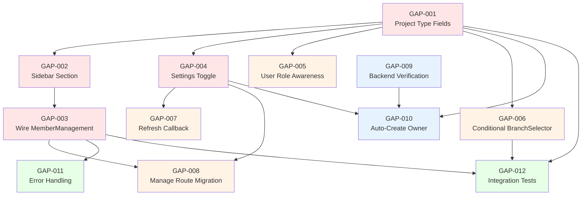

# Collaboration Gap Analysis — What Needs to Be Done

> **Date:** 2026-07-20
> **Scope:** Align the existing collaboration plan (plan.md TASK-001 → TASK-026) with the actual codebase state, and enumerate every remaining task needed to make collaboration fully functional from `/project/[id]`.
> **Context:** The project is migrating from `/project/[id]/manage` → `/project/[id]`. Collaboration features (enable collaboration, add collaborators, branch management) are currently **non-functional** despite UI components existing.

---

## Current State Summary

### What EXISTS (files present in codebase)

| Area | Files Present | Status |
|------|--------------|--------|
| **TypeScript Types** | `util/project.ts` — `Member`, `Branch`, `DiffResult`, `ConflictInfo`, `MergeResult` | ✅ Types defined |
| **Frontend Service Methods** | `project.service.ts` — `inviteMember`, `listMembers`, `updateMemberRole`, `removeMember`, `acceptInvitation`, `createBranch`, `listBranches`, `getBranchData`, `deleteBranch`, `getBranchDiff`, `mergeBranch`, `resolveConflicts`, `rebaseBranch` | ✅ Methods exist |
| **BFF Proxy Routes** | `app/api/project/[id]/members/route.ts`, `app/api/project/[id]/members/[userId]/`, `app/api/project/[id]/members/accept/`, `app/api/project/[id]/branches/route.ts`, `app/api/project/[id]/branches/[branchName]/` | ✅ Routes exist |
| **Collaboration UI Components** | `components/collaboration/BranchSelector.tsx`, `BranchCreateDialog.tsx`, `MemberManagement.tsx`, `MemberList.tsx`, `InviteMemberDialog.tsx`, `MergeConfirmDialog.tsx`, `MergeDiffView.tsx`, `ConflictResolutionPanel.tsx` | ✅ Files exist |
| **Context Branch Awareness** | `DesignSystemContext.tsx` — `currentBranch`, `SET_CURRENT_BRANCH`, `setCurrentBranch`, `mergeBranch`, `resolveConflicts`, branch-aware `syncWithProjectData`, branch-aware `uploadToServer` | ✅ State & methods exist |
| **ProjectTopBar Integration** | `BranchSelector` rendered, `MergeConfirmDialog` + `ConflictResolutionPanel` wired | ✅ Wired up |
| **Tests** | `__tests__/branch-selector.test.tsx`, `__tests__/merge-diff-view.test.tsx` | ✅ Basic tests exist |

### What's BROKEN / MISSING (the actual gaps)

| # | Gap | Severity |
|---|-----|----------|
| 1 | **No `collaborationEnabled` field on `Project` type** — The `Project` interface in `util/project.ts` has no `collaborationEnabled`, `ownerUserId`, or `maxMembers` fields. There's no way to toggle collaboration on/off from the UI. | 🔴 Critical |
| 2 | **No "Enable Collaboration" toggle in settings** — Neither `ProjectSettingsSection` (in `/project/[id]`) nor `Settings.tsx` (in `/project/[id]/manage`) have any collaboration toggle, member management, or collaboration UI. | 🔴 Critical |
| 3 | **`MemberManagement` component is orphaned** — `MemberManagement.tsx` exists but is **never imported or rendered** anywhere. No page or section uses it. | 🔴 Critical |
| 4 | **No collaborator section in the sidebar** — `ProjectSidebar.tsx` defines sections: `brand-bible`, `handoff`, `tokens`, `components`, `settings`. There is no `collaborators` or `team` section. | 🔴 Critical |
| 5 | **`ProjectSettingsSection` has no collaboration features** — It only handles project name, visibility, webhook URL, and delete. No collaboration enable, no member list, no invite. | 🔴 Critical |
| 6 | **`Project` type missing `collaborationEnabled` in `ProjectUpdateRequest`** — Can't PATCH to enable collaboration. | 🔴 Critical |
| 7 | **`BranchSelector` shows for ALL projects** — Even non-collaborative projects show the branch selector in the top bar. There's no conditional check for `collaborationEnabled`. | 🟡 Medium |
| 8 | **No user role awareness in UI** — `ProjectDetailsScreen` hard-codes `isOwner` based on whether `getProject()` returns data. There's no `userRole` state from membership context. Viewers should not see edit controls. | 🟡 Medium |
| 9 | **`/project/[id]/manage` route still exists** — The old manage page (`Settings.tsx` / `DesignEditor.tsx`) still has its own route. The migration to consolidate everything under `/project/[id]` is incomplete. | 🟡 Medium |
| 10 | **Backend status unknown** — Cannot verify if backend models (`ProjectMember`, `ProjectBranch`), controllers, and middleware exist. Frontend calls may 404. | 🟠 Unknown |

---

## Tasks — What Needs to Be Done

### GAP-001: Add `collaborationEnabled` and Related Fields to `Project` Type

**Priority:** Critical
**Severity:** Blocker — prevents all collaboration features from working
**Dependencies:** None

**Description:**
The `Project` interface in [project.ts](file:///Users/oluwatobiloba/Desktop/charisol/design_system/charisol-design-system-fe/util/project.ts#L93-L125) is missing the collaboration-related fields that the backend is expected to support.

**Files to Modify:**
- [MODIFY] [project.ts](file:///Users/oluwatobiloba/Desktop/charisol/design_system/charisol-design-system-fe/util/project.ts)

**Changes Required:**
```typescript
// Add to Project interface (after line 124):
collaborationEnabled?: boolean;
ownerUserId?: string;
maxMembers?: number;

// Add to ProjectUpdateRequest interface (after line 192):
collaborationEnabled?: boolean;
```

**Validation Criteria:**
- [ ] `Project` interface includes `collaborationEnabled?: boolean`, `ownerUserId?: string`, `maxMembers?: number`
- [ ] `ProjectUpdateRequest` interface includes `collaborationEnabled?: boolean`
- [ ] TypeScript compilation passes with no new errors
- [ ] Existing code that uses `Project` type is unaffected (all fields are optional)

---

### GAP-002: Add "Collaboration" Section to Project Sidebar

**Priority:** Critical
**Severity:** Blocker — no way to navigate to collaboration features
**Dependencies:** GAP-001

**Description:**
[ProjectSidebar.tsx](file:///Users/oluwatobiloba/Desktop/charisol/design_system/charisol-design-system-fe/components/sections/project/ProjectSidebar.tsx) defines `ProjectSection` type and `NAV_ITEMS` array. Neither includes a collaborators/team section. Need to add a "Team" or "Collaborators" section that appears **only when `collaborationEnabled` is true**.

**Files to Modify:**
- [MODIFY] [ProjectSidebar.tsx](file:///Users/oluwatobiloba/Desktop/charisol/design_system/charisol-design-system-fe/components/sections/project/ProjectSidebar.tsx)

**Changes Required:**
1. Extend `ProjectSection` type to include `"collaborators"`
2. Add a "Team" nav item to `NAV_ITEMS` (with Users icon)
3. Accept a `collaborationEnabled` prop to conditionally show the section
4. The section should appear between "components" and "settings" in the nav

**Validation Criteria:**
- [ ] `ProjectSection` type union includes `"collaborators"`
- [ ] NAV_ITEMS includes a "Team" entry with `id: "collaborators"`
- [ ] When `collaborationEnabled` is falsy, the "Team" nav item does NOT appear
- [ ] When `collaborationEnabled` is true, the "Team" nav item appears with a Users icon
- [ ] Clicking "Team" sets active section to `"collaborators"`
- [ ] No regression in existing sidebar navigation

---

### GAP-003: Integrate `MemberManagement` into `ProjectDetailsScreen`

**Priority:** Critical
**Severity:** Blocker — MemberManagement component exists but is orphaned
**Dependencies:** GAP-002

**Description:**
[MemberManagement.tsx](file:///Users/oluwatobiloba/Desktop/charisol/design_system/charisol-design-system-fe/components/collaboration/MemberManagement.tsx) is fully implemented but never rendered. [ProjectDetailsScreen.tsx](file:///Users/oluwatobiloba/Desktop/charisol/design_system/charisol-design-system-fe/components/sections/project/ProjectDetailsScreen.tsx) needs to render it when `activeSection === "collaborators"`.

**Files to Modify:**
- [MODIFY] [ProjectDetailsScreen.tsx](file:///Users/oluwatobiloba/Desktop/charisol/design_system/charisol-design-system-fe/components/sections/project/ProjectDetailsScreen.tsx)
- [MODIFY] [ProjectSidebar.tsx](file:///Users/oluwatobiloba/Desktop/charisol/design_system/charisol-design-system-fe/components/sections/project/ProjectSidebar.tsx) (from GAP-002)

**Changes Required:**
1. Import `MemberManagement` into `ProjectDetailsScreen`
2. Add conditional rendering: `{activeSection === "collaborators" && <MemberManagement ... />}`
3. Determine `currentUserRole` — currently `isOwner` is a boolean. Need to map this to `'owner' | 'editor' | 'viewer'`
4. Pass `collaborationEnabled` to `ProjectSidebar`

**Validation Criteria:**
- [ ] Clicking "Team" in sidebar renders `MemberManagement` in the main content area
- [ ] `projectId` prop is correctly passed to `MemberManagement`
- [ ] `currentUserRole` is correctly derived (owner if `isOwner`, otherwise needs member lookup)
- [ ] Non-collaborative projects do not show the "Team" section
- [ ] Owner can see the "Invite Member" button
- [ ] Viewer cannot see the "Invite Member" button

---

### GAP-004: Add "Enable Collaboration" Toggle to `ProjectSettingsSection`

**Priority:** Critical
**Severity:** Blocker — no way to enable collaboration for a project
**Dependencies:** GAP-001

**Description:**
[ProjectSettingsSection.tsx](file:///Users/oluwatobiloba/Desktop/charisol/design_system/charisol-design-system-fe/components/sections/project/ProjectSettingsSection.tsx) currently handles project name, visibility, webhook URL, and delete. It needs an "Enable Collaboration" toggle that PATCHes `collaborationEnabled` on the project.

**Files to Modify:**
- [MODIFY] [ProjectSettingsSection.tsx](file:///Users/oluwatobiloba/Desktop/charisol/design_system/charisol-design-system-fe/components/sections/project/ProjectSettingsSection.tsx)

**Changes Required:**
1. Add `collaborationEnabled` state initialized from `project.collaborationEnabled`
2. Add a toggle switch UI element with a label explaining what collaboration does
3. Include `collaborationEnabled` in the save handler's `updates` object
4. After successful save, trigger a callback to refresh the project (so sidebar conditionally shows "Team")
5. Add an explanatory description: "Allow other users to be invited as editors or viewers of this project"

**Validation Criteria:**
- [ ] Toggle renders with correct initial state from `project.collaborationEnabled`
- [ ] Toggling ON adds `collaborationEnabled: true` to the PATCH request
- [ ] Toggling OFF adds `collaborationEnabled: false` to the PATCH request
- [ ] Toggle is included in the `isDirty` check
- [ ] After saving with collaboration enabled, the sidebar shows the "Team" section
- [ ] Only the project owner can see and interact with the toggle
- [ ] The toggle has a descriptive label and helper text

---

### GAP-005: Add User Role Awareness to `ProjectDetailsScreen`

**Priority:** High
**Severity:** Major — viewers can currently see all edit controls
**Dependencies:** GAP-001

**Description:**
[ProjectDetailsScreen.tsx](file:///Users/oluwatobiloba/Desktop/charisol/design_system/charisol-design-system-fe/components/sections/project/ProjectDetailsScreen.tsx) currently determines ownership via a simple check: if `getProject()` returns data, user is owner. For collaborative projects, the user could be an editor or viewer. Need to:
1. Fetch the current user's role from the members API
2. Pass the role to child components that need it
3. Conditionally hide/disable edit controls for viewers

**Files to Modify:**
- [MODIFY] [ProjectDetailsScreen.tsx](file:///Users/oluwatobiloba/Desktop/charisol/design_system/charisol-design-system-fe/components/sections/project/ProjectDetailsScreen.tsx)

**Changes Required:**
1. After `loadProject()`, if `project.collaborationEnabled`, call `projectService.listMembers(projectId)` and find current user's role
2. Replace the boolean `isOwner` with a `userRole: 'owner' | 'editor' | 'viewer' | null` state
3. Derive `isOwner` and `canEdit` from `userRole`
4. Pass `userRole` to `ProjectSettingsSection`, `TokensSection`, `MemberManagement`, etc.

**Validation Criteria:**
- [ ] `userRole` state correctly reflects 'owner', 'editor', or 'viewer'
- [ ] `isOwner` is derived as `userRole === 'owner'`
- [ ] `canEdit` is derived as `userRole === 'owner' || userRole === 'editor'`
- [ ] For non-collaborative projects, `userRole` defaults to 'owner' (backward compatible)
- [ ] Settings section is only shown/editable for owners
- [ ] Token editing is disabled for viewers

---

### GAP-006: Conditionally Show `BranchSelector` Only for Collaborative Projects

**Priority:** Medium
**Severity:** UX — branch selector visible even when collaboration is disabled
**Dependencies:** GAP-001

**Description:**
[ProjectTopBar.tsx](file:///Users/oluwatobiloba/Desktop/charisol/design_system/charisol-design-system-fe/components/sections/project/ProjectTopBar.tsx#L141-L146) always renders `BranchSelector` regardless of whether the project has collaboration enabled. It should only appear when `collaborationEnabled === true`.

**Files to Modify:**
- [MODIFY] [ProjectTopBar.tsx](file:///Users/oluwatobiloba/Desktop/charisol/design_system/charisol-design-system-fe/components/sections/project/ProjectTopBar.tsx)

**Changes Required:**
1. Add `collaborationEnabled?: boolean` to the `Props` type
2. Wrap `BranchSelector` rendering in `{collaborationEnabled && <BranchSelector ... />}`
3. Also wrap the "Compare & Merge" button in the same conditional
4. Update `ProjectDetailsScreen` to pass `collaborationEnabled` prop

**Validation Criteria:**
- [ ] `BranchSelector` is NOT visible for non-collaborative projects
- [ ] `BranchSelector` IS visible when `collaborationEnabled === true`
- [ ] "Compare & Merge" button only appears for collaborative projects on non-main branches
- [ ] No visual regression for non-collaborative project top bars

---

### GAP-007: Add `onProjectRefresh` Callback to `ProjectSettingsSection`

**Priority:** Medium
**Severity:** Functional — settings changes (like enabling collaboration) don't reflect in the parent
**Dependencies:** GAP-004

**Description:**
When settings are saved (especially `collaborationEnabled` toggle), the parent `ProjectDetailsScreen` needs to know so it can refresh the project data and update the sidebar navigation. Currently `ProjectSettingsSection` calls `router.refresh()` but the parent state is not updated.

**Files to Modify:**
- [MODIFY] [ProjectSettingsSection.tsx](file:///Users/oluwatobiloba/Desktop/charisol/design_system/charisol-design-system-fe/components/sections/project/ProjectSettingsSection.tsx)
- [MODIFY] [ProjectDetailsScreen.tsx](file:///Users/oluwatobiloba/Desktop/charisol/design_system/charisol-design-system-fe/components/sections/project/ProjectDetailsScreen.tsx)

**Changes Required:**
1. Add `onProjectRefresh?: () => void` prop to `ProjectSettingsSection`
2. Call `onProjectRefresh()` after successful save
3. In `ProjectDetailsScreen`, pass `loadProject` as `onProjectRefresh`

**Validation Criteria:**
- [ ] After saving collaboration toggle, sidebar updates to show/hide "Team" section
- [ ] After renaming the project, the top bar title updates
- [ ] `onProjectRefresh` is optional (doesn't break existing usage)

---

### GAP-008: Handle the `/project/[id]/manage` → `/project/[id]` Route Migration

**Priority:** Medium
**Severity:** UX — stale route still exists, potential confusion
**Dependencies:** GAP-003, GAP-004

**Description:**
The old [manage page](file:///Users/oluwatobiloba/Desktop/charisol/design_system/charisol-design-system-fe/app/project/%5Bid%5D/manage/page.tsx) at `/project/[id]/manage` still exists and renders the legacy `Settings` component (the old full-page design editor with `DesignEditor.tsx`). Since everything is now consolidated under `/project/[id]` with the new sidebar-based layout, the manage route should redirect to the main project page.

**Files to Modify:**
- [MODIFY] [app/project/[id]/manage/page.tsx](file:///Users/oluwatobiloba/Desktop/charisol/design_system/charisol-design-system-fe/app/project/%5Bid%5D/manage/page.tsx)

**Changes Required:**
1. Replace the manage page content with a redirect to `/project/[id]`
2. Use `redirect()` from `next/navigation` for server-side redirect
3. Alternatively, keep as a temporary compatibility layer that shows the new `ProjectDetailsScreen` with `activeSection="settings"` via query param

**Validation Criteria:**
- [ ] Visiting `/project/[id]/manage` redirects to `/project/[id]`
- [ ] No 404 errors for the manage route
- [ ] Any bookmarks or links to `/manage` still work via redirect
- [ ] The redirect preserves the project ID parameter

---

### GAP-009: Verify Backend API Compatibility

**Priority:** High
**Severity:** Blocker — frontend calls may 404 if backend is not ready
**Dependencies:** None (investigation task)

**Description:**
The frontend has service methods and BFF proxy routes for collaboration endpoints, but the backend (`charisol-design-system-be`) status is unknown. Need to verify:
1. Do the backend models (`ProjectMember`, `ProjectBranch`) exist?
2. Do the API endpoints (`POST /project/:id/members`, `GET /project/:id/members`, etc.) exist?
3. Does `PATCH /project/:id` accept `collaborationEnabled` field?
4. Does the `authorizeProjectAccess` middleware exist?

**Files to Check (Backend):**
- `charisol-design-system-be/models/ProjectMember.js`
- `charisol-design-system-be/models/ProjectBranch.js`
- `charisol-design-system-be/controllers/collaboratorController.js`
- `charisol-design-system-be/controllers/branchController.js`
- `charisol-design-system-be/middlewares/authorizeProjectAccess.js`
- `charisol-design-system-be/routes/v1/index.js`

**Validation Criteria:**
- [ ] Backend models exist or are identified as missing
- [ ] API endpoints respond with expected status codes (not 404)
- [ ] `PATCH /project/:id` with `collaborationEnabled: true` succeeds
- [ ] Member CRUD endpoints work: POST → GET → PATCH → DELETE
- [ ] Branch CRUD endpoints work: POST → GET → PATCH → DELETE
- [ ] Document which plan.md tasks (TASK-001 through TASK-013) are complete vs. pending

---

### GAP-010: Wire Up `enableCollaboration` Auto-Create Owner Flow

**Priority:** High
**Severity:** Functional — enabling collaboration doesn't auto-create owner membership
**Dependencies:** GAP-001, GAP-004, GAP-009

**Description:**
Per plan.md TASK-009, when collaboration is enabled for the first time, a `ProjectMember` record for the owner should be auto-created. The frontend needs to handle the response from the PATCH that enables collaboration, and ensure the member list reflects the owner immediately.

**Files to Modify:**
- Depends on GAP-009 findings (may be backend-only or need frontend handling)

**Validation Criteria:**
- [ ] After enabling collaboration, `listMembers()` returns at least the owner with `role: "owner"`, `status: "active"`
- [ ] Enabling collaboration a second time does NOT create a duplicate owner record (idempotent)
- [ ] The `MemberManagement` component shows the owner in the list immediately after enabling

---

### GAP-011: Add Error Handling for Collaboration API Calls in Components

**Priority:** Medium
**Severity:** UX — unhandled errors for collaboration actions
**Dependencies:** GAP-003

**Description:**
The `MemberManagement`, `BranchSelector`, `MergeConfirmDialog`, and `ConflictResolutionPanel` components make API calls but may not handle all error states gracefully, especially:
- 403 (not authorized — viewer trying to invite)
- 409 (member already exists, branch name conflict)
- 404 (project/branch not found)
- Network errors

**Files to Review/Modify:**
- [MemberManagement.tsx](file:///Users/oluwatobiloba/Desktop/charisol/design_system/charisol-design-system-fe/components/collaboration/MemberManagement.tsx)
- [BranchSelector.tsx](file:///Users/oluwatobiloba/Desktop/charisol/design_system/charisol-design-system-fe/components/collaboration/BranchSelector.tsx)
- [InviteMemberDialog.tsx](file:///Users/oluwatobiloba/Desktop/charisol/design_system/charisol-design-system-fe/components/collaboration/InviteMemberDialog.tsx)

**Validation Criteria:**
- [ ] 403 errors show "You don't have permission" toast
- [ ] 409 on invite shows "Member already invited" toast
- [ ] 409 on branch create shows "Branch name already exists" toast
- [ ] Network errors show generic retry message
- [ ] Loading states prevent double-submission

---

### GAP-012: Add Integration Tests for Full Collaboration Flow

**Priority:** Medium
**Severity:** Quality — no end-to-end test for the collaboration workflow
**Dependencies:** GAP-001 through GAP-006

**Description:**
Write integration tests that verify the full flow:
1. Enable collaboration in settings → sidebar shows "Team" section
2. Navigate to "Team" → see owner in member list
3. Invite a member → member appears in list with "pending" status
4. Branch selector appears → can create a branch
5. Switch to branch → edits go to branch endpoint
6. Merge branch → data syncs back to main

**Files to Create:**
- [NEW] `__tests__/collaboration-integration.test.tsx`

**Validation Criteria:**
- [ ] Test covers enabling collaboration toggle
- [ ] Test covers member invite → list → remove flow
- [ ] Test covers branch create → switch → merge flow
- [ ] All existing tests continue to pass
- [ ] Tests mock API calls appropriately

---

## Task Dependency Graph



**Legend:**
- 🔴 Red: Critical blockers (GAP-001 → GAP-004)
- 🟠 Orange: High priority (GAP-005 → GAP-008)
- 🔵 Blue: Backend verification (GAP-009 → GAP-010)
- 🟢 Green: Quality/Polish (GAP-011 → GAP-012)

---

## Execution Order (Recommended)

| Order | Task | Est. Time | Rationale |
|-------|------|-----------|-----------|
| 1 | **GAP-001** — Add type fields | 15 min | Unblocks everything else |
| 2 | **GAP-009** — Verify backend | 30 min | Need to know if backend exists before wiring |
| 3 | **GAP-004** — Settings toggle | 1 hr | Users need to be able to enable collaboration |
| 4 | **GAP-007** — Refresh callback | 30 min | Settings changes must propagate to parent |
| 5 | **GAP-002** — Sidebar section | 45 min | Navigation to collaboration features |
| 6 | **GAP-003** — Wire MemberManagement | 30 min | Make existing component functional |
| 7 | **GAP-005** — User role awareness | 1 hr | Role-based UI controls |
| 8 | **GAP-006** — Conditional BranchSelector | 30 min | Clean UX for non-collaborative projects |
| 9 | **GAP-010** — Auto-create owner | 30 min | Depends on backend verification |
| 10 | **GAP-008** — Manage route migration | 15 min | Cleanup old route |
| 11 | **GAP-011** — Error handling | 45 min | Polish |
| 12 | **GAP-012** — Integration tests | 2 hr | Verify everything works together |

**Estimated Total:** ~8 hours

---

## Mapping Back to Original Plan (plan.md)

| Original Task | Status | GAP Task |
|---------------|--------|----------|
| TASK-001: ProjectMember Model | ❓ Unverified (backend) | GAP-009 |
| TASK-002: ProjectBranch Model | ❓ Unverified (backend) | GAP-009 |
| TASK-003: Project Model Update | ❓ Backend unverified, **Frontend missing** | GAP-001, GAP-009 |
| TASK-004: CDK Infrastructure | ❓ Unverified (backend) | GAP-009 |
| TASK-005: Auth Middleware | ❓ Unverified (backend) | GAP-009 |
| TASK-006: Route Integration | ❓ Unverified (backend) | GAP-009 |
| TASK-007: Collaborator Controller | ❓ Unverified (backend) | GAP-009 |
| TASK-008: Collaborator Routes | ❓ Unverified (backend) | GAP-009 |
| TASK-009: Auto-Create Owner | ❓ Unverified (backend) | GAP-010 |
| TASK-010: Branch Controller | ❓ Unverified (backend) | GAP-009 |
| TASK-011: Branch Routes | ❓ Unverified (backend) | GAP-009 |
| TASK-012: 3-Way Merge | ❓ Unverified (backend) | GAP-009 |
| TASK-013: Merge Controller | ❓ Unverified (backend) | GAP-009 |
| TASK-014: FE Collaborator Service | ✅ **Done** — methods in project.service.ts | — |
| TASK-015: BFF Proxy Routes (Collab) | ✅ **Done** — routes in app/api/project/[id]/members/ | — |
| TASK-016: Member Management UI | ⚠️ **Partial** — Component exists but is orphaned | GAP-003 |
| TASK-017: FE Branch Service | ✅ **Done** — methods in project.service.ts | — |
| TASK-018: BFF Proxy Routes (Branch) | ✅ **Done** — routes in app/api/project/[id]/branches/ | — |
| TASK-019: Branch Selector UI | ✅ **Done** — BranchSelector.tsx used in ProjectTopBar | GAP-006 (conditional) |
| TASK-020: Context Branch Awareness | ✅ **Done** — DesignSystemContext has branch state | — |
| TASK-021: Merge Diff View UI | ✅ **Done** — MergeDiffView.tsx, MergeConfirmDialog.tsx | — |
| TASK-022: Conflict Resolution UI | ✅ **Done** — ConflictResolutionPanel.tsx | — |
| TASK-023: E2E Tests | ❌ **Not Done** | GAP-012 |
| TASK-024: Update Existing Tests | ❌ **Not Done** | GAP-012 |
| TASK-025: Migration Script | ❓ Unverified (backend) | GAP-009 |
| TASK-026: S3 Rename | ❓ Unverified (backend) | GAP-009 |

### Summary
- **Frontend Service Layer:** ✅ Fully implemented (TASK-014, 015, 017, 018)
- **Frontend UI Components:** ✅ All exist (TASK-016, 019, 020, 021, 022)
- **Frontend Integration (wiring):** ❌ Broken — components not connected, types missing, no enable toggle
- **Backend:** ❓ Unverified — all TASK-001 through TASK-013 need verification
- **Testing:** ❌ Not complete
