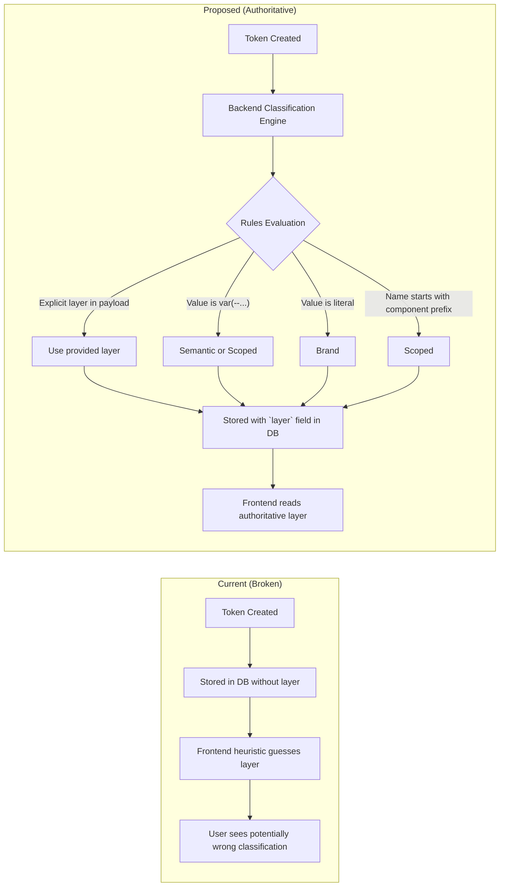

# Token Classification Architecture — Brand, Semantic, and Scoped (Component)

> **Version:** 1.0  
> **Date:** 2026-07-29  
> **Scope:** Move token classification (brand / semantic / scoped) from frontend heuristic guessing to a backend-authoritative, schema-enforced system with deterministic rules, explicit storage, and user-understandable structure.

---

## 1. Problem Statement

### 1.1 The Current System Is Broken

Today, token classification into **Brand**, **Semantic**, and **Scoped** (Component) layers is done **entirely on the frontend** via a heuristic function in [`token.utils.ts`](file:///Users/oluwatobiloba/Desktop/charisol/design_system/charisol-design-system-fe/util/token.utils.ts#L92-L124) (`TokenUtils.getSubTab`). This function:

1. **Guesses the layer from the token key string** using prefix matching (e.g., `color-` → brand, `button-` → component)
2. **Has no backend awareness** — the backend stores no `layer` field on tokens and performs no classification
3. **Falls back to "semantic"** for anything it can't classify — meaning ~80% of tokens land in semantic by accident, not by design intent
4. **Is inconsistent** — tokens created via Figma import, Style Dictionary, AI brief, or manual creation all go through different paths, none of which set a `layer`

### 1.2 Evidence from the Screenshot

From the Strata UI:

| Tab | Count | Explanation |
|-----|-------|-------------|
| **Brand** | 0 | No tokens match the hardcoded `brand-` prefix heuristic |
| **Semantic** | 559 | Everything falls here as the default catch-all |
| **Scoped** | 54 | Only tokens starting with component prefixes (`button-`, `input-`, `card-`, etc.) |

This means the frontend is displaying a fundamentally incorrect picture. The 559 "semantic" tokens likely include hundreds of brand/global tokens (raw color values like `#FE5D7A`, scale values like `16px`) that should be classified as **Brand**.

### 1.3 What Users Don't Understand

Users cannot answer these questions in the current system:
- **"How is a token classified?"** — There's no visible rule, it's invisible heuristics
- **"How do I create a brand token vs a semantic token?"** — There's no structural difference in creation
- **"What makes a token semantic vs scoped?"** — No enforced constraints, just naming guesses
- **"How do I reclassify a token?"** — The `layer` field exists on the DesignToken type but is rarely populated

---

## 2. Design Principles

### 2.1 The Token Hierarchy (Canonical Model)

```
┌─────────────────────────────────────────────────────────────────────┐
│                     TOKEN CLASSIFICATION PYRAMID                     │
│                                                                     │
│  ┌─────────────────────────────────────────────────────────────┐    │
│  │  Layer 1: BRAND (Global / Foundation)                       │    │
│  │  ─────────────────────────────────────────────────────────  │    │
│  │  • Raw, context-agnostic values                             │    │
│  │  • No design intent — just "what is available"              │    │
│  │  • e.g., --color-blue-500: #3B82F6                          │    │
│  │  • e.g., --font-size-lg: 18px                               │    │
│  │  • e.g., --spacing-16: 16px                                 │    │
│  │                                                             │    │
│  │  RULE: Value is a LITERAL (hex, px, rem, string)            │    │
│  │  RULE: Name describes the VALUE, not the PURPOSE            │    │
│  └─────────────────────────────────────────────────────────────┘    │
│                            ▼ references                             │
│  ┌─────────────────────────────────────────────────────────────┐    │
│  │  Layer 2: SEMANTIC (Alias / Purpose-Driven)                 │    │
│  │  ─────────────────────────────────────────────────────────  │    │
│  │  • Maps a brand token to a MEANING                          │    │
│  │  • Expresses WHY a value is used                            │    │
│  │  • e.g., --color-primary: var(--color-blue-500)             │    │
│  │  • e.g., --text-error: var(--color-red-600)                 │    │
│  │  • e.g., --spacing-card-padding: var(--spacing-16)          │    │
│  │                                                             │    │
│  │  RULE: Value is a REFERENCE to a brand token (var(--...))   │    │
│  │        or an OVERRIDDEN literal for legacy/migration        │    │
│  │  RULE: Name describes the PURPOSE, not the value            │    │
│  └─────────────────────────────────────────────────────────────┘    │
│                            ▼ references                             │
│  ┌─────────────────────────────────────────────────────────────┐    │
│  │  Layer 3: SCOPED / COMPONENT (Element-Specific)             │    │
│  │  ─────────────────────────────────────────────────────────  │    │
│  │  • Ties a semantic token to a SPECIFIC component            │    │
│  │  • Allows isolated overrides per component                  │    │
│  │  • e.g., --button-primary-bg: var(--color-primary)          │    │
│  │  • e.g., --input-border-focus: var(--color-interactive)     │    │
│  │  • e.g., --card-border-radius: var(--radius-lg)             │    │
│  │                                                             │    │
│  │  RULE: Name MUST start with a component prefix              │    │
│  │  RULE: Value SHOULD reference a semantic token              │    │
│  │  RULE: MUST be linked to a registered component             │    │
│  └─────────────────────────────────────────────────────────────┘    │
└─────────────────────────────────────────────────────────────────────┘
```

### 2.2 Classification Authority



**Key Decision: The backend is the single source of truth for token classification.**

---

## 3. Classification Engine

### 3.1 Classification Rules (Priority Order)

The backend classification engine applies the following rules in strict priority order:

```
RULE 1 — EXPLICIT LAYER (Highest Priority)
├── If `layer` field is provided in the create/update payload:
│   ├── "brand" or "foundation" → BRAND
│   ├── "semantic" → SEMANTIC
│   └── "component" or "scoped" → SCOPED
│
RULE 2 — COMPONENT PREFIX DETECTION
├── If the token key (after removing `--`) starts with a REGISTERED component name:
│   ├── e.g., --button-*, --input-*, --card-*, --modal-*, --nav-*, --header-*,
│   │        --footer-*, --badge-*, --chip-*, --avatar-*, --table-*,
│   │        --form-*, --select-*, --checkbox-*, --radio-*, --toggle-*,
│   │        --tooltip-*, --alert-*, --toast-*, --sidebar-*, --dropdown-*,
│   │        --tabs-*, --accordion-*, --breadcrumb-*, --pagination-*
│   └── → SCOPED
│
RULE 3 — VALUE REFERENCE DETECTION
├── If the token value contains `var(--` (CSS variable reference):
│   ├── If ALSO matched RULE 2 → SCOPED (already handled above)
│   └── Otherwise → SEMANTIC
│
RULE 4 — VALUE LITERAL DETECTION
├── If the token value is a raw literal:
│   ├── Hex color: #RGB, #RRGGBB, #RRGGBBAA → BRAND
│   ├── Numeric + unit: 16px, 1rem, 200ms, 0.25 → BRAND
│   ├── Named color: transparent, inherit, currentColor → BRAND
│   ├── CSS function: rgb(), rgba(), hsl(), hsla() → BRAND
│   ├── Font stack string: "Inter", "Roboto", sans-serif → BRAND
│   └── Pure number: 400, 1.5, 0 → BRAND
│
RULE 5 — NAMING CONVENTION ANALYSIS
├── If the key contains PURPOSE keywords:
│   ├── Purpose words: primary, secondary, tertiary, error, warning, success,
│   │                  info, danger, muted, disabled, interactive, surface,
│   │                  background, foreground, accent, highlight, link, hover,
│   │                  focus, active, pressed, selected, border-default
│   └── → SEMANTIC
├── If the key contains SCALE/VALUE keywords:
│   ├── Scale words: 100, 200, 300, ..., 900, xs, sm, md, lg, xl, 2xl, 3xl,
│   │               thin, light, regular, medium, semibold, bold, extrabold,
│   │               black, white, gray-NNN, blue-NNN, red-NNN, green-NNN
│   └── → BRAND
│
RULE 6 — FALLBACK
└── If none of the above match → SEMANTIC (with `autoClassified: true` flag)
```

### 3.2 Classification Engine Pseudocode

```javascript
/**
 * Deterministic token classification engine.
 * 
 * @param {string} key - Token key (e.g., "--color-primary")
 * @param {string} value - Token value (e.g., "var(--color-blue-500)")
 * @param {string|null} explicitLayer - User-provided layer override
 * @param {string[]} registeredComponents - List of component names in the project
 * @returns {{ layer: "brand"|"semantic"|"component", confidence: "explicit"|"high"|"medium"|"low", rule: string }}
 */
function classifyToken(key, value, explicitLayer, registeredComponents) {
  // RULE 1: Explicit layer
  if (explicitLayer) {
    const normalized = normalizeLayerName(explicitLayer);
    if (normalized) return { layer: normalized, confidence: "explicit", rule: "EXPLICIT_LAYER" };
  }
  
  const cleanKey = key.replace(/^--/, "").toLowerCase();
  const cleanValue = String(value || "").trim();
  
  // RULE 2: Component prefix
  const allPrefixes = [...BUILT_IN_COMPONENT_PREFIXES, ...registeredComponents];
  const matchedComponent = allPrefixes.find(prefix => 
    cleanKey.startsWith(prefix + "-") || cleanKey.startsWith(prefix + "_") || cleanKey.startsWith(prefix + ".")
  );
  if (matchedComponent) {
    return { layer: "component", confidence: "high", rule: "COMPONENT_PREFIX", componentRef: matchedComponent };
  }
  
  // RULE 3: CSS variable reference
  if (cleanValue.includes("var(--")) {
    return { layer: "semantic", confidence: "high", rule: "VARIABLE_REFERENCE" };
  }
  
  // RULE 4: Literal value detection
  if (isLiteralValue(cleanValue)) {
    return { layer: "brand", confidence: "high", rule: "LITERAL_VALUE" };
  }
  
  // RULE 5: Naming convention
  if (hasPurposeKeyword(cleanKey)) {
    return { layer: "semantic", confidence: "medium", rule: "PURPOSE_KEYWORD" };
  }
  if (hasScaleKeyword(cleanKey)) {
    return { layer: "brand", confidence: "medium", rule: "SCALE_KEYWORD" };
  }
  
  // RULE 6: Fallback
  return { layer: "semantic", confidence: "low", rule: "FALLBACK", autoClassified: true };
}
```

### 3.3 Built-in Component Prefixes

These are recognized as component-scoped tokens by default. Projects can register additional component names that extend this list.

```javascript
const BUILT_IN_COMPONENT_PREFIXES = [
  "button", "btn", "input", "textarea", "select", "checkbox", "radio", "toggle", "switch",
  "card", "modal", "dialog", "drawer", "sheet",
  "nav", "navbar", "header", "footer", "sidebar", "menu", "menubar",
  "badge", "chip", "tag", "label",
  "avatar", "icon", "image", "img",
  "table", "grid", "list", "item",
  "form", "field", "fieldset",
  "tooltip", "popover", "dropdown",
  "alert", "toast", "notification", "banner", "snackbar",
  "tabs", "tab", "accordion", "collapse",
  "breadcrumb", "pagination", "stepper",
  "progress", "spinner", "skeleton", "loader",
  "divider", "separator",
  "link", "anchor",
];
```

---

## 4. Schema Design

### 4.1 Extended DesignToken Schema

The existing `DesignToken` type currently has an optional `layer` field. We make this field **required and backend-computed**.

```typescript
// BEFORE (current)
type DesignToken = {
  name: string;
  value: string;
  type: TokenType;
  unit: string | null;
  comment: string;
  category?: string;           // Loosely used, not enforced
  deprecated?: boolean;
  layer?: "foundation" | "brand" | "semantic" | "component";  // Optional, rarely set
};

// AFTER (proposed)
type DesignToken = {
  name: string;
  value: string;
  type: TokenType;
  unit: string | null;
  comment: string;
  deprecated?: boolean;
  
  // === NEW: Backend-Authoritative Classification ===
  layer: "brand" | "semantic" | "component";           // REQUIRED — set by backend
  
  classification: {
    confidence: "explicit" | "high" | "medium" | "low"; // How certain the classification is
    rule: string;                                        // Which rule triggered (e.g., "LITERAL_VALUE")
    autoClassified: boolean;                             // true if user didn't explicitly set layer
    reclassifiedAt?: string;                             // ISO timestamp of last manual reclassification
    reclassifiedBy?: string;                             // userId who reclassified
  };
  
  // === NEW: Reference tracking (for semantic + scoped) ===
  references?: {
    resolvedValue?: string;          // The fully-resolved literal value
    referencedTokenKey?: string;     // The token key being referenced (e.g., "--color-blue-500")
    componentRef?: string;           // For scoped tokens: which component this belongs to
  };
};
```

### 4.2 Backend Variable Object (DynamoDB / S3)

Each variable stored in the `designSystem.variables` array (or object) gets the classification metadata:

```json
{
  "--color-blue-500": {
    "name": "Blue 500",
    "value": "#3B82F6",
    "type": "color",
    "unit": null,
    "comment": "Primary blue from brand palette",
    "layer": "brand",
    "classification": {
      "confidence": "high",
      "rule": "LITERAL_VALUE",
      "autoClassified": true
    }
  },
  "--color-primary": {
    "name": "Primary Color",
    "value": "var(--color-blue-500)",
    "type": "color",
    "unit": null,
    "comment": "Main brand interaction color",
    "layer": "semantic",
    "classification": {
      "confidence": "high",
      "rule": "VARIABLE_REFERENCE",
      "autoClassified": true
    },
    "references": {
      "resolvedValue": "#3B82F6",
      "referencedTokenKey": "--color-blue-500"
    }
  },
  "--button-primary-bg": {
    "name": "Button Primary Background",
    "value": "var(--color-primary)",
    "type": "color",
    "unit": null,
    "comment": "Primary button background color",
    "layer": "component",
    "classification": {
      "confidence": "high",
      "rule": "COMPONENT_PREFIX",
      "autoClassified": true,
      "componentRef": "button"
    },
    "references": {
      "resolvedValue": "#3B82F6",
      "referencedTokenKey": "--color-primary"
    }
  }
}
```

### 4.3 Classification Constraints (Validation Schema)

These constraints are enforced by the backend when creating or updating tokens:

| Constraint | Rule | Error |
|-----------|------|-------|
| **BRAND tokens must have literal values** | Value must NOT contain `var(--` | `BRAND_CANNOT_REFERENCE: Brand tokens store raw values, not references` |
| **SEMANTIC tokens should reference brand tokens** | Value SHOULD contain `var(--`. Literal values are allowed but flagged as `confidence: "low"` | Warning: `SEMANTIC_LITERAL_VALUE: Semantic token has a literal value — consider creating a brand token first` |
| **SCOPED tokens must have a component prefix** | Key must start with a registered component name | `SCOPED_MISSING_COMPONENT: Scoped tokens must be prefixed with a component name (e.g., button-, card-)` |
| **SCOPED tokens should reference semantic tokens** | Value SHOULD contain `var(--` pointing to a semantic token | Warning: `SCOPED_DIRECT_BRAND_REF: Scoped token references brand directly — consider using a semantic alias` |
| **No circular references** | A token cannot reference itself, directly or transitively | `CIRCULAR_REFERENCE: Token creates a circular reference chain` |
| **Duplicate key prevention** | Cannot create two tokens with the same key | `DUPLICATE_KEY: Token with this key already exists` |

### 4.4 Soft vs Hard Constraints

| Type | Behavior | Example |
|------|----------|---------|
| **Hard Constraint** | Blocks the operation, returns 400 | Circular reference, duplicate key |
| **Soft Constraint (Warning)** | Allows the operation but returns warnings in the response | Semantic token with literal value |
| **Informational** | Included in response metadata | Auto-classification confidence |

---

## 5. API Design

### 5.1 Token Creation — Explicit Layer Support

```
POST /v2/projects/:projectId/variables
```

**Request Body:**

```json
{
  "key": "--color-blue-500",
  "name": "Blue 500",
  "value": "#3B82F6",
  "type": "color",
  "layer": "brand",           // Optional — if omitted, backend auto-classifies
  "comment": "Primary blue from brand palette"
}
```

**Response (201 Created):**

```json
{
  "data": {
    "id": "var_1722000000_abc123",
    "key": "--color-blue-500",
    "name": "Blue 500",
    "value": "#3B82F6",
    "type": "color",
    "layer": "brand",
    "classification": {
      "confidence": "explicit",
      "rule": "EXPLICIT_LAYER",
      "autoClassified": false
    },
    "warnings": []
  }
}
```

### 5.2 Token Reclassification

```
PATCH /v2/projects/:projectId/variables/:variableId/reclassify
```

**Request Body:**

```json
{
  "layer": "semantic"
}
```

**Response (200 OK):**

```json
{
  "data": {
    "id": "var_1722000000_abc123",
    "key": "--dashboard-adbannerbadge-color",
    "layer": "semantic",
    "previousLayer": "brand",
    "classification": {
      "confidence": "explicit",
      "rule": "EXPLICIT_LAYER",
      "autoClassified": false,
      "reclassifiedAt": "2026-07-29T13:00:00Z",
      "reclassifiedBy": "user_abc"
    },
    "warnings": [
      {
        "code": "SEMANTIC_LITERAL_VALUE",
        "message": "This semantic token has a literal value (#FE5D7A). Consider creating a brand token and referencing it."
      }
    ]
  }
}
```

### 5.3 Bulk Reclassification (Auto-Classify All)

```
POST /v2/projects/:projectId/variables/reclassify-all
```

This endpoint runs the classification engine across ALL tokens in a project, updating their `layer` and `classification` metadata. Used for:
- Initial migration of existing projects (559 tokens all marked semantic → proper classification)
- After large imports (Figma, Style Dictionary)

**Request Body:**

```json
{
  "mode": "auto",             // "auto" = engine decides; "preview" = dry-run only
  "overrideExplicit": false   // If true, re-classifies even tokens with explicit layer
}
```

**Response (200 OK):**

```json
{
  "data": {
    "reclassified": 485,
    "unchanged": 128,
    "summary": {
      "brand": { "count": 340, "examples": ["--color-blue-500", "--spacing-16", "--font-size-lg"] },
      "semantic": { "count": 165, "examples": ["--color-primary", "--text-error", "--bg-surface"] },
      "component": { "count": 108, "examples": ["--button-primary-bg", "--input-border-focus"] }
    },
    "warnings": [
      { "key": "--dashboard-custom-gradient", "code": "LOW_CONFIDENCE", "suggestedLayer": "semantic" }
    ]
  }
}
```

### 5.4 List Tokens by Layer

```
GET /v2/projects/:projectId/variables?layer=brand&type=color&page=1&pageSize=50
```

**Response:**

```json
{
  "data": [...],
  "pagination": { "page": 1, "pageSize": 50, "total": 340, "hasNext": true },
  "layerCounts": {
    "brand": 340,
    "semantic": 165,
    "component": 108
  }
}
```

---

## 6. Backend Architecture

### 6.1 New Files / Modules

```
utils/
  tokenClassifier.js              ← Classification engine (pure function, no side effects)
  tokenClassifier.test.js          ← Unit tests for classification rules

controllers/
  frontendContractController.js    ← MODIFY: Add classification to variable CRUD
  designSystemController.js        ← MODIFY: Add classification to variable CRUD
```

### 6.2 Classification Integration Points

The classification engine must be called at every entry point where tokens are created or modified:

| Entry Point | File | Change |
|------------|------|--------|
| Manual token creation (V1) | `designSystemController.js` `createVariable()` | Add `classifyToken()` call |
| Manual token creation (V2) | `frontendContractController.js` `createVariableV2()` | Add `classifyToken()` call |
| Token update (V1) | `designSystemController.js` `updateVariable()` | Re-classify on value change |
| Token update (V2) | `frontendContractController.js` `updateVariableV2()` | Re-classify on value change |
| AI Brief import | `frontendContractController.js` `importAiBriefV2()` | Classify all generated tokens |
| Context Engine | `frontendContractController.js` `generateDesignSystemEngine()` | Classify all patches |
| Style Dictionary import | `designSystemController.js` `importStyleDictionary()` | Classify imported tokens |
| Figma import | `projectController.js` `syncProjectVersionToRemote()` | Classify on sync |
| Patch operations | `projectController.js` `patchProjectVersionToRemote()` | Classify on add/replace |
| Bulk sync | `projectController.js` | Classify entire token set |
| Baseline preset | `baselinePreset.js` | Pre-classify baseline tokens |

### 6.3 Integration with Token Resolver

The existing [`tokenResolver.js`](file:///Users/oluwatobiloba/Desktop/charisol/design_system/charisol-design-system-be/utils/tokenResolver.js) resolves `var(--...)` references. The classification engine uses this to:

1. **Detect reference chains** — A semantic token referencing a brand token
2. **Compute `references.resolvedValue`** — The final literal value after dereferencing
3. **Detect circular references** — Block creation of circular token chains
4. **Validate layer hierarchy** — Ensure brand ← semantic ← scoped flow

---

## 7. Frontend Changes

### 7.1 Remove Frontend Classification Logic

The entire `TokenUtils.getSubTab()` function becomes a simple property read:

```typescript
// BEFORE (complex heuristic)
static getSubTab(key: string, token?: DesignToken): "brand" | "semantic" | "component" {
  if (token?.layer) { ... }
  if (token?.category) { ... }
  const lower = key.toLowerCase().replace(/^--/, "");
  if (lower.startsWith("brand.") || ...) return "brand";
  // ... 30+ lines of prefix matching ...
  return "semantic";
}

// AFTER (read from backend)
static getSubTab(key: string, token?: DesignToken): "brand" | "semantic" | "component" {
  return token?.layer ?? "semantic";  // Backend always provides layer
}
```

### 7.2 Display Classification Metadata

The UI should show users WHY a token is classified the way it is:

- Show `classification.confidence` as a badge (✓ Explicit, ⚡ Auto-High, ⚠ Auto-Low)
- Show `classification.rule` on hover/tooltip
- Allow manual reclassification via the Edit Token Modal

---

## 8. Migration Strategy

### 8.1 Phase 1 — Backend Classification Engine (No Breaking Changes)

1. Add `tokenClassifier.js` utility module
2. Modify token create/update endpoints to call classifier
3. Add `layer` and `classification` fields to new/updated tokens
4. **Do NOT remove frontend heuristic yet** — it serves as fallback for tokens without `layer`

### 8.2 Phase 2 — Backfill Existing Tokens

1. Add `POST /v2/projects/:projectId/variables/reclassify-all` endpoint
2. Run backfill for all existing projects (can be done via admin script)
3. All existing tokens get classified and stored with `layer` field

### 8.3 Phase 3 — Frontend Cutover

1. Frontend reads `token.layer` directly (already exists in type definition)
2. Remove `TokenUtils.getSubTab()` heuristic logic
3. Add classification badge and reclassification UI

### 8.4 Backward Compatibility

- Tokens without `layer` field continue to work (frontend falls back to `"semantic"`)
- The classification engine is additive — no existing data is modified without explicit trigger
- All API responses include `layer` for new/updated tokens

---

## 9. Impact Analysis

### 9.1 Change Impact by Layer

| Layer | Change Impact | Example |
|-------|--------------|---------|
| Brand | **Massive** — changing `--color-blue-500` cascades to every semantic token referencing it, and through them to every component token | A brand color change propagates through 50+ tokens |
| Semantic | **Broad** — changing `--color-primary` affects all components using that meaning | A semantic change affects 10-20 component tokens |
| Scoped | **Isolated** — changing `--button-primary-bg` only affects that one component | Zero cascade risk |

### 9.2 Affected Components

| Component | Impact |
|-----------|--------|
| `TokensSection.tsx` | Uses `getSubTab()` — will read `token.layer` directly |
| `EditTokenModal.tsx` | Layer selection — needs reclassification API call |
| `AddVariableModal.tsx` | Layer selection — pass to backend |
| `TokenImportModal.tsx` | `targetLayer` — pass to backend classifier |
| `ComponentsSection.tsx` | Layer display — read from backend |
| `DesignSystemContext.tsx` | State management — include `layer` in token data |
| `publishSnapshot.js` | Token export — include `layer` metadata in snapshots |
| `tokenFormatters.js` | Format builders — group tokens by layer in exports |

---

## 10. Appendix

### A. Complete Classification Decision Table

| Key Pattern | Value Pattern | Resulting Layer | Rule | Confidence |
|------------|--------------|-----------------|------|-----------|
| `--color-blue-500` | `#3B82F6` | Brand | LITERAL_VALUE | High |
| `--font-size-lg` | `18px` | Brand | LITERAL_VALUE | High |
| `--spacing-16` | `1rem` | Brand | LITERAL_VALUE | High |
| `--color-primary` | `var(--color-blue-500)` | Semantic | VARIABLE_REFERENCE | High |
| `--text-error` | `var(--color-red-600)` | Semantic | VARIABLE_REFERENCE | High |
| `--bg-surface` | `#FFFFFF` | Semantic | PURPOSE_KEYWORD | Medium |
| `--button-primary-bg` | `var(--color-primary)` | Scoped | COMPONENT_PREFIX | High |
| `--input-border-focus` | `var(--color-interactive)` | Scoped | COMPONENT_PREFIX | High |
| `--card-border-radius` | `var(--radius-lg)` | Scoped | COMPONENT_PREFIX | High |
| `--dashboard-adbannerbadge-color` | `#fe5d7a` | Semantic | FALLBACK | Low |
| Any | Any | (explicit `layer: "brand"`) | Brand | EXPLICIT_LAYER | Explicit |

### B. Naming Convention Guidance (For Users)

| Layer | Naming Pattern | Examples |
|-------|---------------|----------|
| Brand | `--{category}-{scale/shade}` | `--color-blue-500`, `--font-size-lg`, `--spacing-4` |
| Semantic | `--{purpose}-{modifier}` | `--color-primary`, `--text-error`, `--bg-surface-elevated` |
| Scoped | `--{component}-{property}-{state}` | `--button-bg-hover`, `--input-border-focus`, `--card-shadow` |
