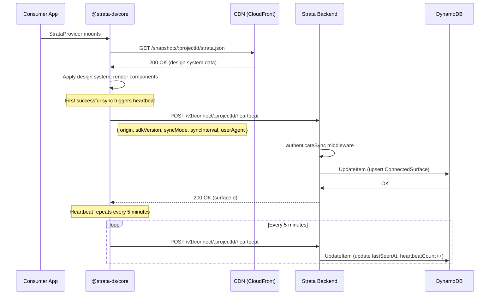
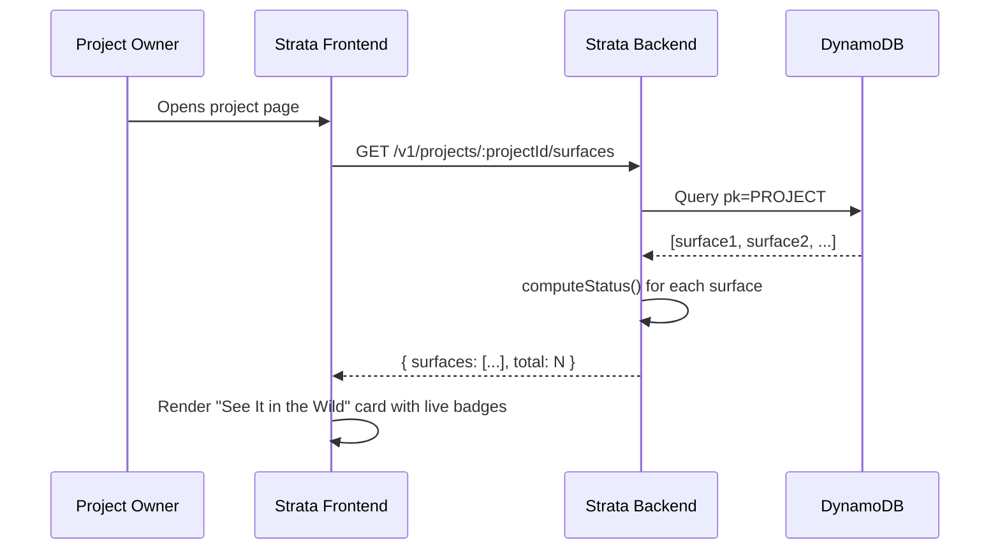

# Connected Apps Tracking — System Architecture

> **Goal**: Enable Strata to automatically discover, register, and display every production application ("connected surface") that consumes a design system via the `@strata-ds/core` NPM package — with zero manual configuration by the end user.

---

## 1. Problem Statement

Today, the "See It in the Wild" section on the Strata project page (file:///Users/oluwatobiloba/Desktop/charisol/design_system/charisol-design-system-fe/app/explore/project/[id]/page.tsx#L695-L730) renders an empty state because `connectedSurfaces` is never populated. Project owners have no visibility into:

- **Which** apps are consuming their design system tokens/components
- **Whether** those apps are actively syncing or stale
- **What version** of the design system each app is using
- **How frequently** each app polls for updates

This makes Strata feel disconnected from its own value proposition: "design once, sync everywhere."

---

## 2. High-Level Architecture

```
┌─────────────────────────────────────────────────────────────┐
│                    Consumer Application                      │
│                                                             │
│   StrataProvider (runtime)                                  │
│     ├── Sync cycle: fetch snapshot from CDN / API           │
│     └── Heartbeat: POST /v1/connect/:projectId/heartbeat   │
│           • origin, user-agent, app metadata                │
│           • triggered on first sync + interval              │
│                                                             │
│   postinstall (build-time)                                  │
│     └── POST /v1/connect/:projectId/register                │
│           • hostname, environment, package version          │
└──────────────────────────────┬──────────────────────────────┘
                               │  HTTPS
                               ▼
┌─────────────────────────────────────────────────────────────┐
│               Strata Backend (Express + DynamoDB)            │
│                                                             │
│   /v1/connect/:projectId/register   (build-time)            │
│   /v1/connect/:projectId/heartbeat  (runtime)               │
│   /v1/connect/:projectId/surfaces   (dashboard read)        │
│   /v1/connect/:projectId/surfaces/:surfaceId  (manage)      │
│                                                             │
│   ConnectedSurface Model (DynamoDB)                         │
│     pk: PROJECT#<projectId>                                 │
│     sk: SURFACE#<surfaceId>                                 │
│     ├── origin, hostname, environment                       │
│     ├── lastSeenAt, firstSeenAt                             │
│     ├── sdkVersion, syncMode, syncInterval                  │
│     ├── status (live / stale / dormant)                     │
│     └── metadata (appName, framework, nodeEnv)              │
│                                                             │
│   Status Engine (event-driven)                              │
│     live    → heartbeat within 2× syncInterval              │
│     stale   → no heartbeat for > 2× syncInterval           │
│     dormant → no heartbeat for > 7 days                     │
└──────────────────────────────┬──────────────────────────────┘
                               │
                               ▼
┌─────────────────────────────────────────────────────────────┐
│            Strata Frontend (Next.js Dashboard)               │
│                                                             │
│   Project Overview → "See It in the Wild" card              │
│     ├── GET /v1/connect/:projectId/surfaces                 │
│     ├── Live / Stale / Dormant badge per surface            │
│     ├── Last seen timestamp + SDK version                   │
│     └── Manual "Link Surface" for non-SDK apps              │
│                                                             │
│   Project Settings → "Connected Apps" tab                   │
│     ├── Remove surface, rename, set emoji                   │
│     └── Toggle heartbeat requirement                        │
└─────────────────────────────────────────────────────────────┘
```

---

## 3. Data Model

### 3.1 ConnectedSurface Entity

| Field            | Type       | Description                                                                 |
|:-----------------|:-----------|:----------------------------------------------------------------------------|
| `pk`             | `String`   | Partition key — `PROJECT#<projectId>` (co-located with project data)        |
| `sk`             | `String`   | Sort key — `SURFACE#<surfaceId>` (deterministic hash of origin)             |
| `surfaceId`      | `String`   | Deterministic ID derived from `sha256(origin)` or manual entry UUID         |
| `origin`         | `String`   | The `window.location.origin` of the consuming app (e.g. `https://app.acme.com`) |
| `hostname`       | `String`   | Extracted hostname for display (e.g. `app.acme.com`)                        |
| `displayName`    | `String`   | Optional human-readable name (auto-derived or user-set)                     |
| `emoji`          | `String`   | Optional emoji for visual identity (default: `🌐`)                         |
| `environment`    | `String`   | `production` / `staging` / `development` / `unknown`                        |
| `status`         | `String`   | `live` / `stale` / `dormant` — computed from heartbeat recency              |
| `sdkVersion`     | `String`   | `@strata-ds/core` package version (e.g. `2.1.20`)                          |
| `syncMode`       | `String`   | `cdn` / `legacy` / `static`                                                |
| `syncInterval`   | `Number`   | Polling interval in ms (e.g. `5000`)                                        |
| `lastSeenAt`     | `String`   | ISO 8601 timestamp of last heartbeat                                        |
| `firstSeenAt`    | `String`   | ISO 8601 timestamp of first registration                                    |
| `heartbeatCount` | `Number`   | Total heartbeats received (useful for analytics)                            |
| `userAgent`      | `String`   | Browser/runtime user-agent string                                           |
| `metadata`       | `Object`   | Extensible bag: `{ appName, framework, nodeEnv, pageUrl }`                  |
| `source`         | `String`   | `auto` (SDK-reported) or `manual` (dashboard-linked)                        |
| `createdAt`      | `String`   | DynamoDB auto-timestamp                                                     |
| `updatedAt`      | `String`   | DynamoDB auto-timestamp                                                     |

### 3.2 Key Design — Co-location with Project

Using `pk = PROJECT#<projectId>` means connected surfaces live in the same partition as the project record. This enables:

- **Single-query fetch**: `pk = PROJECT#<projectId> AND sk BEGINS_WITH SURFACE#` retrieves all surfaces for a project in one DynamoDB query.
- **No separate table**: Avoids provisioning and managing a new table.
- **Atomic consistency**: Surfaces are always co-located with their project.

### 3.3 Surface ID Derivation

```
surfaceId = sha256(origin).substring(0, 16)
```

This ensures:
- **Idempotency**: The same origin always maps to the same surface ID. Multiple heartbeats from `https://app.acme.com` update the same record.
- **Privacy**: The origin is stored in plaintext (it's a public URL), but the ID itself is a hash.
- **Collision resistance**: 16 hex chars = 64 bits of entropy — sufficient for per-project uniqueness.

---

## 4. Component Architecture

### 4.1 NPM Package (`@strata-ds/core`)

#### 4.1.1 Heartbeat Reporter (`src/telemetry/heartbeat.ts`)

A new module responsible for reporting the consuming app's presence to the Strata backend.

```
Responsibilities:
  • Send a heartbeat POST on first successful sync
  • Re-send heartbeat at a configurable interval (default: every 5 minutes)
  • Include: origin, sdkVersion, syncMode, syncInterval, userAgent, metadata
  • Graceful degradation: never throw, never block rendering
  • Respect opt-out: skip if `reportUsage={false}` on StrataProvider
  • Skip in SSR: only run in browser (typeof window !== 'undefined')
  • Skip in development: only run when NODE_ENV === 'production' (configurable)
```

#### 4.1.2 StrataProvider Changes

New props:

| Prop              | Type      | Default  | Description                                            |
|:------------------|:----------|:---------|:-------------------------------------------------------|
| `reportUsage`     | `boolean` | `true`   | Whether to send heartbeat telemetry                    |
| `appName`         | `string`  | `undefined` | Human-readable app name for dashboard display        |
| `environment`     | `string`  | auto-detected | Override environment detection                    |

#### 4.1.3 Build-Time Registration (`src/cli/postinstall.ts`)

The existing postinstall hook already reads `strata.json`. Extend it to send a one-time registration ping:

```
POST /v1/connect/:projectId/register
Body: { hostname: os.hostname(), sdkVersion, environment: 'build', source: 'postinstall' }
```

This captures build-time presence (CI/CD pipelines, developer machines) even if the app hasn't rendered in a browser yet.

### 4.2 Backend (Express)

#### 4.2.1 New Controller: `connectedSurfaceController.js`

| Endpoint                                              | Method   | Auth            | Description                                  |
|:------------------------------------------------------|:---------|:----------------|:---------------------------------------------|
| `/v1/connect/:projectId/heartbeat`                    | `POST`   | `authenticateSync` | Upsert surface from SDK heartbeat          |
| `/v1/connect/:projectId/register`                     | `POST`   | `authenticateSync` | One-time build-time registration           |
| `/v1/projects/:projectId/surfaces`                    | `GET`    | `authenticateUser` | List all surfaces for project owner        |
| `/v1/projects/:projectId/surfaces/:surfaceId`         | `PATCH`  | `authenticateUser` | Update displayName, emoji                  |
| `/v1/projects/:projectId/surfaces/:surfaceId`         | `DELETE` | `authenticateUser` | Remove a surface                           |
| `/v1/projects/:projectId/surfaces/manual`             | `POST`   | `authenticateUser` | Manually link a surface (URL + name)       |

#### 4.2.2 Status Computation

Status is computed at read time (not stored as a TTL trigger) to avoid DynamoDB Streams complexity:

```javascript
function computeStatus(surface) {
  const now = Date.now();
  const lastSeen = new Date(surface.lastSeenAt).getTime();
  const staleness = now - lastSeen;

  // 2× the reported sync interval, with a floor of 60 seconds
  const staleThreshold = Math.max(surface.syncInterval * 2, 60_000);
  const dormantThreshold = 7 * 24 * 60 * 60 * 1000; // 7 days

  if (staleness <= staleThreshold) return 'live';
  if (staleness <= dormantThreshold) return 'stale';
  return 'dormant';
}
```

#### 4.2.3 Authentication for Heartbeats

Heartbeat and register endpoints reuse the existing `authenticateSync` middleware (file:///Users/oluwatobiloba/Desktop/charisol/design_system/charisol-design-system-be/middlewares/authenticateSync.js). This means:

- **Public projects**: Heartbeats accepted without a token (origin is validated against `allowedOrigins`)
- **Private projects**: Heartbeats require the `pt_live_*` sync token (same token used for data sync)

No new authentication mechanism is needed.

### 4.3 Frontend (Next.js Dashboard)

#### 4.3.1 "See It in the Wild" Card Enhancement

The existing card at (file:///Users/oluwatobiloba/Desktop/charisol/design_system/charisol-design-system-fe/app/explore/project/[id]/page.tsx#L695-L730) currently reads from `project.connectedSurfaces` (always empty). Replace with:

- `GET /v1/projects/:projectId/surfaces` on page load
- Render each surface with status badge (`🟢 Live`, `🟡 Stale`, `⚫ Dormant`)
- Show SDK version, last seen time, and app name
- "Link Surface" button for manual entry

#### 4.3.2 Project Settings — Connected Apps Tab

A new settings sub-tab allowing project owners to:

- View all auto-detected and manually linked surfaces
- Rename surfaces, set emoji identifiers
- Remove surfaces that are no longer relevant
- See heartbeat history (last 10 heartbeats with timestamps)

---

## 5. Data Flow Diagrams

### 5.1 Runtime Heartbeat Flow



### 5.2 Dashboard Read Flow



---

## 6. Security & Privacy Considerations

### 6.1 What Data is Collected

| Data Point    | Sensitivity | Justification                                                |
|:--------------|:------------|:-------------------------------------------------------------|
| `origin`      | Low         | Public URL — visible in browser address bar                  |
| `userAgent`   | Low         | Standard HTTP header, no PII                                 |
| `sdkVersion`  | None        | Package version, publicly available on npm                   |
| `syncMode`    | None        | Configuration detail, no PII                                 |
| `hostname`    | Low         | Derived from origin                                          |

### 6.2 What is NOT Collected

- **No cookies or session tokens**
- **No user identity** (no login, no email, no IP address stored)
- **No page content** or DOM snapshots
- **No component usage analytics** (which components are rendered)
- **No request body from sync responses** (token values, design data)

### 6.3 Opt-Out

Setting `reportUsage={false}` on `StrataProvider` disables all telemetry. The SDK will not send any heartbeat requests. This is clearly documented in the README.

### 6.4 Rate Limiting

Heartbeat endpoints are rate-limited to prevent abuse:
- **Per-origin**: 1 heartbeat per minute per origin (deduplication window)
- **Per-project**: 100 unique surfaces maximum per project (prevents enumeration attacks)

---

## 7. Scalability Considerations

### 7.1 DynamoDB Capacity

| Metric                   | Estimate                                                              |
|:-------------------------|:----------------------------------------------------------------------|
| Writes per heartbeat     | 1 `UpdateItem` (upsert)                                              |
| Read for dashboard       | 1 `Query` (returns all surfaces for a project, typically < 50 items)  |
| Storage per surface      | ~500 bytes (small JSON document)                                      |
| Max surfaces per project | 100 (enforced in backend)                                             |

With on-demand DynamoDB pricing, this adds negligible cost — heartbeats are small writes and surfaces are read infrequently (only when a project owner views the dashboard).

### 7.2 Heartbeat Frequency

The default 5-minute heartbeat interval is a balance between:
- **Freshness**: Status detection within 10 minutes (2× interval)
- **Cost**: ~288 writes/day per active surface (12/hour × 24 hours)
- **Network**: POST body is < 500 bytes, response is < 100 bytes

For a project with 10 active surfaces, this is ~2,880 writes/day — well within DynamoDB free tier.

---

## 8. Failure Modes & Resilience

| Failure Scenario              | Behaviour                                                          |
|:------------------------------|:-------------------------------------------------------------------|
| Heartbeat POST fails          | Silently swallowed, retried next interval. No user impact.         |
| Backend returns 401           | Heartbeat disabled for session. App continues to sync normally.    |
| Backend returns 429           | Exponential backoff on heartbeat only. Sync unaffected.            |
| DynamoDB throttle             | Backend returns 500, heartbeat retried next interval.              |
| SDK running in SSR            | Heartbeat skipped entirely (no `window` object).                   |
| SDK running in dev mode       | Heartbeat skipped by default (configurable via `reportUsage`).     |
| Consumer sets `reportUsage=false` | All telemetry disabled. No network calls.                      |

---

## 9. Glossary

| Term              | Definition                                                                                 |
|:------------------|:-------------------------------------------------------------------------------------------|
| **Surface**       | A single deployed instance of an application consuming the Strata design system.           |
| **Heartbeat**     | A periodic lightweight POST from the SDK to report the surface's continued presence.       |
| **Origin**        | The `window.location.origin` value (e.g., `https://app.acme.com`).                        |
| **Sync Token**    | A `pt_live_*` bearer token used to authenticate SDK requests to the Strata backend.        |
| **SDK**           | The `@strata-ds/core` NPM package.                                                        |
| **CDN Snapshot**  | A pre-built JSON file served from CloudFront containing the full design system state.      |
| **Status**        | Computed freshness indicator: `live`, `stale`, or `dormant`.                               |
