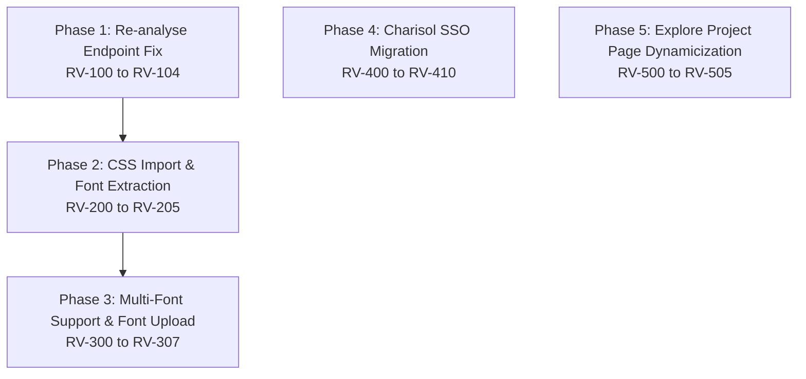

# Master Implementation Plan — Review Feedback Resolution

> **Location**: `docsplan/newlist/`
> **Target System**: Strata (Charisol Design System)
> **Goal**: Comprehensive, phase-by-phase implementation plan addressing all review feedback items with unique Task IDs and strict validation criteria.

---

## Roadmap Overview

---

## Phase Summary & Documentation Matrix

| Phase | Feature / Scope | Priority | Tasks | Doc Link |
|-------|-----------------|----------|-------|----------|
| **Phase 1** | Re-analyse Endpoint Fix | 🔴 High | `RV-100` – `RV-104` | [01-REANALYSE-FIX.md](file:///Users/oluwatobiloba/Desktop/charisol/design_system/docsplan/newlist/01-REANALYSE-FIX.md) |
| **Phase 2** | CSS Import & Font Extraction in BCE | 🟡 Medium | `RV-200` – `RV-205` | [02-CSS-IMPORT-BCE.md](file:///Users/oluwatobiloba/Desktop/charisol/design_system/docsplan/newlist/02-CSS-IMPORT-BCE.md) |
| **Phase 3** | Multi-Font Support & Font Upload | 🟡 Medium | `RV-300` – `RV-307` | [03-FONT-TYPE.md](file:///Users/oluwatobiloba/Desktop/charisol/design_system/docsplan/newlist/03-FONT-TYPE.md) |
| **Phase 4** | Charisol SSO Auth Migration | 🟠 Medium-High | `RV-400` – `RV-410` | [04-CHARISOL-SSO.md](file:///Users/oluwatobiloba/Desktop/charisol/design_system/docsplan/newlist/04-CHARISOL-SSO.md) |
| **Phase 5** | Explore Project Page Dynamicization | 🔴 High | `RV-500` – `RV-505` | [05-EXPLORE-PROJECT.md](file:///Users/oluwatobiloba/Desktop/charisol/design_system/docsplan/newlist/05-EXPLORE-PROJECT.md) |

---

## Task Inventory

### Phase 1: Re-analyse Endpoint Fix ([01-REANALYSE-FIX.md](file:///Users/oluwatobiloba/Desktop/charisol/design_system/docsplan/newlist/01-REANALYSE-FIX.md))
- `RV-100`: Add error visibility and loading states to reclassify-all flow in `TokensSection.tsx`
- `RV-101`: Harden `project.service.ts` reclassify response parsing and error handling
- `RV-102`: Increase BFF timeout (30s) and add debug logging in `reclassify-all/route.ts`
- `RV-103`: End-to-end manual verification of re-analyse/reclassify behavior
- `RV-104`: Fix build type error in `DesignEditor.tsx`

### Phase 2: CSS Import & Font Extraction in BCE ([02-CSS-IMPORT-BCE.md](file:///Users/oluwatobiloba/Desktop/charisol/design_system/docsplan/newlist/02-CSS-IMPORT-BCE.md))
- `RV-200`: Extract `@import` URLs from CSS text in `urlScraper.js`
- `RV-201`: Recursively fetch imported CSS with depth/count limits in `urlScraper.js`
- `RV-202`: Extract font-family declarations and Google Fonts from CSS in `urlScraper.js`
- `RV-203`: Integrate font extraction into `scrapeBrandUrl()` output
- `RV-204`: Update BCE website extraction prompt in `brandContextEngineController.js`
- `RV-205`: Unit tests for scraper enhancements in `tests/unit/urlScraper.test.js`

### Phase 3: Multi-Font Support & Font Upload ([03-FONT-TYPE.md](file:///Users/oluwatobiloba/Desktop/charisol/design_system/docsplan/newlist/03-FONT-TYPE.md))
- `RV-300`: Google Fonts API integration service (`services/google-fonts.service.ts`)
- `RV-301`: Searchable Font Picker component (`components/ui/FontPicker.tsx`)
- `RV-302`: Font Upload modal component (`components/modals/project/FontUploadModal.tsx`)
- `RV-303`: Frontend Font Service (`services/font.service.ts`)
- `RV-304`: BFF proxy routes for font upload/list/delete (`app/api/fonts/...`)
- `RV-305`: Backend controller & routes for S3 font storage and DynamoDB metadata (`fontController.js`)
- `RV-306`: Replace hardcoded font list in `DesignEditor.tsx` with `<FontPicker>`
- `RV-307`: Font management UI section in Settings (`FontManager.tsx`)

### Phase 4: Charisol SSO Auth Migration ([04-CHARISOL-SSO.md](file:///Users/oluwatobiloba/Desktop/charisol/design_system/docsplan/newlist/04-CHARISOL-SSO.md))
- `RV-400`: Register Strata on Charisol Developer Portal (Manual prerequisite)
- `RV-401`: Install and audit `@charisol/auth-sdk-web` package
- `RV-402`: Create Charisol auth wrapper (`lib/charisol-auth.ts`)
- `RV-403`: Create OAuth callback handler page (`app/auth/callback/page.tsx`)
- `RV-404`: Backend SSO login endpoint in `authController.js`
- `RV-405`: BFF proxy route for SSO login (`app/api/auth/charisol-sso/route.ts`)
- `RV-406`: Replace Google OAuth button with Charisol SSO in `Signin.tsx`
- `RV-407`: Update `AuthContext.tsx` for SSO session handling & logout
- `RV-408`: Update `auth.service.ts` with `loginWithCharsolSso()`
- `RV-409`: Update signup flow for Charisol SSO auto-creation
- `RV-410`: End-to-end SSO verification & tracking update

### Phase 5: Explore Project Page Dynamicization ([05-EXPLORE-PROJECT.md](file:///Users/oluwatobiloba/Desktop/charisol/design_system/docsplan/newlist/05-EXPLORE-PROJECT.md))
- `RV-500`: Expose `brandIdentity`, `brandContext`, `logo`, `color`, `connectedSurfaces` in backend `getPublicProject` (`publicController.js`)
- `RV-501`: Dynamic Token Dictionary from `rawVariables` in `app/explore/project/[id]/page.tsx`
- `RV-502`: Dynamic Handoff Code generator for CSS, Tailwind, and JSON snippets
- `RV-503`: Dynamic Brand Typography, Mood Keywords, & Personality in Overview and Brand System tabs
- `RV-504`: Dynamic Package Name & Metadata in Explore Sidebar
- `RV-505`: End-to-End Verification & Build Test
