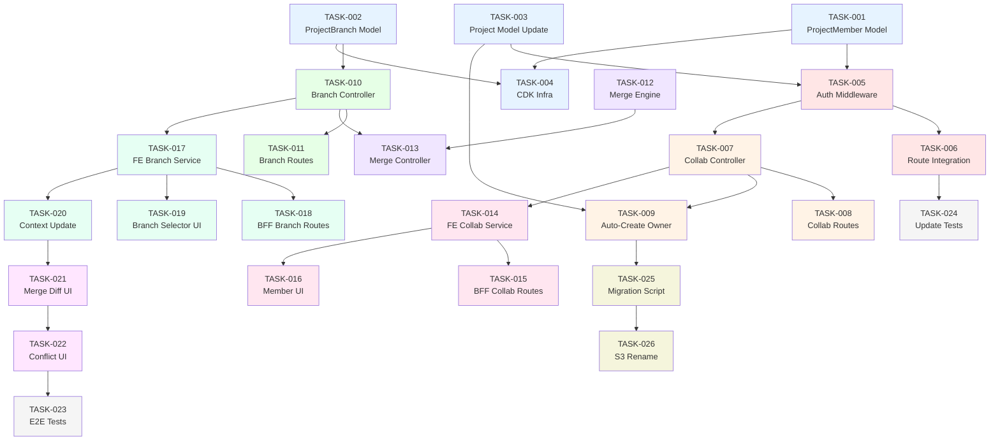

# Implementation Plan — Collaborative Branching & Multi-User VCS

> **Version:** 1.0  
> **Date:** 2026-07-13  
> **Architecture Reference:** [ARCHITECTURE.md](file:///Users/oluwatobiloba/Desktop/charisol/design_system/docsplan/ARCHITECTURE.md)  
> **Status:** DRAFT — Awaiting Approval

---

## Overview

This plan extends the existing single-owner Git-like VCS into a multi-user collaborative system. Collaborators can be invited, work on isolated branches, and merge changes back to main with conflict resolution.

> [!IMPORTANT]
> All tasks are organized in dependency order. Backend infrastructure tasks must complete before API endpoints, which must complete before frontend integration.

---

## Phase 1: Data Layer & Infrastructure

### TASK-001: Create ProjectMember DynamoDB Model

**Priority:** Critical  
**Estimated Effort:** 2 hours
**Dependencies:** None

**Description:**  
Create a new Dynamoose model at `charisol-design-system-be/models/ProjectMember.js` to store project membership records. This model powers all authorization checks and collaboration features.

**Files to Create/Modify:**
- [NEW] `models/ProjectMember.js`
- [MODIFY] `models/helpers/dynamodb.js` — add `ProjectMember` to `getModelNameAsString` switch

**Schema:**

```javascript
{
  pk: String (hashKey),         // projectId
  sk: String (rangeKey),        // "MEMBER#<userId>"
  projectId: String,            // denormalized (GSI)
  userId: String,               // denormalized (GSI)
  email: String,                // for invite lookup (GSI)
  role: String,                 // "owner" | "editor" | "viewer"
  status: String,               // "pending" | "active" | "revoked"
  invitedBy: String,
  invitedAt: String,
  acceptedAt: String,
  lastActiveAt: String,
}
```

**GSIs Required:**
- `UserProjectsIndex`: PK=`userId`, SK=`projectId`
- `InviteEmailIndex`: PK=`email`, SK=`projectId`

**Validation Criteria:**
- [ ] Model file exports a valid Dynamoose model
- [ ] `getModelNameAsString({ ProjectMember })` resolves correctly
- [ ] Schema includes all fields listed above with correct types
- [ ] GSIs are defined for `userId` and `email` lookups
- [ ] Unit test: create, query by pk, query by GSI, update status

---

### TASK-002: Create ProjectBranch DynamoDB Model

**Priority:** Critical  
**Estimated Effort:** 2 hours  
**Dependencies:** None

**Description:**  
Create a new Dynamoose model at `charisol-design-system-be/models/ProjectBranch.js` to store branch metadata. Branch data lives in S3; this table tracks metadata and optimistic locking state.

**Files to Create/Modify:**
- [NEW] `models/ProjectBranch.js`
- [MODIFY] `models/helpers/dynamodb.js` — add `ProjectBranch` to `getModelNameAsString` switch

**Schema:**

```javascript
{
  pk: String (hashKey),         // projectId
  sk: String (rangeKey),        // "BRANCH#<branchName>"
  branchName: String,
  createdBy: String,            // userId
  baseBranch: String,           // "main" or another branch name
  baseSequence: Number,         // sequenceNumber at fork point
  baseS3Key: String,            // S3 key of base snapshot at fork
  s3Key: String,                // current branch data S3 key
  hash: String,                 // content hash
  sequenceNumber: Number,       // per-branch optimistic lock
  status: String,               // "active" | "merged" | "closed" | "stale"
  mergedAt: String,
  mergedBy: String,
  mergeMessage: String,
}
```

**Validation Criteria:**
- [ ] Model file exports a valid Dynamoose model
- [ ] `getModelNameAsString({ ProjectBranch })` resolves correctly
- [ ] Schema includes all fields with correct types
- [ ] Unit test: create branch record, query by projectId, update status to merged

---

### TASK-003: Update Project Model for Collaboration Support

**Priority:** Critical  
**Estimated Effort:** 1 hour  
**Dependencies:** None

**Description:**  
Add new fields to the existing [Project.js](file:///Users/oluwatobiloba/Desktop/charisol/design_system/charisol-design-system-be/models/Project.js) schema to support collaboration features.

**Files to Modify:**
- [MODIFY] `models/Project.js`

**New Fields:**

```javascript
collaborationEnabled: { type: Boolean, default: false },
ownerUserId: { type: String },   // denormalized owner pk for quick checks
maxMembers: { type: Number, default: 20 },
```

**Validation Criteria:**
- [ ] New fields added to schema with correct defaults
- [ ] Existing tests still pass (schema is additive only)
- [ ] `saveUnknown: true` continues to allow flexible storage
- [ ] Unit test: create project with `collaborationEnabled: true`

---

### TASK-004: CDK/Infrastructure — Add DynamoDB Tables

**Priority:** Critical  
**Estimated Effort:** 3 hours  
**Dependencies:** TASK-001, TASK-002

**Description:**  
Add CloudFormation/CDK definitions for the `ProjectMember` and `ProjectBranch` DynamoDB tables with the required GSIs. Add environment variables for table names.

**Files to Modify:**
- [MODIFY] `cdk/` stack definitions
- [MODIFY] `.env.example` — add `DYNAMODB_PROJECT_MEMBER_TABLE_NAME`, `DYNAMODB_PROJECT_BRANCH_TABLE_NAME`

**Validation Criteria:**
- [ ] CDK synth succeeds without errors
- [ ] Tables are created with correct key schema and GSIs
- [ ] Environment variables are documented in `.env.example`
- [ ] Local dev env can reference new tables (localstack or actual DynamoDB)

---

## Phase 2: Authorization Layer

### TASK-005: Create `authorizeProjectAccess` Middleware

**Priority:** Critical  
**Estimated Effort:** 4 hours  
**Dependencies:** TASK-001, TASK-003

**Description:**  
Create a new middleware that checks project membership and role-based access. This replaces the current pattern of `Project.query("pk").eq(user.pk)` for collaborative projects.

**Files to Create/Modify:**
- [NEW] `middlewares/authorizeProjectAccess.js`
- [MODIFY] `middlewares/index.js` — export new middleware

**Logic:**

```
1. Extract projectId from req.params (queryId or projectId)
2. Try legacy ownership check: Project.query("pk").eq(user.pk)
   - If found → req.projectRole = "owner", req.projectRecord = project, next()
3. If not found, query ProjectMember: pk=projectId, sk=MEMBER#userId
   - If active member with sufficient role → attach role, next()
   - If pending → 403 "Invitation pending"
   - If not found → 403 "Access denied"
4. Also query and attach the Project record (query by ProjectIdIndex GSI)
```

**Validation Criteria:**
- [ ] Owner continues to access their projects (backward compatible)
- [ ] Collaborator with `editor` role can access write endpoints
- [ ] Collaborator with `viewer` role is blocked from write endpoints
- [ ] Non-member gets 403
- [ ] `req.projectRole` and `req.projectRecord` are set on success
- [ ] Unit tests for all role combinations (owner, editor, viewer, non-member, pending)

---

### TASK-006: Integrate `authorizeProjectAccess` into Existing Routes

**Priority:** Critical  
**Estimated Effort:** 3 hours  
**Dependencies:** TASK-005

**Description:**  
Update existing project routes in [routes/v1/index.js](file:///Users/oluwatobiloba/Desktop/charisol/design_system/charisol-design-system-be/routes/v1/index.js) to use `authorizeProjectAccess` after `authenticateUser` for all project-scoped endpoints.

**Files to Modify:**
- [MODIFY] `routes/v1/index.js`
- [MODIFY] `controllers/projectController.js` — use `req.projectRecord` instead of re-querying

**Route-to-Role Mapping:**

| Route | Required Role |
|-------|--------------|
| `GET /project/:queryId` | viewer |
| `PATCH /project/:queryId` | owner |
| `DELETE /project/:queryId` | owner |
| `POST/PATCH /project/:queryId/upload` | editor |
| `POST /project/:queryId/publish` | owner |
| `GET /project/:queryId/diff` | viewer |
| `GET /project/:queryId/data` | viewer |
| `POST /project/:queryId/import/*` | editor |

**Validation Criteria:**
- [ ] All existing 151 backend tests still pass
- [ ] Owner can still perform all operations (backward compatible)
- [ ] New integration test: editor can PATCH upload but cannot DELETE project
- [ ] New integration test: viewer can GET data but cannot PATCH upload

---

## Phase 3: Collaborator Management API

### TASK-007: Create Collaborator Controller

**Priority:** High  
**Estimated Effort:** 6 hours  
**Dependencies:** TASK-001, TASK-005

**Description:**  
Create a new controller `controllers/collaboratorController.js` with CRUD operations for project members.

**Files to Create:**
- [NEW] `controllers/collaboratorController.js`

**Endpoints to Implement:**

| Function | Method | Path | Role |
|----------|--------|------|------|
| `inviteMember` | POST | `/project/:id/members` | owner |
| `listMembers` | GET | `/project/:id/members` | viewer+ |
| `updateMemberRole` | PATCH | `/project/:id/members/:userId` | owner |
| `removeMember` | DELETE | `/project/:id/members/:userId` | owner |
| `acceptInvitation` | POST | `/project/:id/members/accept` | invitee |
| `listMyProjects` | GET | `/user/projects` | authenticated |

**Business Rules:**
- Max 20 members per project (configurable via `maxMembers`)
- Owner cannot be removed
- Owner cannot have role changed
- Accepting invitation changes status from `pending` to `active`
- Removing a member sets status to `revoked`
- `listMyProjects` queries `UserProjectsIndex` GSI

**Validation Criteria:**
- [ ] `inviteMember` creates a ProjectMember record with `status: pending`
- [ ] `inviteMember` returns 409 if member already exists
- [ ] `inviteMember` returns 403 if max members exceeded
- [ ] `acceptInvitation` transitions status from `pending` to `active`
- [ ] `removeMember` returns 403 when attempting to remove owner
- [ ] `updateMemberRole` returns 403 when attempting to change owner role
- [ ] `listMembers` returns all members for the project
- [ ] `listMyProjects` returns projects across all membership roles
- [ ] Unit tests for all functions (min 15 tests)

---

### TASK-008: Register Collaborator Routes

**Priority:** High  
**Estimated Effort:** 1 hour  
**Dependencies:** TASK-007

**Description:**  
Register the collaborator controller routes in [routes/v1/index.js](file:///Users/oluwatobiloba/Desktop/charisol/design_system/charisol-design-system-be/routes/v1/index.js).

**Files to Modify:**
- [MODIFY] `routes/v1/index.js`

**Routes to Add:**

```javascript
router.post("/project/:queryId/members", authenticateUser, authorizeProjectAccess('owner'), inviteMember);
router.get("/project/:queryId/members", authenticateUser, authorizeProjectAccess('viewer'), listMembers);
router.patch("/project/:queryId/members/:userId", authenticateUser, authorizeProjectAccess('owner'), updateMemberRole);
router.delete("/project/:queryId/members/:userId", authenticateUser, authorizeProjectAccess('owner'), removeMember);
router.post("/project/:queryId/members/accept", authenticateUser, acceptInvitation);
router.get("/user/projects", authenticateUser, listMyProjects);
```

**Validation Criteria:**
- [ ] All routes respond with correct status codes
- [ ] Integration test: full invite→accept→list→remove flow
- [ ] `POST /members/accept` works without `authorizeProjectAccess` (invitee isn't a member yet)

---

### TASK-009: Auto-Create Owner ProjectMember on Collaboration Enable

**Priority:** High  
**Estimated Effort:** 2 hours  
**Dependencies:** TASK-003, TASK-007

**Description:**  
When a project's `collaborationEnabled` is set to `true` for the first time, auto-create a `ProjectMember` record for the owner with `role: owner`, `status: active`.

**Files to Modify:**
- [MODIFY] `controllers/projectController.js` — in `updateProjectById`
- Alternatively: [NEW] `utils/collaborationSetup.js` helper

**Validation Criteria:**
- [ ] Setting `collaborationEnabled: true` creates owner ProjectMember record
- [ ] Idempotent — setting it again doesn't duplicate the record
- [ ] The ProjectMember record has correct `userId`, `email`, `role: owner`
- [ ] Unit test confirms record creation

---

## Phase 4: Branch Management API

### TASK-010: Create Branch Controller

**Priority:** High  
**Estimated Effort:** 8 hours  
**Dependencies:** TASK-002, TASK-005

**Description:**  
Create `controllers/branchController.js` with branch CRUD and data operations. Branches store design system data in S3 with per-branch optimistic locking.

**Files to Create:**
- [NEW] `controllers/branchController.js`

**Functions to Implement:**

| Function | Description |
|----------|------------|
| `createBranch` | Fork from main (or another branch), copy S3 data, create branch record |
| `listBranches` | List all branches for a project with status/metadata |
| `getBranchData` | Fetch branch data from S3 |
| `patchBranchData` | Apply patch operations to branch (with per-branch seq lock) |
| `deleteBranch` | Close/delete a branch (soft delete — mark as closed) |
| `getBranchDiff` | Diff branch data vs main data |

**Key Implementation Details:**
- Branch names are sanitized: lowercase, alphanumeric + hyphens, max 64 chars
- Creating a branch copies `main.json` → `branches/{branchName}.json` and `branches/{branchName}.base.json`
- `patchBranchData` reuses the existing `applyProjectDataPatch` utility from [projectDataPatch.js](file:///Users/oluwatobiloba/Desktop/charisol/design_system/charisol-design-system-be/utils/projectDataPatch.js)
- Branch S3 key format: `projects/{projectId}/branches/{branchName}.json`

**Validation Criteria:**
- [ ] `createBranch` copies main data to new S3 key
- [ ] `createBranch` stores base snapshot for 3-way merge
- [ ] `createBranch` returns 409 if branch name already exists
- [ ] `createBranch` validates branch name format (alphanumeric + hyphens)
- [ ] `patchBranchData` applies patches correctly
- [ ] `patchBranchData` returns 409 on sequence number mismatch
- [ ] `getBranchDiff` computes correct added/modified/deleted lists vs main
- [ ] `deleteBranch` sets status to `closed` (soft delete)
- [ ] `deleteBranch` by owner can delete any branch; editor only their own
- [ ] Unit tests for all functions (min 20 tests)

---

### TASK-011: Register Branch Routes

**Priority:** High  
**Estimated Effort:** 1 hour  
**Dependencies:** TASK-010

**Description:**  
Register branch controller routes in [routes/v1/index.js](file:///Users/oluwatobiloba/Desktop/charisol/design_system/charisol-design-system-be/routes/v1/index.js).

**Files to Modify:**
- [MODIFY] `routes/v1/index.js`

**Routes to Add:**

```javascript
router.post("/project/:queryId/branches", authenticateUser, authorizeProjectAccess('editor'), createBranch);
router.get("/project/:queryId/branches", authenticateUser, authorizeProjectAccess('viewer'), listBranches);
router.get("/project/:queryId/branches/:branchName", authenticateUser, authorizeProjectAccess('viewer'), getBranchData);
router.patch("/project/:queryId/branches/:branchName/upload", authenticateUser, authorizeProjectAccess('editor'), patchBranchData);
router.delete("/project/:queryId/branches/:branchName", authenticateUser, authorizeProjectAccess('editor'), deleteBranch);
router.get("/project/:queryId/branches/:branchName/diff", authenticateUser, authorizeProjectAccess('viewer'), getBranchDiff);
```

**Validation Criteria:**
- [ ] All routes registered and respond with correct status codes
- [ ] Route parameter `:branchName` correctly passed to controllers
- [ ] Viewer cannot POST/PATCH/DELETE; editor can
- [ ] Integration test: create → patch → diff → delete flow

---

## Phase 5: 3-Way Merge Engine

### TASK-012: Implement 3-Way JSON Merge Utility

**Priority:** High  
**Estimated Effort:** 8 hours  
**Dependencies:** None (pure utility)

**Description:**  
Create a pure utility at `utils/mergeEngine.js` that implements a 3-way merge for design system JSON documents. This is the core algorithm for branch merging.

**Files to Create:**
- [NEW] `utils/mergeEngine.js`

**Algorithm:**

```
Input: base (fork-point snapshot), main (current main), branch (branch data)
Output: { merged, conflicts }

For each collection (variables, components):
  1. Compute keySets: baseKeys, mainKeys, branchKeys
  2. For every unique key across all three:
     a. Determine change type using the merge rules table (see ARCHITECTURE.md §6.2)
     b. If no conflict → add to merged result
     c. If conflict → add to conflicts array
  3. Return { merged, conflicts }
```

**Conflict Object Shape:**

```javascript
{
  path: "/variables/--color-primary",
  type: "BOTH_MODIFIED" | "DELETE_MODIFY" | "BOTH_ADDED_DIFFERENT",
  base: { /* base value or null */ },
  main: { /* main value or null */ },
  branch: { /* branch value or null */ },
}
```

**Validation Criteria:**
- [ ] Non-overlapping changes merge cleanly (no conflicts)
- [ ] Both-modified-same-way resolves automatically (no conflict)
- [ ] Both-modified-differently produces a conflict
- [ ] Delete-modify produces a conflict
- [ ] Add-on-both-sides with same value resolves automatically
- [ ] Add-on-both-sides with different values produces a conflict
- [ ] Nested component property merges work correctly
- [ ] Empty document edge cases handled
- [ ] Performance: <100ms for 1000-variable documents
- [ ] Unit tests covering all 14 merge rule combinations (min 25 tests)

---

### TASK-013: Implement Merge Controller

**Priority:** High  
**Estimated Effort:** 6 hours  
**Dependencies:** TASK-010, TASK-012

**Description:**  
Create merge endpoints in `controllers/branchController.js` (or separate `controllers/mergeController.js`) that orchestrate the 3-way merge workflow.

**Functions to Implement:**

| Function | Description |
|----------|------------|
| `mergeBranchToMain` | Execute 3-way merge: fetch base, main, branch from S3 → merge → save or return conflicts |
| `resolveConflicts` | Accept user conflict resolutions and complete the merge |
| `rebaseBranch` | Update branch's base to latest main (re-fork without losing branch changes) |

**Workflow:**

```
mergeBranchToMain:
1. Fetch base.json, main.json, branch.json from S3
2. Run 3-way merge
3. If no conflicts:
   a. Save merged → main.json
   b. Increment Project.sequenceNumber
   c. Mark branch as merged
   d. Return 200
4. If conflicts:
   a. Save mergedPartial (non-conflicting changes) temporarily
   b. Return 409 with conflicts array
```

**Routes to Add:**

```javascript
router.post("/project/:queryId/branches/:branchName/merge", authenticateUser, authorizeProjectAccess('editor'), mergeBranchToMain);
router.post("/project/:queryId/branches/:branchName/merge/resolve", authenticateUser, authorizeProjectAccess('editor'), resolveConflicts);
router.post("/project/:queryId/branches/:branchName/rebase", authenticateUser, authorizeProjectAccess('editor'), rebaseBranch);
```

**Validation Criteria:**
- [ ] Clean merge saves to main.json and marks branch as merged
- [ ] Conflicting merge returns 409 with conflict details
- [ ] `resolveConflicts` accepts resolutions and completes merge
- [ ] `rebaseBranch` updates base snapshot and recalculates diffs
- [ ] Branch cannot be merged if already `merged` or `closed`
- [ ] Only the branch creator or project owner can merge
- [ ] Project.sequenceNumber is incremented on merge
- [ ] Unit tests for merge flow (min 15 tests)

---

## Phase 6: Frontend — Collaborator Management

### TASK-014: Frontend Service — Collaborator API Methods

**Priority:** High  
**Estimated Effort:** 3 hours  
**Dependencies:** TASK-007, TASK-008

**Description:**  
Add collaborator management methods to [project.service.ts](file:///Users/oluwatobiloba/Desktop/charisol/design_system/charisol-design-system-fe/services/project.service.ts).

**Files to Modify:**
- [MODIFY] `services/project.service.ts`

**Methods to Add:**

```typescript
inviteMember(projectId: string, email: string, role: string): Promise<boolean>
listMembers(projectId: string): Promise<Member[]>
updateMemberRole(projectId: string, userId: string, role: string): Promise<boolean>
removeMember(projectId: string, userId: string): Promise<boolean>
acceptInvitation(projectId: string): Promise<boolean>
getMyProjects(): Promise<Project[]>  // via UserProjectsIndex
```

**Validation Criteria:**
- [ ] All methods call correct BFF proxy routes
- [ ] Error handling for 403/409/404 status codes
- [ ] TypeScript types for `Member` interface
- [ ] Jest tests for all methods (min 6 tests)

---

### TASK-015: BFF Proxy Routes — Collaborator Endpoints

**Priority:** High  
**Estimated Effort:** 2 hours  
**Dependencies:** TASK-014

**Description:**  
Create Next.js API routes to proxy frontend calls to backend collaborator endpoints.

**Files to Create:**
- [NEW] `app/api/project/[id]/members/route.ts` — GET, POST
- [NEW] `app/api/project/[id]/members/[userId]/route.ts` — PATCH, DELETE
- [NEW] `app/api/project/[id]/members/accept/route.ts` — POST

**Validation Criteria:**
- [ ] All proxy routes forward auth cookies
- [ ] Response bodies are passed through correctly
- [ ] Error status codes are preserved

---

### TASK-016: Frontend UI — Member Management Component

**Priority:** Medium  
**Estimated Effort:** 6 hours  
**Dependencies:** TASK-014, TASK-015

**Description:**  
Create a `MemberManagement` component that allows the project owner to invite, list, and manage collaborators.

**Files to Create:**
- [NEW] `components/collaboration/MemberManagement.tsx`
- [NEW] `components/collaboration/InviteMemberDialog.tsx`
- [NEW] `components/collaboration/MemberList.tsx`

**Features:**
- Invite by email with role selector (editor/viewer)
- List current members with roles and status
- Remove members (with confirmation dialog)
- Change member roles

**Validation Criteria:**
- [ ] Owner can invite via email
- [ ] Member list displays with correct roles
- [ ] Remove button shows confirmation dialog
- [ ] Role change updates immediately
- [ ] Loading/error states handled
- [ ] Jest snapshot tests for components

---

## Phase 7: Frontend — Branch Management

### TASK-017: Frontend Service — Branch API Methods

**Priority:** High  
**Estimated Effort:** 3 hours  
**Dependencies:** TASK-010, TASK-011

**Description:**  
Add branch management methods to [project.service.ts](file:///Users/oluwatobiloba/Desktop/charisol/design_system/charisol-design-system-fe/services/project.service.ts).

**Files to Modify:**
- [MODIFY] `services/project.service.ts`

**Methods to Add:**

```typescript
createBranch(projectId: string, name: string, baseBranch?: string): Promise<Branch>
listBranches(projectId: string): Promise<Branch[]>
getBranchData(projectId: string, branchName: string): Promise<DesignSystemData>
deleteBranch(projectId: string, branchName: string): Promise<boolean>
getBranchDiff(projectId: string, branchName: string): Promise<DiffResult>
mergeBranch(projectId: string, branchName: string, message: string): Promise<MergeResult>
resolveConflicts(projectId: string, branchName: string, resolutions: Record<string, unknown>): Promise<boolean>
rebaseBranch(projectId: string, branchName: string): Promise<boolean>
```

**Branch-Aware Patch Queue:**

```typescript
// Modify queuePatch to support branch context
queuePatch(projectId: string, op: PatchOp, branchName?: string): void
// When branchName is set, flush to /branches/:name/upload instead of /upload
```

**Validation Criteria:**
- [ ] All methods call correct BFF proxy routes
- [ ] TypeScript types for `Branch`, `MergeResult`, `DiffResult`
- [ ] Patch queue supports branch-scoped flushing
- [ ] Jest tests for all methods (min 10 tests)

---

### TASK-018: BFF Proxy Routes — Branch Endpoints

**Priority:** High  
**Estimated Effort:** 3 hours  
**Dependencies:** TASK-017

**Description:**  
Create Next.js API routes to proxy branch management calls.

**Files to Create:**
- [NEW] `app/api/project/[id]/branches/route.ts` — GET, POST
- [NEW] `app/api/project/[id]/branches/[name]/route.ts` — GET, DELETE
- [NEW] `app/api/project/[id]/branches/[name]/upload/route.ts` — PATCH
- [NEW] `app/api/project/[id]/branches/[name]/diff/route.ts` — GET
- [NEW] `app/api/project/[id]/branches/[name]/merge/route.ts` — POST
- [NEW] `app/api/project/[id]/branches/[name]/merge/resolve/route.ts` — POST

**Validation Criteria:**
- [ ] All proxy routes forward auth cookies
- [ ] Dynamic route parameters `[name]` resolved correctly
- [ ] Error status codes preserved

---

### TASK-019: Frontend UI — Branch Selector Component

**Priority:** Medium  
**Estimated Effort:** 4 hours  
**Dependencies:** TASK-017, TASK-018

**Description:**  
Create a branch selector dropdown in the DesignEditor toolbar that allows users to switch between branches and see which branch they're editing.

**Files to Create:**
- [NEW] `components/collaboration/BranchSelector.tsx`
- [NEW] `components/collaboration/BranchCreateDialog.tsx`

**Features:**
- Dropdown showing `main` + all active branches
- Current branch indicator
- "Create branch" button
- Branch status badges (active/merged/stale)

**Validation Criteria:**
- [ ] Lists all branches including main
- [ ] Switching branch triggers `syncWithProjectData` for that branch's data
- [ ] Create branch dialog validates name format
- [ ] Merged/closed branches shown with disabled state
- [ ] Jest snapshot tests

---

### TASK-020: Update DesignSystemContext for Branch Awareness

**Priority:** High  
**Estimated Effort:** 6 hours  
**Dependencies:** TASK-017, TASK-019

**Description:**  
Extend [DesignSystemContext.tsx](file:///Users/oluwatobiloba/Desktop/charisol/design_system/charisol-design-system-fe/context/DesignSystemContext.tsx) to track the current branch, branch list, user role, and route patch operations to the correct branch endpoint.

**Files to Modify:**
- [MODIFY] `context/DesignSystemContext.tsx`

**New State Fields:**

```typescript
interface DesignSystemState {
  // ... existing fields
  currentBranch: string;           // "main" or branch name
  branches: BranchInfo[];          // cached branch list
  userRole: 'owner' | 'editor' | 'viewer' | null;
  mergeConflicts: ConflictInfo[] | null;
}
```

**New Actions:**

```typescript
| { type: "SET_CURRENT_BRANCH"; payload: string }
| { type: "SET_BRANCHES"; payload: BranchInfo[] }
| { type: "SET_USER_ROLE"; payload: string }
| { type: "SET_MERGE_CONFLICTS"; payload: ConflictInfo[] | null }
```

**New Context Methods:**

```typescript
switchBranch(branchName: string): Promise<void>
createBranch(name: string): Promise<boolean>
mergeBranch(message: string): Promise<MergeResult>
resolveConflicts(resolutions: Record<string, unknown>): Promise<boolean>
```

**Validation Criteria:**
- [ ] Switching branch fetches branch data and updates state
- [ ] Undo/redo stacks are reset on branch switch
- [ ] Pending patch ops are flushed before branch switch
- [ ] User role is respected (viewer cannot edit)
- [ ] Merge conflicts are surfaced in state
- [ ] Jest tests for new reducer actions

---

## Phase 8: Merge & Conflict Resolution UI

### TASK-021: Frontend UI — Merge Diff View

**Priority:** Medium  
**Estimated Effort:** 6 hours  
**Dependencies:** TASK-017, TASK-020

**Description:**  
Create a merge preview component that shows what will change when merging a branch to main.

**Files to Create:**
- [NEW] `components/collaboration/MergeDiffView.tsx`
- [NEW] `components/collaboration/MergeConfirmDialog.tsx`

**Features:**
- Side-by-side diff: main vs branch for variables and components
- Added/modified/deleted indicators with color coding
- Merge commit message text area
- "Merge" button (disabled until message entered)

**Validation Criteria:**
- [ ] Correctly displays added (green), modified (yellow), deleted (red) items
- [ ] Merge button triggers `mergeBranch` context method
- [ ] Commit message is required
- [ ] Loading state during merge operation

---

### TASK-022: Frontend UI — Conflict Resolution Panel

**Priority:** Medium  
**Estimated Effort:** 8 hours  
**Dependencies:** TASK-021

**Description:**  
When a merge produces conflicts, render an interactive conflict resolution panel that lets the user choose "keep main", "keep branch", or "manual edit" for each conflicting key.

**Files to Create:**
- [NEW] `components/collaboration/ConflictResolutionPanel.tsx`
- [NEW] `components/collaboration/ConflictItem.tsx`

**Features:**
- Lists all conflicts with type (both_modified, delete_modify, etc.)
- For each conflict: show base/main/branch values side-by-side
- Radio buttons: "Use main" / "Use branch" / "Custom value"
- "Resolve All" button that submits resolutions
- Auto-resolve suggestions for simple conflicts

**Validation Criteria:**
- [ ] All conflict types rendered with appropriate labels
- [ ] User can select resolution for each conflict
- [ ] "Resolve All" button disabled until all conflicts have selections
- [ ] Submitting resolutions calls `resolveConflicts` and refreshes main
- [ ] Jest tests for conflict rendering

---

## Phase 9: Integration & Testing

### TASK-023: End-to-End Integration Tests

**Priority:** High  
**Estimated Effort:** 8 hours  
**Dependencies:** All prior tasks

**Description:**  
Write comprehensive integration tests that cover the full collaborative workflow.

**Test Scenarios:**

1. **Owner enables collaboration → invites editor → editor accepts**
2. **Editor creates branch → edits tokens → merges cleanly**
3. **Two editors edit same token → merge conflicts → resolve**
4. **Editor edits branch → owner edits main → editor merges with no overlap (clean)**
5. **Viewer cannot create branches or edit**
6. **Owner publishes main to CDN (unchanged workflow)**
7. **Branch rebase onto latest main**
8. **Removing a collaborator revokes branch access**

**Validation Criteria:**
- [ ] All 8 scenarios pass
- [ ] Tests cover backend API + frontend service layer
- [ ] No regression in existing 151 backend tests
- [ ] No regression in existing 354 frontend tests
- [ ] Verify manual UI flows using the [Manual UI Test Guide](file:///Users/oluwatobiloba/Desktop/charisol/design_system/docsplan/MANUAL_UI_TEST_GUIDE.md)

---

### TASK-024: Update Existing Backend Tests for Auth Changes

**Priority:** High  
**Estimated Effort:** 4 hours  
**Dependencies:** TASK-006

**Description:**  
Update existing backend test suites to account for the new `authorizeProjectAccess` middleware. Tests that directly call controllers may need mock adjustments.

**Validation Criteria:**
- [ ] All existing 151 tests pass
- [ ] Mock `authorizeProjectAccess` in controller unit tests
- [ ] Add test helpers for setting `req.projectRole` and `req.projectRecord`

---

## Phase 10: Migration & Deployment

### TASK-025: Migration Script — Enable Collaboration for Existing Projects

**Priority:** Low  
**Estimated Effort:** 2 hours  
**Dependencies:** TASK-009

**Description:**  
Create a one-time migration script that:
1. Sets `ownerUserId` on all existing projects (from `pk`)
2. Optionally creates `ProjectMember` records for existing owners

**Files to Create:**
- [NEW] `scripts/migrate-collaboration.js`

**Validation Criteria:**
- [ ] Script is idempotent (safe to run multiple times)
- [ ] Dry-run mode shows what would change without modifying data
- [ ] All existing projects get `ownerUserId` set

---

### TASK-026: Rename vdraft.json → main.json (S3 Migration)

**Priority:** Low  
**Estimated Effort:** 2 hours  
**Dependencies:** TASK-025

**Description:**  
For projects that opt into collaboration, rename the S3 key from `vdraft.json` to `main.json`. Update `Project.draftData.s3Key` accordingly. This can be done lazily on first branch creation.

**Strategy:**
- **Lazy migration**: On first `createBranch` call, check if `draftData.s3Key` ends with `vdraft.json`. If so, copy to `main.json`, update DynamoDB, then proceed.
- **No downtime**: Both keys work during transition.

**Validation Criteria:**
- [ ] Lazy rename happens transparently on first branch creation
- [ ] Project continues to work with old `vdraft.json` key until migration
- [ ] After migration, all reads/writes use `main.json`
- [ ] Integration test confirms rename + continued operation

---

## Summary — Task Dependency Graph



**Legend:**
- 🔵 Blue: Phase 1 — Data Layer
- 🔴 Red: Phase 2 — Authorization
- 🟠 Orange: Phase 3 — Collaborator API
- 🟢 Green: Phase 4 — Branch API
- 🟣 Purple: Phase 5 — Merge Engine
- 🩷 Pink: Phase 6 — FE Collaborators
- 🌊 Teal: Phase 7 — FE Branches
- 🟪 Magenta: Phase 8 — Merge UI
- ⬜ Gray: Phase 9 — Testing
- 🟡 Beige: Phase 10 — Migration

---

## Estimated Total Effort

| Phase | Tasks | Hours |
|-------|-------|-------|
| 1. Data Layer | TASK-001 to TASK-004 | 8h |
| 2. Authorization | TASK-005 to TASK-006 | 7h |
| 3. Collaborator API | TASK-007 to TASK-009 | 9h |
| 4. Branch API | TASK-010 to TASK-011 | 9h |
| 5. Merge Engine | TASK-012 to TASK-013 | 14h |
| 6. FE Collaborators | TASK-014 to TASK-016 | 11h |
| 7. FE Branches | TASK-017 to TASK-020 | 16h |
| 8. Merge UI | TASK-021 to TASK-022 | 14h |
| 9. Testing | TASK-023 to TASK-024 | 12h |
| 10. Migration | TASK-025 to TASK-026 | 4h |
| **Total** | **26 tasks** | **~104h** |
