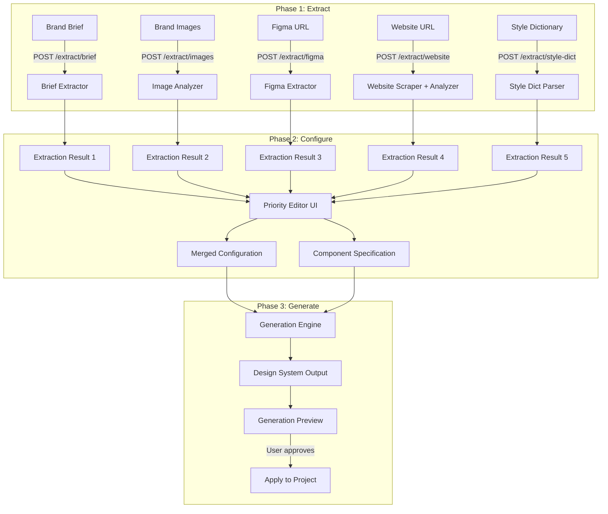
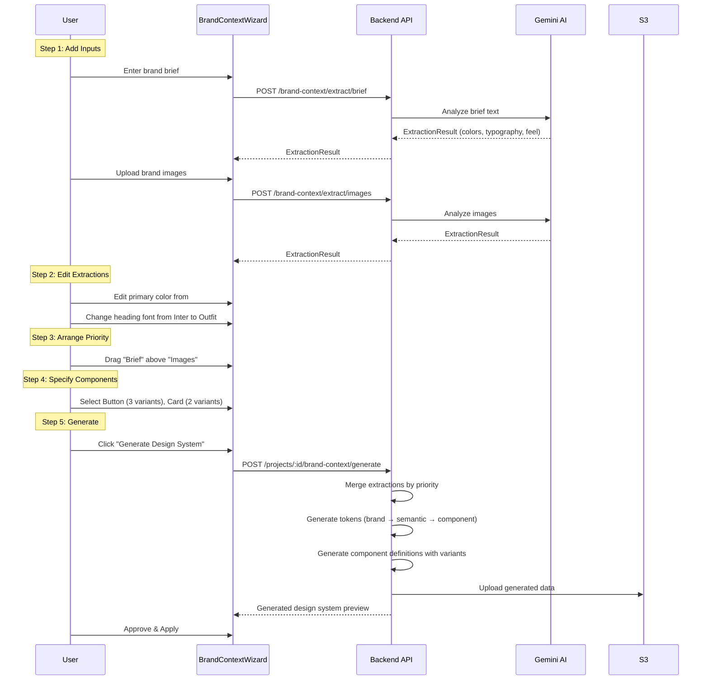

# Brand Context Engine v2 — Dynamic Priority Engine Architecture

> **Version:** 1.0  
> **Date:** 2026-08-05  
> **Scope:** Redesign the Brand Context Engine from a fire-and-forget generator into a user-controlled, priority-based generation engine with extraction preview, editable results, component specification, and variation control.

---

## 1. Problem Statement

### 1.1 Current Brand Context Engine — User Has No Control

The current `BrandContextEditor.tsx` and `contextEngine.js` work as a **black box**:

```
┌─────────────────────────────────────────────────────────────────┐
│                  CURRENT FLOW (BROKEN)                           │
│                                                                  │
│  User provides inputs → Submit ALL at once → Backend processes   │
│  everything sequentially → Generates entire design system →      │
│  Auto-redirects to project                                       │
│                                                                  │
│  Problems:                                                       │
│  ❌ No preview of what was EXTRACTED from each input             │
│  ❌ No ability to EDIT extracted data before generation          │
│  ❌ No PRIORITY control — all inputs weighted equally            │
│  ❌ No COMPONENT SELECTION — user can't choose what to generate │
│  ❌ No VARIATION CONTROL — always generates one variant          │
│  ❌ Black box — user doesn't know what influenced the output    │
│  ❌ All-or-nothing — can't partially apply results              │
└─────────────────────────────────────────────────────────────────┘
```

### 1.2 What Users Need

Users need a **controllable generation pipeline** where they can:

1. **See what was extracted** from each input (brand brief, images, Figma, website, style dictionary)
2. **Edit the extractions** before generation (fix colors, change fonts, adjust mood)
3. **Arrange priority** of inputs (e.g., "Figma tokens should override website colors")
4. **Specify which components** to generate (e.g., "Generate Button, Card, and Input")
5. **Control variation count** (e.g., "Generate 3 Button variants: primary, secondary, ghost")
6. **Preview generation plan** before execution

---

## 2. Target Architecture — Dynamic Priority Engine

### 2.1 Design Philosophy

The new Brand Context Engine follows a **3-phase pipeline**:

```
┌──────────────┐      ┌──────────────┐      ┌──────────────┐
│   PHASE 1    │  →   │   PHASE 2    │  →   │   PHASE 3    │
│   EXTRACT    │      │  CONFIGURE   │      │   GENERATE   │
│              │      │              │      │              │
│ Parse each   │      │ User edits,  │      │ Generate DS  │
│ input source │      │ prioritizes, │      │ using merged │
│ independently│      │ & specifies  │      │ config       │
│              │      │ components   │      │              │
└──────────────┘      └──────────────┘      └──────────────┘
```

### 2.2 High-Level Architecture



---

## 3. Phase 1: Extraction — Per-Input Parsing

### 3.1 Extraction Result Schema

Each input source produces an **ExtractionResult** that the user can review and edit:

```typescript
interface ExtractionResult {
  id: string;                    // Unique ID for this extraction
  sourceType: "brief" | "image" | "figma" | "website" | "style-dict";
  sourceLabel: string;           // User-friendly label (e.g., "Brand Brief", "logo.png")
  extractedAt: string;           // ISO timestamp
  
  // Extracted data — user can edit any of these
  colors: ExtractedColor[];
  typography: ExtractedTypography;
  spacing: ExtractedSpacing | null;
  feel: ExtractedFeel;
  
  // Confidence & metadata
  confidence: "high" | "medium" | "low";
  rawSource: string | null;      // Original input for reference
  warnings: string[];
}

interface ExtractedColor {
  id: string;
  hex: string;
  role: "primary" | "secondary" | "accent" | "neutral" | "success" | "warning" | "danger" | "info" | "custom";
  label: string;                 // e.g., "Primary Brand Blue"
  confidence: "high" | "medium" | "low";
  source: string;                // Where this was found (e.g., "Logo dominant color")
}

interface ExtractedTypography {
  heading: {
    family: string;
    weight: string;
    style: string;
    confidence: "high" | "medium" | "low";
  };
  body: {
    family: string;
    weight: string;
    style: string;
    confidence: "high" | "medium" | "low";
  };
  rationale: string;
}

interface ExtractedFeel {
  mood: string[];                // ["Modern", "Professional", "Trustworthy"]
  personality: string;
  visualTone: string;
  industry: string;
}
```

### 3.2 Per-Source Extraction Endpoints

| Method | Path | Input | Output |
|--------|------|-------|--------|
| POST | `/v1/brand-context/extract/brief` | `{ brief, goals, primaryColor }` | `ExtractionResult` |
| POST | `/v1/brand-context/extract/images` | `FormData (files[])` | `ExtractionResult` |
| POST | `/v1/brand-context/extract/figma` | `{ figmaUrl, figmaTokenId }` | `ExtractionResult` |
| POST | `/v1/brand-context/extract/website` | `{ url }` | `ExtractionResult` |
| POST | `/v1/brand-context/extract/style-dict` | `{ tokens: {} }` | `ExtractionResult` |

Each endpoint extracts data independently and returns it for user review. **No changes are applied to the project at this stage.**

### 3.3 Backend Implementation

```javascript
// New file: controllers/brandContextEngineController.js

async function extractFromBrief(req, res) {
  const { brief, goals, primaryColor } = req.body;
  
  // Use Gemini to analyze brief → extract colors, typography, feel
  const analysis = await analyzeBrandText({ title: brief, description: goals, primaryColor });
  
  // Transform to ExtractionResult format
  const result = {
    id: generateId("ext"),
    sourceType: "brief",
    sourceLabel: "Brand Description",
    extractedAt: new Date().toISOString(),
    colors: transformAnalysisColors(analysis.colors),
    typography: analysis.typography,
    spacing: null,
    feel: analysis.feel,
    confidence: "high",
    rawSource: brief,
    warnings: [],
  };
  
  return res.json({ status: true, data: result });
}
```

---

## 4. Phase 2: Configure — User Controls

### 4.1 Priority System

The user arranges extraction results in **priority order** via drag-and-drop. When multiple sources provide conflicting values for the same property, the higher-priority source wins:

```
┌─────────────────────────────────────────────────┐
│           PRIORITY ARRANGEMENT (User Editable)   │
│                                                  │
│  ┌─ 1 ─┐  Figma Tokens (highest priority)       │
│  │ ↕↕↕ │  Colors: #3B82F6, #10B981, ...         │
│  └─────┘  Typography: Inter, Roboto              │
│                                                  │
│  ┌─ 2 ─┐  Brand Brief                           │
│  │ ↕↕↕ │  Colors: #0A84FF (primary override)    │
│  └─────┘  Typography: Same as Figma              │
│                                                  │
│  ┌─ 3 ─┐  Website Scrape                        │
│  │ ↕↕↕ │  Colors: #2563EB, #4F46E5, ...         │
│  └─────┘  Typography: Outfit, Inter              │
│                                                  │
│  ┌─ 4 ─┐  Brand Images                          │
│  │ ↕↕↕ │  Colors: #A9358D, #10B981, ...         │
│  └─────┘  Feel: Modern, Professional             │
│                                                  │
│  Note: Items higher in the list override lower   │
│  items when conflicts exist.                     │
└─────────────────────────────────────────────────┘
```

### 4.2 Priority Resolution Algorithm

```javascript
function mergeExtractionsByPriority(extractions, priorityOrder) {
  const merged = {
    colors: { primary: null, secondary: null, accent: null, neutrals: [], palette: [] },
    typography: { heading: null, body: null, rationale: "" },
    feel: { mood: [], personality: "", visualTone: "", industry: "" },
  };

  // Process from LOWEST priority to HIGHEST (so highest wins)
  const ordered = [...priorityOrder].reverse();
  
  for (const extractionId of ordered) {
    const extraction = extractions.find(e => e.id === extractionId);
    if (!extraction) continue;

    // Colors: higher priority overwrites
    const primary = extraction.colors.find(c => c.role === "primary");
    if (primary) merged.colors.primary = primary.hex;
    // ... same for secondary, accent, etc.

    // Typography: higher priority overwrites
    if (extraction.typography.heading) {
      merged.typography.heading = extraction.typography.heading;
    }

    // Feel: merge arrays (union), strings overwrite
    merged.feel.mood = [...new Set([...merged.feel.mood, ...extraction.feel.mood])];
    if (extraction.feel.personality) merged.feel.personality = extraction.feel.personality;
  }

  return merged;
}
```

### 4.3 Component Specification

The user specifies exactly which components they want generated and how many variations:

```typescript
interface ComponentSpecification {
  components: ComponentRequest[];
}

interface ComponentRequest {
  type: string;              // "Button" | "Card" | "Input" | "Modal" | "Badge" | etc.
  variationCount: number;    // How many variants (e.g., 3 → primary, secondary, outline)
  variationNames?: string[]; // Optional custom names (e.g., ["primary", "ghost", "link"])
  includeStates?: boolean;   // Generate hover, focus, disabled states?
  customProperties?: Record<string, string>; // User-specified overrides
}
```

**Default Component Catalog:**

| Component | Default Variants | States |
|-----------|-----------------|--------|
| Button | primary, secondary, outline, ghost, link, destructive | hover, focus, active, disabled |
| Input | default, filled, outlined | focus, error, disabled |
| Card | default, elevated, outlined | hover |
| Badge | default, success, warning, danger, info | — |
| Avatar | default, with-initials, with-status | — |
| Alert | info, success, warning, danger | dismissible |
| Modal | default, drawer, sheet | — |
| Toggle | default | checked, disabled |
| Select | default | open, focus, error, disabled |
| Tooltip | default | — |
| Tabs | default, pills, underline | active, disabled |
| Table | default | striped, hover-row |

### 4.4 Configuration State (Frontend)

```typescript
interface BrandContextConfig {
  // Extraction results (from Phase 1)
  extractions: ExtractionResult[];
  
  // User-configured priority order (array of extraction IDs)
  priorityOrder: string[];
  
  // User edits applied to extractions
  edits: Record<string, Partial<ExtractionResult>>;
  
  // Component generation specification
  componentSpec: ComponentSpecification;
  
  // Merged configuration (computed from above)
  mergedConfig: MergedBrandConfig;
}
```

---

## 5. Phase 3: Generate — Controlled Generation

### 5.1 Generation Endpoint

```
POST /v1/projects/:projectId/brand-context/generate
```

**Request Body:**

```json
{
  "mergedConfig": {
    "colors": { "primary": "#3B82F6", "secondary": "#10B981", ... },
    "typography": { "heading": { ... }, "body": { ... } },
    "feel": { "mood": [...], "personality": "...", ... }
  },
  "componentSpec": {
    "components": [
      { "type": "Button", "variationCount": 3, "variationNames": ["primary", "secondary", "outline"], "includeStates": true },
      { "type": "Card", "variationCount": 2, "variationNames": ["default", "elevated"] },
      { "type": "Input", "variationCount": 2, "includeStates": true }
    ]
  },
  "options": {
    "mode": "preview",         // "preview" = dry-run, "apply" = commit changes
    "targetBranch": "main",    // or create new branch
    "includeTokens": true,     // Generate design tokens
    "includeComponents": true  // Generate component definitions
  }
}
```

### 5.2 Generation Engine

```javascript
async function generateFromBrandContext(req, res) {
  const { mergedConfig, componentSpec, options } = req.body;
  const { projectId } = req.params;

  // 1. Generate brand/foundation tokens from merged colors
  const brandTokens = generateBrandTokens(mergedConfig.colors);

  // 2. Generate semantic tokens referencing brand tokens
  const semanticTokens = generateSemanticTokens(brandTokens, mergedConfig.feel);

  // 3. Generate typography tokens
  const typographyTokens = generateTypographyTokens(mergedConfig.typography);

  // 4. Generate component definitions with specified variations
  const components = {};
  for (const compReq of componentSpec.components) {
    components[compReq.type] = await generateComponent({
      type: compReq.type,
      variationCount: compReq.variationCount,
      variationNames: compReq.variationNames,
      includeStates: compReq.includeStates,
      brandTokens,
      semanticTokens,
      typographyTokens,
      feel: mergedConfig.feel,
    });
  }

  // 5. Return preview or apply
  if (options.mode === "preview") {
    return res.json({
      status: true,
      data: {
        preview: true,
        tokens: { ...brandTokens, ...semanticTokens, ...typographyTokens },
        components,
        summary: {
          tokenCount: Object.keys(brandTokens).length + Object.keys(semanticTokens).length + Object.keys(typographyTokens).length,
          componentCount: Object.keys(components).length,
          variationCount: componentSpec.components.reduce((sum, c) => sum + c.variationCount, 0),
        },
      },
    });
  }

  // Apply mode: save to project
  // ... (existing apply logic)
}
```

### 5.3 Component Generation with Variations

```javascript
async function generateComponent({ type, variationCount, variationNames, includeStates, brandTokens, semanticTokens, typographyTokens, feel }) {
  const componentDef = {
    displayName: type,
    description: `${type} component with ${variationCount} variation(s)`,
    linkedElement: { htmlTag: getDefaultHtmlTag(type) },
    properties: {},
    children: {},
  };

  // Generate each variation as a child
  const names = variationNames || generateVariationNames(type, variationCount);
  for (let i = 0; i < variationCount; i++) {
    const variantName = names[i] || `variant-${i + 1}`;
    componentDef.children[variantName] = {
      displayName: `${type} — ${variantName}`,
      properties: generateVariantProperties(type, variantName, { brandTokens, semanticTokens }),
      ...(includeStates ? { children: generateStateChildren(type, variantName, { brandTokens, semanticTokens }) } : {}),
    };
  }

  return componentDef;
}
```

---

## 6. API Design

### 6.1 New Endpoints

| Method | Path | Auth | Description |
|--------|------|------|-------------|
| POST | `/v1/brand-context/extract/brief` | auth | Extract from brand brief text |
| POST | `/v1/brand-context/extract/images` | auth | Extract from uploaded brand images |
| POST | `/v1/brand-context/extract/figma` | auth | Extract from Figma file |
| POST | `/v1/brand-context/extract/website` | auth | Extract from website URL |
| POST | `/v1/brand-context/extract/style-dict` | auth | Extract from Style Dictionary JSON |
| POST | `/v1/brand-context/merge-preview` | auth | Preview merged configuration |
| POST | `/v1/projects/:projectId/brand-context/generate` | auth + editor | Generate design system from config |
| GET | `/v1/brand-context/component-catalog` | public | Get available component types |

### 6.2 Modified Endpoints

| Endpoint | Change |
|----------|--------|
| `POST /projects/:projectId/imports/ai-brief` | Add `componentSpec` parameter |
| `POST /projects/:projectId/imports/figma-link` | Return `ExtractionResult` instead of just saving URL |

---

## 7. Frontend Architecture

### 7.1 New Components

```
components/
  brand-context/
    BrandContextWizard.tsx         ← Main multi-step wizard
    InputSourceCard.tsx            ← Card for each input source
    ExtractionResultCard.tsx       ← Editable extraction result display
    PriorityArrangerPanel.tsx      ← Drag-and-drop priority ordering
    ColorPaletteEditor.tsx         ← Editable color palette (inline edit)
    TypographyEditor.tsx           ← Editable typography selections
    FeelEditor.tsx                 ← Editable mood/personality/tone
    ComponentSpecPanel.tsx         ← Component selection + variation count
    ComponentTypeSelector.tsx      ← Checkbox list of available components
    VariationConfigurator.tsx      ← Per-component variation count/names
    GenerationPreview.tsx          ← Preview generated tokens + components
    MergedConfigSummary.tsx        ← Visual summary of merged configuration
```

### 7.2 Wizard Flow

```
┌─────────────────────────────────────────────────────────────────┐
│  Step 1: ADD INPUTS                                              │
│  ─────────────────────────────────────────────────────────────── │
│  [+ Brand Brief] [+ Images] [+ Figma] [+ Website] [+ JSON]     │
│                                                                  │
│  ┌────────────────────────────────────────────────────────────┐  │
│  │ 📝 Brand Brief                                     [Edit] │  │
│  │ "We are a modern fintech brand targeting..."              │  │
│  │ Status: ✅ Extracted — 6 colors, Inter + Roboto           │  │
│  └────────────────────────────────────────────────────────────┘  │
│  ┌────────────────────────────────────────────────────────────┐  │
│  │ 🖼️ Brand Images (2 files)                         [Edit] │  │
│  │ logo.png, brand-guide.pdf                                 │  │
│  │ Status: ✅ Extracted — 8 colors, mood: Modern             │  │
│  └────────────────────────────────────────────────────────────┘  │
│                                                                  │
│                                               [Next: Configure] │
├─────────────────────────────────────────────────────────────────┤
│  Step 2: REVIEW & EDIT EXTRACTIONS                               │
│  ─────────────────────────────────────────────────────────────── │
│  For each extraction, show editable:                             │
│  • Colors (click to change hex, reassign roles)                  │
│  • Typography (dropdown to change font families)                 │
│  • Feel (edit mood keywords, personality)                        │
│                                               [Next: Prioritize]│
├─────────────────────────────────────────────────────────────────┤
│  Step 3: ARRANGE PRIORITY                                        │
│  ─────────────────────────────────────────────────────────────── │
│  Drag-and-drop to arrange priority:                              │
│  ① Figma Tokens (highest)                                       │
│  ② Brand Brief                                                  │
│  ③ Brand Images                                                 │
│  (higher wins in conflicts)                                      │
│                                          [Next: Select Components│
├─────────────────────────────────────────────────────────────────┤
│  Step 4: SPECIFY COMPONENTS                                      │
│  ─────────────────────────────────────────────────────────────── │
│  ☑ Button    — Variations: [3] [primary] [secondary] [outline]  │
│  ☑ Card      — Variations: [2] [default] [elevated]             │
│  ☑ Input     — Variations: [2] [default] [filled]               │
│  ☐ Modal     — Variations: [1]                                  │
│  ☐ Badge     — Variations: [4]                                  │
│  ☐ Avatar    — Variations: [2]                                  │
│                                              [Next: Preview]     │
├─────────────────────────────────────────────────────────────────┤
│  Step 5: PREVIEW & GENERATE                                      │
│  ─────────────────────────────────────────────────────────────── │
│  Summary:                                                        │
│  • 85 tokens (32 brand, 38 semantic, 15 component)               │
│  • 3 components with 7 total variants                            │
│  • Primary: #3B82F6  Secondary: #10B981  Accent: #F59E0B        │
│                                                                  │
│             [Generate Design System]  [Save as Draft]            │
└─────────────────────────────────────────────────────────────────┘
```

---

## 8. Component Settings — Token Usage Constraint

### 8.1 Problem

The system should not allow components to use **direct brand tokens** or create brand tokens inline. Component properties should reference **semantic tokens only**, enforcing the brand → semantic → component hierarchy.

### 8.2 Solution

```
┌─────────────────────────────────────────────────────────────────┐
│              COMPONENT PROPERTY VALUE CONSTRAINTS                 │
│                                                                  │
│  ✅ ALLOWED for component properties:                           │
│     • var(--color-primary)           (semantic reference)        │
│     • var(--text-error)              (semantic reference)        │
│     • var(--spacing-card-padding)    (semantic reference)        │
│     • var(--button-primary-bg)       (scoped reference)          │
│     • inherit                        (CSS keyword)               │
│     • currentColor                   (CSS keyword)               │
│                                                                  │
│  ❌ BLOCKED for component properties:                           │
│     • #3B82F6                        (direct brand value)        │
│     • var(--color-blue-500)          (direct brand reference)    │
│     • 16px                           (direct brand value)        │
│     • "Inter"                        (direct brand value)        │
│                                                                  │
│  When user tries to set a literal or brand reference:            │
│  → System prompts: "Create a semantic token first, then          │
│    reference it in the component property."                      │
│  → Or: Auto-suggest existing semantic tokens that match.         │
└─────────────────────────────────────────────────────────────────┘
```

### 8.3 Backend Validation

Add a new validation rule to `tokenClassificationValidator.js`:

```javascript
function validateComponentPropertyValue(value, allVariables) {
  // Check if value is a literal (hex, px, rem, etc.)
  if (isLiteralValue(value)) {
    return {
      valid: false,
      error: "COMPONENT_LITERAL_VALUE",
      message: "Component properties cannot use literal values. Create a semantic token and reference it instead.",
      suggestion: findMatchingSemanticToken(value, allVariables),
    };
  }

  // Check if value references a brand token directly
  const refMatch = value.match(/var\(--([^)]+)\)/);
  if (refMatch) {
    const referencedToken = allVariables.find(v => v.key === `--${refMatch[1]}`);
    if (referencedToken && referencedToken.layer === "brand") {
      return {
        valid: false,
        error: "COMPONENT_DIRECT_BRAND_REF",
        message: "Component properties should not reference brand tokens directly. Use a semantic alias instead.",
        suggestion: findSemanticAlias(referencedToken, allVariables),
      };
    }
  }

  return { valid: true };
}
```

---

## 9. Data Flow Diagram



---

## 10. Migration Strategy

### 10.1 Backward Compatibility

- The existing `BrandContextEditor` remains functional during transition
- The existing `POST /imports/ai-brief` endpoint continues to work
- The new wizard is accessed via a separate route/UI toggle
- Projects can use either the old or new workflow

### 10.2 Phased Rollout

| Phase | Scope | Timeline |
|-------|-------|----------|
| Phase 1 | Per-source extraction endpoints + extraction preview UI | Week 1-2 |
| Phase 2 | Priority arrangement UI + merge algorithm | Week 2-3 |
| Phase 3 | Component specification panel + variation control | Week 3-4 |
| Phase 4 | Generation engine + preview + apply | Week 4-5 |
| Phase 5 | Component settings validation (no direct brand tokens) | Week 5-6 |

---

**Architecture Version**: 1.0  
**Last Updated**: 2026-08-05  
**Maintained By**: Design System Team
