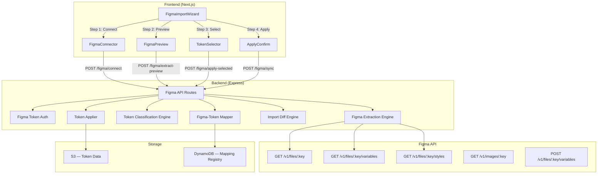
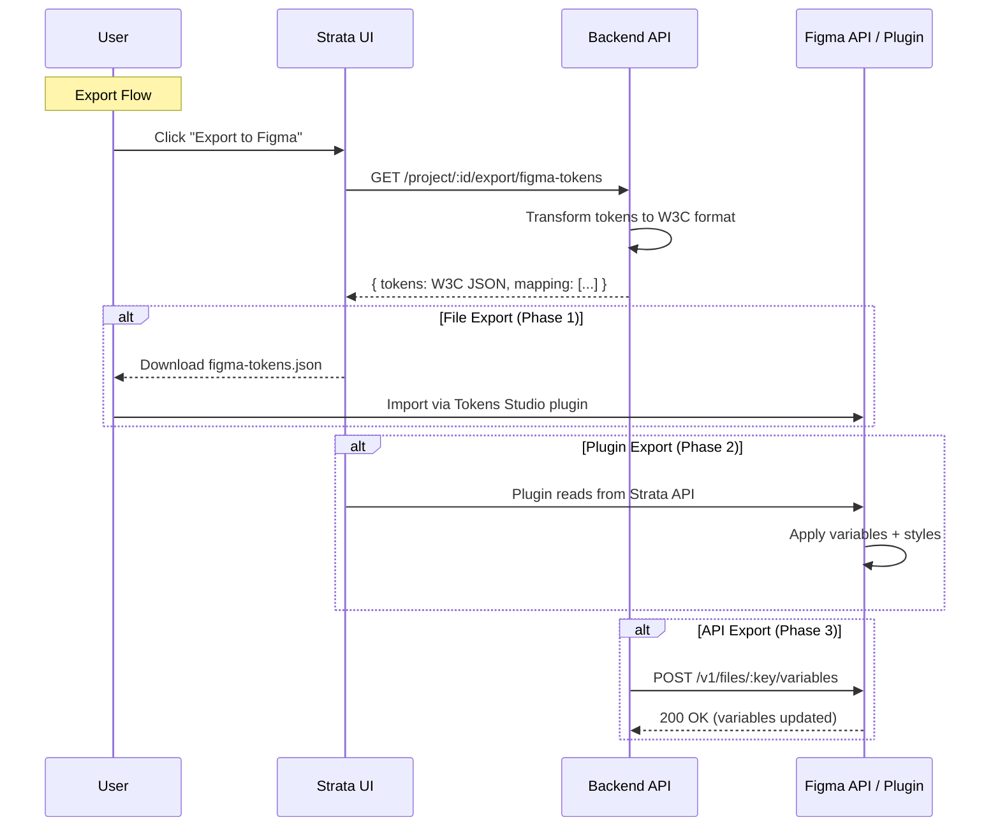

# Figma Bi-Directional Sync — Architecture Document

> **Version:** 1.0  
> **Date:** 2026-08-05  
> **Scope:** Establish a structural, consistent Figma importation pipeline and design the export-back-to-Figma capability.

---

## 1. Problem Statement

### 1.1 Current Figma Import — Fragmented & Inconsistent

The current Figma integration is scattered across multiple endpoints, utility functions, and processing pipelines with no unified strategy:

| Endpoint | Controller | Purpose | Problem |
|----------|-----------|---------|---------|
| `POST /v1/figma/test-extraction` | `figmaController.testFigmaExtraction` | Extract tokens from Figma file | Returns raw `masterTokens`; no classification, no validation, no project integration |
| `GET /v1/figma/json-data` | `figmaController.processFigmaLink` | Process Figma link to tokens | Uses hardcoded `FIGMA_TOKEN` env var; returns JSON-stringified result |
| `GET /v1/figma/figure-to-image-processor` | `figmaController.processFigmaLinkToImage` | Render Figma nodes to images | Standalone — no connection to token pipeline |
| `GET /v1/figma/figma-chads-processor` | `figmaController.processFigmaLinkToChads` | Compress Figma data for CHADS format | Standalone — no project integration |
| `POST /v1/figma/image-to-chads-processor` | `figmaController.processFigmaImagesToChads` | Process rendered images via CHADS | Standalone — no connection back to tokens |
| `POST /v1/project/:queryId/import/figma-link` | `designSystemController.importFigmaLink` | Save Figma link to project imports | Only stores the URL — does NOT extract tokens |
| `POST /v1/projects/:projectId/imports/figma-link` | `frontendContractController.importFigmaLinkV2` | V2 version of Figma link import | Stores URL but extraction is fragmented |

### 1.2 Key Issues

```
┌────────────────────────────────────────────────────────────────┐
│                    CURRENT FIGMA IMPORT PROBLEMS                │
│                                                                 │
│  ❌ No unified pipeline — 7+ endpoints, none complete          │
│  ❌ Token extraction ≠ Project integration (separate flows)    │
│  ❌ No token classification on import (all land as "semantic") │
│  ❌ No diff/preview step — user can't review before applying   │
│  ❌ No incremental sync — full re-import every time            │
│  ❌ Multiple auth patterns (env var, user token, profile DB)   │
│  ❌ No export/push-back to Figma capability                    │
│  ❌ processFigmaNode traversal is greedy — extracts everything │
│  ❌ No mapping persistence — can't track Figma node ↔ token    │
└────────────────────────────────────────────────────────────────┘
```

### 1.3 What Users Experience

1. **Import is a black box** — User pastes Figma URL, clicks import, gets flooded with 500+ tokens, all marked "semantic", with no preview or control
2. **No re-sync** — If Figma design changes, user must re-import from scratch, losing any manual edits they've made
3. **No export** — After curating a design system in Strata, there's no way to push tokens back to Figma for the design team

---

## 2. Target Architecture — Structured Figma Pipeline

### 2.1 Design Philosophy

The Figma integration should follow a **5-stage pipeline** model:

```
┌──────────┐    ┌───────────┐    ┌────────────┐    ┌──────────┐    ┌──────────┐
│  CONNECT │ →  │  EXTRACT  │ →  │  CLASSIFY  │ →  │  PREVIEW │ →  │  APPLY   │
│          │    │           │    │  & MAP     │    │  & DIFF  │    │          │
│ Auth +   │    │ Figma API │    │ Token      │    │ User     │    │ Merge    │
│ Validate │    │ Traversal │    │ Classifier │    │ Reviews  │    │ into DS  │
└──────────┘    └───────────┘    └────────────┘    └──────────┘    └──────────┘
```

### 2.2 High-Level Architecture



---

## 3. Stage 1: CONNECT — Figma Authentication & Validation

### 3.1 Current Problem

Three different auth patterns exist:
- `process.env.FIGMA_TOKEN` (hardcoded server env var)
- `req.body.figmaToken` (direct token from client — insecure)
- `req.body.figmaTokenId` → Profile DB lookup (correct pattern)

### 3.2 Proposed Solution

Standardize on **Profile-stored Figma tokens** with a unified validation endpoint:

```javascript
// POST /v1/figma/connect
// Body: { figmaUrl: string, figmaTokenId: number }
// Response: { valid: boolean, fileInfo: { name, lastModified, pages[], nodeCount } }

async function connectFigma(req, res) {
  // 1. Resolve token from Profile DB (using figmaTokenId)
  // 2. Parse & validate Figma URL format
  // 3. Fetch file metadata only (lightweight validation)
  // 4. Return file info for user confirmation
}
```

### 3.3 Figma URL Parser

```javascript
// Support all Figma URL formats:
// - https://www.figma.com/file/{key}/{title}
// - https://www.figma.com/design/{key}/{title}
// - https://www.figma.com/file/{key}/{title}?node-id={nodeId}
// - https://www.figma.com/proto/{key}/{title}
// - Figma API URL: https://api.figma.com/v1/files/{key}

function parseFigmaUrl(url) {
  // Returns: { fileKey: string, nodeId?: string, format: "design"|"file"|"proto" }
}
```

---

## 4. Stage 2: EXTRACT — Structured Token Extraction

### 4.1 Current Problem

`processFigmaNode` in `utils/index.js` does a greedy recursive traversal that:
- Extracts ALL nodes regardless of relevance
- Doesn't distinguish between Figma Variables, Styles, and node properties
- Doesn't track which Figma node produced which token

### 4.2 Proposed: Multi-Source Extraction Strategy

```
┌─────────────────────────────────────────────────────────────┐
│                FIGMA EXTRACTION SOURCES                      │
│                                                              │
│  Source 1: Figma Variables API (v1/files/:key/variables)     │
│  ──────────────────────────────────────────────────────────  │
│  • Color variables → brand layer tokens                      │
│  • Number variables → spacing/sizing brand tokens            │
│  • String variables → font family brand tokens               │
│  • Boolean variables → feature flag tokens                   │
│  • Modes support → theme variant support                     │
│                                                              │
│  Source 2: Figma Styles API (v1/files/:key/styles)           │
│  ──────────────────────────────────────────────────────────  │
│  • Fill styles → color semantic tokens                       │
│  • Text styles → typography semantic tokens                  │
│  • Effect styles → shadow/blur semantic tokens               │
│  • Grid styles → layout semantic tokens                      │
│                                                              │
│  Source 3: Figma Node Traversal (existing processFigmaNode)  │
│  ──────────────────────────────────────────────────────────  │
│  • Component instances → component scoped tokens             │
│  • Component sets → component variant mappings               │
│  • Auto layout → spacing/gap tokens                          │
│  • Frame properties → sizing/border tokens                   │
└─────────────────────────────────────────────────────────────┘
```

### 4.3 Extraction Pipeline

```javascript
async function extractFigmaTokens(fileKey, figmaToken, options = {}) {
  const results = {
    fromVariables: [],   // Figma Variables API
    fromStyles: [],      // Figma Styles API
    fromNodes: [],       // Node traversal
    metadata: {
      fileKey,
      fileName: "",
      extractedAt: new Date().toISOString(),
      sources: { variables: 0, styles: 0, nodes: 0 },
    },
    mappings: [],  // Figma nodeId → token key mappings
  };

  // Source 1: Variables API (if available — requires Figma paid plan)
  if (options.useVariablesApi) {
    const vars = await fetchFigmaVariables(fileKey, figmaToken);
    results.fromVariables = transformFigmaVariables(vars);
  }

  // Source 2: Styles API
  const styles = await fetchFigmaStyles(fileKey, figmaToken);
  results.fromStyles = transformFigmaStyles(styles);

  // Source 3: Node traversal (existing logic, refined)
  const file = await fetchFigmaFile(fileKey, figmaToken);
  results.fromNodes = traverseAndExtract(file.document, {
    includeComponents: options.includeComponents ?? true,
    includeInstances: options.includeInstances ?? false,
    depthLimit: options.depthLimit ?? 10,
  });

  return results;
}
```

---

## 5. Stage 3: CLASSIFY & MAP — Token Classification

### 5.1 Figma-Aware Classification

After extraction, every token is classified using the Token Classification Engine (see `TOKEN_CLASSIFICATION_ARCHITECTURE.md`) with Figma-specific hints:

| Figma Source | Default Layer | Rationale |
|-------------|--------------|-----------|
| Variable (color) | brand | Raw color value from design palette |
| Variable (number) | brand | Raw numeric scale value |
| Style (fill) | semantic | Named color with purpose (e.g., "Primary/500") |
| Style (text) | semantic | Typography role (e.g., "Heading 1") |
| Style (effect) | semantic | Named effect (e.g., "Card Shadow") |
| Node property | component | Component-specific value |
| Component set variant | component | Variant-specific override |

### 5.2 Mapping Registry

Each imported token maintains a **mapping** back to its Figma source:

```json
{
  "tokenKey": "--color-blue-500",
  "figmaSource": {
    "type": "variable",
    "fileKey": "abc123",
    "variableId": "VariableID:123:456",
    "variableName": "Blue/500",
    "collectionName": "Color Palette",
    "lastSyncedAt": "2026-08-05T12:00:00Z",
    "lastSyncedValue": "#3B82F6"
  }
}
```

This mapping enables:
- **Incremental sync** — detect what changed in Figma since last import
- **Export back** — know which Figma variable to update
- **Conflict detection** — both Figma and Strata changed the same token

---

## 6. Stage 4: PREVIEW & DIFF — User Review

### 6.1 Import Preview Response

Before applying, the user sees a structured preview:

```json
{
  "preview": {
    "summary": {
      "newTokens": 45,
      "updatedTokens": 12,
      "unchangedTokens": 503,
      "removedInFigma": 3,
      "conflicts": 2
    },
    "byLayer": {
      "brand": { "new": 30, "updated": 5 },
      "semantic": { "new": 10, "updated": 5 },
      "component": { "new": 5, "updated": 2 }
    },
    "tokens": [
      {
        "key": "--color-blue-500",
        "action": "add",
        "layer": "brand",
        "value": "#3B82F6",
        "figmaSource": "Blue/500 (Color Palette)",
        "selected": true
      },
      {
        "key": "--color-primary",
        "action": "update",
        "layer": "semantic",
        "currentValue": "#2563EB",
        "newValue": "#3B82F6",
        "figmaSource": "Primary/Default (Styles)",
        "selected": true
      }
    ]
  }
}
```

### 6.2 User Controls

The frontend presents:
- **Select/deselect individual tokens** for import
- **Select/deselect by layer** (brand, semantic, component)
- **Select/deselect by category** (colors, typography, spacing)
- **Conflict resolution** for tokens that changed in both Figma and Strata
- **Naming remapping** — user can rename tokens before import

---

## 7. Stage 5: APPLY — Merge Into Design System

### 7.1 Application Strategy

```javascript
async function applyFigmaImport(projectId, selectedTokens, options) {
  // 1. Load current project data
  // 2. For each selected token:
  //    a. Classify using Token Classification Engine
  //    b. Validate against classification constraints
  //    c. Generate JSON Patch operations
  // 3. Apply patches to project data (same pipeline as context engine)
  // 4. Save mapping registry for incremental sync
  // 5. If collaboration enabled → create branch "figma-import-{date}"
  // 6. Upload to S3, update DynamoDB
}
```

### 7.2 Branch Integration

If collaboration is enabled, Figma imports create a dedicated branch so changes can be reviewed before merging to main:

```
main ──────────────────────────────────► main (after merge)
         │                                    ▲
         └── figma-import-20260805 ──────────┘
              (auto-created on import)
```

---

## 8. Figma Export (Push Back to Figma)

### 8.1 The Challenge

Exporting tokens back to Figma is more complex because:
- Figma's Variables API requires write access (Enterprise/Organization plan)
- Figma Styles are read-only via API — cannot create/update styles programmatically
- Component properties can only be set on instances, not definitions

### 8.2 Feasible Export Strategies

```
┌─────────────────────────────────────────────────────────────┐
│                    EXPORT STRATEGIES                          │
│                                                              │
│  Strategy 1: Figma Variables API (Recommended)               │
│  ──────────────────────────────────────────────────────────  │
│  • POST /v1/files/:key/variables                             │
│  • Can create/update/delete variables                        │
│  • Requires Figma Enterprise or Organization plan            │
│  • Works with: brand tokens (colors, numbers)                │
│  • Limitation: Only variables, not styles or components      │
│                                                              │
│  Strategy 2: Figma Plugin Bridge                             │
│  ──────────────────────────────────────────────────────────  │
│  • Build a Figma Plugin that reads from Strata API           │
│  • Plugin runs inside Figma and has full write access         │
│  • Can update: variables, styles, AND components             │
│  • No plan restriction — works for all Figma users           │
│  • Requires user to install & run the plugin manually         │
│                                                              │
│  Strategy 3: Figma Tokens JSON Export                        │
│  ──────────────────────────────────────────────────────────  │
│  • Export tokens as Figma Tokens Studio compatible JSON       │
│  • User imports via Tokens Studio plugin                     │
│  • Format: W3C Design Tokens Format                          │
│  • No API needed — file-based transfer                       │
│  • Broad compatibility with existing Figma workflows         │
│                                                              │
│  Strategy 4: Style Dictionary Export                         │
│  ──────────────────────────────────────────────────────────  │
│  • Already partially implemented in ProjectExports.tsx        │
│  • Export as Style Dictionary JSON that Figma plugins read   │
│  • Compatible with Tokens Studio, Figma Tokens, etc.         │
└─────────────────────────────────────────────────────────────┘
```

### 8.3 Recommended Approach: Hybrid (Plugin + API + File Export)

**Phase 1 (Immediate):** File-based export via W3C Design Tokens format + Style Dictionary JSON — no Figma API dependency. Users can import into Figma via Tokens Studio plugin.

**Phase 2 (Medium-term):** Build a Figma Plugin that connects to Strata API, allowing real-time bi-directional sync within Figma.

**Phase 3 (Long-term):** Direct Figma Variables API integration for Enterprise/Organization users.

### 8.4 Export Data Flow



### 8.5 W3C Design Tokens Export Format

```json
{
  "$schema": "https://design-tokens.github.io/community-group/format/",
  "color": {
    "blue": {
      "500": {
        "$value": "#3B82F6",
        "$type": "color",
        "$description": "Primary blue from brand palette"
      }
    },
    "primary": {
      "$value": "{color.blue.500}",
      "$type": "color",
      "$description": "Main brand interaction color"
    }
  },
  "spacing": {
    "4": {
      "$value": "1rem",
      "$type": "dimension"
    }
  }
}
```

---

## 9. API Design

### 9.1 New Unified Endpoints

| Method | Path | Auth | Description |
|--------|------|------|-------------|
| POST | `/v1/figma/connect` | auth + editor | Validate Figma URL + token, return file metadata |
| POST | `/v1/figma/extract-preview` | auth + editor | Extract tokens and return preview diff |
| POST | `/v1/projects/:projectId/figma/apply` | auth + editor | Apply selected tokens to project |
| POST | `/v1/projects/:projectId/figma/sync` | auth + editor | Incremental sync (re-import changes) |
| GET | `/v1/projects/:projectId/figma/mappings` | auth + viewer | Get Figma-token mapping registry |
| GET | `/v1/projects/:projectId/export/figma-tokens` | auth + viewer | Export tokens as W3C Design Tokens JSON |
| GET | `/v1/projects/:projectId/export/style-dictionary` | auth + viewer | Export as Style Dictionary format |
| DELETE | `/v1/projects/:projectId/figma/mappings` | auth + editor | Clear Figma mapping registry |

### 9.2 Deprecated Endpoints (Phase Out)

The following endpoints should be deprecated and eventually removed:

| Endpoint | Replacement |
|----------|-------------|
| `GET /v1/figma/json-data` | `POST /v1/figma/extract-preview` |
| `POST /v1/figma/test-extraction` | `POST /v1/figma/connect` + `POST /v1/figma/extract-preview` |
| `GET /v1/figma/figure-to-image-processor` | Internal use only in extract pipeline |
| `POST /v1/project/:queryId/import/figma-link` | `POST /v1/projects/:projectId/figma/apply` |

---

## 10. Data Model

### 10.1 Figma Mapping Registry (DynamoDB or Project JSON)

```javascript
// Stored per-project in DynamoDB or as part of project metadata
{
  figmaSync: {
    enabled: true,
    fileKey: "abc123",
    fileUrl: "https://www.figma.com/design/abc123/...",
    lastSyncAt: "2026-08-05T12:00:00Z",
    tokenMappings: {
      "--color-blue-500": {
        figmaType: "variable",     // "variable" | "style" | "node"
        figmaId: "VariableID:123:456",
        figmaName: "Blue/500",
        figmaCollection: "Color Palette",
        lastSyncValue: "#3B82F6",
        direction: "import",       // "import" | "export" | "bidirectional"
      },
      // ... more mappings
    },
    syncHistory: [
      {
        timestamp: "2026-08-05T12:00:00Z",
        direction: "import",
        tokensAdded: 45,
        tokensUpdated: 12,
        tokensRemoved: 0,
        initiatedBy: "user_abc",
      }
    ]
  }
}
```

---

## 11. Security Considerations

| Concern | Mitigation |
|---------|------------|
| Figma token exposure | Tokens stored encrypted in Profile DB; never sent to frontend |
| Figma API rate limits | Queue requests with exponential backoff; cache file metadata |
| Large Figma files | Stream extraction; limit depth; paginate preview results |
| Token naming collisions | Preview step shows conflicts; user chooses resolution |
| Export data leakage | Export endpoints require project membership; rate-limited |

---

## 12. Frontend Components

```
components/
  figma/
    FigmaImportWizard.tsx        ← Multi-step import wizard
    FigmaConnector.tsx           ← Step 1: URL + token validation
    FigmaPreviewPanel.tsx        ← Step 2: Token extraction preview
    FigmaTokenSelector.tsx       ← Step 3: Select tokens to import
    FigmaApplyConfirm.tsx        ← Step 4: Review & apply
    FigmaExportDialog.tsx        ← Export tokens to Figma format
    FigmaSyncStatus.tsx          ← Show last sync status in sidebar
    FigmaMappingViewer.tsx       ← View/manage Figma-token mappings
```

---

**Architecture Version**: 1.0  
**Last Updated**: 2026-08-05  
**Maintained By**: Design System Team
