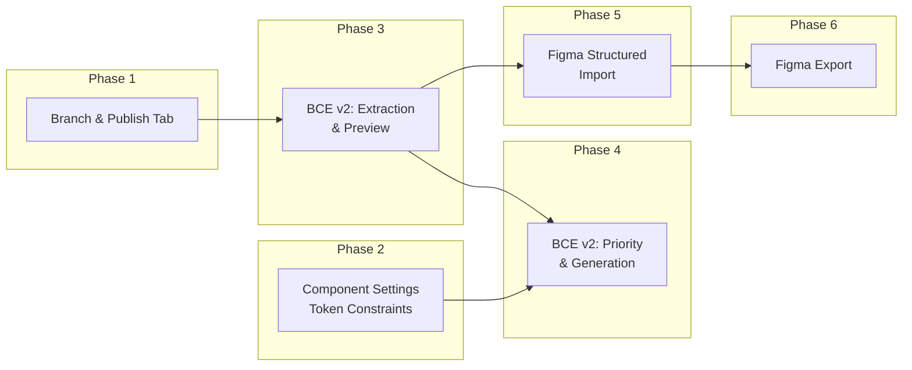

# Implementation Plan — Design System Platform Enhancements

> **Version:** 1.0  
> **Date:** 2026-08-05  
> **Scope:** Phased implementation plan covering Figma Bi-Directional Sync, Brand Context Engine v2, Branch & Publish Tab, and Component Settings Constraints.

---

## Phase Overview

| Phase | Focus Area | Priority | Est. Effort |
|-------|-----------|----------|-------------|
| **Phase 1** | Branch & Publish Tab | High | 1-2 weeks |
| **Phase 2** | Component Settings — Token Constraints | High | 1 week |
| **Phase 3** | Brand Context Engine v2 — Extraction & Preview | Critical | 2-3 weeks |
| **Phase 4** | Brand Context Engine v2 — Priority, Configuration & Generation | Critical | 2-3 weeks |
| **Phase 5** | Figma Importation — Structured Pipeline | High | 2-3 weeks |
| **Phase 6** | Figma Exportation — Push Back to Figma | Medium | 2-3 weeks |

---

## Phase 1: Branch & Publish Tab

> **Goal:** Create a dedicated Branch & Publish section in the project sidebar for centralized branch management and publish history.

### Tasks

| Task ID | Description | Layer | Depends On |
|---------|------------|-------|------------|
| `BP-001` | **Add `PATCH /project/:id/branches/:name/rename` endpoint** — Validate new name, auth check (owner or creator), copy S3 files to new key, create new ProjectBranch record, close old one | Backend | — |
| `BP-002` | **Add `GET /project/:id/publish-history` endpoint** — Query project's `projectData` map, return sorted version list with message, timestamp, publisher, and default flag | Backend | — |
| `BP-003` | **Add BFF proxy routes** — `app/api/project/[id]/branches/[name]/rename/route.ts` and `app/api/project/[id]/publish-history/route.ts` | Frontend (BFF) | BP-001, BP-002 |
| `BP-004` | **Add `renameBranch()` to `BranchService`** — `PATCH /project/:id/branches/:name/rename` with `{ newName }` body | Frontend (Service) | BP-003 |
| `BP-005` | **Add `getPublishHistory()` and `setDefaultVersion()` to `PublishService`** — Fetch version list and update default | Frontend (Service) | BP-003 |
| `BP-006` | **Create `BranchPublishSection.tsx`** — Main tab component with two panels: Branches list and Publish History | Frontend (UI) | BP-004, BP-005 |
| `BP-007` | **Create `BranchCard.tsx`** — Branch card with status badge, metadata, action buttons (Switch, View Diff, Merge), and context menu (Rename, Delete) | Frontend (UI) | BP-006 |
| `BP-008` | **Create `BranchRenameDialog.tsx`** — Modal with branch name input, validation feedback, and confirm/cancel | Frontend (UI) | BP-006 |
| `BP-009` | **Create `PublishHistoryPanel.tsx`** — Scrollable list of published versions with "Set as Default" button | Frontend (UI) | BP-005 |
| `BP-010` | **Add "Branch & Publish" nav item to `ProjectSidebar.tsx`** — Insert after "Collaboration" with git-branch icon, conditionally shown when collaboration is enabled | Frontend (UI) | BP-006 |
| `BP-011` | **Wire `BranchPublishSection` into `ProjectViewPage.tsx`** — Render when `active === "branch-publish"` | Frontend (UI) | BP-006, BP-010 |
| `BP-012` | **Add permission guards** — Owner-only for publish and set-default; editor+ for rename/delete own; owner for rename/delete others' | Frontend + Backend | BP-001 |

### Validation Criteria

| Criteria ID | Criteria | How to Validate |
|-------------|---------|-----------------|
| `BP-V01` | Branch rename updates S3 keys and DynamoDB record | Create branch, rename it, verify old S3 key is preserved, new key has data, old DDB record is closed |
| `BP-V02` | Rename blocked for `main` branch | Attempt rename of `main` → expect 400 error |
| `BP-V03` | Only owner or creator can rename/delete | Login as non-owner non-creator → expect 403 |
| `BP-V04` | Publish history shows all versions in descending order | Publish 3 versions → verify all appear with correct messages |
| `BP-V05` | "Set as Default" updates `project.defaultVersion` | Click "Set as Default" on v2 → verify CDN serves v2 |
| `BP-V06` | Publish button visible only to owner | Login as editor → verify publish button is hidden |
| `BP-V07` | Tab shows in sidebar when collaboration is enabled | Toggle `collaborationEnabled` → verify tab appears/disappears |

---

## Phase 2: Component Settings — Token Constraints

> **Goal:** Prevent components from using direct brand tokens or literal values. Enforce the brand → semantic → component token hierarchy.

### Tasks

| Task ID | Description | Layer | Depends On |
|---------|------------|-------|------------|
| `CS-001` | **Add `validateComponentPropertyValue()` to `tokenClassificationValidator.js`** — Reject literal values and direct brand token references in component properties. Return error code, message, and suggested semantic token | Backend | — |
| `CS-002` | **Integrate validation into component create/update endpoints** — Call `validateComponentPropertyValue()` in `designSystemController.createComponent` and `updateComponent`. Also integrate into `frontendContractController` V2 endpoints | Backend | CS-001 |
| `CS-003` | **Integrate validation into patch pipeline** — Call `validateComponentPropertyValue()` in `projectDataPatch.js` when patching component properties (op: "add" or "replace" on `/components/*/properties/*`) | Backend | CS-001 |
| `CS-004` | **Add `findMatchingSemanticToken()` utility** — Given a literal value, find semantic tokens with matching resolved value to suggest as alternatives | Backend | — |
| `CS-005` | **Update component property editor UI** — When user enters a literal value or brand token reference, show inline validation error with suggestion to create/use a semantic token | Frontend (UI) | CS-001 |
| `CS-006` | **Add "Create Semantic Token" quick action** — In the component property editor, when validation fails, offer a button to create a semantic token pointing to the brand token the user intended | Frontend (UI) | CS-005 |
| `CS-007` | **Update `ComponentsSection.tsx` property panel** — Add token picker that filters to semantic-only tokens for component property values | Frontend (UI) | CS-005 |

### Validation Criteria

| Criteria ID | Criteria | How to Validate |
|-------------|---------|-----------------|
| `CS-V01` | Setting a component property to `#3B82F6` returns validation error | PATCH component property with literal hex → expect 400 with `COMPONENT_LITERAL_VALUE` |
| `CS-V02` | Setting a component property to `var(--color-blue-500)` (brand) returns warning | PATCH component property with brand ref → expect 400 with `COMPONENT_DIRECT_BRAND_REF` |
| `CS-V03` | Setting a component property to `var(--color-primary)` (semantic) succeeds | PATCH component property with semantic ref → expect 200 |
| `CS-V04` | Suggestion includes matching semantic tokens | Set literal `#3B82F6` → response includes `var(--color-primary)` as suggestion |
| `CS-V05` | "Create Semantic Token" quick action creates token and sets reference | Click quick action → verify new semantic token created and component property updated |
| `CS-V06` | Validation works in patch pipeline (context engine, Figma import) | Run context engine that generates component with literal → verify it's auto-aliased |

---

## Phase 3: Brand Context Engine v2 — Extraction & Preview

> **Goal:** Build per-source extraction endpoints that return structured, editable results before any changes are applied.

### Tasks

| Task ID | Description | Layer | Depends On |
|---------|------------|-------|------------|
| `BCE-001` | **Define `ExtractionResult` schema** — TypeScript types for `ExtractionResult`, `ExtractedColor`, `ExtractedTypography`, `ExtractedFeel` shared between frontend and backend | Shared Types | — |
| `BCE-002` | **Create `POST /v1/brand-context/extract/brief` endpoint** — Accept brief, goals, primaryColor. Use Gemini to analyze. Return `ExtractionResult` | Backend | BCE-001 |
| `BCE-003` | **Create `POST /v1/brand-context/extract/images` endpoint** — Accept multipart images. Use Gemini vision to analyze. Return `ExtractionResult` with detected colors and mood | Backend | BCE-001 |
| `BCE-004` | **Create `POST /v1/brand-context/extract/figma` endpoint** — Accept figmaUrl + figmaTokenId. Extract tokens from Figma. Transform to `ExtractionResult` | Backend | BCE-001 |
| `BCE-005` | **Create `POST /v1/brand-context/extract/website` endpoint** — Accept URL. Scrape and analyze. Return `ExtractionResult` | Backend | BCE-001 |
| `BCE-006` | **Create `POST /v1/brand-context/extract/style-dict` endpoint** — Accept JSON tokens. Parse structure. Return `ExtractionResult` | Backend | BCE-001 |
| `BCE-007` | **Create `brandContextEngineController.js`** — New controller housing all extraction endpoints | Backend | BCE-002 → BCE-006 |
| `BCE-008` | **Add BFF proxy routes** — `app/api/brand-context/extract/[source]/route.ts` for each extraction source | Frontend (BFF) | BCE-007 |
| `BCE-009` | **Create `ExtractionResultCard.tsx`** — Display extraction result with editable colors, typography, and feel. Inline color pickers, font dropdowns, mood tag editor | Frontend (UI) | BCE-001 |
| `BCE-010` | **Create `ColorPaletteEditor.tsx`** — Editable color list with role assignment (primary/secondary/accent/etc.), hex input, and color picker | Frontend (UI) | — |
| `BCE-011` | **Create `TypographyEditor.tsx`** — Editable heading + body font selection with Google Fonts dropdown | Frontend (UI) | — |
| `BCE-012` | **Create `FeelEditor.tsx`** — Editable mood keywords (tag chips), personality text, visual tone, industry | Frontend (UI) | — |
| `BCE-013` | **Create `InputSourceCard.tsx`** — Card for each input source with add/remove, status indicator, and expand to show `ExtractionResultCard` | Frontend (UI) | BCE-009 |

### Validation Criteria

| Criteria ID | Criteria | How to Validate |
|-------------|---------|-----------------|
| `BCE-V01` | Brief extraction returns structured `ExtractionResult` with colors and typography | POST brief → verify response has `colors[]`, `typography`, `feel` |
| `BCE-V02` | Image extraction detects colors from uploaded image | Upload brand logo → verify extracted colors match visible colors |
| `BCE-V03` | Website extraction scrapes and returns brand data | POST website URL → verify colors/typography extracted |
| `BCE-V04` | Style dictionary extraction parses token JSON | POST valid style-dict JSON → verify tokens transformed to `ExtractionResult` |
| `BCE-V05` | Extraction results are editable in UI | Click edit on color → change hex → verify change persists in state |
| `BCE-V06` | Multiple extractions can coexist independently | Add brief + image + website → verify 3 independent `ExtractionResult` cards |

---

## Phase 4: Brand Context Engine v2 — Priority, Configuration & Generation

> **Goal:** Implement priority arrangement, component specification, and controlled generation.

### Tasks

| Task ID | Description | Layer | Depends On |
|---------|------------|-------|------------|
| `BCE-020` | **Create `PriorityArrangerPanel.tsx`** — Drag-and-drop list of extraction results. Higher = wins in conflicts. Visual indicators for conflict resolution | Frontend (UI) | BCE-009 |
| `BCE-021` | **Implement `mergeExtractionsByPriority()` utility** — Frontend utility that resolves conflicts by priority order. Returns `MergedBrandConfig` | Frontend (Logic) | BCE-001 |
| `BCE-022` | **Create `POST /v1/brand-context/merge-preview` endpoint** — Accept extractions + priority order, return merged configuration preview | Backend | BCE-001 |
| `BCE-023` | **Create `GET /v1/brand-context/component-catalog` endpoint** — Return available component types with default variation names and state support | Backend | — |
| `BCE-024` | **Create `ComponentSpecPanel.tsx`** — Checkbox grid of available components with variation count input and custom name fields | Frontend (UI) | BCE-023 |
| `BCE-025` | **Create `VariationConfigurator.tsx`** — Per-component variation count slider/input with name customization | Frontend (UI) | BCE-024 |
| `BCE-026` | **Create `BrandContextWizard.tsx`** — Multi-step wizard wrapping all Phase 3 + Phase 4 components (Steps 1-5 from architecture doc) | Frontend (UI) | BCE-013, BCE-020, BCE-024 |
| `BCE-027` | **Create `POST /v1/projects/:projectId/brand-context/generate` endpoint** — Accept merged config + component spec. Support `preview` and `apply` modes. Generate tokens with classification. Generate components with variations | Backend | BCE-001, CS-001 |
| `BCE-028` | **Implement `generateComponent()` with variation support** — Generate component definition with N variations, each with properties referencing semantic tokens. Include state children if requested | Backend | BCE-027 |
| `BCE-029` | **Create `GenerationPreview.tsx`** — Display generated tokens (grouped by layer) and components (with variants). Summary statistics. Approve/reject buttons | Frontend (UI) | BCE-027 |
| `BCE-030` | **Create `MergedConfigSummary.tsx`** — Visual summary of final merged configuration: color swatches, font preview, mood tags | Frontend (UI) | BCE-021 |
| `BCE-031` | **Wire wizard into `ProjectSetup.tsx` or `BrandContextEditor.tsx`** — Replace or augment existing brand context editor with new wizard | Frontend (UI) | BCE-026 |
| `BCE-032` | **Add branch integration** — If collaboration enabled, auto-create branch `brand-context-{hash}` for generated changes | Backend | BCE-027 |

### Validation Criteria

| Criteria ID | Criteria | How to Validate |
|-------------|---------|-----------------|
| `BCE-V10` | Priority arrangement works via drag-and-drop | Drag extraction from position 3 to position 1 → verify order change persists |
| `BCE-V11` | Higher priority source wins conflicts | Set Figma=priority-1 (primary=#111), Brief=priority-2 (primary=#222) → merged shows #111 |
| `BCE-V12` | Component specification generates correct number of variants | Specify Button with 3 variants → verify 3 child components generated |
| `BCE-V13` | Generated components reference semantic tokens only | Inspect generated component properties → verify all values are `var(--semantic-*)` |
| `BCE-V14` | Preview mode returns data without applying | POST with `mode: "preview"` → verify no project data changes |
| `BCE-V15` | Apply mode saves to project and creates branch (if collaboration enabled) | POST with `mode: "apply"` → verify project data updated or branch created |
| `BCE-V16` | End-to-end wizard flow completes successfully | Walk through all 5 steps → verify design system generated and visible |

---

## Phase 5: Figma Importation — Structured Pipeline

> **Goal:** Replace the fragmented Figma import endpoints with a unified, structured, preview-first pipeline.

### Tasks

| Task ID | Description | Layer | Depends On |
|---------|------------|-------|------------|
| `FI-001` | **Create `parseFigmaUrl()` utility** — Parse all Figma URL formats (file, design, proto) and extract fileKey + nodeId | Backend | — |
| `FI-002` | **Create `POST /v1/figma/connect` endpoint** — Validate Figma URL + resolve token from Profile DB + fetch file metadata (name, pages, node count). Lightweight validation only | Backend | FI-001 |
| `FI-003` | **Create `fetchFigmaVariables()` utility** — Call Figma Variables API (`GET /v1/files/:key/variables/local`) if available | Backend | FI-002 |
| `FI-004` | **Create `fetchFigmaStyles()` utility** — Call Figma Styles API and transform fill/text/effect styles to tokens | Backend | FI-002 |
| `FI-005` | **Refactor `processFigmaNode()`** — Add depth limiting, node-type filtering, and mapping tracking (nodeId → tokenKey) | Backend | — |
| `FI-006` | **Create `POST /v1/figma/extract-preview` endpoint** — Run multi-source extraction (variables + styles + nodes), classify tokens, compute diff vs current project, return structured preview | Backend | FI-003, FI-004, FI-005 |
| `FI-007` | **Create `POST /v1/projects/:projectId/figma/apply` endpoint** — Accept selected tokens from preview, apply to project with classification, save Figma mappings | Backend | FI-006 |
| `FI-008` | **Create Figma mapping registry schema** — Store `figmaSync.tokenMappings` in project metadata for incremental sync | Backend | FI-007 |
| `FI-009` | **Create `POST /v1/projects/:projectId/figma/sync` endpoint** — Incremental sync: compare current mappings vs Figma state, return diff of changes since last sync | Backend | FI-008 |
| `FI-010` | **Create `GET /v1/projects/:projectId/figma/mappings` endpoint** — Return current mapping registry | Backend | FI-008 |
| `FI-011` | **Add BFF proxy routes** — All new Figma endpoints proxied through Next.js API routes | Frontend (BFF) | FI-002 → FI-010 |
| `FI-012` | **Create `FigmaImportWizard.tsx`** — Multi-step wizard: Connect → Preview → Select → Apply | Frontend (UI) | FI-011 |
| `FI-013` | **Create `FigmaConnector.tsx`** — URL input + token ID selection + connect button + file metadata display | Frontend (UI) | FI-012 |
| `FI-014` | **Create `FigmaPreviewPanel.tsx`** — Show extracted tokens grouped by source (variables, styles, nodes) with layer classification badges | Frontend (UI) | FI-012 |
| `FI-015` | **Create `FigmaTokenSelector.tsx`** — Selectable token list with filter by layer/category, select all/none per group, naming override | Frontend (UI) | FI-012 |
| `FI-016` | **Create `FigmaSyncStatus.tsx`** — Sidebar widget showing last sync time and "Sync Now" button | Frontend (UI) | FI-009 |
| `FI-017` | **Deprecation notices on old endpoints** — Add deprecation headers to `/v1/figma/json-data`, `/v1/figma/test-extraction`, etc. | Backend | FI-006 |

### Validation Criteria

| Criteria ID | Criteria | How to Validate |
|-------------|---------|-----------------|
| `FI-V01` | Figma URL validation handles all formats | Test file/design/proto URLs → all return valid fileKey |
| `FI-V02` | Token resolution from Profile DB works | Connect with valid figmaTokenId → verify file metadata returned |
| `FI-V03` | Extraction preview shows categorized tokens | Extract from Figma file with variables + styles → verify categorized preview |
| `FI-V04` | Token classification runs on import | Import tokens → verify `layer` field set on all tokens |
| `FI-V05` | User can select/deselect individual tokens | Preview shows 50 tokens → select 20 → apply → verify only 20 applied |
| `FI-V06` | Mapping registry persists after import | Import → verify `figmaSync.tokenMappings` saved to project |
| `FI-V07` | Incremental sync detects changes since last import | Change Figma file → sync → verify only changed tokens shown |
| `FI-V08` | Import creates branch when collaboration enabled | Import with collaboration enabled → verify branch created |

---

## Phase 6: Figma Exportation — Push Back to Figma

> **Goal:** Enable exporting design tokens from Strata to Figma via file export, plugin bridge, and eventually direct API.

### Tasks

| Task ID | Description | Layer | Depends On |
|---------|------------|-------|------------|
| `FE-001` | **Create `GET /v1/projects/:projectId/export/figma-tokens` endpoint** — Export tokens in W3C Design Tokens format compatible with Figma Tokens Studio plugin | Backend | — |
| `FE-002` | **Create `GET /v1/projects/:projectId/export/style-dictionary` endpoint** — Export tokens in Style Dictionary JSON format | Backend | — |
| `FE-003` | **Create W3C Design Tokens transformer** — Transform internal token format to W3C schema with proper `$value`, `$type`, `$description`, and alias references using `{group.token}` syntax | Backend | FE-001 |
| `FE-004` | **Create `FigmaExportDialog.tsx`** — Modal with format selection (W3C/Style Dictionary), token layer filter, download button, and copy-to-clipboard | Frontend (UI) | FE-001, FE-002 |
| `FE-005` | **Add "Export to Figma" button to `ProjectExports.tsx`** — Quick access alongside existing CSS/JSON exports | Frontend (UI) | FE-004 |
| `FE-006` | **Design Figma Plugin specification** — Architecture doc for a Figma Plugin that connects to Strata API for bi-directional sync | Documentation | FE-001 |
| `FE-007` | **Build Figma Plugin MVP** — Plugin that reads tokens from Strata API and creates/updates Figma local variables | Plugin | FE-006 |
| `FE-008` | **Implement Figma Variables API export (Enterprise)** — `POST /v1/files/:key/variables` for direct variable creation/update | Backend | FI-008 |
| `FE-009` | **Create `FigmaMappingViewer.tsx`** — View current Figma-token mappings, sync direction, and last sync timestamps | Frontend (UI) | FI-010 |

### Validation Criteria

| Criteria ID | Criteria | How to Validate |
|-------------|---------|-----------------|
| `FE-V01` | W3C export produces valid Design Tokens JSON | Export → validate against W3C schema → import into Tokens Studio |
| `FE-V02` | Style Dictionary export produces valid JSON | Export → run through `style-dictionary` CLI → verify successful build |
| `FE-V03` | Export includes proper references for semantic tokens | Export semantic token → verify value uses `{color.blue.500}` alias syntax |
| `FE-V04` | Export filters by token layer | Export brand-only → verify no semantic or component tokens |
| `FE-V05` | Figma Plugin can read from Strata API | Install plugin → connect to project → verify tokens loaded |
| `FE-V06` | Figma Plugin creates local variables from exported tokens | Run plugin import → verify Figma variables created |

---

## Dependency Graph

**Parallelization opportunities:**
- Phase 1 (Branch & Publish) and Phase 2 (Component Settings) can run in parallel
- Phase 3 backend extraction endpoints can be built in parallel with frontend UI components
- Phase 6 (Figma Export) file-based export can start before Phase 5 is complete

---

## Risk Register

| Risk | Impact | Mitigation |
|------|--------|------------|
| Figma Variables API requires Enterprise plan | High — blocks direct import/export for free users | Use node traversal as fallback; file-based export as alternative |
| Gemini API rate limits during multi-source extraction | Medium — extraction may fail or be slow | Queue extractions; cache results; implement retry with backoff |
| Large Figma files cause timeout | Medium — extraction may fail for complex designs | Implement streaming extraction; depth limiting; progress reporting |
| Breaking changes to existing import flow | High — existing users may lose workflow | Maintain backward compatibility; old endpoints continue to work |
| Component property validation breaks existing data | High — existing components may have literal values | Run validation only on new/edited data; migration backfill optional |

---

**Implementation Plan Version**: 1.0  
**Last Updated**: 2026-08-05  
**Maintained By**: Design System Team
