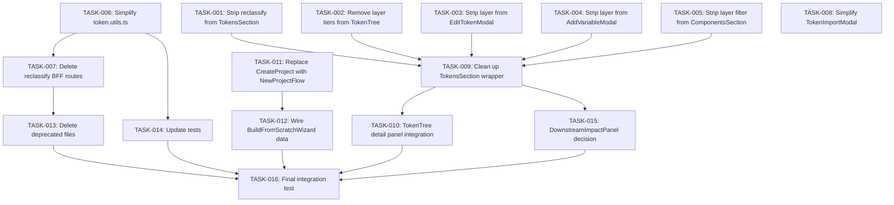

# V2 UI Upgrade — Implementation Plan

> **Date:** 2026-09-09  
> **Companion doc:** [ARCHITECTURE.md](file:///Users/oluwatobiloba/Desktop/charisol/design_system/docsplan/v2-ui-upgrade/ARCHITECTURE.md)  
> **Strategy:** Ship in 4 phases over ~2 weeks. Each phase is independently deployable.

---

## Phase 1 — Strip Semantic/Scoped Layer Enforcement (Frontend Only)

> **Goal:** Remove all UI that forces or displays the 3-tier layer model, while keeping the `layer` field on the data type for backward compat.
 
---

### TASK-001: Remove reclassify feature from TokensSection

**Files:**
- `components/sections/project/TokensSection.tsx`

**Changes:**
1. Remove `bulkProgress`, `bulkPreview`, `overrideExplicit`, `bulkError` state variables
2. Remove `handleBulkPreview()` and `handleBulkApply()` functions
3. Remove the "Auto-Classify All" button from the header
4. Remove the entire bulk-classify modal (lines ~440–594 in current file)
5. Remove `SubTab` type alias and the `getSubTab()` re-export
6. Remove `computeTokenGroupCounts()` function (counts by brand/semantic/component)
7. Remove unused imports for `projectService` (if only used for reclassify)

**Validation:**
- [ ] `tsc --noEmit` passes
- [ ] No references to `bulkProgress` or `reclassify` remain in this file
- [ ] Token tab still renders, add/edit/delete tokens still work
- [ ] All existing tests pass

---

### TASK-002: Remove layer tiers from TokenTree

**Files:**
- `components/sections/project/TokenTree.tsx`

**Changes:**
1. Remove `LAYER_TIERS` constant (lines 68–72)
2. Remove `renderTieredCategory()` function (lines 344–370)
3. In the main render, change spacing category to use `renderFlatCategory()` instead of `renderTieredCategory()`
4. In the detail panel, remove the `selectedLayerLabel` line that calls `getSubTab()`
5. Remove import of `getSubTab` from `TokensSection`

**Validation:**
- [ ] `tsc --noEmit` passes
- [ ] Token tree renders all categories without brand/semantic/scoped sub-folders
- [ ] Detail panel shows category but not layer label
- [ ] Search and expand/collapse still work

---

### TASK-003: Remove layer selector from EditTokenModal

**Files:**
- `components/modals/project/EditTokenModal.tsx`

**Changes:**
1. Remove the layer dropdown/selector UI
2. Remove `isReclassifying` state and `handleLayerChange()` / reclassify logic
3. Remove `onLayerReclassified` prop
4. Remove import of `projectService.reclassifyVariable()`
5. Keep the value editing, unit editing, and save functionality

**Validation:**
- [ ] `tsc --noEmit` passes
- [ ] Edit modal opens, displays token name/value/unit
- [ ] Saving a value change still works end-to-end
- [ ] No layer selector visible in the modal

---

### TASK-004: Remove layer selector from AddVariableModal

**Files:**
- `components/modals/project/AddVariableModal.tsx`

**Changes:**
1. Remove the layer tab strip or radio buttons (Brand/Semantic/Component)
2. Remove any logic that sets `layer` on the created token
3. Simplify the modal to: name, type, value, unit, comment
4. Let `layer` default to undefined or a neutral default

**Validation:**
- [ ] `tsc --noEmit` passes
- [ ] Adding a new token works without selecting a layer
- [ ] The token appears in TokenTree under the correct category

---

### TASK-005: Remove layer filter from ComponentsSection token picker

**Files:**
- `components/sections/project/ComponentsSection.tsx`

**Changes:**
1. Remove `filteredTokens` filter `token.layer !== "semantic"` → show all tokens
2. Remove `semanticMode` state and related UI (brand token creation for semantic linking)
3. Remove `brandTokenName` state and `handleCreateBrandToken()` function
4. Remove `suggestBrandTokenName()` helper
5. Simplify `LAYERS` constant removal from the add-token modal
6. In `handleAddTokenConfirm()`, remove the semantic-mode brand-token-provisioning branch

**Validation:**
- [ ] `tsc --noEmit` passes
- [ ] When adding a token to a component via "pick", all tokens are shown (not just semantic)
- [ ] When adding a token via "create", no layer selector is shown
- [ ] Component property save still works correctly

---

### TASK-006: Simplify token.utils.ts — remove validation and layer classification

**Files:**
- `util/token.utils.ts`
- `__tests__/util.token-utils.test.ts`

**Changes:**
1. Remove `getSubTab()` method entirely
2. Remove `findMatchingSemanticTokens()` method
3. Remove `findMatchingBrandToken()` method
4. Remove `validateComponentPropertyValue()` method
5. Keep: `resolveToTerminal()`, `extractVarReferences()`, `isVariableReference()`, `isLiteralValue()`, `sanitizeTokenName()`, `generateTokenKey()`, `isValidTokenKey()`, `formatTokenKeyName()`, `getDefaultValueForType()`, `cleanupInvalidTokens()`
6. Update tests: remove `describe("TokenUtils.getSubTab")` block and any test that references removed methods

**Validation:**
- [ ] `tsc --noEmit` passes
- [ ] `npm test` passes with updated tests
- [ ] No remaining imports of removed methods across the codebase

---

### TASK-007: Remove reclassify BFF API routes

**Files:**
- `app/api/project/[id]/variables/reclassify-all/route.ts` — DELETE file
- `app/api/project/[id]/variables/[variableId]/reclassify/route.ts` — DELETE file
- `services/project.service.ts` — remove `reclassifyVariable()` and `reclassifyAllVariables()` methods

**Validation:**
- [ ] `tsc --noEmit` passes
- [ ] No remaining imports or references to reclassify methods
- [ ] Application builds and runs correctly

---

### TASK-008: Simplify TokenImportModal layer logic

**Files:**
- `components/modals/import/TokenImportModal.tsx`

**Changes:**
1. Remove the layer target selector (if present in the import UI)
2. Remove auto-layer assignment via `TokenUtils.getSubTab()`
3. Imported tokens get no explicit `layer` (or a default)

**Validation:**
- [ ] Token import flow works end-to-end
- [ ] Imported tokens appear in the correct TokenTree category
- [ ] `tsc --noEmit` passes

---

## Phase 2 — Upgrade Token Tab to New UI

> **Goal:** Ensure TokenTree is the sole rendering path and clean up the TokensSection wrapper.

---

### TASK-009: Clean up TokensSection as a thin wrapper

**Files:**
- `components/sections/project/TokensSection.tsx`

**Changes:**
1. After Phase 1 removals, TokensSection should be a thin container that:
   - Manages add/edit/import modal state
   - Delegates all rendering to `<TokenTree />`
   - Passes callbacks: `onEditToken`, `onDeleteToken`, `onAddRamp`, `onImport`
2. Remove any remaining dead code: `activeGroup`, `activeSubTab`, `searchQuery` (now in TokenTree), `editingKey`/`editingValue` (inline editing removed), classification badges, etc.
3. Remove `pendingChanges`, `DownstreamImpactPanel`, `lastAppliedChanges`, `showUndoToast` if they are only relevant to the old table layout
4. Keep: `handleAddVariable`, `handleEditSave`, `handleImportTokens`, `editModalKey` management

**Validation:**
- [ ] `tsc --noEmit` passes
- [ ] TokensSection.tsx is under 200 lines
- [ ] Token tab shows the tree view with all functionality intact
- [ ] Add, edit, delete, and import flows work

---

### TASK-010: Improve TokenTree detail panel with edit/delete integration

**Files:**
- `components/sections/project/TokenTree.tsx`

**Changes:**
1. The detail panel's Edit/Delete buttons should call `onEditToken(key)` / `onDeleteToken(key)` passed as props
2. Verify that selecting a token, clicking Edit opens `EditTokenModal`
3. Verify that clicking Delete triggers `deleteVariable()` with confirmation

**Validation:**
- [ ] Edit button opens EditTokenModal for the selected token
- [ ] Delete button removes the token after confirmation
- [ ] "Used By" links navigate to the referencing token in the tree

---

## Phase 3 — Upgrade Create Project Flow

> **Goal:** Replace old CreateProject modal with NewProjectFlow wizard.

---

### TASK-011: Replace CreateProject modal with NewProjectFlow

**Files:**
- `components/sections/dashboard/Dashboard.tsx`
- `components/sections/dashboard/CreateProject.tsx`
- `components/sections/dashboard/NoProject.tsx`

**Changes:**
1. In `Dashboard.tsx`, replace the old create-project modal trigger with `NewProjectFlow`
2. When user clicks "New project", show the `NewProjectFlow` component (full-screen overlay)
3. `NewProjectFlow` handles the 2-step flow: Name → Setup (Start from scratch / Import / Skip)
4. On successful creation, navigate to the new project
5. Mark `CreateProject.tsx` as deprecated or delete it
6. Update `NoProject.tsx` "Create your first project" button to trigger `NewProjectFlow`

**Validation:**
- [ ] "New project" from dashboard opens the 2-step flow
- [ ] "Start from scratch" opens the 5-step BuildFromScratchWizard
- [ ] "Import what you have" creates project and opens BrandContextModal
- [ ] "Skip for now" creates a bare project and navigates to it
- [ ] All 5 wizard steps render correctly (Basics, Colors, Type, Logo, Voice, Review)
- [ ] "Apply to project" creates the project with the chosen primary color

---

### TASK-012: Wire BuildFromScratchWizard data through to project creation

**Files:**
- `components/modals/project/BuildFromScratchWizard.tsx`
- `components/sections/dashboard/NewProjectFlow.tsx`

**Changes:**
1. Extend `BuildResult` type to include: `primaryColor`, `secondaryColor`, `accentColor`, `headingFont`, `bodyFont`, `voiceTags`, `industry`, `vibe`
2. In `handleWizardApply()`, pass the full `BuildResult` to the project creation API (or create follow-up API calls to set initial tokens)
3. After project creation, auto-create brand color tokens from the chosen palette
4. After project creation, auto-create typography tokens from the chosen type pairing

**Validation:**
- [ ] Completing the wizard creates a project with auto-generated color and typography tokens
- [ ] The tokens appear in TokenTree under Color/Typography categories
- [ ] Review step accurately summarizes all choices

---

## Phase 4 — Polish & Cleanup

> **Goal:** Final cleanup, test updates, and dead code removal.

---

### TASK-013: Delete deprecated files

**Files to delete:**
- `components/modals/project/CreateProjectForm.tsx` (replaced by NewProjectFlow)
- `components/sections/dashboard/CreateProject.tsx` (replaced by NewProjectFlow)
- `app/api/project/[id]/variables/reclassify-all/route.ts`
- `app/api/project/[id]/variables/[variableId]/reclassify/route.ts`

**Validation:**
- [ ] `tsc --noEmit` passes
- [ ] `npm test` passes
- [ ] `npm run build` succeeds
- [ ] No dead imports referencing deleted files

---

### TASK-014: Update all tests

**Files:**
- `__tests__/util.token-utils.test.ts`
- `__tests__/util.tag-safety.test.ts`
- `__tests__/util.default-component.test.ts`
- Any other test files referencing `getSubTab`, `semantic`, `reclassify`, `validateComponentPropertyValue`

**Changes:**
1. Remove test cases for deleted methods
2. Update test descriptions that reference the 3-tier model
3. Add new tests for simplified token category grouping
4. Ensure all 42+ existing test suites still pass

**Validation:**
- [ ] `npm test` passes with 0 failures
- [ ] No warnings about unreachable code or undefined methods
- [ ] Test coverage does not decrease significantly

---

### TASK-015: Update TokensSection downstream impact panel (optional keep)

**Files:**
- `components/sections/project/TokensSection.tsx`
- `components/sections/project/DownstreamImpactPanel.tsx`

**Decision point:** The `DownstreamImpactPanel` shows which brand-bible sections and downstream tokens are affected when a token value changes. This is useful for value changes (not layer changes). 

**Changes:**
1. If keeping: decouple from layer concepts — show "X tokens reference this" without brand/semantic/component labels
2. If removing: delete `DownstreamImpactPanel.tsx` and all `pendingChanges` state management from `TokensSection`

**Validation:**
- [ ] If kept: panel shows affected tokens without layer labels
- [ ] If removed: no references to `DownstreamImpactPanel` remain

---

### TASK-016: Final integration test

**Steps:**
1. Run `tsc --noEmit` — zero errors
2. Run `npm test` — all suites pass
3. Run `npm run build` — production build succeeds
4. Manual smoke test:
   - [ ] Create a new project via the wizard (all 5 steps)
   - [ ] Navigate to Tokens tab — tree renders with categories
   - [ ] Add a token — no layer selector shown
   - [ ] Edit a token — no layer selector shown
   - [ ] Import tokens — import works without layer assignment
   - [ ] Navigate to Components tab — tree renders with taxonomy
   - [ ] Create a component — new modal works
   - [ ] Add a token to a component — all tokens available (not just semantic)
   - [ ] Select a token in the tree — detail panel shows "Resolves To" and "Used By"
   - [ ] Delete a token — token removed from tree
   - [ ] Theme toggle works (light/dark via AvatarMenu)

---

## Task Dependency Graph

---

## Summary Table

| Task ID | Phase | Title | Est. Effort | Priority |
|---|---|---|---|---|
| TASK-001 | 1 | Strip reclassify from TokensSection | 1h | P0 |
| TASK-002 | 1 | Remove layer tiers from TokenTree | 30m | P0 |
| TASK-003 | 1 | Strip layer from EditTokenModal | 45m | P0 |
| TASK-004 | 1 | Strip layer from AddVariableModal | 30m | P0 |
| TASK-005 | 1 | Strip layer filter from ComponentsSection | 1h | P0 |
| TASK-006 | 1 | Simplify token.utils.ts | 1h | P0 |
| TASK-007 | 1 | Delete reclassify BFF routes | 15m | P1 |
| TASK-008 | 1 | Simplify TokenImportModal | 30m | P1 |
| TASK-009 | 2 | Clean up TokensSection wrapper | 1.5h | P0 |
| TASK-010 | 2 | TokenTree detail panel integration | 45m | P1 |
| TASK-011 | 3 | Replace CreateProject with NewProjectFlow | 1h | P0 |
| TASK-012 | 3 | Wire BuildFromScratchWizard data | 2h | P1 |
| TASK-013 | 4 | Delete deprecated files | 15m | P0 |
| TASK-014 | 4 | Update tests | 1.5h | P0 |
| TASK-015 | 4 | DownstreamImpactPanel decision | 30m | P2 |
| TASK-016 | 4 | Final integration test | 1h | P0 |
| | | **Total** | **~13h** | |
